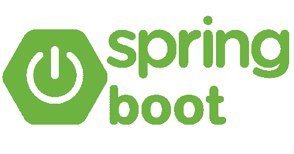

# 什么是 Spring 框架？它和 Spring Boot 有什么不同？

> 原文：<https://medium.com/quick-code/what-is-spring-framework-how-is-it-different-from-spring-boot-84058de163d9?source=collection_archive---------0----------------------->

大家好！今天我将解释 Java 最著名的框架之一——Spring 框架。大多数人经常将它与 Spring boot(我将在博客的后面部分谈到)混淆，并互换使用。首先让我澄清一下——这两者并不相互竞争，而是根据用户的需求来选择使用哪一个。

## 那么什么是春天呢？

简而言之，它是一个 Java 框架(如果你想了解更多关于什么是框架的信息，请点击[此处](/quick-code/what-are-libraries-frameworks-and-packages-b614b5f3e67f))，它在 Java 的基础上拥有许多特性，可以创建企业应用程序，可以针对任何类型的部署进行配置。正是这个框架提出了依赖注入的概念，使得编写框架的单元和集成测试成为可能。因此，现在 java 应用程序是可测试的。

这个框架就像是应用程序的构建块，您需要提供所有的配置并指定所有需要的依赖项。此外，它很容易与其他框架集成，如 Hibernate 和 Struts。

## Spring Boot 怎么样？

现在 Spring 框架有一个关于配置的大问题。看，当我们在任何项目上工作时，我们的重点需要满足业务需求，而不是搞清楚配置、依赖性和环境设置。为了克服这个问题，我们有了弹簧靴。

它是基于 Spring 框架构建的，但附带了一整套模板配置和代码，这使得开发人员可以更快、更容易地将应用程序投入生产。

所以弹簧靴是在弹簧框架上制作的。例如，如果你想创建一个 web 应用程序，那么在 Spring 中我们需要安装一个单独的 web 服务器，然后进行所有的配置，创建一个. jar 文件。但是 Spring boot 有这个 spring-boot-starter-web，它有一个内置的 web 服务器，可以随时安装，我们现在需要做的就是编写我们的业务逻辑，很快您的应用程序就可以投入生产，从而消除从头开始设置一切的摩擦，并专注于编写我们的 web 应用程序的代码。