# 什么是 Tableau？使用 Tableau 可视化数据

> 原文：<https://medium.com/edureka/what-is-tableau-1d9f4c641601?source=collection_archive---------0----------------------->

What is Tableau? — Edureka

Tableau 是一个趋势和市场领先的 BI 工具，用于以易于理解的格式可视化和分析您的数据。它允许您处理实时数据集，并将更多时间用于数据分析，而不是数据争论。这只是一个画面的概述，让我们继续了解什么是画面。

# 用 Tableau 实现数据可视化

在本文中，我将向您解释什么是 tableau 以及如何使用它，从而向您展示使用 Tableau 进行数据可视化的真正威力。

1.数据可视化的力量:安斯科姆的四重奏

2.但是为什么是 Tableau？

3.正在与 Tableau 建立连接

4.Tableau 桌面 UI

5.理解 Tableau 的用户界面及其术语

6.在 Tableau 中创建可视化

# 数据可视化的力量:安斯科姆的四重奏

这个 Anscombe 四重奏的例子将向您展示数据可视化的**威力。**

现在你会问“安斯康贝的四重奏是什么？”

嗯，安斯科姆的四重奏由四个数据集组成，它们具有几乎相同的简单描述性统计数据，但在绘制时却显得非常不同。每个数据集由十一个(x，y)点组成。

在下图中，您会注意到每个数据集中的数据点非常相似，但是当您为相同的数据创建图表时，每个数据集都有自己的可视化效果。

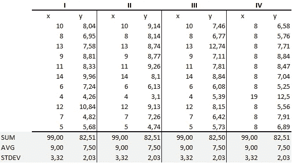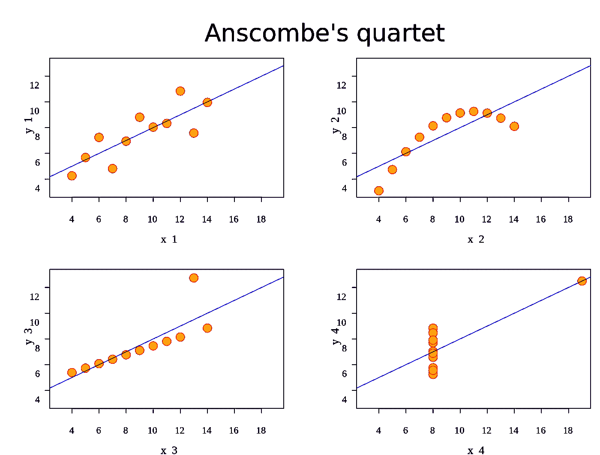

# 但是为什么是 Tableau？

## 访问多个数据连接

Tableau 可以轻松连接到几乎任何数据源，无论是企业数据仓库、Microsoft Excel 还是基于网络的数据。

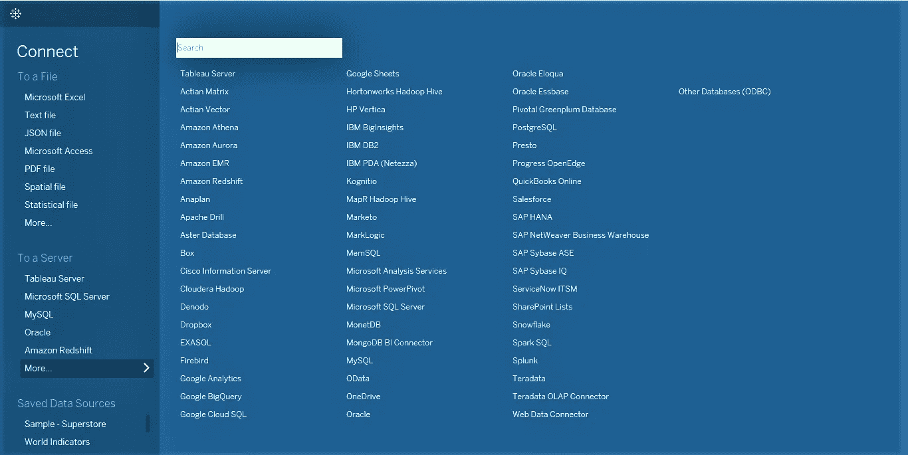

## 实时分析

Tableau 允许您连接并分析实时数据。

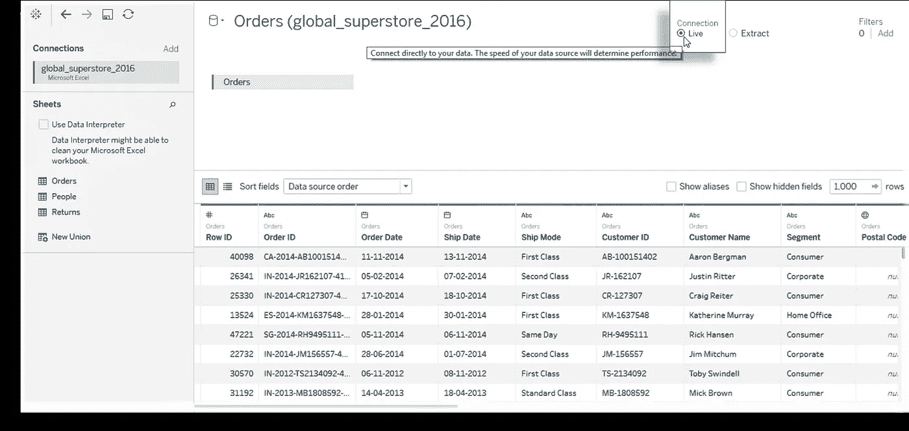

## ShowMe

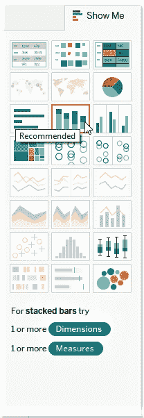

Tableau 在推荐使用哪种可视化方面非常棒。“示范”突出显示最适合数据中字段类型(属性)的视图类型(图表)。

## 地图

与其他商业智能工具不同，在 Tableau 中使用地图非常简单。您可以轻松地从 ShowMe 列表中选择它。

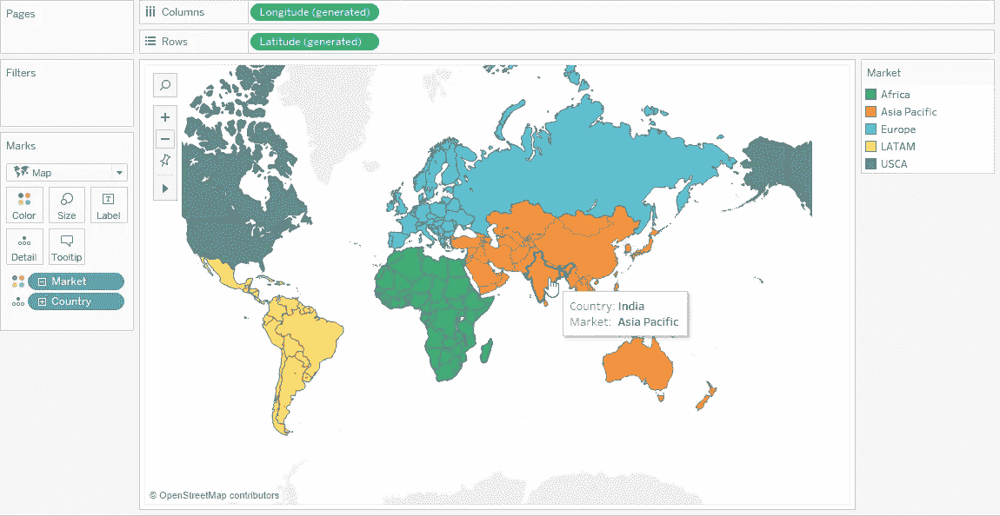

# 建立连接

使用 Tableau 并从文件和服务器连接到不同的数据源。您可以处理各种文件格式，如 CSV、JSON、TXT，甚至可以从 Tableau Server、MySQL、Amazon Redshift 等服务器导入数据。

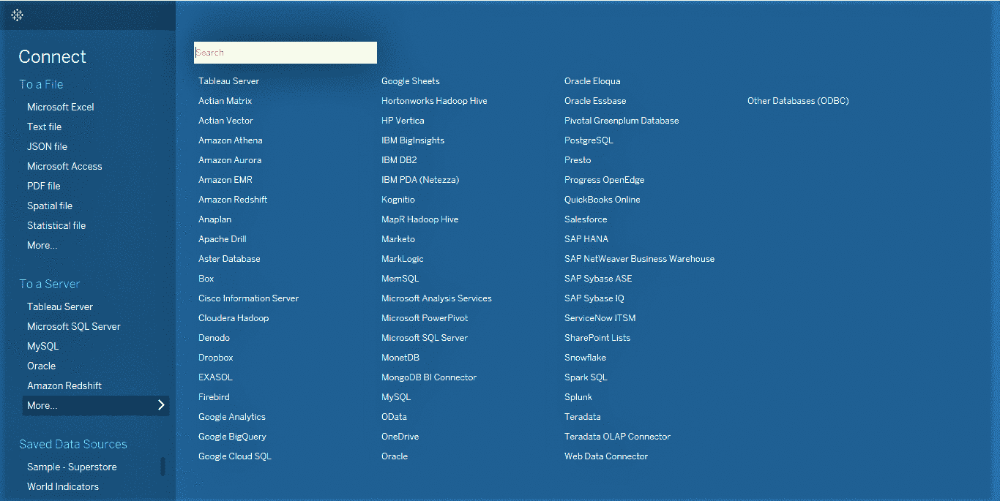

# Tableau 桌面 UI

既然我们已经建立了与 Tableau 的连接，现在轮到了解 Tableau 的 UI，并了解来自度量和维度(在数据窗格下)的字段如何在创建可视化中发挥重要作用。您还将了解页面架、过滤器架和标记卡。

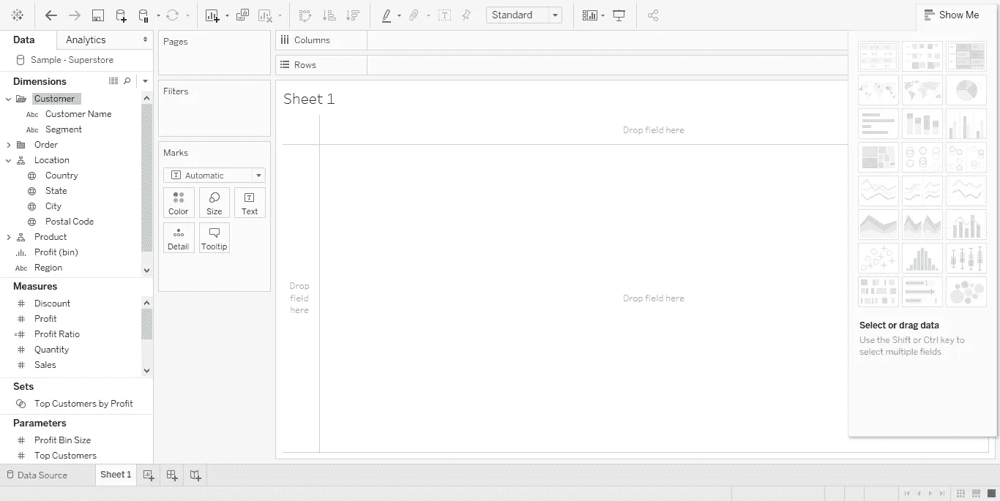

# 理解 Tableau 的用户界面及其术语

## 措施

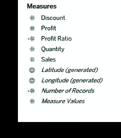

度量是可以度量、聚合或用于不同计算目的的字段。它可以帮助您回答与业务相关的问题。通常，包含数值的字段放在度量下。

**例如:折扣、利润、销售额等**

## 尺寸

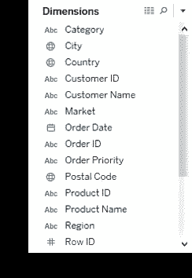

维度由那些无法聚合的值组成。它用于对事实进行分类。

**例如:类别、国家、城市等**

## 页面架

页面架允许您根据字段中包含的单个值来分析数据。它创建了一组页面，每个页面上有不同的视图。

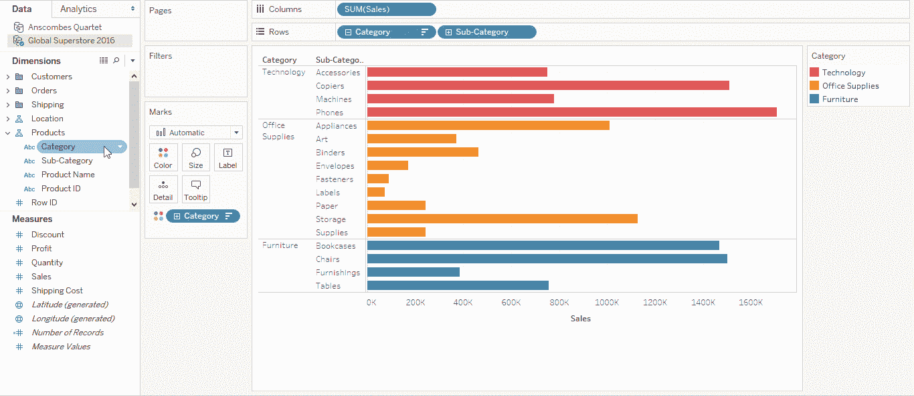

## 过滤器架

过滤器架允许您在视图中添加或删除数据。您可以将数据窗格中的维和度量添加到过滤器架中，以过滤您的数据。过滤后，字段将显示在过滤器架上。

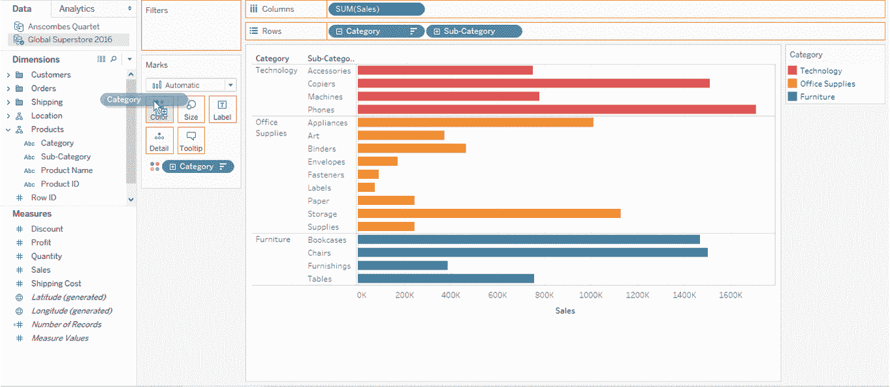

## 行/列货架

使用行列搁板添加维度和度量来完成可视化。行被视为 X 轴，列被视为 Y 轴。

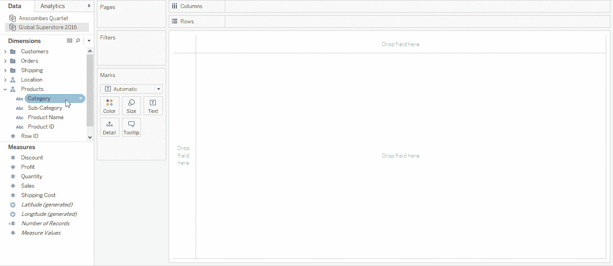

## 标记卡片架

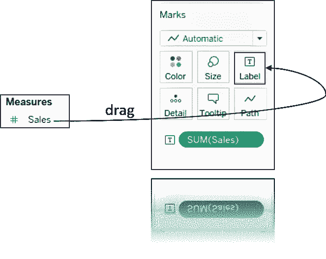

标记架是 Tableau 中的一个区域，您可以在其中拖动字段来设置标记属性。它通过设置颜色、大小、标签、细节、路径或形状来帮助你增强视觉效果。

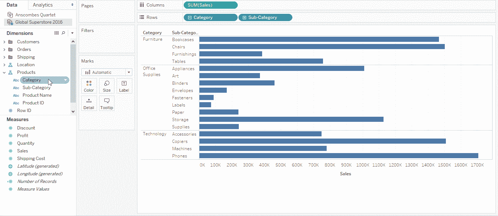

# 用 Tableau 创建可视化

我想现在你已经很熟悉 Tableau 的术语了。让我们继续前进，探索一些您可以在 Tableau 中轻松创建的可视化。现在，让我给你看一些在 Tableau 中非常流行的图表。

## **条形图**

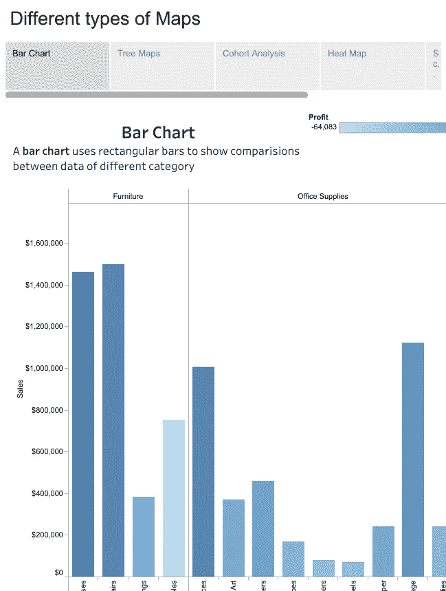

## **热图**

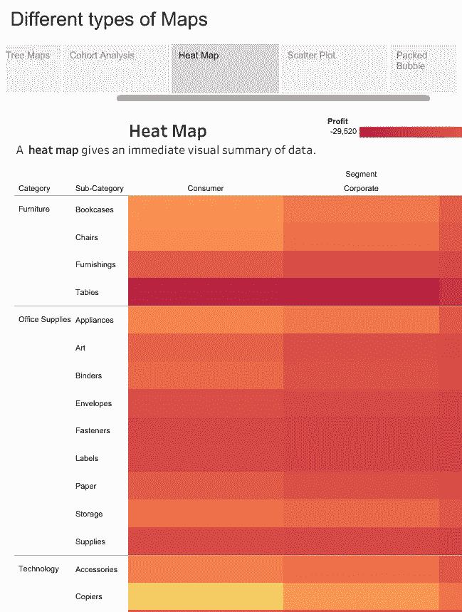

## **散点图**

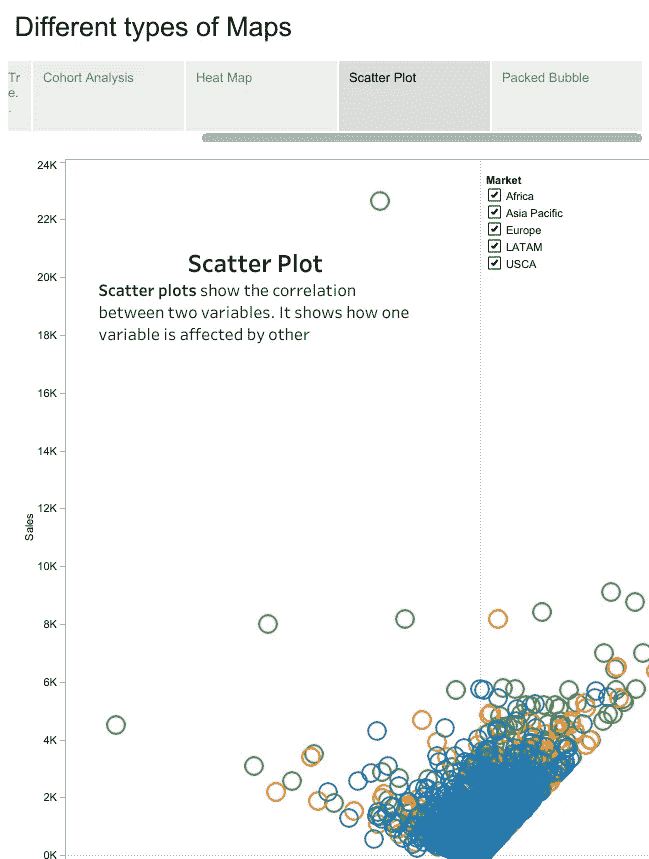

## **挤泡泡**

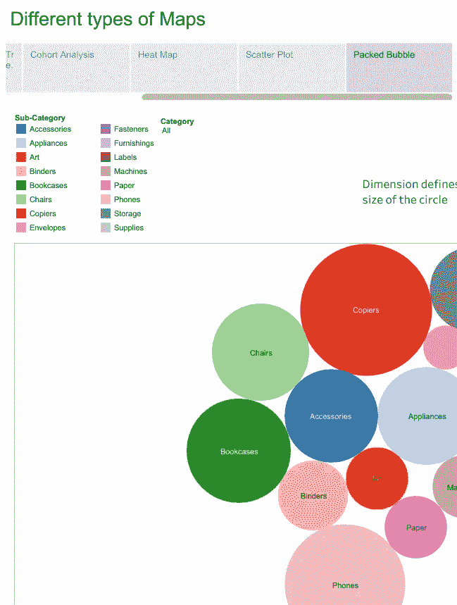

## 协同分析

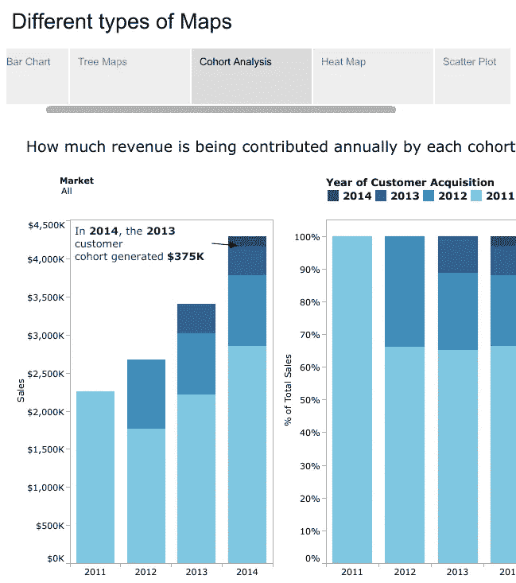

## 树形地图

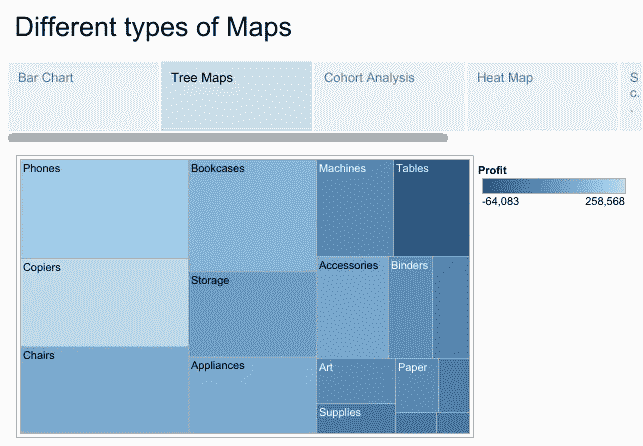

*这就把我们带到了“什么是 Tableau？”这篇文章的结尾。我希望这篇文章对你有所帮助，并增加了你的知识价值。*

如果你想查看更多关于人工智能、DevOps、道德黑客等市场最热门技术的文章，那么你可以参考 [Edureka 的官方网站。](https://www.edureka.co/blog/?utm_source=medium&utm_medium=content-link&utm_campaign=what-is-tableau)

请留意本系列中的其他文章，它们将解释 Tableau 的各个方面。

> 1. [Tableau 教程](/edureka/tableau-tutorial-37d2d6a9684b)
> 
> 2. [Tableau 仪表盘](/edureka/tableau-dashboards-3e19dd713bc7)
> 
> 3. [Tableau 函数](/edureka/tableau-functions-ce794b10e588)
> 
> 4.[表格图表](/edureka/tableau-charts-111758e2ea97)
> 
> 5.[场景中的 LOD 表情](/edureka/tableau-lod-2f650ca1503d)
> 
> 6. [Tableau 提示和技巧](/edureka/tableau-tips-and-tricks-a18bf8991afc)
> 
> 7.[循序渐进指导学习 Tableau 公共](/edureka/tableau-public-942228327953)
> 
> 8. [Tableau 桌面 vs Tableau 公共 vs Tableau 阅读器](/edureka/tableau-desktop-vs-tableau-public-vs-tableau-reader-fbb2a3aa0bac)
> 
> 9.[如何在 Tableau 中创建和使用参数？](/edureka/parameters-in-tableau-ac552e6b0cde-ac552e6b0cde)
> 
> 10.[Tableau 中的集合是什么以及如何创建它们](/edureka/sets-in-tableau-39befe9b7fa1)
> 
> 11.[数据混合](/edureka/tableau-lod-2f650ca1503d)
> 
> 12 .[Tableau 中的甜甜圈图](/edureka/donut-chart-in-tableau-a2e6fadf6534)
> 
> 13.[2020 年你必须准备的 50 个 Tableau 面试问题](/edureka/tableau-interview-questions-and-answers-4f80523527d)
> 
> 14.[如何以及何时使用不同的 Tableau 图表](/edureka/tableau-charts-111758e2ea97)

*原载于 2017 年 5 月 19 日 www.edureka.co***。**