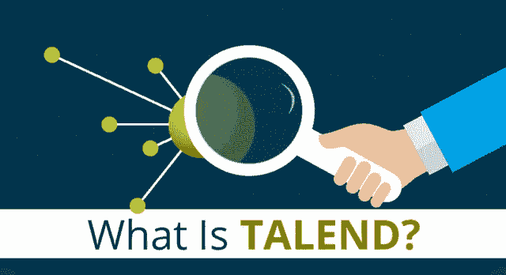
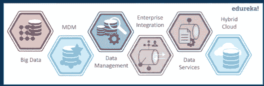
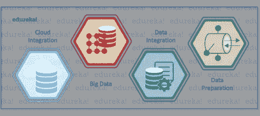
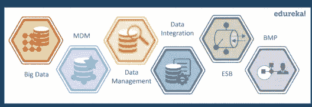
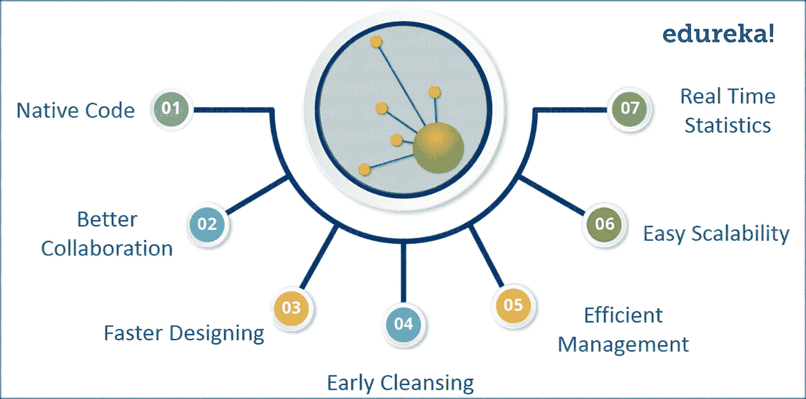

# Talend 是什么？Talend ETL 工具简介

> 原文：<https://medium.com/edureka/what-is-talend-tool-881b41fc1f5f?source=collection_archive---------5----------------------->

What is Talend? — Edureka

在当今的大数据和以云为中心的世界中，组织利用其企业信息变得非常重要。 ***Talend*** 是一个开源软件集成平台，帮助您毫不费力地将这些数据转化为商业见解。通过这篇文章，我将向您介绍 Talend ETL 工具。

让我们快速浏览一下我将在本文中讨论的主题:

*   Talend 是什么？
*   Talend 产品
*   Talend 的优势
*   现实生活中的用例

# Talend 是什么？

Talend 是一个开源数据集成平台。它为数据集成、数据管理、企业应用集成、数据质量、云存储和大数据提供各种软件和服务。Talend 于 2005 年作为第一家数据集成软件的商业开源软件供应商首次进入市场。2006 年 10 月，Talend 推出了它的第一款产品——*Talend Open Studio*，现在被称为*Talend Open Studio for Data Integration*。从那时起，它已经发布了广泛的产品，在市场上非常受欢迎。

Talend 被认为是云和大数据集成软件的下一代领导者。它帮助公司做出实时决策，并变得更加数据驱动。使用 Talend，数据变得更容易访问，质量得到提高，并且可以快速转移到目标系统。

为了便于理解，我列出了 Talend 产品的一些有趣特性:

*   ***更快的开发和部署:*** Talend 自动执行任务并为您进一步维护。
*   ***费用更少:*** Talend 提供开源工具，可以免费下载。此外，随着流程的加快，开发成本会大大降低。
*   ***未来的证明:*** Talend 包含您可能需要的一切，以满足现在和未来的市场需求。因此，它不太可能很快退出市场。
*   ***统一平台:*** Talend 根据组织的需求，在产品的共同基础上满足我们所有的需求。
*   ***庞大的社区:*** 作为一款开源软件，它有一个庞大的社区做后盾。这是所有 *Talend* 用户和*社区*成员的首选位置，他们可以在这里分享信息、经验、疑问、疑问等。

在本文的下一部分，我们将了解 Talend 发布的各种产品。

# Talend 产品

## Talend 平台

## 泰伦企业

## Talend 开放工作室

在所有这些产品中，使用最多的产品是 Talend Open Studios，因为它们是免费的，任何人都可以轻松下载和使用。

# Talend 的优势

现在让我列出一些使用 Talend 的优势:

现在，你知道什么是 Talend，它有什么优点，让我们看看 Talend 在现实生活中是如何帮助组织的。

# 现实生活中的用例

## **行业:**

零售和电子商务

## **关于:**

Groupon 是一个美国电子商务市场，通过在全球 15 个国家提供各种活动、旅游、商品和服务，将用户与当地商家联系起来。截至 2015 年 3 月，它已经为大约 4810 万活跃客户提供服务，并在全球 48 个国家的超过 425，000 笔活跃交易中占据重要地位。Groupon 的商业模式改变了公司接触新客户的方式。不管原因是什么，Groupon 接触到了更多的人，这比任何其他媒体都更直接、更迅速。

## **挑战:**

*   Groupon 的业务活动主要依赖于它的 IT 基础设施。该公司在短短几年内的惊人增长最终给其 IT 基础设施带来了巨大的压力。
*   据说是 Groupon 生命线的海量数据成为了一个巨大的挑战。平均而言，该公司每天需要处理大约 1tb 的原始数据，这也是实时的。
*   此外，他们还必须在各种数据库中存储这些经过*处理的信息*。

## **塔伦德帮了什么忙:**

Groupon 使用 Talend 的数据集成产品将不同来源的原始数据导入数据仓库，然后将其转换为所需的格式，再导出到各种目标系统。

***它究竟是如何工作的？***

Groupon 从 30 多个国家收集客户数据，并通过 Talend 集成平台将其加载到数据仓库中。Groupon 借助运行在 PostgreSQL 数据库上的 OLTP 解决方案，每天处理数百万笔交易。然后，Talend 平台每隔 5 分钟将数据从 OLTP 系统复制到 Teradata 仓库。与此同时，客户数据也从不同的数据源加载到 Salesforce CRM 解决方案。为了确保 Groupon 始终拥有单一的真实来源，这些数据每小时都会与数据仓库进一步同步。

因此，Talend 集成平台的最终目标是从 CRM、电子邮件营销和 OLTP 系统等各种来源导入数据，并尽快将其转移到数据仓库。然后，销售团队可以使用这些汇总数据来支持战略决策。

## **结果:**

*   每天都有 1 TB 的原始数据被实时处理并存储在各种目标系统中
*   **每天使用 **ETL** 流程执行 1000 个数据集成任务**
*   每隔 **5 分钟**，Talend 用 **OLTP** 系统数据更新数据仓库

> **“使用 Talend，我们可以实时分析 1tb 的客户数据，这有助于我们在趋势出现时识别出**
> **。”**
> 
> **-Rafael Herrera，Groupon GmbH 商务智能国际部主管**

这就把我们带到了这篇关于什么是 Talend 的文章的结尾。我尽最大努力让内容简短而有知识性。希望你喜欢读它。

如果你想查看更多关于人工智能、DevOps、道德黑客等市场最热门技术的文章，那么你可以参考 [Edureka 的官方网站。](https://www.edureka.co/blog/?utm_source=medium&utm_medium=content-link&utm_campaign=what-is-talend-tool)

请留意本系列中的其他文章，它们将解释 Talend 的各个方面。

> 1. [Talend 教程](/edureka/talend-tutorial-data-integration-2ecf5159388e)
> 
> 2. [Talend ETL 教程](/edureka/talend-etl-tool-d08b497c33f)
> 
> 3. [Talend 大数据教程](/edureka/talend-big-data-tutorial-7500d3b457a8)
> 
> 4. [Talend 架构](/edureka/talend-architecture-18dd64db2408)

*原载于 2018 年 3 月 5 日*[*www.edureka.co*](https://www.edureka.co/blog/what-is-talend-tool/)*。*