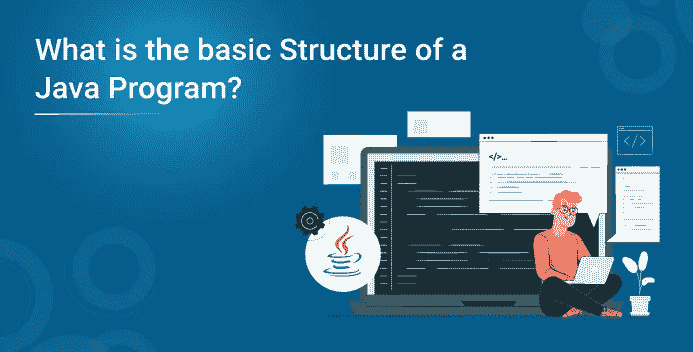
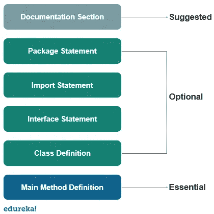

# Java 程序的基本结构是什么？

> 原文：<https://medium.com/edureka/what-is-the-basic-structure-of-a-java-program-b41387238ea9?source=collection_archive---------5----------------------->



Java 编程语言是平台无关的，是一种安全的编程语言。随着各种各样的应用，Java 编程语言在过去的二十年里一直有需求。开箱即用的特性有助于 java 脱颖而出。在本文中，我们将详细了解 java 程序的结构。以下是本文中讨论的主题:

*   文件科
*   程序包语句
*   导入语句
*   接口部分
*   类别定义
*   主方法类

# 文件科



它用于提高程序的可读性。它由 Java 中的注释组成，这些注释包括基本信息，如方法的用法或功能，以便程序员在审查或调试代码时更容易理解它。Java 注释不一定局限于有限的空间，它可以出现在代码中的任何地方。

编译器在执行时会忽略这些注释，这只是为了提高 Java 程序的可读性。

Java 支持三种类型的注释

*   单行注释
*   多行注释
*   文档注释

让我们看一个例子来理解如何在 Java 程序中使用上述注释。

```
// a single line comment is declared like this
/* a multi-line comment is declared like this
and can have multiple lines as a comment */
/** a documentation comment starts with a delimiter and ends with */
```

# 程序包语句

Java 中有一个条款允许你在一个叫做 package 的集合中声明你的类。一个 Java 程序中只能有一个 package 语句，并且它必须位于代码的开头，在任何类或接口声明之前。这个语句是可选的，例如，看看下面的语句。

`**package**` `student;`

该语句声明在这个源文件中定义的所有类和接口都是学生包的一部分。并且在源文件中只能声明一个包。

# 导入语句

许多预定义的类存储在 Java 的包中，import 语句用于引用存储在其他包中的类。import 语句总是写在 package 语句之后，但必须在任何类声明之前。

我们可以在 import 语句中导入一个或多个特定的类。看一下这个例子，了解如何在 Java 中导入语句。

```
import java.util.Date; //imports the date class
import java.applet.*;  //imports all the classes from the java applet package
```

# 接口部分

这个部分用于在 Java 中指定一个接口。这是一个可选部分，主要用于在 Java 中实现多重继承。接口与 Java 中的类非常相似，但它只包含常量和方法声明。

接口不能被实例化，但它可以由类实现或由其他接口扩展。

```
interface stack{
void push(int item);
void pop();
}
```

# 类别定义

一个 Java 程序可能包含几个类定义，类是任何 Java 程序的基本部分。它定义了程序中用户定义的类的信息。

类是对字段进行操作的变量和方法的集合。Java 中的每个程序都至少有一个包含 main 方法的类。

# 主方法类

main 方法是从执行实际开始的地方开始的，并遵循为以下语句指定的顺序。让我们看一个示例程序来理解它是如何构造的。

```
public class Example{
//main method declaration
public static void main(String[] args){
System.out.println("hello world");
}
}
```

让我们一行一行地分析上面的程序，了解它是如何工作的。

## 公共类示例

这将创建一个名为 Example 的类。您应该确保类名以大写字母开头，并且 public 单词意味着它可以从任何其他类中访问。

## 评论

为了提高可读性，我们可以使用注释来为程序员定义特定的注释或方法的功能等。

## 吊带

花括号用于将所有命令组合在一起。以确保命令属于某个类或方法。

## 公共静态无效干线

*   当 main 方法被声明为 public 时，意味着它也可以在这个类之外使用。
*   单词 static 意味着我们想访问一个方法而不创建它的对象。因为我们调用 main 方法时没有创建任何对象。
*   单词 void 表示它不返回任何值。main 被声明为 void，因为它不返回任何值。
*   主要是方法，这是任何 Java 程序必不可少的部分。

## String[]参数

它是一个数组，其中每个元素都是一个字符串，名为 args。如果通过控制台运行 Java 代码，可以传递输入参数。main()将其作为输入。

## system . out . println()；

该语句用于在屏幕上打印输出，其中 system 是预定义的类，out 是 PrintWriter 类的对象。println 方法在屏幕上用新的一行打印文本。所有 Java 语句都以分号结尾。

这就把我们带到了本文的结尾，我们已经了解了 Java 程序的结构。我希望你清楚本教程中与你分享的所有内容。如果你想查看更多关于人工智能、DevOps、道德黑客等市场最热门技术的文章，你可以参考 Edureka 的官方网站。

请留意本系列中解释 Java 其他各方面的其他文章。

> *1。* [*面向对象编程*](/edureka/object-oriented-programming-b29cfd50eca0)
> 
> *2。*[*Java 中的继承*](/edureka/inheritance-in-java-f638d3ed559e)
> 
> *3。*[*Java 中的多态性*](/edureka/polymorphism-in-java-9559e3641b9b)
> 
> *4。*[*Java 中的抽象*](/edureka/java-abstraction-d2d790c09037)
> 
> *5。* [*Java 字符串*](/edureka/java-string-68e5d0ca331f)
> 
> *6。* [*Java 数组*](/edureka/java-array-tutorial-50299ef85e5)
> 
> *7。* [*Java 收藏*](/edureka/java-collections-6d50b013aef8)
> 
> 8。 [*Java 线程*](/edureka/java-thread-bfb08e4eb691)
> 
> *9。*[*Java servlet 简介*](/edureka/java-servlets-62f583d69c7e)
> 
> *10。* [*Servlet 和 JSP 教程*](/edureka/servlet-and-jsp-tutorial-ef2e2ab9ee2a)
> 
> *11。*[*Java 中的异常处理*](/edureka/java-exception-handling-7bd07435508c)
> 
> *12。* [*高级 Java 教程*](/edureka/advanced-java-tutorial-f6ebac5175ec)
> 
> *13。* [*Java 面试题*](/edureka/java-interview-questions-1d59b9c53973)
> 
> *14。* [*Java 程序*](/edureka/java-programs-1e3220df2e76)
> 
> *15。*[*kot Lin vs Java*](/edureka/kotlin-vs-java-4f8653f38c04)
> 
> *16。* [*依赖注入使用 Spring Boot*](/edureka/what-is-dependency-injection-5006b53af782)
> 
> *17。* [*堪比 Java 中的*](/edureka/comparable-in-java-e9cfa7be7ff7)
> 
> *18。* [*十大 Java 框架*](/edureka/java-frameworks-5d52f3211f39)
> 
> *19。* [*Java 反射 API*](/edureka/java-reflection-api-d38f3f5513fc)
> 
> *20。*[*Java 中的 30 大模式*](/edureka/pattern-programs-in-java-f33186c711c8)
> 
> *21。* [*核心 Java 备忘单*](/edureka/java-cheat-sheet-3ad4d174012c)
> 
> *22。*[*Java 中的套接字编程*](/edureka/socket-programming-in-java-f09b82facd0)
> 
> *23。* [*Java OOP 备忘单*](/edureka/java-oop-cheat-sheet-9c6ebb5e1175)
> 
> *24。*[*Java 中的注解*](/edureka/annotations-in-java-9847d531d2bb)
> 
> 25。[*Java 中的库管理系统项目*](/edureka/library-management-system-project-in-java-b003acba7f17)
> 
> *26。*[*Java 中的树*](/edureka/java-binary-tree-caede8dfada5)
> 
> *27。*[*Java 中的机器学习*](/edureka/machine-learning-in-java-db872998f368)
> 
> 28。 [*顶级数据结构&Java 中的算法*](/edureka/data-structures-algorithms-in-java-d27e915db1c5)
> 
> *29。* [*Java 开发者技能*](/edureka/java-developer-skills-83983e3d3b92)
> 
> 三十。 [*前 55 名 Servlet 面试问题*](/edureka/servlet-interview-questions-266b8fbb4b2d)
> 
> *31。*[](/edureka/java-exception-handling-7bd07435508c)*[*顶级 Java 项目*](/edureka/java-projects-db51097281e3)*
> 
> *32。 [*Java 字符串备忘单*](/edureka/java-string-cheat-sheet-9a91a6b46540)*
> 
> **33。*[*Java 中的嵌套类*](/edureka/nested-classes-java-f1987805e7e3)*
> 
> **34。* [*Java 集合面试问答*](/edureka/java-collections-interview-questions-162c5d7ef078)*
> 
> **35。*[*Java 中如何处理死锁？*](/edureka/deadlock-in-java-5d1e4f0338d5)*
> 
> **36。* [*你需要知道的 50 个 Java 合集面试问题*](/edureka/java-collections-interview-questions-6d20f552773e)*
> 
> **37。*[*Java 中的字符串池是什么概念？*](/edureka/java-string-pool-5b5b3b327bdf)*
> 
> **38。*[*C、C++和 Java 有什么区别？*](/edureka/difference-between-c-cpp-and-java-625c4e91fb95)*
> 
> **39。*[*Java 中的回文——如何检查一个数字或字符串？*](/edureka/palindrome-in-java-5d116eb8755a)*
> 
> *40。 [*你需要知道的顶级 MVC 面试问答*](/edureka/mvc-interview-questions-cd568f6d7c2e)*
> 
> *41。[*Java 编程语言十大应用*](/edureka/applications-of-java-11e64f9588b0)*
> 
> *42。[*Java 中的死锁*](/edureka/deadlock-in-java-5d1e4f0338d5)*
> 
> **43。*[*Java 中的平方和平方根*](/edureka/java-sqrt-method-59354a700571)*
> 
> **44。*[*Java 中的类型转换*](/edureka/type-casting-in-java-ac4cd7e0bbe1)*
> 
> *45。[*Java 中的运算符及其类型*](/edureka/operators-in-java-fd05a7445c0a)*
> 
> *46。[*Java 中的析构函数*](/edureka/destructor-in-java-21cc46ed48fc)*
> 
> *47。[*Java 中的二分搜索法*](/edureka/binary-search-in-java-cf40e927a8d3)*
> 
> **48。*[*Java 中的 MVC 架构*](/edureka/mvc-architecture-in-java-a85952ae2684)*
> 
> **49。* [*冬眠面试问答*](/edureka/hibernate-interview-questions-78b45ec5cce8)*

**原载于 2019 年 9 月 12 日*[*https://www.edureka.co*](https://www.edureka.co/blog/structure-of-a-java-program/)*。**