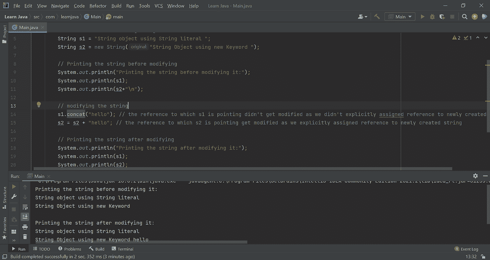

# String、StringBuilder、StringBuffer 有什么区别？

> 原文：<https://medium.com/quick-code/what-is-the-difference-between-string-stringbuilder-and-stringbuffer-6b8a998f6eae?source=collection_archive---------0----------------------->

## **String、StringBuilder、StringBuffer 有什么区别？**

我们先来了解一下什么是 String、StringBuilder、StringBuffer。

# **弦**

*   Java 中的字符串是一个表示字符序列的对象。
*   Java 字符串是不可变的，这意味着一旦它被声明就不能被改变
*   我们可以用两种方法创建字符串对象。1)通过使用字符串文字，2)通过 new 关键字。
*   Java 中的字符串对象存储在一个叫做字符串常量池的空间中。如果池中已经存在该字符串，则返回对池实例的引用。

让我们看下面的例子来理解不变性和创建 Java 字符串对象的不同方法。

Immutability of string

# **StringBuilder**

*   与字符串类似，StringBuilder 也是一个表示字符序列的对象。
*   Java StringBuilder 类用于创建可变字符串。
*   除了 Java StringBuilder 类不是线程安全的之外，这意味着它不能保证同步。

下面的例子展示了 StringBuilder 类的可变性。

The mutability of the StringBuilder class

下面的例子说明了为什么 StringBuilder 不是线程安全的。

Example of how StringBuilder class is not thread-safe

正如我们看到的，我们有两个线程，每个线程添加了 50000 个“A”字符，因此结果字符串的理想长度应该是 100000，但它是 98885，这是意外的。因此，我们可以明确地说 StringBuilder 类不是线程安全的。

# **StringBuffer**

*   与 StringBuilder 类似，StringBuffer 也是一个表示字符序列的对象，它用于创建可变字符串。
*   Java StringBuffer 类是线程安全的。这意味着多个线程不能同时访问它，并保证同步。

下面的例子展示了 StringBuffer 类是线程安全的和可变的。

Thread-safe and mutable StringBuffer class

在这里，我们可以看到我们有两个线程，每个线程添加了 50000 个“A”字符，因此结果字符串的理想长度应该是 100000，实际上是 100000。因此，我们可以明确地说 StringBuffer 类是线程安全的。

## 我们可以将 String、StringBuilder 和 StringBuffer 之间的区别总结如下。

Difference between String, StringBuilder, and StringBuffer