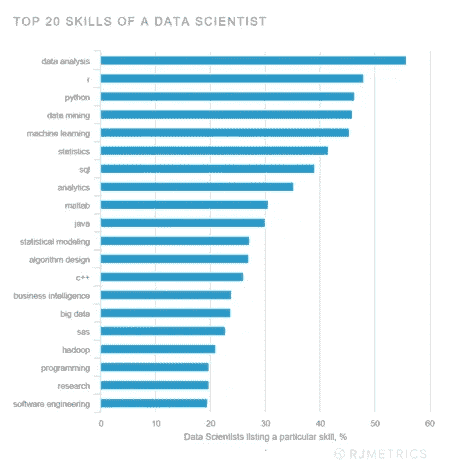

# R 的未来如何？

> 原文：<https://medium.com/quick-code/what-is-the-future-of-r-b41c413f0a71?source=collection_archive---------0----------------------->

当我决定在 R 编程领域迈出一步时，我想到的一个最重要的问题是，这种语言是否值得学习？下面的问题迫使我对 R 的职业前景和未来做了彻底的研究。令我惊讶的是，我发现 R 将会有一个光明的未来。下面我根据我的研究分享了 R 程序员的职业前景、工作角色和薪水。

r 是数据科学家和统计学家最常用的语言。据估计，R 的用户大约有 200 万。世界各地有成千上万的人与他们的团队一起为 R 贡献 [**数据科学课程**](https://onlineitguru.com/data-science-course.html) 技术。它被认为是游戏规则的改变者，因为 R 编程已经被证明是最好的数据分析工具。

R 编程的未来是充满希望的，现在已经成为趋势，因为对于编程新手来说，它是一种简单而容易的语言。

**应用&R 在各个领域的作用- >** 除了 IT 行业，还有其他几个行业也在雇佣 R 程序员来利用他们的数据&寻找问题的解决方案。一些非常需要 R 申请人的行业-

*   *金融行业*
*   *银行*
*   *卫生组织*
*   *学术界*
*   *制造公司*
*   *政府部门*

从零开始学习 R 编程，用 [**数据科学认证**](https://onlineitguru.com/data-science-course.html) 更接近你的数据科学梦想

**R 职位名称- >** 以下是 R 程序员的工作岗位-

*   **数据科学家**

数据科学家记录、存储和分析数据，从中得出有意义的见解。r 被认为是高效处理数据的最合适的工具。

*平均年收入-28，000，000 印度卢比*

*   **商业分析师**

业务分析师试图通过开发高级解决方案来解决业务问题。r 通过其庞大的软件包，为此提供了各种商业智能工具。

*平均年收入-67 万印度卢比*

*   **量化分析师**

定量分析师处理所有类型的数据&试图为各种数据问题提供有效的解决方案。R 的健壮的库和包有助于解决问题。

*平均年收入-58 万印度卢比*

*   **数据分析师**

数据分析师负责提取和分析数据。公司可以通过使用 R 统计库获得准确的决策。

*平均年收入-720，000 印度卢比*

*   **数据可视化专家**

非常需要 R 编程方面的数据可视化专家。R 流行的主要原因之一是它强大的可视化库。R 的各种包如 plotly，ggplot2 等。促进有吸引力的图表和情节。

*平均年收入-65 万印度卢比*

**R->就业前景**

R 程序员可以从事各种类型的工作。由于对数据科学家的需求不断增长，初学者和专业 R 程序员都可以进入数据科学行业。

组织使用 R 程序员来实现他们的分析目标，并期望新员工已经掌握了 R 工具和技术的知识。

> 要深入了解 R 的数据科学知识，请注册参加 [**数据科学在线培训**](https://onlineitguru.com/data-science-course.html) 的实时免费演示

下面是一些例子

*   纽约时报——它使用 R 来创建信息图表。
*   福特- R 正被福特用来改进其车辆的设计。
*   谷歌——为了计算广告活动的投资回报率，使用了 R。
*   Twitter- R 也被 Twitter 用来监控用户体验。

考虑到以上事实，可以肯定地说 R 将会有一个光明的未来。最新的薪酬待遇处于最佳状态，所以你可以想象在不久的将来它会涨多少。

希望这对你有所帮助！