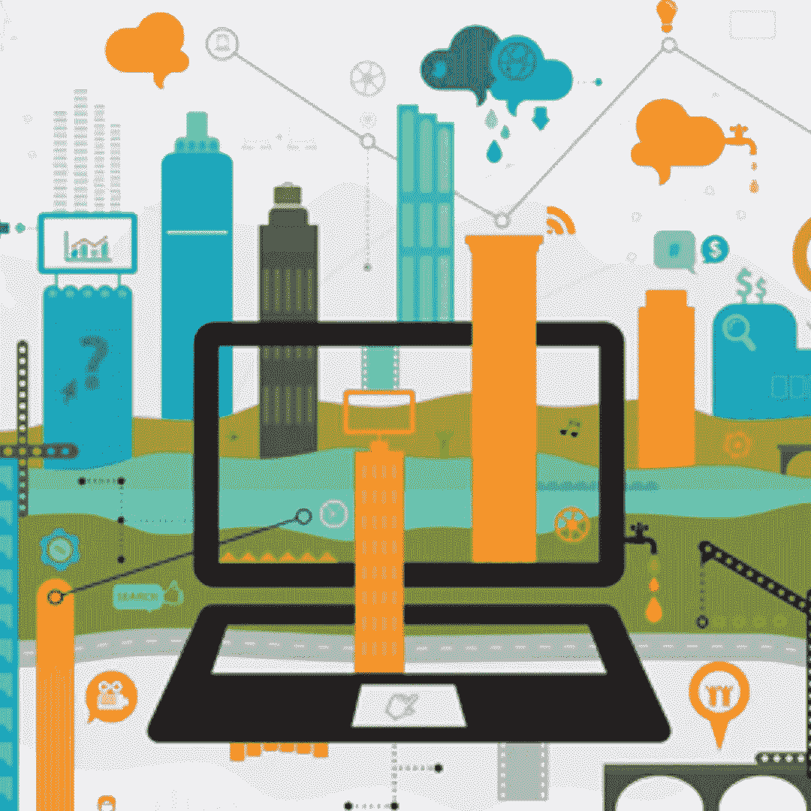

# 什么是物联网

> 原文：<https://medium.com/quick-code/what-is-the-internet-of-things-iot-a2c58ce577a5?source=collection_archive---------1----------------------->

关于“[物联网](https://www.mytectra.com/iot-training-in-bangalore.html)”(IoT)已经有了很多讨论。但是，这个术语在网络空间中到底意味着什么呢？

对于天生相对无组织的人类来说，“物联网”是一个伟大的创新。然而，对于重视隐私的人来说，“物联网”可能会被视为大规模入侵。

本质上，“[物联网](https://www.mytectra.com/iot-training-in-bangalore.html)意味着让每一个电子设备——以及许多其他东西——以某种方式与互联网实时连接和互动，以便可以跟踪和监控。根据推理，通过互联网“云”以这种方式对一切进行分类，你将能够更好地组织你的生活，而不需要花费“时间”关注你的生活。

这种存在也有好处。比如，让你的手机发出嗡嗡声，提醒你买鸡蛋，因为你的冰箱会发送通知，告诉你的手机鸡蛋快吃完了。谁不想被提醒鸡蛋快吃完了？

或者你可以通过手机设置家庭安全系统。或者你可以用手机或手持设备锁车。如果你足够精通技术，你可以使用手持设备来跟踪和组织你认为足够重要的一切。

“物联网”的缺点是它可能容易受到监控，无论是公司还是政府。虽然政府不一定会对你是否几乎没有鸡蛋感兴趣，但有很多公司会想知道你的鸡蛋购买习惯。他们愿意为这种信息支付惊人的金额，这样他们就可以更准确地将他们的在线广告瞄准像你这样的鸡蛋购买者。

那么，如果你决定走上“物联网”的道路，你如何保护自己的隐私呢

# 这里有一些简单的提示:

1.知道什么是重要的。如果你在鸡蛋上贴上 RFID 标签，而不是给自己写一张需要购买鸡蛋的便条，你可能把“物联网”的概念带得有点远了。

2.如果你注意到在线广告似乎特别针对你，你可能要考虑拔掉一点。至少，关闭或限制你的网络浏览器激活 cookies 的能力。“Cookies”是“跟踪机制”的一种可爱的说法 Cookies 存储您的浏览历史、密码、用户名等。它们可以让你的电子生活变得无限方便，但它们也可以用来跟踪数量惊人的个人信息。

3.保护好你的 WiFi 和云密码。太多的人使用他们的生日，宠物的名字，社会安全号码，或者其他可笑的愚蠢的标识符，即使是温和的黑客也能发现。如果人们不采取简单的密码预防措施，“物联网”将成为他们的数字游乐场。恶作剧黑客可以打开和关闭你的车库门；在“物联网”的世界里，专业黑客不费吹灰之力就能摧毁你的生活。

4.记住，“[物联网](https://www.mytectra.com/iot-training-in-bangalore.html)本质上是一种便利。这不是必需品。如果你用一个移动设备在三个州之外打开和关闭你的阁楼灯，你是在轻率和不必要地使用它。如果你用它来监控你的安全系统并向当局报警，你就用对了。

最终，“物联网”只是互联网持续发展的最新代表。几乎可以肯定的是，六个月后将会是另一番景象。

*最初发表于*[T5【https://www.mytectra.com】](https://www.mytectra.com/blog/what-is-iot-internet-of-things/)*。*