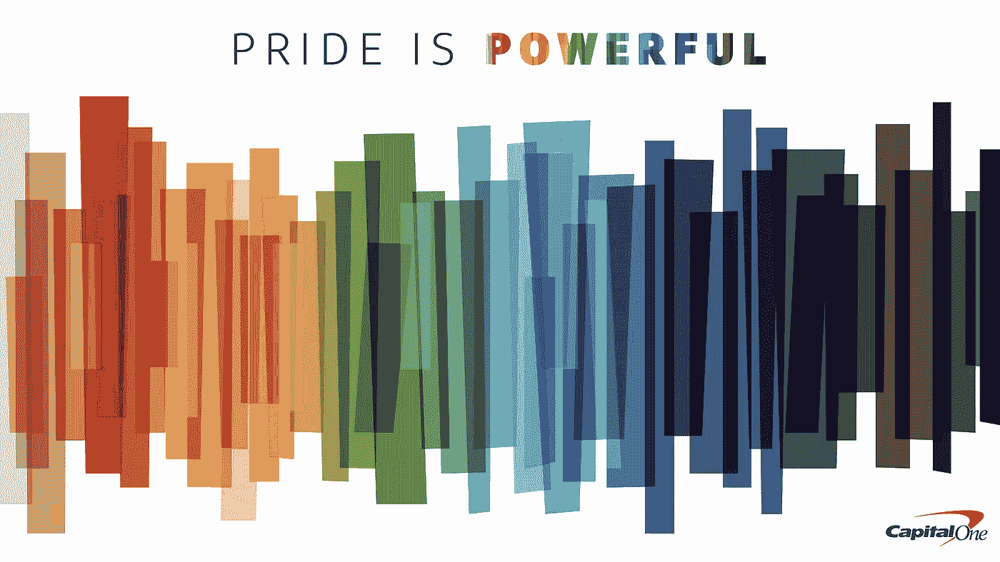

# 骄傲的力量是什么？

> 原文：<https://medium.com/capital-one-tech/what-is-the-power-of-pride-daf2d2ddfe3f?source=collection_archive---------6----------------------->

## 这个月，我们庆祝科技力量与骄傲力量的交汇

对于 LGBTQ+社区来说，自豪月是一个自豪和自由地表达对自己、对方和社区的爱的机会。从石墙骚乱的暴力开始，骄傲不仅象征着为所有 LGBTQ+个人争取平等权利，它也是对社区内所有自由和自豪地生活在真理中的人的庆祝——无论他们在个人旅程中处于什么位置。

LGBTQ+的工程师和开发人员从第一天起就是科技行业的基础部分。这种骄傲，我们颂扬他们的贡献，以及科技力量与骄傲力量的交汇。

# **团结社区**

**因为与同龄人和盟友的联系很重要。**

*   [**科技女同性恋** :](https://lesbianswhotech.org/pridesummit2021/) Capital One 是科技女同性恋的骄傲赞助商，我们迫不及待地想分享我们今年如何将骄傲的力量带到我们的展台。查看 Allison Perkel 在 2020 年关于 Capital One 云计算之旅的主题演讲中的[反思。](https://www.capitalone.com/tech/cloud/doing-the-hard-things-first/)

# **扩大知名度**

**为员工创造一个安全的空间和平台，分享他们的经验和思想领导力。**

*   [**员工反思**](https://www.capitalonecareers.com/pride-is-powerful-associate-reflections-cul-divi) —为了突出骄傲在全球的力量，我们请 Capital One 的员工，包括我们工程团队的许多员工，反思他们个人的、强大的骄傲经历。这是他们说的，用他们自己的话说。
*   [**专题文章:使用模板化文档**](https://www.capitalone.com/tech/software-engineering/how-to-use-templates-for-better-documentation/)——我们的技术博客不仅提供了我们高科技的内幕，也为各种背景的同事提供了一个分享专业知识的机会。查看 Ariel Diamond 最近的一篇文章，了解模板是如何成为一种无价的文档工具，可以传达未被识别的假设，并帮助用户开始并持续使用您的服务。

# **向前移动 LGBTQ+权限**

**我们知道在争取平等的道路上还有很多工作要做，但是当我们作为一个团体走到一起时，我们的声音会更有力量，影响会更持久。**

*   [**Capital One 宣布大力支持《平等法案》**](https://www.capitalone.com/about/newsroom/equality-act/) **—** 在 Capital One，我们对 LGBTQ+社区有着长期的承诺，最近还倡导通过《平等法案》，以确保其成员受到法律的平等保护。我们继续与人权运动和其他团体合作，倡导通过《平等法》。
*   [作为这些努力的一部分，我们很高兴地宣布，我们将通过超过 50 万美元的资金对社区进行直接投资，以支持我们推动变革的两个合作伙伴:](https://www.capitalone.com/about/newsroom/pride-is-powerful/) [Out & Equal](https://outandequal.org/) 和[国家跨性别平等中心](https://transequality.org/)。
*   [**普惠福利帮助 LGBTQ+员工茁壮成长**](https://www.capitalonecareers.com/inclusive-benefits-help-lgbtq-associates-thrive-cul-divi) —对于 Capital One 的员工来说，茁壮成长可以归结为找到他们需要的福利和资源来支持他们所爱的人，并反映他们如何确定和选择建立自己的家庭。我们提供的福利方案旨在支持所有员工，公平是决策的首要考虑因素，并承认虽然不同的人有不同的需求，但每个人和每个家庭都应该过得好——无论是身体上、经济上还是情感上。

我们知道，多元化和包容性让我们变得更加强大——不仅仅是在骄傲的时候，而是每天都是如此。我们致力于利用我们的声音和平台，代表我们的同事、客户和社区倡导积极的变革，并邀请您加入我们。[了解今年我们如何在首都一号庆祝和表彰骄傲](https://www.capitalone.com/about/newsroom/pride-is-powerful/)。

*披露声明:2021 资本一。观点是作者个人的观点。除非本帖中另有说明，否则 Capital One 不隶属于所提及的任何公司，也不被这些公司认可。使用或展示的所有商标和其他知识产权是其各自所有者的财产。*