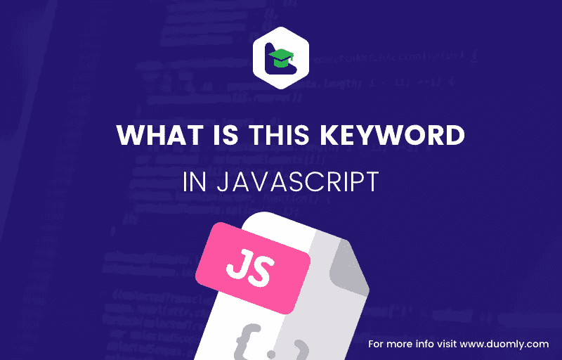

# Javascript 中这是什么？

> 原文：<https://medium.com/quick-code/what-is-this-in-javascript-3cf0a7628798?source=collection_archive---------0----------------------->



[Duomly — programming online courses](https://www.duomly.com)

Javascript 中的这个关键字是一个非常重要的概念，它让初学者和更高级的开发人员都感到困惑。功能很强大，但是不知道怎么用就没那么好用了。

在本文中，我将解释这个关键字是什么，以及它在不同情况下的值是什么，并通过代码示例使其更加明显。

# 这是什么？

让我们首先解释 Javascript 代码是如何工作的，以便更好地理解这个关键字是什么。每次我们在浏览器中运行 Javascript 时，引擎都会执行一系列步骤，其中之一就是创建执行上下文。执行上下文可以被理解为 Javascript 代码运行的环境。每个执行上下文都引用对象，这个对象通常引用这个关键字值。换句话说，我们可以说这个关键字是对调用函数的对象的引用。该关键字的值取决于它的使用位置。

# 这个单独使用

如果这将被单独使用，而不是在任何对象或函数的上下文中，它将引用全局范围。在浏览器的情况下，全局对象名是一个窗口。让我们看一个简单的代码示例:

```
<script>
var fruit = "apple";
function getFruit() {
   var fruit = "banana";
   console.log("fruit", fruit); // „banana”
   console.log("this.fruit", this.fruit); // „apple”
}
returnFruit();
</script>
```

让我们通过上面的例子来更好地理解这个单独使用的关键字。getFruit()函数是在全局范围内调用的，第一个 Fruit 变量也放在全局范围内。如果你将 console.log(this)，窗口对象将有 getFruit()方法和 Fruit 属性。

此时，当我们在调用 this.fruit 时，它会返回“apple”，但局部变量 fruit 会返回“banana”。

我们的 this here 是窗口对象，所以 this.fruit 引用全局 fruit 属性。

值得一提的是，在启用严格模式的情况下，这在全局范围内是未定义的。

# 这与方法一起使用

在从构造函数创建新对象的情况下，我们的 this 关键字指的是对象的新实例。

让我们来看看这个例子:

```
var firstName = "Peter";
var lastName = "Strong";function Person(firstName, lastName) {
  this.firstName = firstName;
  this.lastName = lastName;
  this.returnName = function() {
    return this.firstName + ' ' + this.lastName;
  };
}let newPerson = new Person("Kate", "Smith");
console.log(newPerson.returnName()); // "Kate Smith"
```

在调用 returnName()方法的情况下，它将引用使用 Person 构造函数创建的 newPerson 对象，我们的值将是“Kate Smith ”,而不是“Peter Strong ”,因为我们使用的是 newPerson 对象属性。

# 这用于函数中

在函数中使用这个关键字可能有点棘手。最好记住 Javascript 中的函数是一个对象。它有自己的属性，其中之一就是这个，它的值取决于它是如何被调用的。如果函数被任何对象调用，那么这个值就是对象。否则，我们这个属性的功能就是一个全局对象——窗口。让我们来看一个代码示例。

```
var catName = "Garfield";
var catColor = "orange";function getCat() {
  return this.catName + ' is ' + this.catColor;
}var cat = {
  catName = "Jerry",
  catColor = "gray",
  getCat: function() {
    return this.catName + ' is ' + this.catColor;
  }
}console.log('Cat in gloabl scope', getCat()); // "Garfield is orage"
console.log('Cat in object scope', cat.getCat()); // "Jerry is gray"
```

如果我们分析代码，可以看到两个函数，一个是全局作用域函数，一个是 cat 对象方法。当我们调用全局作用域函数 getCat()时，它使用全局作用域变量，因为函数中的这个关键字指的是全局对象。在 Cat 对象的 getCat()方法的情况下，这指的是 cat 对象属性，这就是我们如何从这样类似的函数中获得两个不同的结果。

# 这在事件中使用

在事件的情况下，在触发任何事件后，我们调用事件处理程序。这些处理程序是一个调用一些代码的函数。当我们在事件处理程序中使用这个关键字时，它指的是启动这个函数的 HTML 元素。请记住，DOM 模型是一个对象树，因此页面上的每个 HTML 元素都作为一个对象存储在其中。让我们来看一些示例代码:

```
<button onclick="this.style.backgroundColor='blue'">Click here!</button>
```

现在我们可以看到，使用它，我们可以引用按钮 HTML 对象并操作它的样式，例如。

# 调用()，应用()和绑定()

Javascript 中有三种方法可以帮助我们设置这个值，它们是 call()、apply()和 bind()。

有时我们想从对象中借用一个方法，并在其他上下文中使用它，就会出现错误。让我们看一下代码:

```
var boy = {
  greeting = 'Hello',
  sayHi: function() {
    return this.greeting;
  }
}var spanishBoy = {
  greeting: 'Hola'
} boy.sayHi(); // "Hello";
```

如果我们想使用 sayHi()函数，但是带有一个 spanishBoy 变量问候语，我们该怎么办？这就是 call()、apply()和 bind()得心应手之处。让我们仔细检查一下，看看有什么不同。

# 调用()

call()方法允许我们给这个关键字赋新的值。我们可以向 call()方法传递多个参数。第一个参数是 new this 的值，接下来，我们可以传递函数参数。因此，调用带有新 this 和传递参数的函数。让我们来看看代码:

```
var boy = {
  greeting = 'Hello',
  sayHi: function() {
    return this.greeting;
  }
}var spanishBoy = {
  greeting: 'Hola'
} boy.sayHi(); // "Hello";boy.sayHi.call(spanishBoy); // "Hola";
```

这里您可以看到使用 call()方法的结果。sayHi()方法是通过 spanishBoy 上下文立即调用的，我们有可能使用 Boy 对象方法，而无需为 spanishBoy 对象创建新方法。

# 应用()

我们来看看下一个方法，apply()。这个方法与 call()非常相似，它也让我们更改这个值，并在函数被使用后立即调用它，但是它们之间有一个小的区别。在向 call()方法传递参数时，它看起来像这样:call(newThis，arg1，arg2，arg3)。在 apply()函数的情况下，我们可以将它们作为数组传递，而不是分别传递每个参数，就像这样:apply(newThis，[arg1，arg2，arg3])。

# 绑定()

bind()方法与 call()和 apply()略有不同。bind()没有立即调用函数，而是创建并返回一个新的函数，并赋予新的 this 值。让我们看一下代码示例。

```
var boy = {
  greeting = 'Hello',
  sayHi: function() {
    return this.greeting;
  }
}var spanishBoy = {
  greeting: 'Hola'
} boy.sayHi(); // "Hello";
const sayHola = boy.sayHi.bind(spanishBoy);
sayHola(); // "Hola";
```

在这个例子中，我们可以看到我们能够创建一个名为 sayHola()的新函数，您可以随时调用它。在处理异步代码时，或者如果你想传递一些参数给你的函数，使用 bind()方法可能会非常有用。

# 结论

在本文中，我介绍了这个关键字在 Javascript 中的定义和用法。我解释了在不同的场景中你可以期望得到什么样的值，并描述了 3 个重要的方法:call()、apply()和 bind()。

考虑到理解这个关键字对正确使用它和避免代码中的大量错误是多么重要，我希望你会发现这篇文章是有用的。此外，记住理解 Javascript 的基础知识对掌握更高级的概念非常有帮助。

好好编码！


[Duomly — programming online courses](https://www.duomly.com)

感谢您的阅读。

这篇文章是我们的队友安娜创作的。