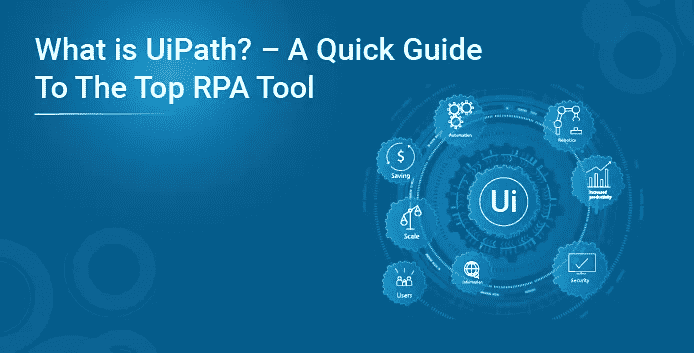
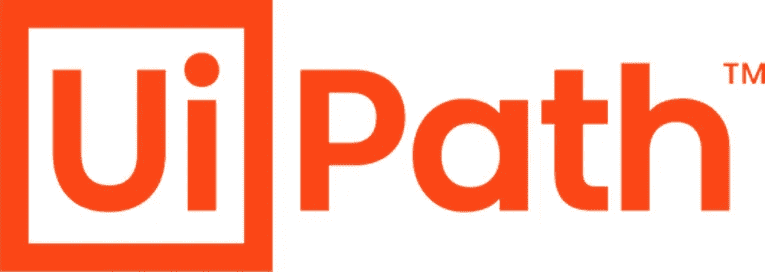
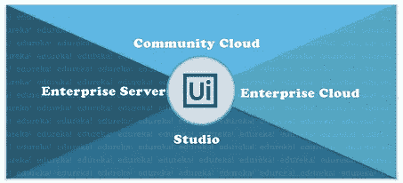
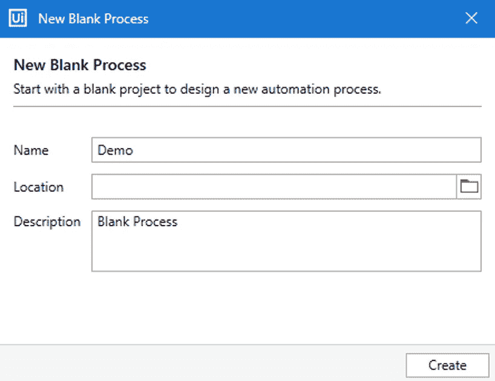
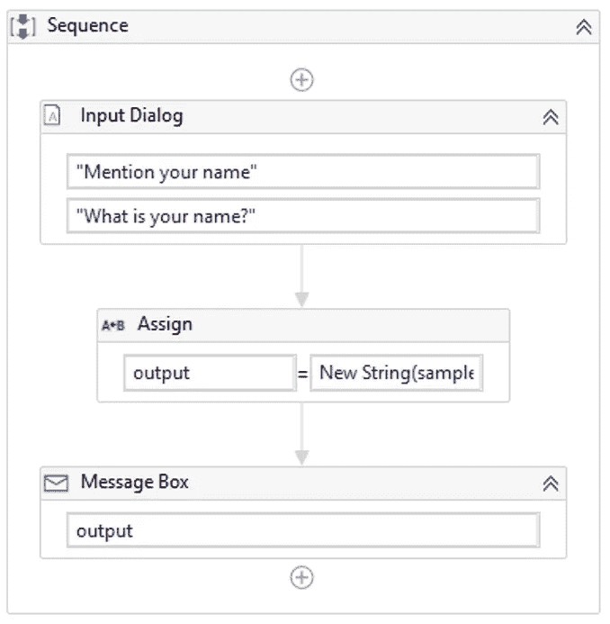
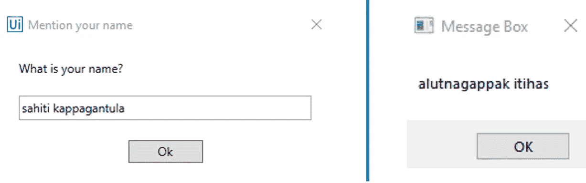

# 什么是 UiPath？—顶级 RPA 工具快速指南

> 原文：<https://medium.com/edureka/what-is-uipath-a26fcf471d5a?source=collection_archive---------0----------------------->

机器人流程自动化是在 RPA 工具的帮助下，从简单到复杂的任务实现自动化的过程。当今市场上的顶级工具之一是 UiPath。UiPath 被 Forrester 评为在战略和市场占有率方面得分最高的领导者。因此，在这篇关于什么是 UiPath 的文章中，我将通过讨论以下主题向您介绍 UiPath:

*   UiPath 简介
*   UiPath 版本
*   UiPath 安装
*   UiPath 的体系结构
*   UiPath 中的项目模板
*   UiPath Studio 组件
*   亲自动手

# 什么是 UiPath？

**UiPath** 是**一款机器人流程自动化工具**，用于 **Windows 桌面自动化**。它用于借助**拖放功能**自动化重复/冗余任务，并消除人工干预。该工具提供了各种版本来支持不同类型的用户，并带有一个活跃的社区来解决问题。

根据德勤 2019 年科技 500 强，UiPath **在北美排名№1** 。它被跨国公司使用，如*空客、NASA、AUTODESK、DHL、HP、PARADISE* 等。作为市场领导者，它试图通过提供各种版本来确保满足所有类型的受众，无论是新人还是在顶级企业工作的经验丰富的专业人士。

这个关于什么是 UiPath 的会议将提供对 UiPath 的基本理解。

因此，在本文的下一部分，我们将讨论 UiPath 提供的各种版本。

# UiPath 版本

以下是 UiPath 提供的各种版本。

*   **社区云** —这个版本通常由小团队或个人用来练习自动化任务。
*   **Studio**—Studio 版本面向希望在企业级使用 UiPath 的个人。
*   **企业云** —顾名思义，这个版本是整个 RPA 平台的基于云的版本，包括 Studio、Robots 和 Orchestrator。
*   **企业服务器** —该版本由 UiPath 提供，是由 Studio、Robots 和 Orchestrator 组成的整个企业自动化平台的本地版本。

一旦你找到了你想要的版本，你就可以安装那个版本了。

# UiPath 安装

要安装 UiPath，您可以转到 start-trial 链接并选择您想要安装的版本。之后，您可以参考我的文章，了解 UiPath 安装的最佳步骤。

因此，到现在为止，您一定已经对 UiPath 有了基本的了解，并且已经安装了它。接下来，在本文中让我们讨论 UiPath 的架构。

# UiPath 架构

UiPath 架构或其平台组件由以下三个组件组成:

*   ***UiPath Studio*** —这是一个可视化设计器，让您使用预构建的活动构建自动化工作流。基于客户的需求，这种自动化可以用来自动化一个简单或复杂的任务。
*   ***UiPath 机器人****—UiPath Studio 上设计的自动化由 ui path 机器人执行。因此，请确保您的机器人处于运行状态以执行任务。*
*   ****ui path Orchestrator***—ui path 的该产品用于发布项目或自动化工作流，以确保自动化同时在各种系统上工作。*

*如果你希望对 UiPath 平台组件有一个详细的了解，那么可以参考我的关于 UiPath 架构的文章。继续阅读本文，让我们了解可以使用 UiPath 创建的不同类型的项目。*

# *项目模板*

*UiPath 中的不同项目模板如下:*

*   ****流程*** —用于创建一个空白项目来设计各种类型的自动化项目*
*   ****库*** —该模板用于创建可重用组件，然后将它们一起发布为库。创建的库可以作为自动化过程的依赖项进一步添加。*
*   ****编排流程*** —顾名思义，这类项目模板用于通过服务编排和长事务来实现流程。*
*   ****后台进程*** —后台进程用于创建一个不需要用户交互，可以作为后台进程运行的进程。此外，多个后台进程可以在同一个机器人上同时运行。*
*   ****机器人企业框架*** —此类项目模板用于创建适合大规模部署的业务流程。*
*   ****基于触发器的有人值守自动化*** —顾名思义，这种类型的项目用于触发自动化以响应键盘或鼠标用户事件。*
*   ****事务性流程*** —此模板用于将自动化工作流建模为流程图。*

*现在，您已经知道了可以创建的不同类型的项目，让我带您了解一下 UiPath 的基本组件，这样您就可以前进并自动化任务了。*

# *UiPath Studio 组件*

*UiPath Studio 的主要组件是以下窗格:*

*   ****功能区标签*** —该标签由三个选项(开始、设计和执行)组成，提供保存项目、打开最近的项目、设计自动化工作流、调试任务和执行工作流的功能。*
*   ****活动窗格*** —该窗格包含所有用于自动化工作流的活动，您可以将这些活动拖放到工作区中。*
*   ****属性窗格*** —该窗格用于配置所有的活动。几乎所有的活动都必须进行配置，以设计活动的范围、输出变量和其他属性。*
*   ****输出窗格*** —顾名思义，输出窗格用于检查执行的自动化工作流的输出。*

*现在，我已经讨论了这么多关于 UiPath 的内容，让我带您通过一个简单的 UiPath 操作来帮助您更好地理解。*

# *动手操作:反转字符串*

***第一步:**通过选择流程并提及项目的名称、位置和描述等细节，创建一个**空白项目**。参考下文。*

**

***第二步:**在主面板中拖拽一个**序列**，然后拖拽一个**输入对话框。***

***第三步:**在输入对话框的**标题部分提及“*提及你的名字*”，在标签部分提及“*你的名字是什么？*”。***

***步骤 4:** 在输入对话框活动的**属性部分**转到输出部分，按下 **CTRL + K** 创建一个输出变量作为*样本*。*

***步骤 5:** 接下来，拖放一个**分配活动**，并在分配活动的 **To 部分创建一个变量作为*输出*。之后，在 value 部分提到，表达式 New String(sample。ToCharArray.Reverse.ToArray)***

***第六步:**现在，确保创建的变量的数据类型是**字符串**。*

***第七步:**最后**添加一个消息框**，显示输出，并将输出变量称为*输出【在第二步中创建】。**

***第 8 步:**点击 run 按钮执行项目。您的最终工作流程应该如下所示:*

**

# *输出:*

**

*如果你想查看更多关于人工智能、DevOps、道德黑客等市场最热门技术的文章，你可以参考 Edureka 的官方网站。*

**原载于 2020 年 5 月 14 日***。***