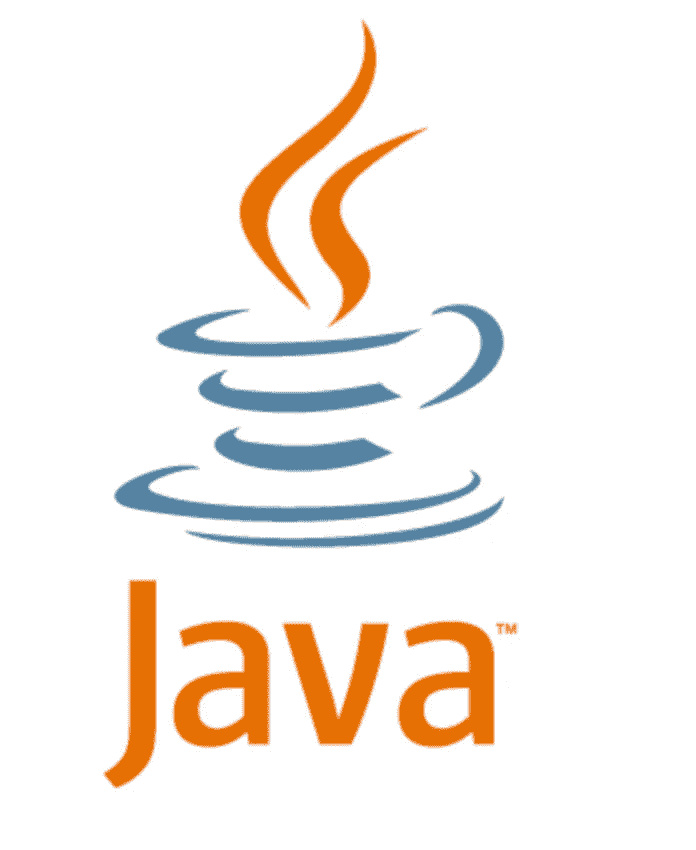

# 你的重点是什么？

> 原文：<https://medium.easyread.co/what-is-your-focus-4586d642c94f?source=collection_archive---------8----------------------->

你好*easy readers* Berikut top artikel[easy reader](https://medium.com/easyread)杨沙阳。

# 软件工程

## [发布-订阅模式和可观察模式之间的差异](https://medium.com/easyread/difference-between-pub-sub-pattern-and-observable-pattern-d5ae3d81e6ce)

乔纳森·纳塔内尔·西亚汉

**观察者模式**是一种软件设计模式，其中一个名为**主题**的对象维护一个名为**观察者**的依赖者列表，并自动通知它们任何状态变化，通常是通过调用它们的方法之一。

**发布订阅**是一种消息传递模式，消息的发送者(称为发布者)不将消息直接发送给特定的接收者(称为订阅者)，而是将发布的消息分类，而不知道可能有哪些订阅者(如果有的话)。

[***阅读更多……***](https://medium.com/easyread/difference-between-pub-sub-pattern-and-observable-pattern-d5ae3d81e6ce)

## [Instalasi Flutter Tanpa Android Studio](https://medium.com/easyread/instalasi-flutter-tanpa-android-studio-2a0876302a68)

由 [Ihwan ID](https://medium.com/u/70f7ebd1a0ef?source=post_page-----4586d642c94f--------------------------------)

这是我第一次在一个不稳定的环境中看到这样的景象。

[***阅读更多……***](https://medium.com/easyread/instalasi-flutter-tanpa-android-studio-2a0876302a68)

## [创建自己的 Java 发布库](https://medium.com/easyread/create-your-own-java-pubsub-library-fbee21d0bb44)

乔纳森·纳塔纳埃尔·西亚汉

你听说过发布-订阅模式吗？你试过用它吗？
在[软件架构](https://en.wikipedia.org/wiki/Software_architecture)，**发布-订阅**是一种消息传递模式，消息的发送者(称为发布者)不将消息直接发送给特定的接收者(称为订阅者)，而是将发布的消息分类，而不知道可能有哪些订阅者(如果有的话)。

[***阅读更多……***](https://medium.com/easyread/create-your-own-java-pubsub-library-fbee21d0bb44)

# 编程；编排

## [用一种编程语言来统治一切](https://medium.com/easyread/the-one-programming-language-to-rule-them-all-989ccc024b1b)

作者[凯文·戴夫](https://medium.com/u/8cb3ff087496?source=post_page-----4586d642c94f--------------------------------)

我开始思考是否有什么编程语言可以成为解决所有问题的*银弹*。我认为这将使开发人员的生活更加轻松。如果我可以使用一种语言，我为什么要学习越来越多的语言，我可以只用一种语言建立这个世界上的任何东西？所以我开始列出一些“统治一切”编程语言的清单。

[***阅读更多……***](https://medium.com/easyread/the-one-programming-language-to-rule-them-all-989ccc024b1b)

## [使用 PokeAPI 和 Firebase 部署渐进式 Web 应用](https://medium.com/easyread/progressive-web-apps-with-pokeapi-and-deploy-using-firebase-9e6aeb9e3abd)

由[阿门多](https://medium.com/u/39c73b5e1a9d?source=post_page-----4586d642c94f--------------------------------)

我们首先应该知道的是**“什么是 PWA”**。PWA 是一个 web 应用程序，结合了现代浏览器的功能和移动体验。使用 PWA，有很多优点，例如在离线模式下运行应用程序，直接将应用程序添加到屏幕上，通过 URL 访问，等等。

[***阅读更多……***](https://medium.com/easyread/progressive-web-apps-with-pokeapi-and-deploy-using-firebase-9e6aeb9e3abd)

## [使用 Lombok 实现构建器模式](https://medium.com/easyread/how-to-create-builder-pattern-in-3-line-d916fafbb193)

由[法斯卡尔·萨皮·雅洛克希尔](https://medium.com/u/8b5ec4a996c1?source=post_page-----4586d642c94f--------------------------------)

**Builder 模式**是 Java 中的**设计模式**之一，它通过自定义类型和参数对象来减少构造函数或方法调用所需的参数数量。

**什么是龙目岛？** Lombok 是一个用于减少模型/数据对象样板代码的依赖项。它可以生成 getters、setters、builder 模式和。等等。使用批注“@”。

[***阅读更多……***](https://medium.com/easyread/how-to-create-builder-pattern-in-3-line-d916fafbb193)

# 戈朗

## [Golang 清洁建筑的 GraphQL 交付](https://medium.com/easyread/graphql-delivery-on-golangs-clean-architecture-5c995a17b3a8)

作者:Ridho perdana

干净的架构，是编程中流行的架构之一。它以各层之间良好的分离关系而闻名。每一层都不需要知道另一层的实现，所以我们可以很容易地改变实现，而不用在另一层上做任何改变。

今天，我想尝试在我的朋友关于 Golang 的干净架构的代码中实现 GraphQL。现在我将尝试添加更多使用 GraphQL 的 HTTP 层。

[***阅读更多……***](https://medium.com/easyread/graphql-delivery-on-golangs-clean-architecture-5c995a17b3a8)

# 生产力

## [Mempercepat 使用开放 API 3 进行开发](https://medium.com/easyread/mempercepat-proses-development-dengan-open-api-3-8502011b7463)

由[伊曼肿瘤公司](https://medium.com/u/ef42567fbbae?source=post_page-----4586d642c94f--------------------------------)

为了避免延迟和阻塞，我们采用了 API 驱动开发的方法。随着时间的推移，蒂姆·贝茨成为了一名律师。

API 驱动的开发以 API 优先设计为原则，这是一种非常好的开发方式，我们可以设计出既实用又实用的 API。我们必须实现后端和前端(移动和网络)的统一。这份合同将通过一系列文件来完成，这些文件将由一个不确定的时间表来确定。

[***阅读更多……***](https://medium.com/easyread/mempercepat-proses-development-dengan-open-api-3-8502011b7463)

## [蒙哥纳尔战略部署 Aplikasi](https://medium.com/easyread/mengenal-strategi-deployment-aplikasi-23eef9f6f8dd)

by [Iman Tumorang](https://medium.com/u/ef42567fbbae?source=post_page-----4586d642c94f--------------------------------)

Dalam dunia *Software Engineering* , istilah “deployment” adalah sesuatu hal yang lumrah. *Deployment* adalah kegiatan yang bertujuan untuk menyebarkan aplikasi yang telah dikerjakan oleh para pengembang. Penyebarannya dapat melalui beragam cara tergantung dari jenis aplikasinya.

[***Read more…***](https://medium.com/easyread/mengenal-strategi-deployment-aplikasi-23eef9f6f8dd)

# Today I Learned Series

## [Today I Learned: Membuat Horizontal Pod Autoscaler(HPA) pada Kubernetes](https://medium.com/easyread/today-i-learned-membuat-horizontal-pod-autoscaler-hpa-pada-kubernetes-86da03095071)

by [Iman Tumorang](https://medium.com/u/ef42567fbbae?source=post_page-----4586d642c94f--------------------------------)

## [Today I Learned: How to Delete Git-Tag Remotely](https://medium.com/easyread/today-i-learned-how-to-delete-git-tag-remotely-caa95dc3a495)

by [Iman Tumorang](https://medium.com/u/ef42567fbbae?source=post_page-----4586d642c94f--------------------------------)

## [Today I Learned: Pull Docker Image dari GCR (Google Container Registry) di Kubernetes non GCP](https://medium.com/easyread/today-i-learned-pull-docker-image-dari-gcr-google-container-registry-di-kubernetes-non-gcp-c142f530047e)

by [Iman Tumorang](https://medium.com/u/ef42567fbbae?source=post_page-----4586d642c94f--------------------------------)

Kalau seseorang bertanya kepada kamu apakah fokus kamu dalam hidup ini, kira-kira bagaimana kamu akan menjawabnya?

Saat kamu memiliki fokus, hal tersebut berperan besar dalam membantu kamu untuk menjalani kehidupan kamu dengan lebih baik karena fokus akan membantu kamu mencapai target dan bergerak dalam *track* yang benar. Ketika kamu fokus, kamu mampu mengenali apa yang perlu dan tidak perlu kamu lakukan dan pikirkan ketika berusaha mencapai target. Kamu akan dapat memilih mana hal yang baik, penting dan harus dilakukan serta mengenyampingkan hal-hal yang mengganggu fokus kamu.

Ketika memiliki fokus, kamu memiliki satu pandangan yang jelas sehingga kamu benar-benar tahu apa yang kamu inginkan dan tidak meraba-raba lagi. Berbeda jika pandangan kamu kabur, kamu tidak dapat melihat apa yang ada di depan kamu, dan cara untuk menggapai hal tersebut juga semakin sulit.Oleh karena itu, milikilah fokus yang dapat membantu kamu tertuju pada satu titik yang ingin kamu capai.

*Nah,* mungkin salah satu mimpimu adalah menjadi seorang *software engineer* yang terkenal. Kalau kamu sudah fokus, kamu dapat menulis langkah apa saja yang bisa kamu lakukan untuk menggapainya. Dan salah satu cara untuk mencapainya bisa saja melalui berbagi pengetahuan. Berbagi pengetahuan melalui tulisan juga merupakan salah satu langkah yang baik *loh* .

Jadi, mari berbagi cerita kamu di [Easyread](https://medium.com/easyread) . Biarkan cerita kamu menjadi salah satu langkah awal yang tepat untuk kamu mencapai mimpi kamu. Easyread is calling for [submission](https://medium.com/easyread/about-easyread-74b20960e180) . 😄