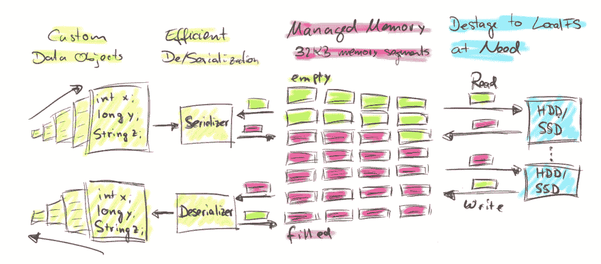
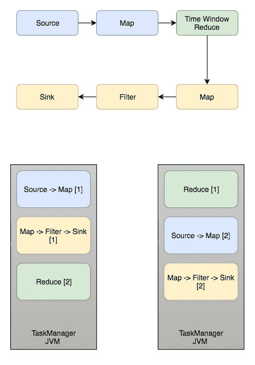
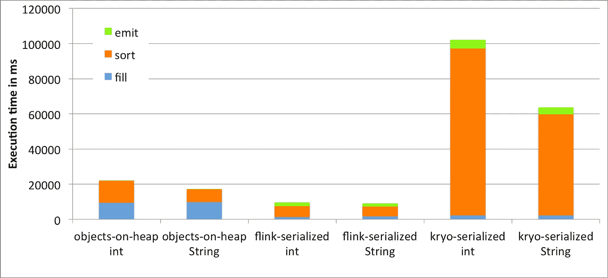
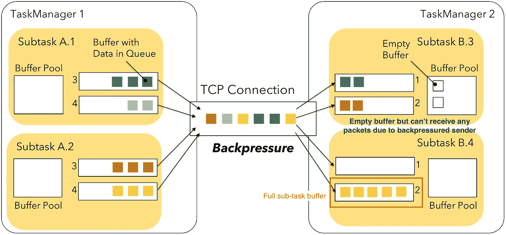
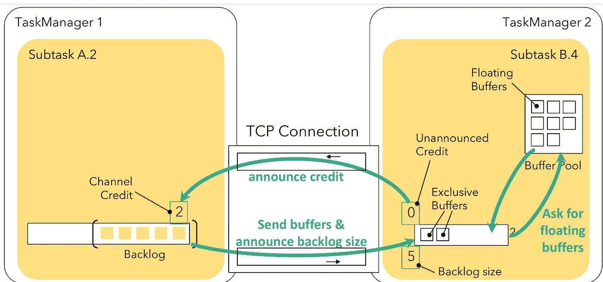
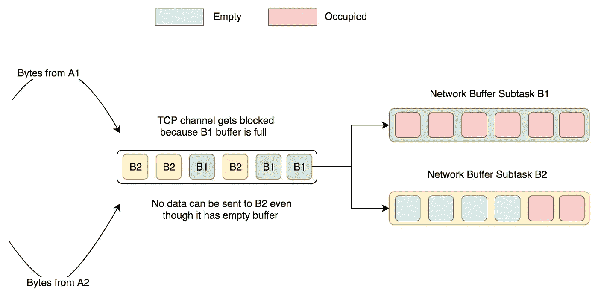
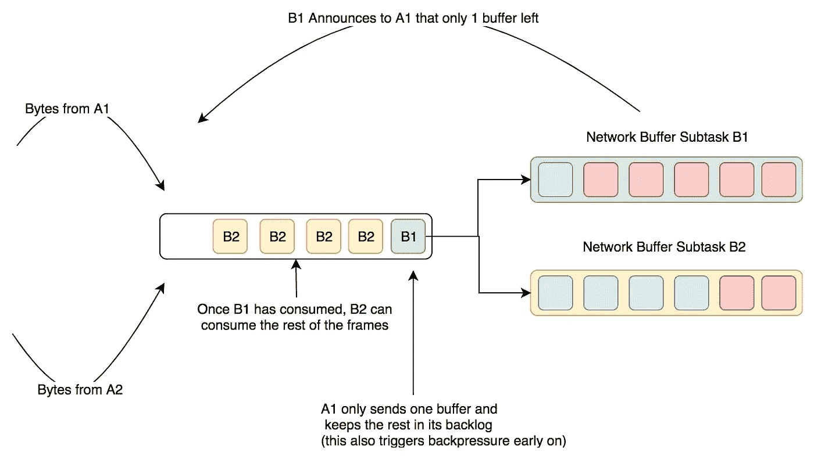

# 这就是阿帕奇 Flink 的规模

> 原文：<https://medium.com/walmartglobaltech/what-makes-apache-flink-scale-317f642fe6d5?source=collection_archive---------1----------------------->

## 内存管理和网络流量控制一瞥

Time-Lapse Photography of Blue Lights by [Pixabay](https://www.pexels.com/@pixabay)

Apache Flink 是一个流行的实时数据处理框架。由于它以容错方式以极高的吞吐量进行低延迟处理，所以它越来越受欢迎。

在过去的三年里，我一直在生产中使用 Apache Flink，每次它都能出色地完成任何工作负载。我运行过 Flink 作业，在不超过 20 个内核的情况下以超过 1000 万 RPM 的速度处理数据流。不仅仅是我。你可以看到所有其他公司的基准。

你可以在这里找到官方的基准。

 [## 打破基准的奇怪案例:重温 Apache Flink 与 Databricks 运行时-数据…

### 阿尔约沙·克雷泰克和迈克尔·温特斯；在过去的几个月里，Databricks 一直在推广 Apache Spark 与…

data-artisans.com](https://data-artisans.com/blog/curious-case-broken-benchmark-revisiting-apache-flink-vs-databricks-runtime) 

因此，我们自然会想到这样一个问题:Flink 是如何有效地进行扩展的？
这里有一些巧妙的技巧。

# 减少垃圾收集

当您在 Java 中操作大量数据时，垃圾收集会很快成为瓶颈。完整的 GC 会使 JVM 停滞几秒钟，在某些情况下甚至几分钟。

Flink 通过管理内存本身来解决这个问题。Flink 保留一部分堆内存(通常在 70%左右)作为托管内存。托管内存由相同大小的内存段填充(默认为 32KB)。这些内存段类似于 *java.nio.ByteBuffer* ，只包含字节数组。

每当一个操作者想要使用内存时，它就向内存管理器请求段，一旦完成，就将它们返回到内存池。由于这些内存段的寿命很长，可以持续重用，所以它们驻留在老一代堆中，不需要经历许多 GC 周期。

Flink 还提供了将内存段放入堆外内存的功能，以提高网络和文件系统的 I/O 速度，尤其是对于有状态操作符。

托管内存的另一个优点是 Flink 可以将较大的段降级到磁盘，并在以后读回它们。这种溢出有助于防止内存不足错误。

A high-level overview of how Flink stores data serialized in memory segments (From [Juggling with Bits and Bytes by Apache Flink](https://flink.apache.org/news/2015/05/11/Juggling-with-Bits-and-Bytes.html))

**注意**:在现代 JVM (Java 8+)中，有了新的 G1 GC，堆空间几乎和堆外一样有效。堆外空间可能有很大的安装和拆卸成本，但如果有更好的序列化，它比堆快。

# 最小化数据传输

在分布式数据处理系统中，映射或过滤任务可以在一个节点上运行，而在另一个节点上减少任务。这要求数据在网络上跨节点共享。

现在，假设您需要对一个数据流执行多个映射和过滤操作。没有必要在单独的任务上运行这些操作。这是因为除了前一个操作符之外，这些操作符都不需要任何其他操作符的输入。

Apache Flink 执行前面提到的优化，其中几个映射和过滤器转换在一个槽中连续完成。这种链接最小化了插槽和多个 JVM 进程之间的数据共享。因此，作业具有较低的网络 I/O、数据传输延迟以及对象之间的最小同步。

Operator chaining in a simple Flink job. The small rectangle inside the JVM represents each slot.

# 挤压你的字节

这样的 Java 对象相当重，例如，一个简单的整数对象占用 24 个字节来存储一个 4 字节的数据。为了避免存储如此沉重的对象，Flink 实现了它的序列化算法，这种算法更加节省空间。

但是，为什么不使用 Kryo(目前在 spark 中使用)、Avro 或协议缓冲区等其他序列化框架呢？

实现它的二进制表示允许 Flink 将相关的对象和相关的键、散列存储在一起。例如，字符串数组的索引键可以彼此相邻地存储。高速缓存在单个指令中提取一组连续的字节，并预取接下来的几个字节。缓存可以加快相邻存储的对象的访问速度。

使用自定义二进制表示的另一个优点是可以直接对二进制数据进行操作，从而减少序列化/反序列化的开销。例如，Flink 会立即对序列化对象进行比较。这提供了执行排序等操作的能力，甚至不需要反序列化数据。

Benchmark for different serialized formats in Flink (Taken from [https://flink.apache.org/news/2015/05/11/Juggling-with-Bits-and-Bytes.html](https://flink.apache.org/news/2015/05/11/Juggling-with-Bits-and-Bytes.html))

# 避免阻止所有人

在 Flink 1.4 之后，Flink 改进了它的网络通信。这项新政策被称为基于信用的流量控制。

每个任务管理器中运行多个插槽，每个插槽都可以运行一个子任务。然而，由于这个原因，多个任务管理器之间的网络连接需要被多路复用，即，连接需要处理来自所有子任务的数据。

多路复用带来了一种折衷。每当接收子任务由于网络缓冲区已满而阻塞时，整个 TCP 连接都会受到反压力。这不是最佳的，因为可能有其他接收子任务具有空缓冲区，但是现在，由于反压力，它们不得不处于空闲状态。

Normal Flow without credit announcements from [A Deep-Dive into Flink’s Network Stack](https://flink.apache.org/2019/06/05/flink-network-stack.html)

Flink 通过引入信用公告解决了这个问题。接收者子任务向发送者子任务宣布他们还有多少缓冲区。当发送方意识到接收方没有剩余的缓冲区时，它就会停止向接收方发送数据。这有助于防止阻塞子任务的字节阻塞 TCP 通道。

Credit-based flow control from [A Deep-Dive into Flink’s Network Stack](https://flink.apache.org/2019/06/05/flink-network-stack.html)

下面是一个更简单的表示法—

Without Credit-Based Flow

With Credit-Based Flow

Apache Flink 是当今最强大的实时数据处理系统。
然而，与其他数据流系统相比，它仍然是新的，并且有某些缺点-

1.  无法在运行时扩展应用程序。
2.  无法在运行时添加新的运算符。
3.  Flink ML 没有 Spark MLLib 成熟。

要阅读更多关于这个话题的内容，你可以参考以下文章—

*   [玩弄比特和字节](https://flink.apache.org/news/2015/05/11/Juggling-with-Bits-and-Bytes.html)
*   [阿帕奇弗林克概念](https://ci.apache.org/projects/flink/flink-docs-release-1.1/concepts/concepts.html#tasks--operator-chains)
*   [深入了解 Flink 的网络堆栈](https://flink.apache.org/2019/06/05/flink-network-stack.html)
*   [是什么让 Apache Flink 成为流媒体应用的最佳选择？](https://hackernoon.com/what-makes-apache-flink-the-best-choice-for-streaming-applications-fc377858a53)