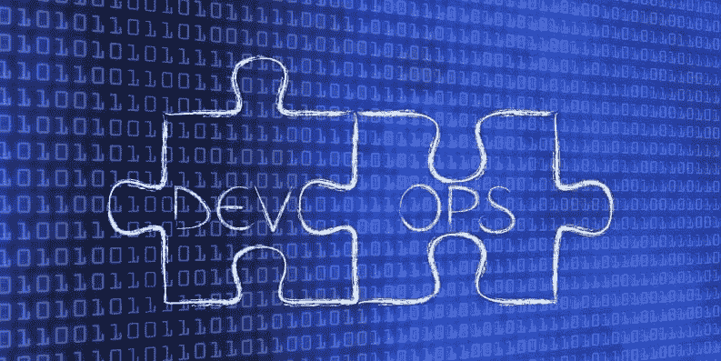

# 招聘 DevOps 工程师时需要注意什么

> 原文：<https://medium.com/version-1/what-to-look-for-when-recruiting-a-devops-engineer-2c5b699549c3?source=collection_archive---------1----------------------->

DevOps 和 DevOps 工程师并不是一个新概念，但是对于他们是什么，涵盖了什么内容，还是有一点不为人知。因此，在招聘 DevOps 工程师时，很难判断你应该寻找什么，以及需要什么样的技能。也不是所有他们需要的技能都是技术性的，因为 DevOps 是一种需要某种态度的文化和社区。

**什么是 DevOps 工程师？**

首先，我们从什么是 DevOps 工程师开始，因为这不是一个显而易见的头衔，因为它包含了主要名称 DevOps。DevOps 本身不是一个角色，它是一种文化，一种开发和部署软件的原则和方法，因此你不可能是真正的 DevOps。然而，DevOps 工程师一词被广泛用于描述在公司内帮助培养 DevOps 文化的人的角色，包括人际交往和技术技能。正如您所知，DevOps 是开发和运营团队成员的组合，过去开发人员会构建代码，然后将代码扔给运营团队进行部署。这将在发布软件时引入许多挑战，最终减缓软件开发生命周期。可以将 DevOps 看作是一种中间媒介，它帮助开发人员实现自助服务，而运营团队构建自助服务工具。DevOps 的最终目标是通过允许企业更频繁地发布高质量的软件来提供商业价值。

根据我的经验，通常是那些在操作方面工作的人成为 DevOps 工程师，因为他们最知道如何将代码从 A 转移到 B，并且拥有所需的大部分技能。他们将利用他们的技术技能来自动化打包、部署和监控代码的过程。他们还将使用他们的软技能与开发人员和其他团队成员合作，研究如何最好地实现这一点，因为所有项目的工作方式都不同。DevOps 工程师还应该使用这些技能，通过鼓励频繁的小变更发布和对新特性的持续监控来帮助更广泛的公司采用 DevOps。DevOps 工程师还衍生出其他角色，如网站可靠性工程师(SRE)，这就像是维护网站/软件正常运行时间的善后工作，包括监控、自动化和警报。

**DevOps 技术技能**

把一个 DevOps 工程师想象成一个万事通。由于他们与应用程序代码、网络、基础设施和监控接触并构建自动化，因此他们需要对所有事情都有所了解。这并不意味着他们需要像俗话说的那样成为所有人的主人:

"什么都懂的人什么都不懂，但往往比什么都懂的人强."

作为 DevOps 工程师，您将在团队中工作，有些团队在某些领域比其他团队更强，这也是一种互补。作为一个广泛的技能范围，你会希望有人知道这些类型的领域:

*   应用程序开发，如 Dotnet Core、Java 和/或 NodeJs。
*   基于 MySQL、PostgresSQL 和/或 MongoDb 等技术的数据库工程。
*   熟悉负载平衡器、虚拟网络和专用连接的网络工程。
*   代码扫描、网络安全和防火墙保护的安全原则。
*   使用 Github、Azure DevOps 和/或 Jenkins 等工具实现管道自动化。
*   基础设施工具，如 Terraform、Ansible 和 CloudInit。
*   像中枢辐条、着陆区和微服务这样的架构模式。

正如你所知道的，这对任何工程师来说都是一个很大的要求，这就是为什么你会想要一个知道所有这些，但可能不是他们的主人的人。我认为他们需要知道的两个关键领域，尤其是在这个时候，在他们正在使用的云平台中非常高效，并且精通命令行界面(CLI)。

云平台变化很大，因此试图在所有方面都做到最好几乎是不可能的任务。因此，我的建议是找一个平台的专家，然后其他技能将能够进一步发展。例如，试图理解 AWS 与 GCP 和 Azure 的应用程序设置会让你有点抓狂，但在单一云平台中理解它意味着你将开始对它了如指掌。

CLI 是 DevOps 工程师最好的朋友，因为它是您可以运行所有工具并与远程工具通信的单点。您将在该角色的大多数方面(如果不是所有方面的话)使用 CLI，因此熟悉自己的工作方式甚至记忆命令将使他们成为更可靠、更高效的工程师。这是你从工作经验中获得的知识，是无价的。

**软技能**

除了技术技能之外，候选人还应该具备软技能，这样他们就可以与项目中的各方进行沟通。沟通是 DevOps 文化的重要组成部分，在任何软件开发项目中，都会有项目经理、开发人员、业务分析师、解决方案架构师等等。因此，他们应该善于向没有相同背景或知识水平的人描述复杂的技术解决方案。

除了与这些成员交谈，他们还需要与他们合作。DevOps 工程师不仅要与其他 DevOps 工程师合作，还要与项目中的所有其他人合作，因为他们将大量参与产品的端到端开发生命周期。

另一个关键的软技能是解决问题，因为当事情出错时，这有时会是工作的主要部分。DevOps 工程师经常遇到他们不了解的新技术或工具，这是他们应该能够使用他们解决问题的技能来理解和学习的地方，允许他们调查任何问题。这也是他们如何能学到更多他们不擅长的东西，持续学习肯定是大多数 DevOps 工程师熟悉和期望的。

**职业背景**

如果你想招聘一名 DevOps 工程师，你应该寻找什么样的技能？理想情况下，你会想要一个以前是 DevOps 工程师或 SRE 的候选人，因为他们应该拥有你正在寻找的相同的技能。然而，即使是现在，这也是一个发展中的实践和角色，所以你通常会有很多候选人是从以前的技能角色转移过来的。因此，下一个最好的办法是招聘来自实践经验丰富的人，如开发人员、数据库工程师、网络工程师和操作人员。不过，他们应该对其他技能有浓厚的兴趣和一定的经验，以证明他们知道这种角色的变化。最后，我建议他们应该有一些云经验，他们可能会在云中做很多工作，并且对你的目标平台有一个很好的了解将是非常有益的。

**关于作者** Christopher Pateman 是 Version 1 的高级 Azure DevOps 工程师。