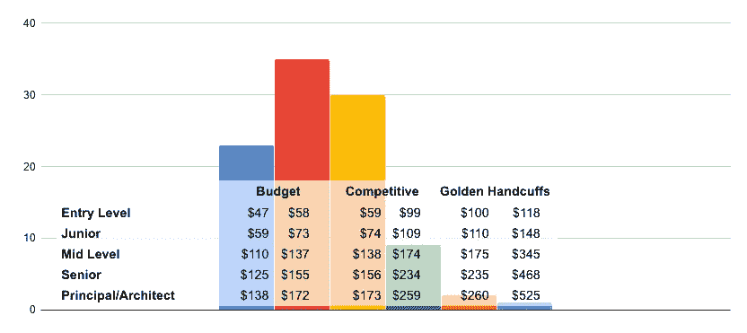

# 2020 年给 JavaScript 开发者发什么工资

> 原文：<https://medium.com/javascript-scene/what-to-pay-javascript-developers-in-2020-2292eb346f3b?source=collection_archive---------1----------------------->

作为招聘经理，我们需要做出很多艰难的选择。大多数招聘经理都会犯的一个错误是对开发人员的补偿。这篇文章将帮助你根据你的需要得到正确的答案。

基准薪酬数据来自[Indeed.com](https://www.indeed.com/salaries/)，但是我们通过定义 5 个不同的经验和专业水平，并将薪酬范围分为三种不同的薪酬策略(预算、竞争和金手铐)，来帮助您解释这些数据并将其应用于您的特定需求。

# JavaScript 薪水

JavaScript Salary Distributions in Thousands, 2020 (USA)

该图中的条形代表属于该工资范围的软件开发人员的百分比。预算范围的中上段是大部分薪水聚集的地方。图表被放大了，所以金色手铐的顶端看起来比实际要大。这种薪水非常罕见，不到 1%的收入最高。

*   大多数初级开发人员的薪水从 5.9 万美元到 10 万美元不等
*   大多数中等水平的薪水从 11 万美元到 15 万美元不等
*   大多数高级开发人员的薪水从 12.5 万美元到 20 万美元不等
*   大多数负责人/架构师的薪水从 13.8 万美元到 23 万美元不等

## 经验水平

*   **入门级:**对语言或技术栈知之甚少。有限或没有专业编程经验。
*   **初级:**语言或技术栈的一些知识。0-3 年的经验。
*   中级水平:对语言或技术堆栈有很强的了解。1-3 年的经验。
*   **高级:**对语言或技术堆栈有很强的了解。3 年以上工作经验(5 年或以上优先，但更难找到和雇佣)。
*   **负责人/技术主管:**掌握语言或技术堆栈。5 年以上工作经验(10 年或以上优先，但很难找到和雇佣)。伟大的导师。

***注:*** *在决定资历时，知识和所展示的技能往往比经验更重要。如果工作具有竞争性，许多具有 5 年以上经验的开发人员将被归类为初级或中级，例如为一家知名公司工作，申请一个远程角色，或加入一家热门的初创公司，那里有更多的新开发人员感兴趣，而不是到处都有工作。*

## 预算范围

*   预算:你想吸引优秀的人才，但你的预算很紧张。
*   竞争激烈:你想要吸引和留住优秀的人才，在留住人才、文化和质量方面取得高于平均水平的成绩。
*   金手铐:你的资金非常充足，多得花不完。你有现金流为人才支付高价，希望最大限度地留住人才，让你最好的人才远离你的竞争对手。你已经有了很受尊敬的同事，你的公司生产突破性的技术和研究，推动整个行业向前发展。

## 快速事实和建议

*   **软件行业拥有** [**比任何行业都高的离职率**](https://business.linkedin.com/talent-solutions/blog/trends-and-research/2018/the-3-industries-with-the-highest-turnover-rates) 超过 13%,这是由于不断增长的巨大需求，当雇主跟不上市场和他们不断增长的技能时，许多开发人员感到被低估了。
*   失去一个优秀的开发人员会让你损失他们年薪的 90%以上(有时甚至更多)。
*   ****更高的薪水能更好地留住员工。****
*   **[**37%的员工将薪水不满意列为离职原因**](https://www.spherion.com/ugc/documents/Spherion_2018_Executive-Summary.pdf) **。****
*   **[**公平的工资导致产品质量的提高**](https://www.jstor.org/stable/2393226?seq=1#page_scan_tab_contents) **。****
*   **在美国，一名 JavaScript 开发人员的平均工资是 11.5 万美元，但请记住，这是中级开发人员预算范围的低端。**
*   **[**一般的软件开发人员只有不到 5 年的经验**](https://insights.stackoverflow.com/survey/2019)[88%的员工认为他们需要更多的培训](https://www.spherion.com/ugc/documents/Spherion_2018_Executive-Summary.pdf)。**
*   **[**58%的软件开发人员对新的工作机会持开放态度，**](https://insights.stackoverflow.com/survey/2019) 即使他们已经有一份全职工作。**
*   **[**60%的软件开发人员上次跳槽不到 2 年前**](https://insights.stackoverflow.com/survey/2019) 。其中一半人在不到一年前换了工作。**
*   **[**开发商不是一个对区位非常敏感的群体**](https://business.linkedin.com/talent-solutions/blog/trends-and-research/2018/7-linkedin-data-points-that-will-help-you-recruit-software-engineers-in-the-us) **。不要以地理位置为借口降低开发人员的工资，除非你对普通开发人员的才能感到满意。****
*   **招聘经理正在与科技中心争夺人才。全球未满足的开发人才需求很大一部分来自科技中心:[旧金山、纽约、西雅图](https://business.linkedin.com/talent-solutions/blog/trends-and-research/2018/7-linkedin-data-points-that-will-help-you-recruit-software-engineers-in-the-us)、[瑞士、挪威、丹麦和以色列](https://www.daxx.com/blog/development-trends/it-salaries-software-developer-trends-2019)。**
*   **[**12%的软件作业是完全远程的**](https://insights.stackoverflow.com/survey/2019) **。** 42%的开发人员更喜欢远程工作，而不是在公司办公室。*【****新冠肺炎更新:*** *如今近 100%的软件岗位都是远程的，有相当一部分不会回到办公室工作。】***
*   **[**远程工作提高了员工的生产力、幸福感、忠诚度和忠诚度**](https://www.predictiveindex.com/blog/remote-work-improves-employee-productivity-happiness-retention/) **。****
*   ****目前有超过 10000 个开放的软件工程师工作列表提到远程工作。****
*   ******如果你不提供远程工作，就要为最优秀的人才支付接近这个范围的最高价。******
*   ****在旧金山、纽约或西雅图招聘办公室职员？将预算数字乘以 1.25–1.5，留出 1 万到 2 万美元的移动奖金，或者提供远程工作，保护你的跑道。****
*   ****初创公司应该支付接近预算范围上限的薪酬，以保护跑道并最大限度地留住人才，或者提供丰厚的股票期权作为补偿。****
*   ****处于早期增长阶段、资金充足的公司应该支付竞争区间的下半部分。****
*   ******强大的既定现金流？支付竞争范围的中间或上半部分。******
*   ******只有现金流非常强劲的公司才应该考虑金手铐策略。除非你有预算与谷歌、网飞、微软等竞争，否则不要支付过高的价格。******
*   ****我不建议付给任何开发者少于 10 万美元/年的报酬。最有技能的初级和中级开发人员在短短几个月内被挖走是很常见的——通常是在你对他们的投资获得回报之前。****

# ****2020 年位置不是重要因素****

****如果你想吸引并留住*高于平均水平的*开发人员，无论你的公司是在低收入地区，还是你的员工在低收入地区*都无关紧要*。****

****为什么不呢？因为软件开发人员通常会接受重新安置以找到合适的工作。如果你开出 8 万美元的年薪，而西雅图这样的科技中心的公司开出 12 万美元的年薪，猜猜你的候选人会选择哪一家。****

****然而，更糟糕的是，旧金山湾区和西雅图等科技中心的公司有更多的需求，超出了他们在当地的满足能力，他们越来越愿意雇用远程员工。这意味着你在与技术中心的薪水和远程工作竞争。远程工作对一半的技术人员来说是一个巨大的额外吸引力。****

****这些因素造成了人才流失——不仅流向了旧金山、西雅图和纽约等科技中心，还流向了全球范围内的高薪阶层。能够在要求更高的市场和偏远地区竞争的人才将会提升薪酬等级，而不会停留在薪酬过低的岗位上。换句话说，世界上任何地方低于平均水平的薪酬*都不会让你留住优秀的员工，他们知道自己的选择，知道如何找到远程工作或转移到薪酬更高的技术中心。*****

> ****如果你想有竞争力，你需要支付比美国全国平均水平更高的薪酬来吸引顶尖人才，*不分地域。*****

****这份给雇主的建议并不意味着如果你的收入低于这里列出的薪水，你就是一个低于平均水平的开发者，但是这份给雇主的建议并不意味着意味着市场上可能会有报酬更高的工作，如果你留意工作机会，你可能会找到更高的薪水。****

****请记住，如果你的收入足以应付你的生活需求和责任，那么你的幸福就比薪水重要得多。如果你不担心钱的问题，而且你对工作和同事都很满意，那么在你打算跳槽之前，考虑一下这份工作的其他好处。****

## ****避免人员流动****

****你留住开发人员的时间越长，他们就变得越有价值。失去一名开发人员可能会让你在生产力、招聘、培训和入职方面损失 90%的年薪，而且可能会损失更多的机会成本(对于高级、领导或执行人才来说，[超过 200%](https://www.americanprogress.org/issues/economy/reports/2012/11/16/44464/there-are-significant-business-costs-to-replacing-employees/) )。****

******经验法则:**在软件行业，年度(甚至季度)加薪是必须的**，**而且这些加薪应该与员工在市场上能找到的有竞争力。****

# ****后续步骤****

****开发人员，想[学习你需要的 JavaScript 技能](https://ericelliottjs.com/)以获得更高的薪水吗？加入[EricElliottJS.com](https://ericelliottjs.com/)并获得不断增加的视频和互动课程，涵盖函数式编程、React、Redux、TDD 等主题。****

****如果你想了解更多关于如何招募、保留和建立软件开发团队的信息，DevAnywhere.io 为工程领导者提供了一个导师项目。学习如何建立平衡的开发团队，如何优化你的团队的开发过程，以及建立一种指导和支持的文化。[告诉我们您的团队和您的需求](https://devanywhere.io/help)。****

*******艾里克·艾略特*** *著有《书籍》、* [*【排版软件】*](https://leanpub.com/composingsoftware)*[*【编程 JavaScript 应用】*](https://pjabook.com/) *。作为*[*【EricElliottJS.com】*](https://ericelliottjs.com/)*和*[*devanywhere . io*](https://devanywhere.io/)*的联合创始人，他教授开发者必备的软件开发技能。他为加密项目组建开发团队并提供建议，为 Adobe Systems、* ***、Zumba Fitness、*** ***【华尔街日报、*******【ESPN、*******BBC、*** *以及包括* ***Usher、弗兰克·奥申、金属乐队在内的顶级录音**********

******他和世界上最美丽的女人享受着与世隔绝的生活方式。******