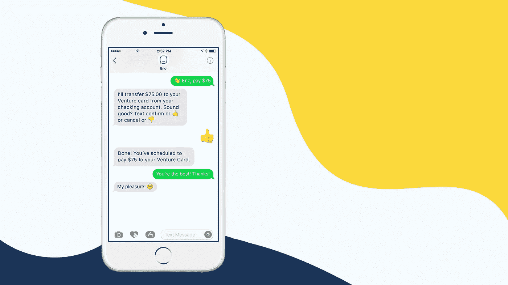

# 我们对聊天机器人的了解

> 原文：<https://medium.com/capital-one-tech/what-we-learned-about-what-our-chatbot-learned-56d105575630?source=collection_archive---------2----------------------->

第一资本公司副总裁肯·多德林&对话式人工智能产品主管

在 3 月份的 SXSW 2017 上，Capital One 推出了 Eno 的邀请制试点，这是美国银行推出的第一款自然语言短信聊天机器人。今天，我们很高兴地宣布 Eno 已经通过试点，现在可以在[与数百万 Capital One U.S .信用卡和银行客户发送短信。](https://www.capitalone.com/applications/eno/)

那么，在过去的七个月中，Eno 学到了什么？嗯，主要是三件事…

**1。Eno 了解到人们发短信谈论他们的钱的方式的多样性。** 迄今为止，已有超过 100，000 名只接受邀请的试点客户与 Eno 聊过他们的信用卡和银行账户。他们一天中的任何时候都用各种方式发短信。有些非常中肯，都是关于缩写*【bal】*。其他人很健谈，用自然语言说话*(“嗨 Eno！我今天有多少钱？”)*。有些人每隔一个单词就摸索一次*(“val”是一个常见的单词，因为“b”与键盘上的“v”相邻)*，而其他人则更喜欢表情符号。事实上，我们已经看到客户在超过 50%的情况下使用竖起大拇指的表情符号来确认他们的付款，Eno 理解这一点。

很高兴看到我们的客户以自己的方式谈论他们的钱！我们看到的一些更有创意的文本包括:

*   我以后再和你谈。确保你保管好我的钱！！
*   嘿伊诺。遇见另一个有感觉的人真是太棒了。我会喜欢你的帮助和陪伴。我能拿回我的球吗？
*   哇，我对你的能力印象深刻！我很高兴我的联系人中有你！

**2。Eno 学会了理解客户的意思。** Eno 通过有监督的机器学习，从每一次对话中学习。充分披露:Eno 是一个终生学习者，还不能做顾客扔给它的所有事情。虽然我们在试点期间扩展了一些功能，但我们的主要重点是让 Eno 在基础方面表现出色:高频率的用例，如余额、可用信贷、最近的交易和支付信用卡账单，其中对话界面表现特别好(…哦，还有找到难以捉摸的路由号码的最快方法。)例如，[我们已经对 Eno](/capitalonetech/how-the-cloud-enabled-capital-ones-innovative-new-chatbot-d77e3f3aa887) 进行了 2200 多种不同方式的培训，帮助客户询问他们的余额。由于我们惊人的对话式人工智能设计和技术团队的出色工作，客户越来越多地发现 Eno 理解他们，当 Eno 理解他们时，他们很高兴。这是银行训练客户用统一的“银行语言”说话的重要一步，也是我们迄今为止从客户那里收到的关于 Eno 的积极反馈的重要贡献者。

**3。Eno 开始学习通过交谈建立关系。** 这是一个不可否认的奇怪说法。Eno pilot 为人类与人工智能的互动模式提供了一个迷人的视角，它与我们传统的与客户互动的方式截然不同。对此的一个见解是: [Eno 从客户那里收到的第三个最常见的意图(一个意图类似于*“账户余额”*或*“最近的交易”*)是*“谢谢”没有纯粹的功能原因来感谢 Eno，然而对话界面和个人互动允许人们建立某种形式的情感联系。今天，基本的问答对话已经结束，但我们看到，随着时间的推移，通过更深入的个人对话，Eno 和我们的客户之间有很多机会发展信任和有价值的关系。*](/capitalonetech/eno-ai-eq-3d939a2f6a7b)

我们带着极大的谦逊来到这个领域，像 Eno 一样，我们每天都在继续学习。今天，我们开始了 Eno 之旅的下一步，我们很高兴能将 Eno 带给数百万 Capital One bank 和美国卡客户。

**了解更多 Eno，在这里** **报名** [**。**](https://www.capitalone.com/applications/eno/)

*Eno 并不适用于所有银行客户。*

*以上观点为作者个人观点。除非本帖中另有说明，否则 Capital One 不属于所提及的任何公司，也不被其认可。使用或展示的所有商标和其他知识产权都是其各自所有者的所有权。本文为 2017 首都一。*