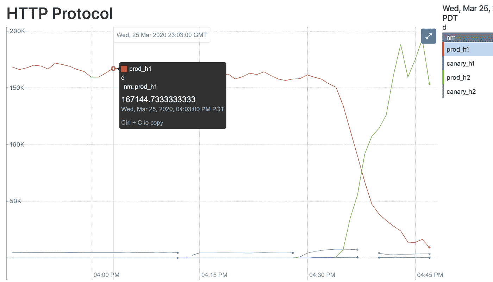
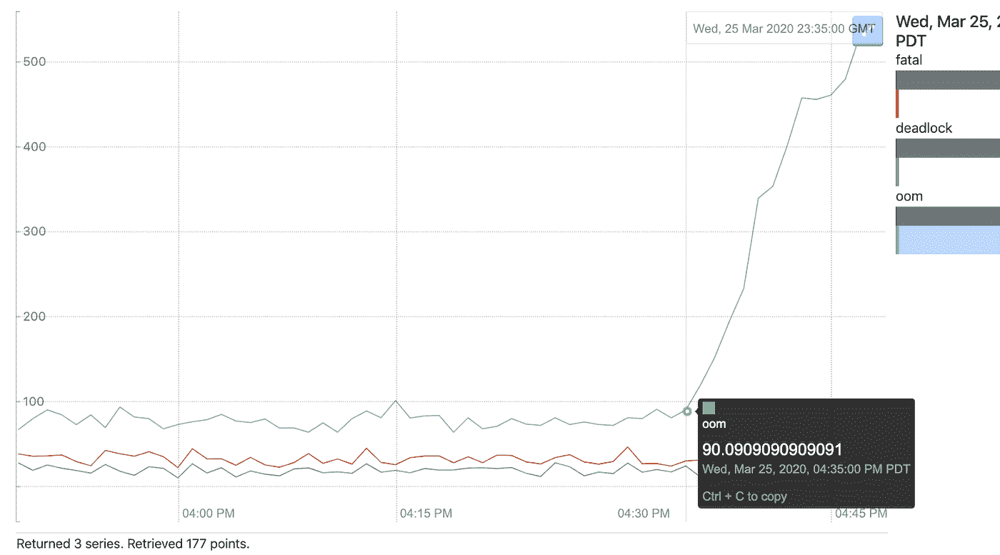
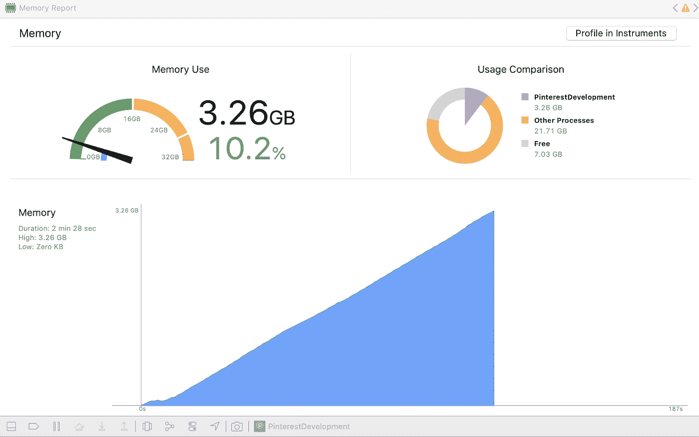
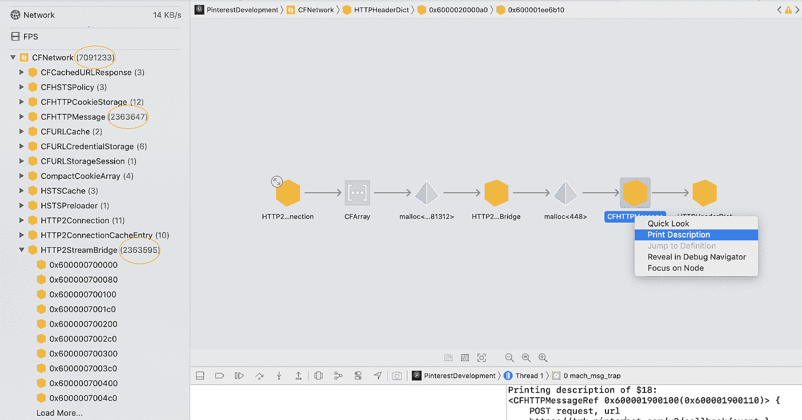
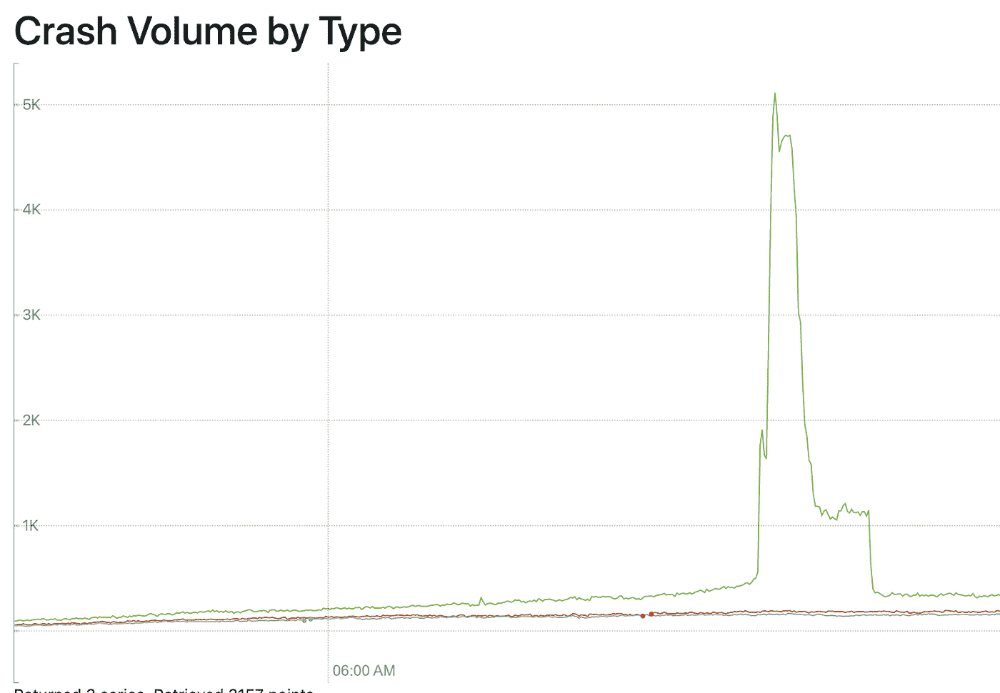
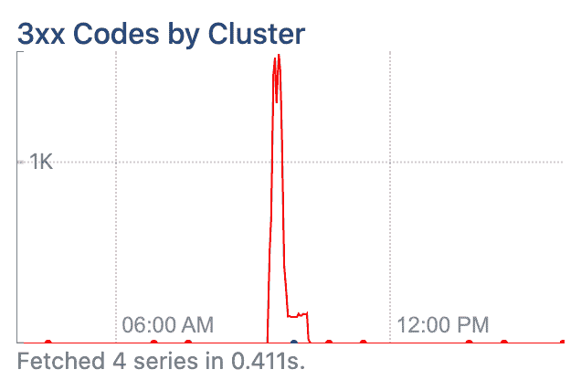
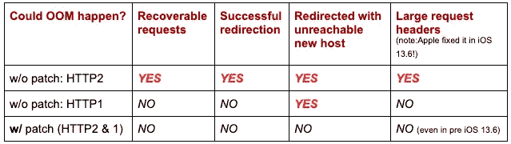

# 我们从 iOS 应用 OOMs 事件中学到了什么

> 原文：<https://medium.com/pinterest-engineering/what-we-learned-from-an-ios-app-ooms-incident-eb31eada251?source=collection_archive---------0----------------------->

马良|软件工程师，应用基础

在 2020 年初，我们开始看到 Pinterest iOS 应用程序中内存不足(OOM)崩溃的显著增加。该事件导致无崩溃用户率(CFUR)下降，从之前的 **99%下降到**96%，降幅很大。发生了什么事？

在这一过程中，我们改进了许多系统，但是这些经验可以在一篇单独的博客中发表。*这篇*博文的主要目的是与更广泛的 iOS 社区分享我们从这个 iOS 特定问题中学到的东西。

# 有什么问题？

对于上下文，在 Pinterest iOS 应用程序中，我们使用 [NSURLSession](https://developer.apple.com/documentation/foundation/nsurlsession) 与 Pinterest REST API 端点对话。大多数端点已经在 HTTP2 上存在了很多年，有些端点因为各种原因被抛弃了。在花费大量时间进行故障排除后，我们排除了同一时期的其他转移注意力的问题，并发现当 HTTP2 在某些端点上启用时，Pinterest iOS 应用程序将比平时多经历约 20 倍的 OOM 崩溃。

下面的图是在后来的复制测试中获得的，可能会让您感觉到它们是如何紧密地联系在一起的:

Figure 1 — when HTTP2 was enabled on that endpoint

Figure 2 — OOMs spiked instantly and aligned w/ HTTP2 timeline.

**TL'DR —罪魁祸首是在我们的代码**中错误地使用了[**http bodystream**](https://developer.apple.com/documentation/foundation/nsurlrequest/1407341-httpbodystream?language=objc)**模式。当特定的错误被触发时，它们可以在一分钟内泄漏数千兆字节的内存，从而导致 OOM 崩溃。更多细节将在下面讨论。**

# 我们是如何解决这个问题的？

将 OOM 崩溃的高峰与 HTTP2 联系起来，并进一步将根本原因缩小到代码中的一个普通 HTTP 问题，并不是那么简单——事实上，我们花了几个月的时间来解决这个问题。以下是我们做的几件事:

*   **复制一个测试端点:**我们为了 HTTP2 测试/验证的目的复制了一个测试端点，通过实验控制 iOS 客户端连接到那个端点。这个临时端点的另一个好处是，在我们在原始端点上再次打开 HTTP2 之前(在这种情况下，几乎是一年之后)，我们将修补过的应用程序版本指向这个端点以采用 HTTP2。
*   **上下文日志记录:**我们记录内存元数据([总计](https://developer.apple.com/documentation/foundation/nsprocessinfo/1408211-physicalmemory)、[可用](https://developer.apple.com/documentation/os/3191911-os_proc_available_memory)、内存占用、峰值等来自 [task_vm_info](https://opensource.apple.com/source/xnu/xnu-4570.41.2/osfmk/mach/task_info.h.auto.html) )和网络指标(延迟、错误代码、有效负载大小等)。)，以及现有的上下文事件。它们有助于找出 oom 的模式，如内存如何积累并响应前台/后台模式切换、异常网络超时等事件。
*   **Xcode 的记忆工具:**这些记忆工具是我们用来将根本原因缩小到精确代码的终极武器:
*   **监控内存报告**并在发现内存异常增加时，准备调试仪器中的内存图或配置文件。

Figure 3 — mocked by triggering errors, on the simulator.

*   **诊断内存图**

有了内存图，深入研究内存分配并找出哪些对象是可疑的就容易多了。还有命令行工具(vmmap、leaks 等。)在分析 raw 时非常有用。记忆图文件也是。

Figure 4 — generate memory graph

Figure 5 — CFNetwork objects are listed on the top.

*   **进一步沟通**

通过与 Apple 团队的交流，我了解到一个已知的问题，即如果 HTTP 头太大，网络请求可能会进入一个循环，从而消耗过多的内存。我能够用模拟的大标题重现 OOM 崩溃，幸运的是，我们的应用程序中没有大请求标题问题。但是这个线索激发了我去更深入地挖掘更低的网络层。

# 根本原因

如前所述，根本原因是对 [HTTPBodyStream](https://developer.apple.com/documentation/foundation/nsurlrequest/1407341-httpbodystream?language=objc) 的不正确使用。在我们的代码中，一些请求使用 HTTPBodyStream 来提供主体数据，即使没有实现[-URL session:task:needNewBodyStream:](https://developer.apple.com/documentation/foundation/nsurlsessiontaskdelegate/1410001-urlsession/)，这在正常情况下也能正常工作。

但是根据图 6(摘自[-URL session:task:needNewBodyStream:](https://developer.apple.com/documentation/foundation/nsurlsessiontaskdelegate/1410001-urlsession/)的 API 文档):

Figure 6 — [API documentation](https://developer.apple.com/documentation/foundation/nsurlsessiontaskdelegate/1410001-urlsession/)

如果请求设置了 HTTPBodyStream，则必须实现委托方法-URL session:task:needNewBodyStream:**才能在所有情况下正常工作。哎呀！**

# 这里的问题:

*   人们可能认为将 [HTTPBodyStream](https://developer.apple.com/documentation/foundation/nsurlrequest/1407341-httpbodystream?language=objc) 设置为 [NSURLRequest](https://developer.apple.com/documentation/foundation/nsurlrequest) 后，工作就完成了，苹果网络会处理好一切。他们可能没有意识到他们还需要实现[-URL session:task:needNewBodyStream:](https://developer.apple.com/documentation/foundation/nsurlsessiontaskdelegate/1410001-urlsession/)因为它在正常情况下工作良好，直到“认证挑战或可恢复的服务器错误”发生。
*   可恢复的服务器错误可能并不罕见，但是请求超时失败可以被认为是可恢复的错误。还有，我们 **发现** [**HTTP 重定向**](https://developer.mozilla.org/en-US/docs/Web/HTTP/Redirections) **也是一个原因，而且肯定会触发内存问题**(结合上面的 [HTTPBodyStream](https://developer.apple.com/documentation/foundation/nsurlrequest/1407341-httpbodystream?language=objc) 问题):

Figure 7 — OOMs chart

Figure 8 — HTTP 3xx timeline

*   API 文档并没有明确说明丢失[-URL session:task:needNewBodyStream:](https://developer.apple.com/documentation/foundation/nsurlsessiontaskdelegate/1410001-urlsession/)的后果，并不是请求失败那么简单。相反，当问题被触发时，很可能会遇到过多的网络跳数，并最终导致 OOM 问题。

您可能想知道为什么 oom 只发生在某些端点上。这主要是因为这些端点请求错误地使用了 HTTPBodyStream，并且它们比其他端点被调用得更频繁。它们可以继续在后台模式下运行，这两种模式加在一起更有可能出错。

# 修复

*   在适当的情况下直接发送请求 [HTTPBody](https://developer.apple.com/documentation/foundation/nsurlrequest/1411317-httpbody?language=objc) ,或者
*   使用 [HTTPBodyStream](https://developer.apple.com/documentation/foundation/nsmutableurlrequest/1409529-httpbodystream?language=objc) 并相应地实现[-URL session:task:needNewBodyStream:](https://developer.apple.com/documentation/foundation/nsurlsessiontaskdelegate/1410001-urlsession/)方法

最后，我们能够在下面的组合中验证我们的修复:

# 关键要点

*   严格遵循苹果的 API 指南，因为在生产中修复此类错误的成本可能非常高。
*   OOM 崩溃至关重要，应该是你的应用程序稳定性得分的一部分
*   WWDC [iOS 记忆深潜视频](https://developer.apple.com/videos/play/wwdc2018/416/)值得一看

*致谢:感谢 Bill Kunz、Jon Parise、Scott Beardsley、iOS 平台团队& Arpit Diggi 一路走来的大力支持。向所有参与其中的人致敬。*

*要在 Pinterest 了解更多关于工程的信息，请查看我们的* [*工程博客*](https://medium.com/pinterest-engineering) *，并访问我们的*[*Pinterest Labs*](https://labs.pinterest.com/)*网站。要查看和申请公开招聘机会，请访问我们的* [*招聘*](https://www.pinterestcareers.com/homepage) *页面。*