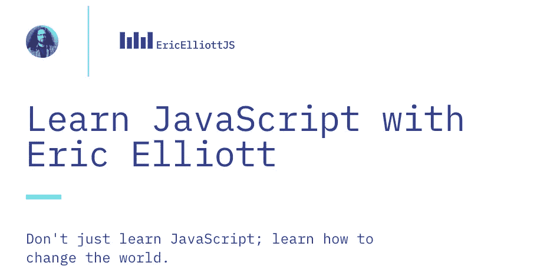
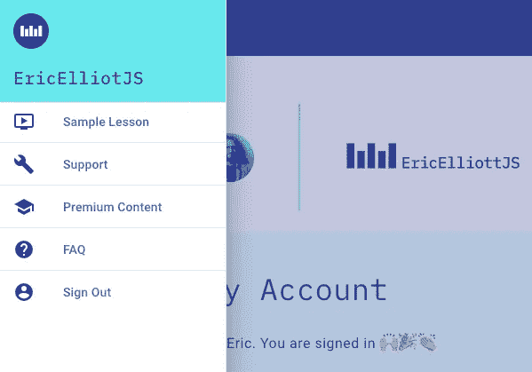

# 我们从零开始重建我们的网站中学到了什么

> 原文：<https://medium.com/javascript-scene/what-we-learned-rebuilding-our-site-from-scratch-52a4af08b6ac?source=collection_archive---------1----------------------->

[](https://ericelliottjs.com)

Splash Page Screenshot

我们今天庆祝是因为我们刚刚推出了新的[EricElliottJS.com](https://ericelliottjs.com)——一个为应用开发者提供学习内容的网站。在向旧网站的用户发送通知后的几秒钟内，用户注册如潮水般涌来。我们迫不及待地想听听大家对新设计、内容和应用程序 UX 的看法，但与此同时，我不禁反思我们在构建它的过程中吸取的所有教训。

以下是我们为新网站打造的一些功能:

*   通过 Firebase 使用 GitHub 身份验证进行无密码登录
*   具有降价支持、语法高亮和进度条的课程播放器
*   运行单元测试的交互式代码编辑器
*   电子邮件支持表单
*   视频嵌入

在我们开始之前，先快速浏览一下技术堆栈。我们使用了:

*   [反应](https://reactjs.org/)为 UI
*   [Redux](https://redux.js.org/) 为可预测状态
*   [Firebase](https://firebase.google.com/) 用于实时、自伸缩的数据库连接
*   [用于发送电子邮件的 Mailgun](https://www.mailgun.com/)
*   使用[通道](https://github.com/ericelliott/riteway)进行单元测试
*   [使用](/javascript-scene/behavior-driven-development-bdd-and-functional-testing-62084ad7f1f2) [TestCafe](https://devexpress.github.io/testcafe/) 进行功能测试

# 第一课:无密码认证

每当你创建一个需要代表用户存储用户名和密码的应用程序时，你就为黑客攻击你的用户创造了更多的空间。众所周知，密码提供了糟糕的用户安全性，而且对用户体验也不是特别好。用户必须记住另一个密码，摆弄密码管理器，或者(更糟糕的是)重用其他网站的密码。

许多用户在几乎每个网站上都重复使用相同的密码，这使得他们和您都容易受到从其他地方窃取数据库的黑客的攻击。即使您自己的密码安全性令人惊叹(除非您有很大的安全预算，相信我，这不是)，您的安全性仍然对黑客敞开大门，这些黑客已经从其他网站获得了有效的用户名和密码，但他们并不那么小心。

我们的目标是开发者，所以我们选择使用 GitHub 登录，为大多数用户提供一键登录的体验。太好了！

# 第二课:Redux 仍然很酷

我们的用户登录状态由几个独立的组件共享，包括:

*   标题，我们在那里显示一个用户头像，让用户知道他们已经登录。


Right: Header User Avatar

*   汉堡菜单抽屉。移动设备上的标题菜单可以折叠，但是用户仍然可以访问侧边栏中的链接。它需要知道用户是否已经登录，这样它才能知道是显示“登录”链接还是“注销”链接。



Hamburger Menu Drawer

在我们的第一遍中，我们使用一个定制的 [Next.js](https://nextjs.org/) `_app.js`文件来管理我们的全局状态，将它传递给组件，但是这比简单地连接 Redux 要多得多。Redux 允许您使用来自`[react-redux](https://redux.js.org/basics/usage-with-react)`的`mapStateToProps`和`mapDispatchToProps`来包装一个单元可测试的显示组件，并使用`connect()`创建一个容器组件。现在，当我们需要获取一些在几个不相连的组件之间共享的状态时，这是一件轻而易举的事情。

这不是我们第一次参观 React+Redux 块，所以我们中的一些人已经知道了这一点，但是:

1.  在这个项目中，我们有几个初级开发人员没有太多使用 React+Redux 的经验
2.  React hooks 是在我们的网站建设过程中发布的，所以我们确实重新思考了什么时候适合用不同的方式做事。

即使现场有 React 挂钩，我们仍然是`react-redux` `connect()`易用性的粉丝。

# 第三课:在你启动之前，确保你可以扩展

在宣布新站点后不久，我们就超过了免费 Firebase 计划的配额。我以为它只是根据使用情况向我们收费，并没有意识到我们将它设置为免费层。哎呀！确保您拥有服务用户所需的服务能力。

如果你正在开始一个新的应用程序，我不会对此强调太多，但我们已经有了一个充满用户的数据库，我们一次给他们发了一大堆电子邮件，这将数百名用户同时发送到我们的网站，几乎立即超过了免费层的容量(我相信 Firebase 上的同时连接数限制为 100)。当我们意识到正在发生的事情时，我们切换到按需付费，这样我们就可以扩展到无限数量的用户。只需点击几下，就可以在仪表板中选择合适的计划。

很容易解决。

# 第四课:自动预览部署

> "在我的机器上工作。"—所有开发人员。

这似乎总是一个问题。我们的站点在本地开发环境中运行良好，但是当我们部署站点时，我们的 CSS 完全失败了。其他一切都正常，但我们得到了无样式的页面。似乎在我们建设网站的时候，我们的一些依赖关系变得不兼容了。我们部署的是 [Zeit 的 Now 服务](https://zeit.co/now)(强烈推荐)，由于某种原因，产品版本与我们正在使用的一些旧库不兼容。

我们希望将升级推迟到发布之后，这将允许我们提前几周发布，但最终我们不得不咬紧牙关，升级一切以使生产构建工作。

幸运的是，我们很早就决定在每次打开 PR 时创建一个生产版本。使用 Zeit 使整个过程变得轻而易举。他们甚至有一个机器人会将部署链接直接报告到你的 GitHub PRs 中。这有助于我们在实际启动网站之前发现并解决问题。

子弹:躲开了。

# 第五课:有时候你必须创造新的东西

我们四处寻找可以用来在交互式代码编辑器中运行单元测试的组件，但是我们找不到一个容易集成的组件，所以我们自己构建了一个。我们之前尝试过在 [DevAnywhere.io](https://devanywhere.io/) 上提供代码反馈，所以我们知道我们喜欢和不喜欢其他解决方案的什么。

我们想要一个带有简单断言的测试框架，这样我们就可以用一个 API 调用来做每一个断言。事实证明，我们非常喜欢以这种方式编写单元测试，我们将其提取到一个新的单元测试框架中，并与世界共享。查看[“重新思考单元测试断言”](/javascript-scene/rethinking-unit-test-assertions-55f59358253f)以了解我们为什么如此热爱它，并在您的下一个项目中试用 [RITEWay](https://github.com/ericelliott/riteway) 。它宠坏了我们。

# 第六课:TDD 摇滚

我已经提到过 [TDD 改变了我的生活](/javascript-scene/tdd-changed-my-life-5af0ce099f80)，但是它在这个项目上特别有用。这是一个中等规模的项目，由六名开发人员组成的团队花了几个月的时间来扩展和维护一个包含数万行应用程序代码的代码库(不包括库)。这看起来似乎很简单，但困难在于细节。

使用测试驱动开发给了我们自动化大量维护的信心。我们使用 [Travis-CI](https://travis-ci.com/) 对每个 pull 请求进行测试，并使用 GitHub PRs 进行代码审查。我们还使用了[更新机器人](https://renovatebot.com/)来帮助我们保持我们的依赖关系最新。拥有良好的代码覆盖率意味着我们可以使用下面的配置安全地自动合并大多数更新的 PRs:

```
{
  "extends": [
    "config:base"
  ],
  "automerge": true,
  "automergeType": "branch",
  "major": {
    "automerge": false
  },
  "schedule": "before 4am",
  "timezone": "America/Los_Angeles"
}
```

# 第七课:庆祝胜利

我们在这个项目上工作了很长时间，在过去的几周里，我们努力推动它越过终点线。非常感谢每一个帮助过我的人，也感谢[JS _ 啦啦队长](https://medium.com/u/2ae82ab96251?source=post_page-----52a4af08b6ac--------------------------------)筛选人才并担任产品经理。

我希望你喜欢使用它，就像我们喜欢建造它一样。

# EricElliottJS.com 有什么？

新网站包含了原网站的所有内容，包括以下课程:

*   函数式编程
*   功能组成
*   固化和部分应用
*   Redux
*   关闭
*   面向对象编程
*   对象组成
*   功能混合蛋白
*   节点和快速
*   猎枪:看我编码真正的项目

## 网络直播

*   ES6
*   对象组成
*   函数式编程
*   反应
*   TimeDivisionDuplex 时分双工

## 书

*   【JavaScript 应用程序编程” (O'Reilly)
*   [《作曲软件》](https://leanpub.com/composingsoftware)

几十个小时的视频内容。几十个代码练习。App 项目。独家访问您在其他地方找不到的内容。

如果你还不是会员，现在就加入吧。

***艾里克·艾略特*** *著有《书籍》、* [*【排版软件】*](https://leanpub.com/composingsoftware)*[*【编程 JavaScript 应用】*](http://pjabook.com) *。作为*[*【EricElliottJS.com】*](https://ericelliottjs.com)*和*[*devanywhere . io*](https://devanywhere.io)*的联合创始人，他教授开发者必备的软件开发技能。他为加密项目组建开发团队并提供建议，为 Adobe Systems、* ***、Zumba Fitness、*** ***【华尔街日报、*******【ESPN、*******BBC、*** *以及包括* ***Usher、弗兰克·奥申、金属乐队在内的顶级录音******

**他和世界上最美丽的女人享受着与世隔绝的生活方式。**