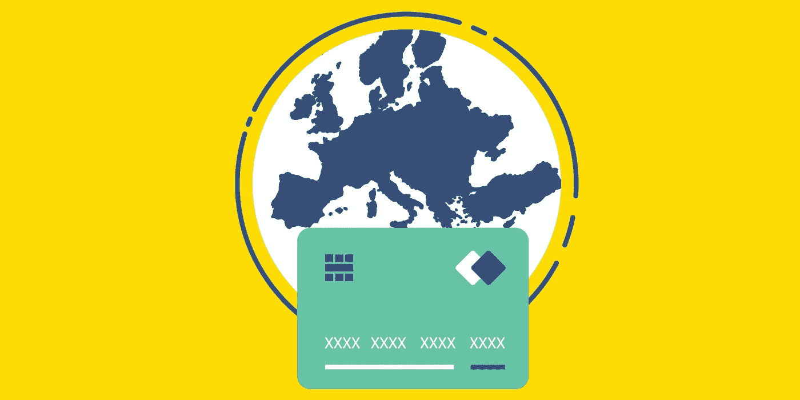
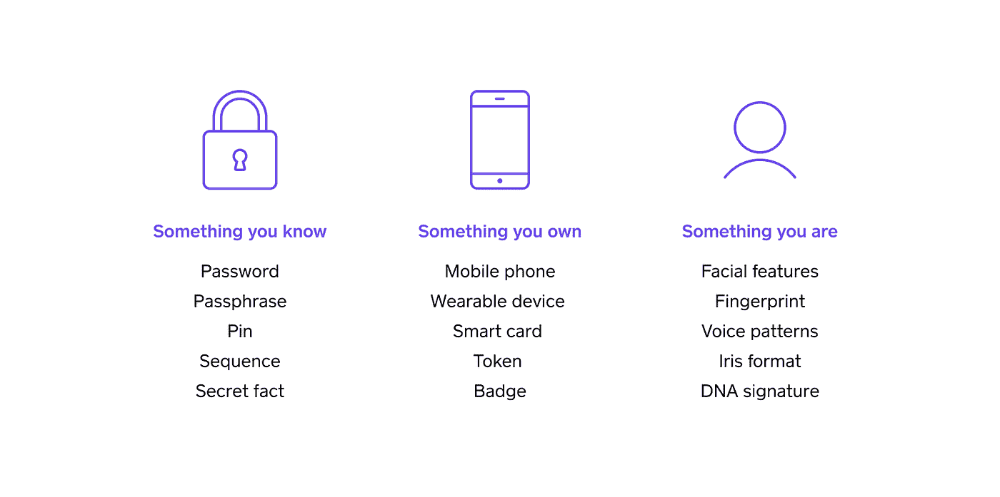

# 关于强客户身份认证(SCA)您需要知道什么

> 原文：<https://medium.com/square-corner-blog/what-you-need-to-know-about-strong-customer-authentication-sca-34a4db77891f?source=collection_archive---------3----------------------->

> 注意，我们已经行动了！如果您想继续了解 Square 的最新技术内容，请访问我们的新家[https://developer.squareup.com/blog](https://developer.squareup.com/blog)

# 什么是 SCA？

强客户认证(SCA)是一项新的欧洲法规，将于 2019 年 9 月 14 日生效，旨在使[欧洲经济区](https://www.gov.uk/eu-eea) (EEA)的客户发起的在线和应用内支付更加安全。目前，在网上支付时，顾客需要输入他们的卡号、有效期、CVV 和邮政编码来进行支付。SCA 生效后，任何接受客户发起的支付的网站或移动应用程序都必须将客户的额外信息传递给他们的支付提供商(在您的案例中是 Square)。没有这种额外认证的支付将被持卡人的银行拒绝。

# 我需要支持 SCA 吗？

在欧洲，所有客户发起的在线和应用内支付都需要 SCA，因为接受支付的企业和持卡人的银行都位于欧洲经济区(EEA)。换句话说，如果您在欧洲经济区运营在线/应用内业务，并且客户也在欧洲经济区，您的交易将需要在 2019 年 9 月 14 日前符合 SCA。另请注意，无论英国的英国退出欧盟如何，SCA 都适用。

# Square 将如何帮助我准备 SCA？

我们正在努力更新我们的平台，以使您的应用程序符合 SCA，并将拒绝付款的影响降至最低。这些更新将允许您向 Square 提供有关您的客户的额外信息，如全名和账单地址，以帮助 Square 评估交易的风险。我们的 API 将自动为低价值和低风险交易申请所有可能的豁免，以减少您的客户的摩擦，同时保持您的交易符合 SCA。如果没有适用的豁免，我们将动态触发质询，以使用以下三个要素中的至少两个要素对客户进行身份验证:

结合使用这两个要素，而不是传统的仅使用密码的方法，将有助于减少在线欺诈。我们还将整合其他低摩擦认证机制，如指纹和面部识别，以帮助提高您的转化率。

我们目前正在对 [Square 支付表单](https://docs.connect.squareup.com/payments/sqpaymentform/what-it-does)、[应用内支付 SDK](https://docs.connect.squareup.com/payments/in-app-payments-sdk/what-it-does) 以及我们的[Connect v2 API](https://docs.connect.squareup.com/get-started)进行这些更改。使用这些产品的开发人员需要在 2019 年 9 月 14 日之前更新他们的集成，以确保 SCA 生效后顺利接受支付。我们将在未来几周更新这篇文章，详细说明如何更新您的集成。同时，如果你有问题或者建议，可以[联系开发者支持](https://squareup.com/help/us/en/contact?panel=BF53A9C8EF68)，或者加入我们的 [Slack 频道](https://squ.re/2Hks3YE)。