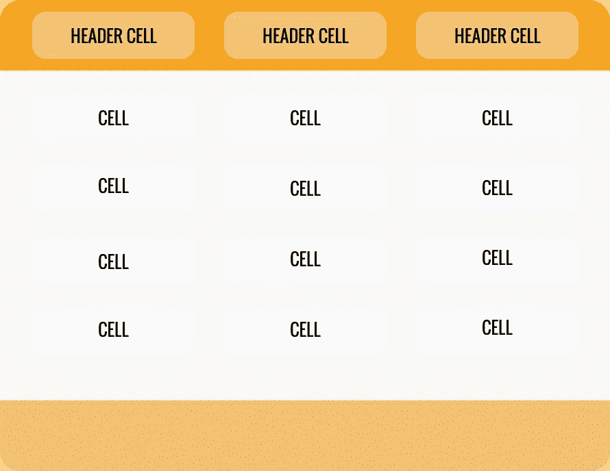
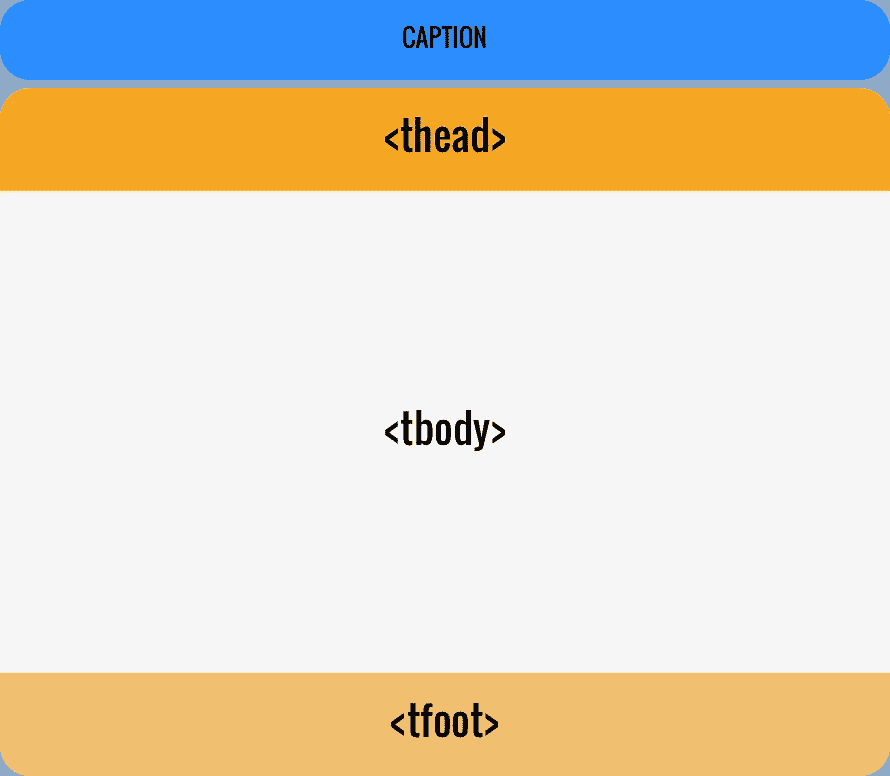
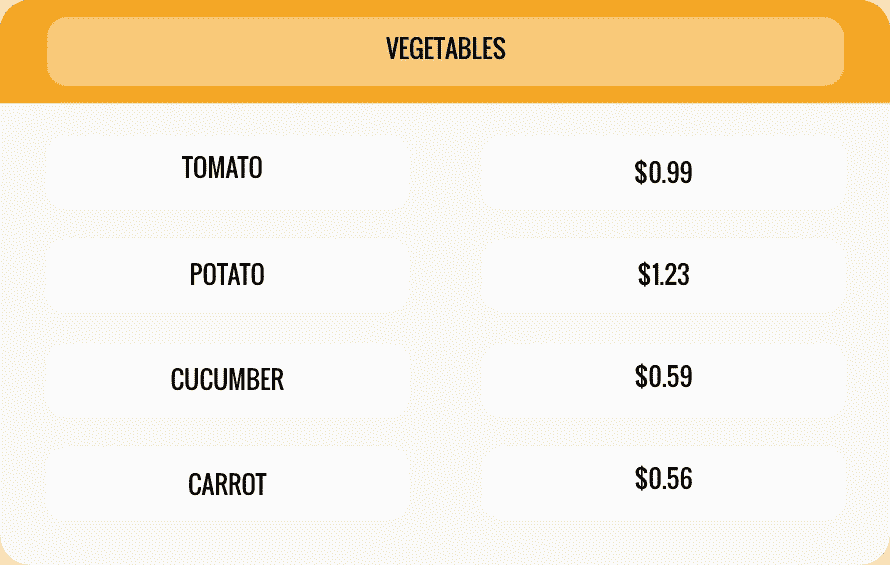
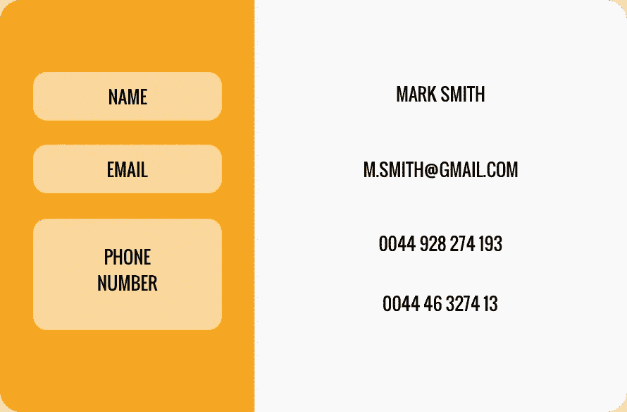
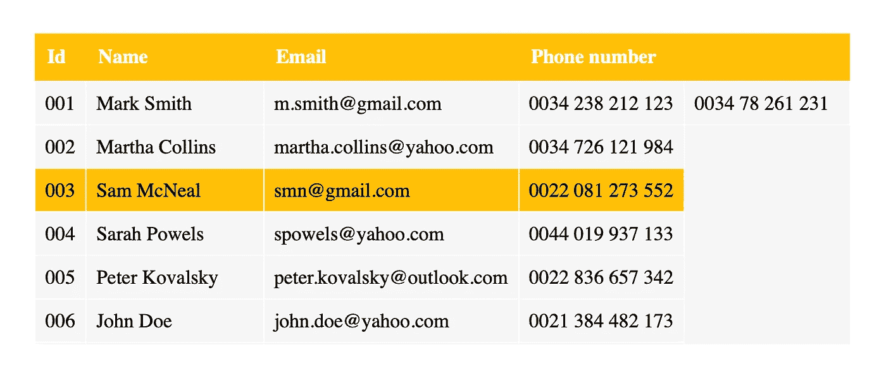

# 桌子里面有什么？如何构建定制的 HTML 表格？

> 原文：<https://medium.com/duomly-blockchain-online-courses/whats-inside-the-table-how-to-build-customized-html-tables-b1eb4793c780?source=collection_archive---------5----------------------->


[Duomly — Programming online courses](https://www.duomly.com)

本文原载于[https://www . blog . duomly . com/how-to-build-an-html-table-tutorial/](https://www.blog.duomly.com/how-to-build-an-html-table-tutorial/)

当你在构建一个有一些数据要展示的项目时，你需要一个好的方法来简单易懂地展示这些信息。根据数据的类型，您可以在不同的 HTML 元素之间进行选择。

在许多情况下，表格是很好地显示大量结构化数据的最方便的方法。这就是为什么在本文中，我想向您解释表的结构，向您展示如何创建一个表，并给你一点建议，当它是一个以表的形式呈现数据的好主意时。

如果你喜欢先看后读，我这里有一个视频版本给你。

HTML tables tutorial

让我们开始成为 HTML 表格大师吧！

# 1.HTML 表格结构——里面有什么？

HTML 表格由多个元素组成，每个元素都有不同的标签。

您必须使用的第一个元素是一个`<table>`标签，它是一种用于构建表格的元素的容器。在这个容器中，你必须放入其他元素，如行、列或单元格。

在下图中，您可以看到哪些元素是最基本表格的一部分。



[Basic HTML table structure](https://www.blog.duomly.com)

`<tr>` -首先应该在表中创建的标签。它是用来造排的。这很容易记住，因为你可以把 tr 想象成一个表格行。

然后，在行内，您需要创建单元格，这也可以看作是创建列。根据需要，您可以使用两种不同的标签来实现:

`<th>` -这是一个创建标题单元格的选项。
`<td>` -用于构建普通单元格，你可以在每行放置任意多的`<td>`元素。

让我们看一个简短的例子:

```
<tr>
  <th>id</th>
</tr>
<tr>
  <td>1</td>
</tr>
```

上面描述的标签只是创建 HTML 表格的基本元素。还有一些 HTML 标签可以帮助你用额外的元素构建更高级的表格。让我们看看这张图片:



[Thead, Tbody, Tfoot — HTML tables](https://www.duomly.com)

`<caption>`允许为表格添加标题。开封后应该直接使用

标签；

`<thead>` | `<tbody>` | `<tfoot>`通过将表头放入`<thead>`，将所有主体元素放入`<tbody>`，将表尾行或其他信息放入`<tfoot>`，允许以更结构化的方式构建表格；

还有两个特殊的属性允许我们操作单元格，它们是 colspan 和 rowspan。



Colspan example



Rowspan example

这些属性采用一个数值，并允许跨其他行或列扩展表的列或行。

# 2.使用代码示例创建 HTML 表格

在你熟悉了所有你应该知道的 HTML 表格之后，让我们来创建一个。

开始时，打开您最喜欢的代码编辑器，创建一个简单的。html 文件。你可以随意称呼它。
开始创建一个简单的 HTML 文件结构，其中包含表格结构，如下面的代码所示:

```
html>
  <head>
    <title>HTML Table by Duomly</title>
    <style></style>
  </head>
  <body>
    <table>
      <thead></thead>
      <tbody></tbody>
      <tfoot></tfoot>
    </table>
  </body>
</html>
```

现在，我们有了一个结构，是时候把一些数据放进去了。让我们创建我们的表头。

```
<thead>
  <tr>
    <th>Id</th>
    <th>Name</th>
    <th>Email</th>
    <th colspan=2>Phone number</th>
  </tr>
</thead>
```

表头准备好了，现在让我们向表体添加数据。我们将有 10 排。

```
<tbody>
  <tr>
    <td>001</td>
    <td>Mark Smith</td>
    <td>m.smith@gmail.com</td>
    <td>0034 238 212 123</td>
    <td>0034 78 261 231</td>
  </tr>
  <tr>
    <td>002</td>
    <td>Martha Collins</td>
    <td>martha.collins@yahoo.com</td>
    <td>0034 726 121 984</td>
  </tr>
  <tr>
    <td>003</td>
    <td>Sam McNeal</td>
    <td>smn@gmail.com</td>
    <td>0022 081 273 552</td>
  </tr>
  <tr>
    <td>004</td>
    <td>Sarah Powels</td>
    <td>spowels@yahoo.com</td>
    <td>0044 019 937 133</td>
  </tr>
  <tr>
    <td>005</td>
    <td>Peter Kovalsky</td>
    <td>peter.kovalsky@outlook.com</td>
    <td>0022 836 657 342</td>
  </tr>
  <tr>
    <td>006</td>
    <td>John Doe</td>
    <td>john.doe@yahoo.com</td>
    <td>0021 384 482 173</td>
  </tr>
  <tr>
    <td>007</td>
    <td>Ann Flori</td>
    <td>a.flori@outlook.com</td>
    <td>0044 239 138 283</td>
  </tr>
  <tr>
    <td>008</td>
    <td>Martin Edwards</td>
    <td>m.edwards@yahoo.com</td>
    <td>0034 276 693 538</td>
    <td>0034 40 5793 963</td>
  </tr>
  <tr>
    <td>009</td>
    <td>Judy Malcolm</td>
    <td>judy.malcolm_2@gmail.com</td>
    <td>0021 845 304 287</td>
  </tr>
  <tr>
    <td>010</td>
    <td>Charles Richardson</td>
    <td>richardsonch@outlook.com</td>
    <td>0044 856 248 329</td>
  </tr>
</tbody>
```

现在我们的桌体准备好了。让我们添加一个`tfoot`元素:

```
<tfoot>
  <tr>
    <td colspan=5>Total amount of clients: 10</td>
  </tr>
</tfoot>
```

桌子的结构已经准备好了，但我们希望我们的桌子看起来漂亮，这就是为什么我们要添加一些风格。让我们回到 HTML 文件的`head`部分的`style`，并放置以下代码:

```
body {
  margin: 0;
  padding: 2rem;
}
.tablecontainer {
  max-height: 250px;
  overflow: auto;
}
table {
  text-align: left;
  position: relative;
  border-collapse: collapse; 
  background-color: #f6f6f6;
}
th, td {
  padding: 0.5em;
}
th {
  background: #ffc107;
  color: white;
  border-radius: 0;
  position: sticky;
  top: 0;
  padding: 10px;
}
td {
  border: 1px solid white;
  box-sizing: border-box;
}
tfoot > tr  {
  background: black;
  color: white;
}
tbody > tr:hover {
  background-color: #ffc107;
}
```

瞧啊。你的 HTML 表格已经准备好了。您应该会得到如下图所示的结果:



[HTML table](https://www.blog.duomly.com)

在上面的代码中，我们使用所有的结构元素创建了一个简单的表。我们还添加了一些样式，使我们的桌子更有用、更美观。我们的表也有一个固定的标题，所以你可以滚动大量的数据，仍然可以看到标题行。

# 3.何时应该在项目中使用 HTML 表格

如果你不确定什么时候用桌子是个好主意，什么时候不是，你应该看看你要展示的日期。如果是我在上面使用的结构和表格形式的数据，那么把它显示成表格是最好的选择之一。

除了清晰的数据表示，还可以轻松地使用表格进行舒适的过滤和排序。

但是，有一件事你应该避免，那就是在表格中构建你的网站布局。
这是一段时间前流行的方法，但现在我们有像 [flexbox](https://www.blog.duomly.com/flexbox-cheatsheet/) 和 [CSS grid](https://www.blog.duomly.com/css-grid-tutorial/) 这样的可能性，所以你可以用一种更好的方式来做，保持你的页面的响应性。

# 结论

HTML 表格是在布局中呈现结构化表格数据的一种很好的方式。它可以使用基本元素创建，如`<table>`、`<tr>`和`<td>`，但你也可以玩它，添加一些更多的功能，并建立一个适当的结构。

如果你不太喜欢玩 CSS 和 HTML，那么你可以查看一个流行的 [CSS 框架](https://www.blog.duomly.com/css-frameworks/)，它有准备好的响应表，有许多准备好的选项，你可以很容易地在你的项目中使用。但我真心鼓励你学会自己构建它，去了解它是如何运作的，以及你能改变什么。

感谢您的阅读，
来自 Duomly 的安娜


[Duomly — Programming Online Courses](https://www.duomly.com)