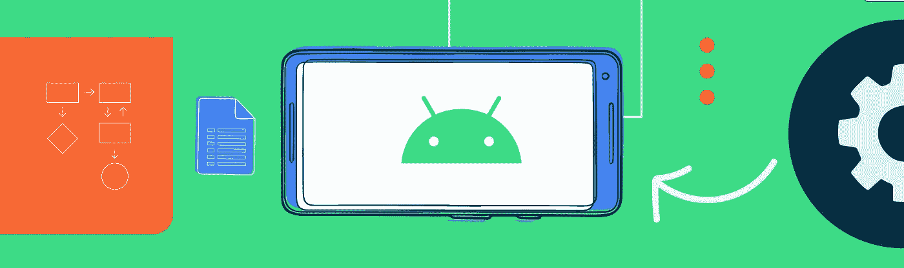
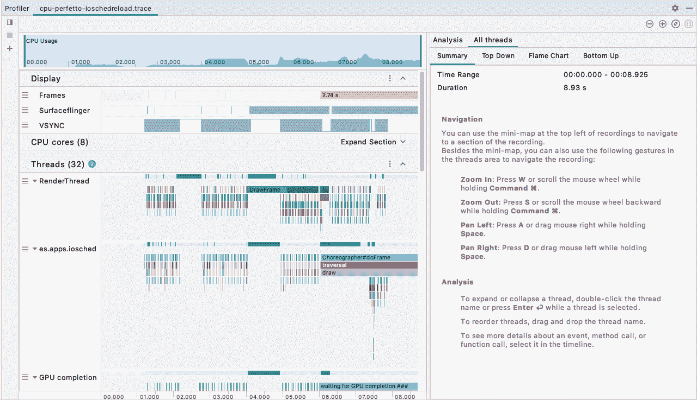
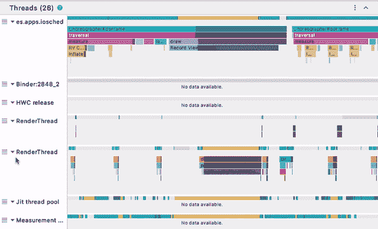
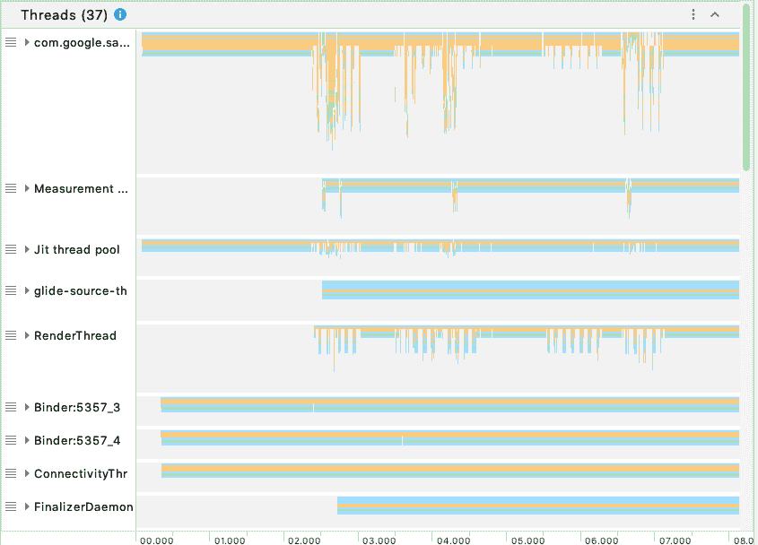
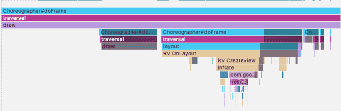
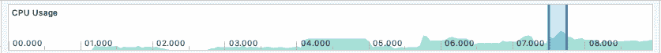
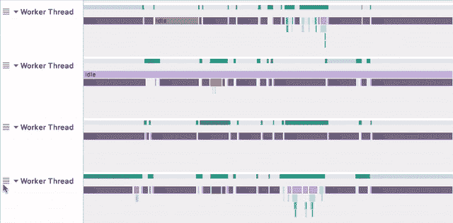
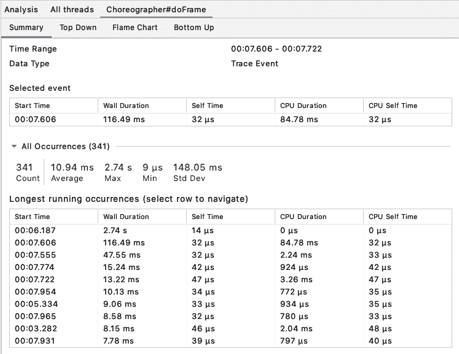

# Android Studio 系统跟踪的新功能

> 原文：<https://medium.com/androiddevelopers/whats-new-in-android-studio-system-trace-5841465c5935?source=collection_archive---------7----------------------->

在 Android Studio 4.0 中，我们彻底检查了 [CPU Profiler](https://developer.android.com/studio/profile/cpu-profiler) UI，以提供更直观的记录工作流程。我们继续根据您的反馈进行改进，并在 4.1 中添加了更多功能。

在本文中，我们将重点介绍 Android Studio 中[系统跟踪](https://developer.android.com/topic/performance/tracing)的新增功能，这是一种不常用但功能强大的 CPU 记录配置。与 Java 方法或 C/C++函数跟踪不同，系统跟踪收集设备活动(如 CPU 内核调度)和 Android 系统进程(如 SurfaceFlinger)。此外，您可以通过调用应用程序中的 [Trace](https://developer.android.com/reference/android/os/Trace) API，使用[自定义事件](https://developer.android.com/topic/performance/tracing/custom-events)来检测您的代码。这样，您的自定义事件将与系统事件一起收集。当您调查诸如 UI 抖动或高功耗等性能问题时，所有这些数据的组合都可以派上用场。

# 一次所有线程

CPU 记录现在与主分析器时间线分开，以便于分析。在这个专用视图中，跟踪数据被组织在 **Profiler** 窗口左侧的部分中。

*System Trace in Android Studio 4.1 Beta 1*

您可以上下移动部分来重新组织列表，或者通过简单的拖放来重新组织部分中的单个项目。

我们从您那里了解到，选择每个线程来查看其调用图(或系统跟踪的跟踪事件)很麻烦，因此我们将所有线程活动合并到一个视图中，同时显示线程状态和调用图。默认情况下，我们根据线程的繁忙程度对它们进行排序，但是您可以拖放任何一个线程来重新排序。

Drag and drop a thread to change the list order

您也可以通过单击三角形图标或双击线程名称来折叠或展开每个线程。请注意，对于 Java 方法跟踪或 C/C++函数跟踪，由于深度调用堆栈，我们默认情况下会折叠所有线程，以便您可以提前浏览所有线程数据。

*C/C++ Function Trace showing threads collapsed by default*

对于系统跟踪，跟踪事件现在有唯一的颜色，以便于区分。

System Trace events are color-coded by name

# 更直观的导航

新的跟踪用户界面有一个改进的时间轴导航方案。我们用主从视图替换了旧的水平滚动条。

在顶部，您可以看到一个时间线，它只映射到跟踪的持续时间，而不是整个分析会话。使用范围选择器，您可以快速缩小到特定的时间范围，下面的部分将显示详细数据。

Use range selector to focus on a small slice of the timeline

从那里，您可以执行更精确的导航操作。

*   使用 Ctrl(或 Mac 上的 Cmd 鼠标滚轮放大/缩小；
*   按住空格键的同时左右拖动鼠标来平移视图；
*   使用“WASD”键缩放和平移视图，就像 Chrome 中的传统 SysTrace UI 一样(chrome://tracing)。

从 Android Studio 4.1 Canary 9 开始，你可以在**线程**部分拖动鼠标来执行框选择。“框选”允许您精确选择一个矩形区域，您可以通过点击右上角的**缩放到选区**按钮(“M”键)来放大该区域。您甚至可以跨多个线程进行选择。当您将相似的线程拖放到彼此旁边并一次检查所有线程时，这很有用。例如，您可能想要对游戏中常见的多个工作线程执行分析。

*Box selection combined w/ drag-and-drop & zooming*

# 分析面板

说到分析，我们想在 **Profiler** 窗口的右栏突出显示 Android Studio 4.0 中引入的新**分析面板**。

在这里，您可以找到基于您的选择从记录的跟踪中导出的分析数据。当您从左栏中选择线程、堆栈帧或跟踪事件时，分析面板将显示特定于您的选择的信息。例如，当选择一个线程时，会显示它的线程状态，以及其他有用的信息。

我们希望这个分析面板对您有用，所以我们一直在探索显示有用分析数据的方法。除了 CPU Profiler 中已经存在的[自上而下](https://developer.android.com/studio/profile/cpu-profiler#top_down_bottom_up)、[火焰图](https://developer.android.com/studio/profile/cpu-profiler#flame_chart)和[自下而上](https://developer.android.com/studio/profile/cpu-profiler#top_down_bottom_up)图形，我们还在 Android Studio 4.1 Canary 10 中添加了一个**摘要**选项卡，用于线程状态分布、跟踪事件统计等内容。例如，我们经常希望找到更多关于重复出现的跟踪事件的信息。摘要选项卡显示基本统计数据(计数、最小值、最大值等。)以及所选跟踪事件的最长运行次数。您甚至可以通过从表中选择一行来导航到另一个事件。

*Statistics and longest running occurrences of a trace event*

# 稳定性和性能改进

最后但同样重要的是，我们一直在提高 CPU 记录的稳定性和性能。

*   我们修复了几个可能导致录制失败的错误。
*   我们利用 Android 最新的工具技术，在 Android API level 28 和更高版本上使用 Perfetto 作为后端构建了系统跟踪。
*   我们还优化了分析器代码，以显著降低解析记录的跟踪时的内存消耗(高达 80%)，允许您打开和分析更长的跟踪。请记住，您可以增加 Android Studio 的最大堆大小,这对很长的跟踪很有帮助。

下载最新的 Android Studio 4.1 [预览版](https://developer.android.com/studio/preview)来试用这些功能。一如既往，我们感谢您的[反馈](http://issuetracker.google.com/issues/new?component=192722&template=842923)。