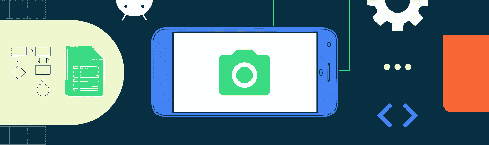
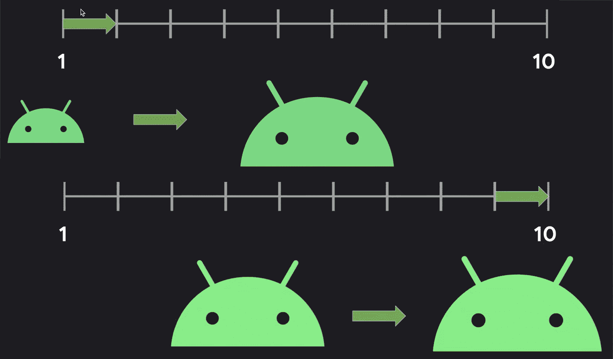

# CameraX 的新功能

> 原文：<https://medium.com/androiddevelopers/whats-new-in-camerax-fb8568d6ddc?source=collection_archive---------0----------------------->

Illustration by [Virginia Poltrack](https://twitter.com/VPoltrack)

## 如何将高级相机控件添加到您的应用程序中？

与开发者项目工程师 [Caren Chang](/@calren24) 合著

*本文基于 2019 年**Android Dev Summit*[*的一篇演示文稿，更新反映了 CameraX API 的当前状态。点击此处观看完整演示:*](https://www.youtube.com/playlist?list=PLWz5rJ2EKKc_xXXubDti2eRnIKU0p7wHd)

Camera2 API 功能强大，但要充分利用它可能有些困难，尤其是由于不同设备提供的各种相机功能，如 HDR 或夜间模式。为了解决这个问题，在去年的谷歌 I/O 上，我们宣布了 CameraX，这是一个新的 Jetpack 库，旨在消除在应用程序中添加相机功能的挫折感。

为了帮助开发人员更轻松地将相机功能集成到他们的应用程序中，CameraX 团队专注于以下几个关键方面:

*   新功能和 API，帮助您在应用中轻松启用更多相机功能。这些现在包括对点击对焦、缩放控制和设备旋转信息的支持。这使得根据镜头处理不同的配置和闪光能力变得更容易——因此你可以查询相机镜头是否具有闪光能力，以及更多。
*   扩大了提供扩展功能的设备范围，因此应用程序可以在更多设备上使用相机功能，如夜间模式或 HDR。在撰写本文时，我们可以兼容三星、LG、OPPO、小米和摩托罗拉的手机(从 Android 10 开始)。
*   测试，特别关注 API 的一致性和稳定性，使用一个拥有 52 种不同设备型号的实验室，从低端到高端设备，代表超过 2 亿台活动设备。

作为这项工作的一部分，CameraX 团队正在与 Lens Go 团队密切合作，以了解该库在野外的表现。Lens Go 是一款应用程序，用户可以将相机对准某个物体，如机场标志，分析图像，并实时给出反馈，如翻译标志。这一合作被证明是测试 CameraX 库如何工作的好方法，特别是在低端设备上 Lens Go 的一个关键设备细分市场。此外，随着每月有数百万用户在数百种设备上使用 Lens Go，了解 CameraX 库在 Lens Go 中的表现对提供更稳定的库有很大帮助。

Lens Go 团队从集成 CameraX 中看到的最大好处之一是更小的 APK 尺寸，因为 CameraX 已经针对性能和尺寸进行了大量优化。他们还能够更快地发布功能，而不必维护自己的摄像头代码。

## **使用 CameraX**

CameraX 支持最常见相机场景的 3 种使用情形:

*   [**预览**](https://developer.android.com/reference/androidx/camera/core/Preview) ，使您能够在应用程序中包含一个显示实时相机馈送的取景器。
*   [**图像分析**](https://developer.android.com/reference/androidx/camera/core/ImageAnalysis) ，使您能够访问相机帧数据，以实现对象检测和增强现实等功能。
*   **，可以拍摄照片并保存到磁盘。**

**对于每个用例，都有三个设置步骤:配置、绑定和交互。**

**为了说明这是如何工作的，让我们以图像捕捉为例:在你的应用程序中拍照。**

**第一步是创建一个图像捕获用例。您可以指定图片分辨率等参数。但是，您不必担心用户设备上的设置分辨率。如果设备不支持请求的分辨率，CameraX 只需回到最接近的分辨率。这意味着配置总是成功的。**

**第二步是绑定。需要考虑不同的生命周期，例如活动的生命周期、相机和捕获会话的生命周期。通过将用例绑定到一个[生命周期所有者](https://developer.android.com/reference/androidx/lifecycle/LifecycleOwner)，CameraX 管理所有的生命周期，因此您不必自己管理状态机。例如，相机在需要时打开，完成后释放。**

**最后一步是互动。当你打电话给`takePicture`时，你的应用程序会抓拍一张照片。**

**因此，只需几行代码，您就有了一个图像捕获管道。**

## ****高级功能****

**为了让您对 CameraX 提供的高级功能有所了解，让我们来看看相机控制和相机信息功能。这些是高级 API，使您能够独立于用例直接控制摄像机。这意味着，如果您有一个预览和图像捕捉用例，当您更新相机状态时，如变焦或闪光灯，它将为所有用例更新它。**

## ****实现点击聚焦****

**CameraX 支持自动对焦，但在某些情况下，您可能希望让用户能够手动控制对焦目标。**

**如果你用 Camera2 API 做这个，你需要找出 UI(取景器)坐标和相机传感器(图像)坐标之间的转换，并指定聚焦区域的大小。**

**使用 CameraX 的方法如下:**

**首先，通过创建一个接受显示器、相机选择器和宽度/高度的`DisplayOrientedMeteringPointFactory`来转换坐标。然后用它把 UI 坐标中的测光点转换成归一化的传感器坐标。**

**接下来，创建一个操作。要在同一点对焦和测光，使用`FocusMeteringAction`，经过归一化测光点。**

**最后，你把这个动作交给`cameraControl`，CameraX 处理剩下的工作。**

## ****实现缩放****

**使用 Camera2 实现缩放需要您找出变换和裁剪区域。**

**使用 CameraX 的方法如下:**

**为了实现缩放，我们需要两个值:基本值和增量值。基本值是当前的缩放比例，增量值是随着用户手指的收缩而改变的比例。**

**要获得增量值，创建`ScaleGestureDetector`。这个 Android 对象将触摸事件转换成比例因子。这里的比例因子是增量值。**

**然后，从`cameraInfo`获取基值，该 API 用于获取相机功能的状态，如变焦比、闪光灯可用性和传感器旋转角度。**

**有了这两个值，现在调用相机控件上的大小和比例。CameraX 将计算出裁剪区域，并向相机发送请求，就这样，您实现了缩放。**

## ****实现缩放滑块****

**要实现缩放滑块，我们需要采用不同的缩放方法。原因是，假设你有一台可以从 1 倍变焦到 10 倍的相机，从 1 倍变焦到 2 倍会缩小 50%的视野。然而，从 9 缩放到 10，尽管在滑块上的距离是相同的，但视野缩小了 10%。**

****

**这不是最好的用户体验，这也是 CameraX 包含`setLinearZoom` API 的原因。这个 API 接受一个滑块值，并进行必要的转换来提供线性缩放。**

**因此，实现缩放滑块只需一行代码:**

## ****了解更多信息****

**希望这能让你深入了解 CameraX API 让你将相机功能集成到你的应用程序中是多么容易。要了解更多信息，请查看 CameraX 文档。在那里，除了完整的 API 文档，你还会找到一个示例应用和动手 [codelab](https://codelabs.developers.google.com/codelabs/camerax-getting-started) 。你可能也想读一些我们早期的博客文章:和 [CameraX Jetpack 库](/androiddevelopers/core-principles-behind-camerax-jetpack-library-8e8380f7604c)背后的[核心原则。](/androiddevelopers/core-principles-behind-camerax-jetpack-library-8e8380f7604c)**

**如果您有任何问题或反馈，请发表在 [CameraX Google group](https://groups.google.com/a/android.com/forum/#!forum/camerax-developers) 上。**

## ****你怎么看？****

**你对 CameraX 有什么想法吗？请在下面的评论中告诉我们，或者使用#AndroidStudio 发推文，我们将从@AndroidDev 回复，在那里我们定期分享关于如何在 Android 上取得成功的新闻和提示。**