# DevTools (Chrome 92) में नया क्या है

> 原文：<https://medium.com/google-developer-experts/whats-new-in-devtools-chrome-92-d8daeb83035?source=collection_archive---------4----------------------->

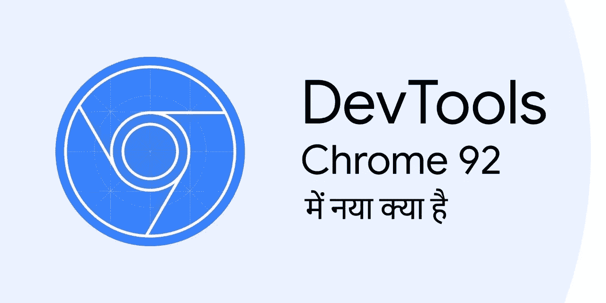

This is a translated content of the original article [What’s New In DevTools (Chrome 92)](https://developer.chrome.com/blog/new-in-devtools-92/) .

# CSS grid संपादक

एक अत्यधिक अनुरोधित विशेषता। अब आप नए CSS grid संपादक के साथ CSS grid का पूर्वावलोकन और लेखन कर सकते हैं!

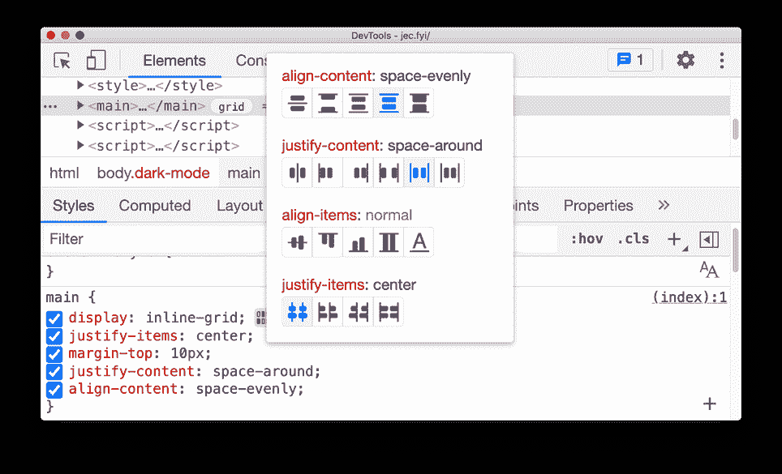

जब आपके पृष्ठ पर किसी HTML तत्व पर `display: grid` या `display: inline-grid` लागू होता है, तो आप स्टाइल्स फलक में उसके बगल में एक आइकन देख सकते हैं। CSS grid संपादक को चालू करने के लिए आइकन पर क्लिक करें। यहां आप ऑन-स्क्रीन आइकन (जैसे `justify-content: space-around` ) के साथ संभावित परिवर्तनों का पूर्वावलोकन कर सकते हैं और केवल एक क्लिक के साथ ग्रिड दिखावट का लेखन सकते हैं।

Chromium समस्या: [1203241](https://crbug.com/1203241)

# कंसोल में `const` पुनर्घोषणा के लिए समर्थन

कंसोल अब मौजूदा `[let](https://gist.github.com/blog/new-in-devtools-80/#redeclarations)` [और](https://gist.github.com/blog/new-in-devtools-80/#redeclarations) `[class](https://gist.github.com/blog/new-in-devtools-80/#redeclarations)` [पुनर्घोषणाओं](https://gist.github.com/blog/new-in-devtools-80/#redeclarations) के अलावा `const` स्टेटमेंट के पुनर्घोषणा का समर्थन करता है। नए JavaScript कोड के साथ प्रयोग करने के लिए कंसोल का उपयोग करने वाले वेब डेवलपर्स के लिए पुन: घोषणा करने में असमर्थता एक सामान्य झुंझलाहट थी।

यह डेवलपर्स को यह देखने के लिए DevTools कंसोल में कोड कॉपी-पेस्ट करने की अनुमति देता है कि यह कैसे काम करता है या प्रयोग होता है, कोड में छोटे बदलाव करता है, और पृष्ठ को रीफ्रेश किए बिना प्रक्रिया को दोहराता है। पहले, DevTools एक `const` बाइंडिंग को फिर से घोषित करने पर एक सिंटैक्स त्रुटि फेका करता था।

नीचे दिए गए उदाहरण का संदर्भ लें। `const` पुनर्घोषणा समर्थित है ** अलग-अलग REPL लिपियों में ** (वेरिएबल `a` देखें)। ध्यान दें कि निम्नलिखित परिदृश्य डिज़ाइन द्वारा समर्थित नहीं हैं:

*   REPL लिपियों में पृष्ठ लिपियों की `const` पुनर्घोषणा की अनुमति नहीं है
*   एक ही REPL स्क्रिप्ट के भीतर `const` पुनर्घोषणा की अनुमति नहीं है (वेरिएबल `b` देखें)

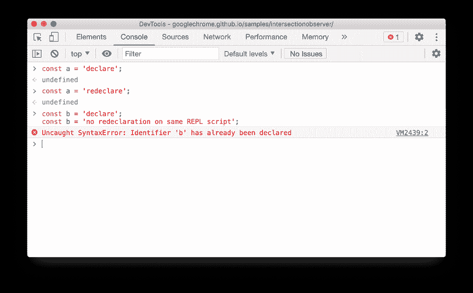

Chromium समस्या: [1076427](https://crbug.com/1076427)

# सोर्स ऑर्डर व्यूअर

बेहतर पहुंच-योग्यता निरीक्षण के लिए अब आप स्क्रीन पर स्रोत तत्वों का क्रम देख सकते हैं।

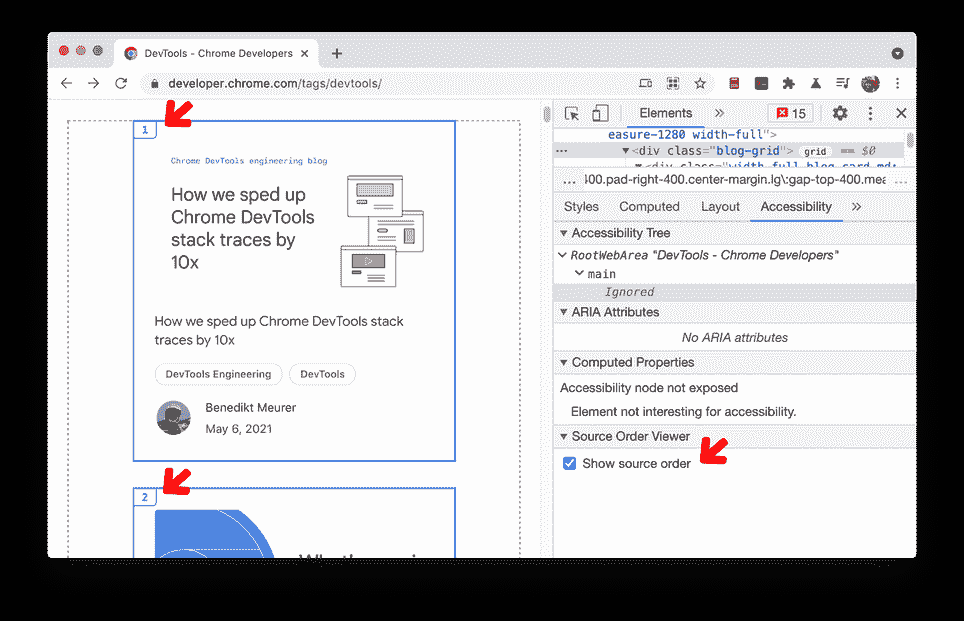

HTML दस्तावेज़ में सामग्री का क्रम खोज इंजन अनुकूलन और सुलभता के लिए महत्वपूर्ण है। नई CSS विशेषताएं डेवलपर्स को ऐसी सामग्री बनाने की अनुमति देती हैं जो HTML दस्तावेज़ में मौजूद सामग्री की तुलना में अपने ऑन-स्क्रीन क्रम में बहुत अलग दिखती है। यह एक बड़ी सुलभता समस्या है क्योंकि स्क्रीन रीडर उपयोगकर्ताओं को देखे गए उपयोगकर्ताओं की तुलना में एक अलग, सबसे अधिक भ्रमित करने वाला अनुभव मिलेगा।

Chromium समस्या: [1094406](https://crbug.com/1094406)

# iframe विवरण देखने के लिए नया शॉर्टकट

एलीमेंट पैनल में आईफ्रेम विवरण देखने के लिए आईफ्रेम एलिमेंट पर राइट क्लिक करके **iframe विवरण दिखाएं** चुनें।

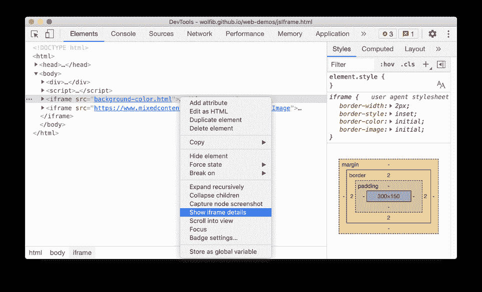

यह आपको एप्लिकेशन पैनल में आईफ्रेम के विवरण के दृश्य में ले जाता है जहां आप संभावित समस्या को डीबग करने के लिए दस्तावेज़ विवरण, सुरक्षा और अलगाव स्थिति, अनुमति नीति, और अधिक की जांच कर सकते हैं।

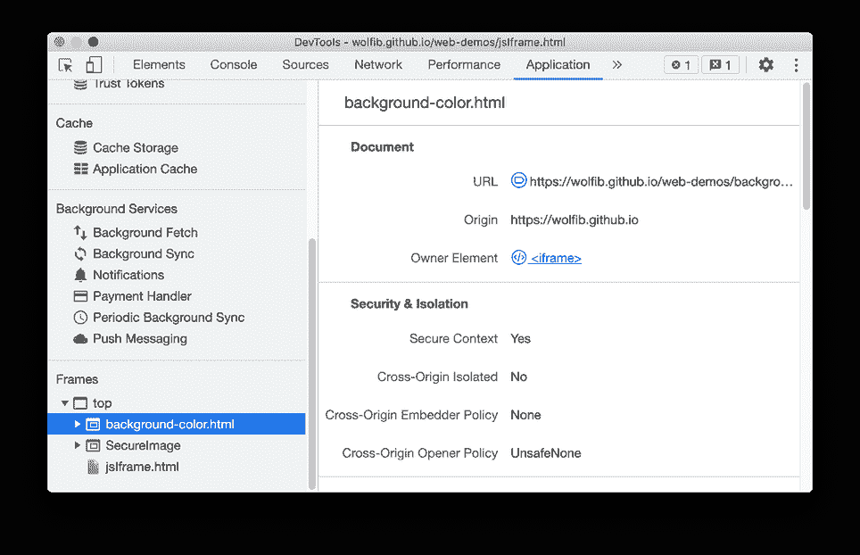

Chromium समस्या: [1192084](https://crbug.com/1192084)

# उन्नत CORS डिबगिंग समर्थन

क्रॉस-ओरिजिनल रिसोर्स शेयरिंग (CORS) त्रुटियाँ अब समस्याएँ टैब में सामने आई हैं। CORS त्रुटियों के कई कारण हैं। संभावित कारणों और समाधानों को समझने के लिए प्रत्येक समस्या का विस्तार करने के लिए क्लिक करें।

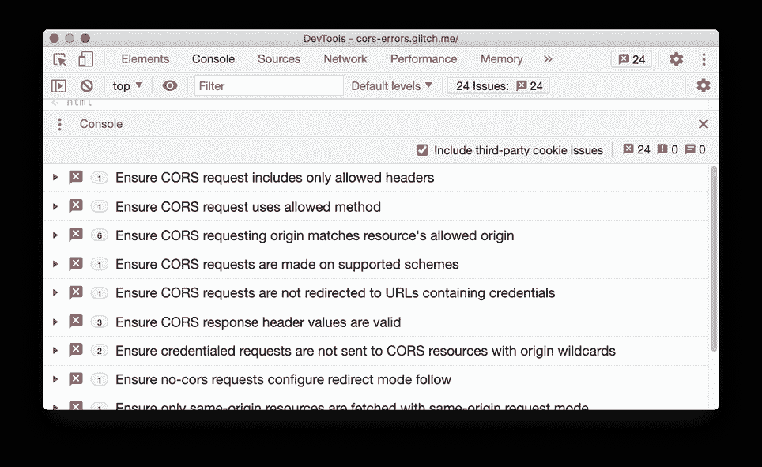

Chromium समस्या: [1141824](https://crbug.com/1141824)

# **नेटवर्क पैनल अपडेट**

**XHR लेबल का नाम बदलकर Fetch/XHR करें**

XHR लेबल का नाम बदलकर अब **Fetch/XHR** कर दिया गया है। यह परिवर्तन यह स्पष्ट करता है कि इस फ़िल्टर में `[XMLHttpRequest](https://xhr.spec.whatwg.org/)` और [Fetch API](https://fetch.spec.whatwg.org/) दोनों नेटवर्क अनुरोध शामिल हैं।

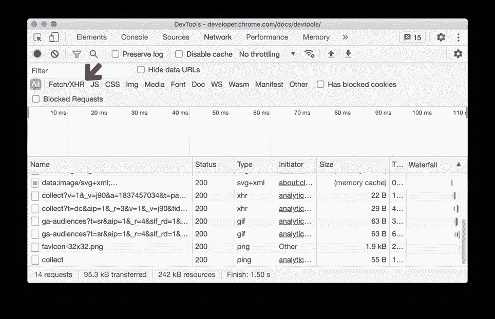

Chromium समस्या: [1201398](https://crbug.com/1201398)

**नेटवर्क पैनल में Wasm संसाधन प्रकार को फ़िल्टर करें**

अब आप Wasm नेटवर्क अनुरोधों को फ़िल्टर करने के लिए नए **Wasm** बटन पर क्लिक कर सकते हैं।

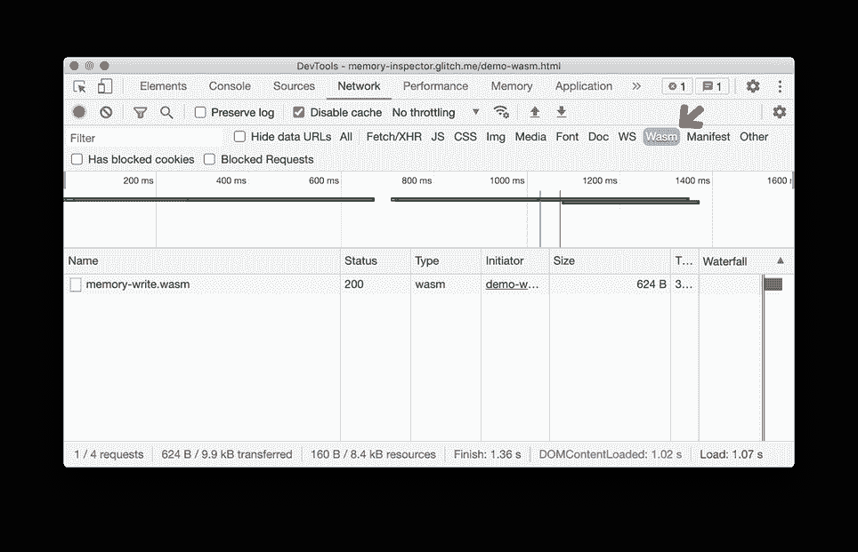

Chromium समस्या: [1103638](https://crbug.com/1103638)

**नेटवर्क स्थिति टैब में उपकरणों के लिए उपयोगकर्ता-एजेंट क्लाइंट संकेत**

[User-Agent Client Hints](https://web.dev/user-agent-client-hints) को अब **नेटवर्क शर्तों** टैब के अंतर्गत **उपयोगकर्ता एजेंट** फ़ील्ड में उपकरणों के लिए लागू किया गया है।

उपयोगकर्ता-एजेंट क्लाइंट संकेत क्लाइंट संकेत API का एक नया विस्तार है, जो डेवलपर्स को गोपनीयता-संरक्षण और एर्गोनोमिक तरीके से उपयोगकर्ता के ब्राउज़र के बारे में जानकारी तक पहुंचने में सक्षम बनाता है।

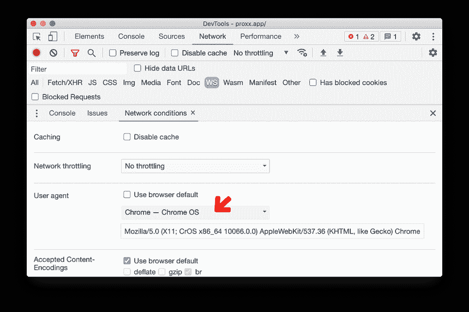

Chromium समस्या: [1174299](https://crbug.com/1174299)

**समस्या टैब में क्विर्क मोड की समस्याओं की रिपोर्ट करें**

DevTools अब [Quirks Mode](https://quirks.spec.whatwg.org/) और [Limited-quirks Mode](https://dom.spec.whatwg.org/#concept-document-limited-quirks) कि समस्या को रिपोर्ट करता है।

Quirks Mode और Limited-quirks Mode वेब मानक बनाए जाने से पहले के पुराने ब्राउज़र मोड हैं। ये मोड पूर्व-मानक-युग लेआउट व्यवहारों का अनुकरण करते हैं जो अक्सर अप्रत्याशित दृश्य प्रभाव का कारण बनते हैं।

लेआउट मुद्दों को डिबगिंग करते समय, डेवलपर्स को लगता है कि वे उपयोगकर्ता द्वारा लिखे गए CSS या HTML बग के कारण हैं, जबकि वास्तविक समस्या पृष्ठ में मौजूद Compat मोड है। DevTools इसे ठीक करने के लिए सुझाव प्रदान करता है।

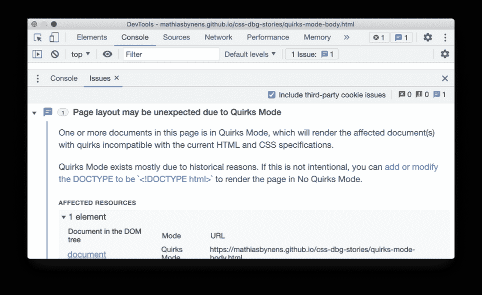

Chromium समस्या: [622660](https://crbug.com/622660)

**प्रदर्शन पैनल में Compute Intersections को शामिल करें**

देवटूल्स अब ज्वाला चार्ट में **Compute Intersections** को दिखाते हैं। ये परिवर्तन आपको [intersection observers](https://web.dev/intersectionobserver-v2/) इवेंट की पहचान करने और इसके संभावित प्रदर्शन ओवरहेड्स को डिबग करने में मदद करते हैं।

[प्रदर्शन पैनल में Compute Intersections](https://developer-chrome-com.imgix.net/image/dPDCek3EhZgLQPGtEG3y0fTn4v82/Nx3K0Lpst0lICGbtpzsW.png?auto=format&w=964)

Chromium समस्या: [1199137](https://crbug.com/1199137)

**Lighthouse पैनल में Lighthouse 7.5**

Lighthouse पैनल अब Lighthouse 7.5 चला रहा है। CSS में परिभाषित `aspect-ratio` वाली छवियों के लिए "स्पष्ट चौड़ाई और ऊंचाई अनुपलब्ध" चेतावनी अब हटा दी गई है। पहले, Lighthouse ने परिभाषित चौड़ाई और ऊंचाई के बिना छवियों के लिए चेतावनियां दिखाईं थी|

परिवर्तनों की पूरी सूची के लिए [रिलीज़ नोट](https://github.com/GoogleChrome/lighthouse/releases/tag/v7.5.0) देखें।

Chromium समस्या: [772558](https://crbug.com/772558)

**कॉल स्टैक में “Restart frame” संदर्भ मेनू को बहिष्कृत कर दिया गया है**

**Restart frame** विकल्प अब बहिष्कृत कर दिया गया है। इस सुविधा को अच्छी तरह से काम करने के लिए और विकास की आवश्यकता है, यह वर्तमान में टूटा हुआ है और अक्सर क्रैश हो जाता है।

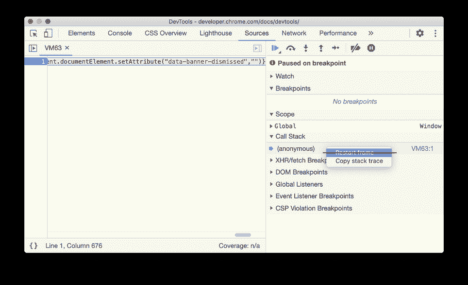

Chromium समस्या: [1203606](https://crbug.com/1203606)

**[प्रायोगिक चरण] प्रोटोकॉल मॉनिटर**

```
प्रयोग को सक्षम करने के लिए, **Settings**> **Experiments** के अंतर्गत **Protocol Monitor** चेकबॉक्स को चेक करें।
```

Chrome DevTools [Chrome DevTools प्रोटोकॉल (CDP)](https://chromedevtools.github.io/devtools-protocol/) का उपयोग करके Chrome ब्राउज़र को इंस्ट्रुमेंट, निरीक्षण, डीबग और प्रोफ़ाइल करता है। **प्रोटोकॉल मॉनिटर** आपको DevTools द्वारा किए गए सभी CDP अनुरोधों और प्रतिक्रियाओं को देखने का एक तरीका प्रदान करता है।

CDP के परीक्षण की सुविधा के लिए दो नए कार्य जोड़े गए:

*   नया **Save** बटन आपको रिकॉर्ड किए गए संदेशों को JSON फ़ाइल के रूप में डाउनलोड करने की अनुमति देता है
*   एक नया क्षेत्र जो आपको सीधे एक वास्तविक CDP कमांड भेजने की अनुमति देता है

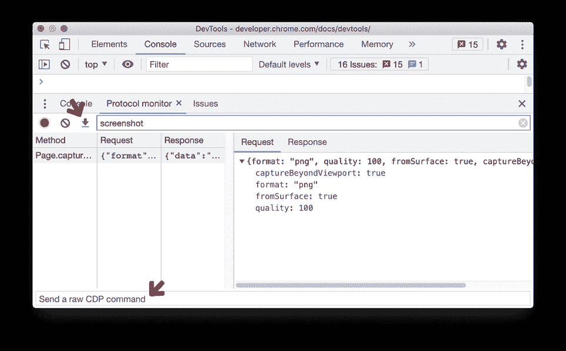

Chromium समस्या: [1204004](https://crbug.com/1204004) , [1204466](https://crbug.com/1204466)

**[प्रायोगिक चरण] Puppeteer Recorder**

```
प्रयोग को सक्षम करने के लिए, **Settings**> **Experiments** के अंतर्गत **Recorder** चेकबॉक्स को चेक करें।
```

[Puppeteer recorder](https://gist.github.com/blog/new-in-devtools-89/#record) अब ब्राउज़र के साथ आपकी बातचीत के आधार पर चरणों की एक सूची तैयार करता है, जबकि पहले DevTools इसके बजाय सीधे एक Puppeteer स्क्रिप्ट तैयार करता था। Puppeteer स्क्रिप्ट के रूप में चरणों को निर्यात करने की अनुमति देने के लिए एक नया **Export** बटन जोड़ा गया है।

चरणों को रिकॉर्ड करने के बाद, आप चरणों को फिर से चलाने के लिए नए **Replay** बटन का उपयोग कर सकते हैं। रिकॉर्डिंग के साथ शुरुआत करने का तरीका जानने के लिए [यहां दिए गए निर्देशों](https://gist.github.com/blog/new-in-devtools-89/#record) का पालन करें।

कृपया ध्यान दें कि यह एक प्रारंभिक चरण का प्रयोग है। हम समय के साथ Recorder कार्यक्षमता को बेहतर बनाने और विस्तारित करने की योजना बना रहे हैं।

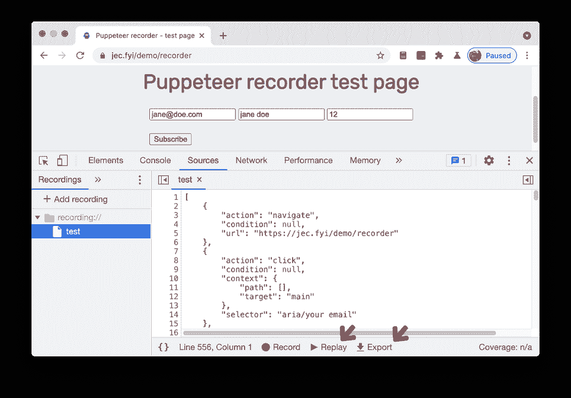

Chromium समस्या: [1199787](https://crbug.com/1199787)