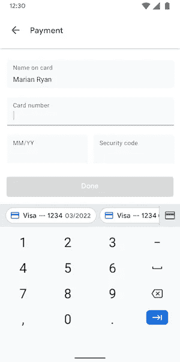
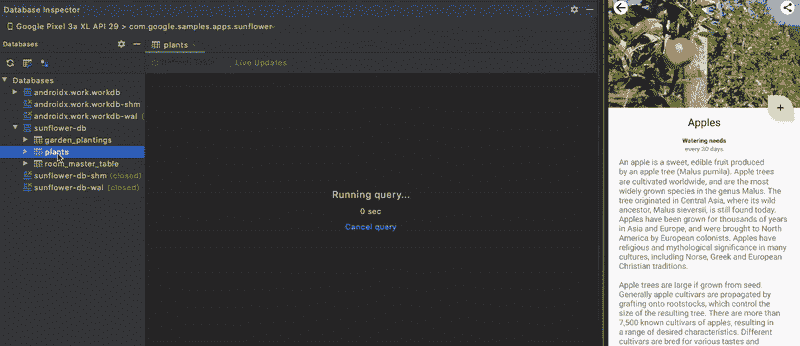
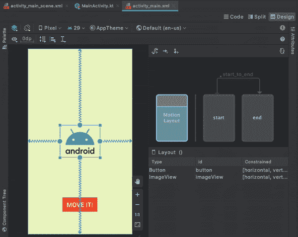
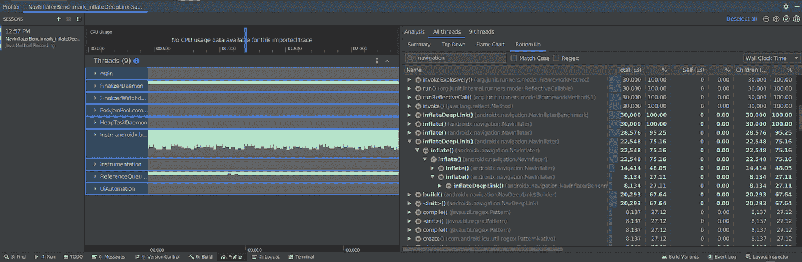

# Jetpack 的新功能

> 原文：<https://medium.com/androiddevelopers/whats-new-in-jetpack-1891d205e136?source=collection_archive---------2----------------------->

Android [Jetpack](http://d.android.com/jetpack) 是一套旨在帮助你轻松编写高质量应用的库，支持旧版本的 Android 操作系统。现在，在 Jetpack 推出两年后，我们已经看到了应用程序的巨大采用，从大型开发团队到那些刚刚起步的人。这仅仅是个开始:今天，我们将推出新的库，以及对现有库的重大更新，这些都是我们在过去一年中一直在努力的。以下是 Jetpack 的最新更新综述——我们的[*Jetpack*中的新内容](https://youtu.be/R3caBPj-6Sg)的扩展版本！

What’s new in Jetpack

# 阿尔法新品

## hilt——Jetpack 推荐的依赖注入库

Hilt 是一个新的 Android 库，它简化了应用程序中的依赖注入。Hilt 让您只关注定义和注入绑定的重要部分，而不用担心管理所有的 DI 设置和连接。

Hilt 构建在 Dagger 之上，受益于它的编译时正确性、改进的运行时性能和可伸缩性。Hilt 增加了与 Jetpack 库和 Android 框架类的集成。例如，要注入`[ViewModel](https://developer.android.com/reference/androidx/lifecycle/ViewModel)`的参数，现在可以用`[@ViewModelInject](http://developer.android.com/training/dependency-injection/hilt-jetpack)`注释`[ViewModel](https://developer.android.com/reference/androidx/lifecycle/ViewModel)`构造函数，然后用`[@AndroidEntryPoint](http://d.android.com/training/dependency-injection/hilt-android)`注释`Fragment`:

在我们的[发布博客](/androiddevelopers/dependency-injection-on-android-with-hilt-67b6031e62d)中找到更多关于 Hilt 的信息和相关资源的链接。

## 分页 3 —增量加载和显示数据

分页是一个库，它帮助您以增量方式加载和显示小块数据。今天我们发布了 Paging 3——使用 Kotlin [协程](https://kotlinlang.org/docs/reference/coroutines-overview.html)完全重写了这个库。这个新版本增加了非常受欢迎的特性，如分隔符、页眉、页脚和列表转换，以及用于观察列表加载状态的 API 和用于重试和刷新的方法。

例如，使用分页 3，可以通过扩展`PagingSource`类并实现`load` `**suspend**`函数来定义数据源，在这里可以直接调用其他挂起函数:

有关分页 3 的更多信息，请查看[文档](http://d.android.com/paging3)和我们的[代码实验室](https://codelabs.developers.google.com/codelabs/android-paging/)。

## 应用程序启动—在应用程序启动时初始化组件

应用程序启动库提供了一种在应用程序启动时初始化组件的简单、高效的方法。App Startup 允许您定义共享单个内容提供者的组件初始化器，而不是为每个需要初始化的组件定义单独的内容提供者。这可以显著改善应用程序的启动时间。

下面是在禁用工作管理器自己的`ContentProvider`之后，如何使用应用程序启动来改善工作管理器的初始化时间，工作管理器是一个在引擎盖下使用`ContentProvider`的库:

有关应用程序启动的更多信息，请查看[官方文档](http://d.android.com/topic/libraries/app-startup)。

## 自动填充 IME 集成

Android 11 为键盘引入了平台 API，以显示来自密码管理器等应用的自动填充建议。Jetpack 的[自动填充](https://developer.android.com/jetpack/androidx/releases/autofill) API 使得键盘和自动填充服务更容易通过其`InlineSuggestionUi`类利用这一新功能。自动填充服务可以使用此类来创建兼容的建议；键盘可以使用它来自定义建议的风格。

Keyboard displays card number autofill suggestion

## 使用核心动画和`SeekableAnimatedVectorDrawable`制作更简单的动画

为了更容易实现和测试动画，我们添加了两个新的库:`[androidx.core:core-animation](https://developer.android.com/jetpack/androidx/releases/core#core-animation_and_core-animation-testing_100_2)` [和](https://developer.android.com/jetpack/androidx/releases/core#core-animation_and_core-animation-testing_100_2) `[androidx.core:core-animation-testing](https://developer.android.com/jetpack/androidx/releases/core#core-animation_and_core-animation-testing_100_2)`。我们还引入了一个新的 API `[SeekableAnimatedVectorDrawable](https://developer.android.com/reference/androidx/vectordrawable/graphics/drawable/SeekableAnimatedVectorDrawable)`作为`[androidx.vectordrawable](https://developer.android.com/jetpack/androidx/releases/vectordrawable)`库的一部分。

`core-animation`回溯自冰激凌三明治以来添加到`[Animator](https://developer.android.com/reference/android/animation/Animator)` API 的所有特性，比如暂停/恢复和查找。

基于核心动画的`[SeekableAnimatedVectorDrawable](https://developer.android.com/reference/androidx/vectordrawable/graphics/drawable/SeekableAnimatedVectorDrawable)`，是`[AnimatedVectorDrawable](https://developer.android.com/reference/android/graphics/drawable/AnimatedVectorDrawable)` (AVD)的一个新的、可寻找的替代品。它使用与 AVD 相同的格式，并增加了查找、暂停和恢复播放的功能。可查找的 AVD 不能使用渲染线程，所以只有在需要新类的附加功能时才应该优先于 AVD。

## 使用 Android Studio 中的数据库检查器调试数据库

Using Database inspector in Android Studio

在 Android Studio 4.1 测试版中，使用新的[数据库检查器](https://developer.android.com/studio/preview/features#database-inspector)，调试数据库问题变得更加容易。该工具使您能够在运行的应用程序中检查、查询和修改 SQLite 数据库。无论您是直接使用 Room 还是 SQLite，您都可以通过从菜单栏中选择*视图>工具窗口>数据库检查器*来开始调试您的数据库。在这篇[博客文章](/androiddevelopers/database-inspector-9e91aa265316)中找到关于该工具以及如何使用它的更多信息。

## WindowManager —更好地支持设备外形

[WindowManager](https://developer.android.com/jetpack/androidx/releases/window) 库是 Android Jetpack 的新成员，旨在帮助应用程序开发人员支持新的形式，如可折叠、铰接屏幕等。它为新旧平台版本上的不同 WindowManager 特性提供了一个通用的 API 表面。

初始版本为已经上市和即将上市的不同类型的可折叠设备提供支持，因此应用程序开发人员可以针对整个类别的硬件配置。查看这篇[博文中的概述](/androiddevelopers/support-new-form-factors-with-the-new-jetpack-windowmanager-library-4be98f5450da)和[示例](https://github.com/android/user-interface-samples/tree/master/WindowManager)以了解更多信息。

## motion layout——为 Android 构建流畅的交互式动画

[MotionLayout API](https://developer.android.com/training/constraint-layout/motionlayout) 扩展了`ConstraintLayout`的丰富功能，帮助 Android 开发者管理他们应用中复杂的运动和小部件动画。使用`MotionLayout`，你可以将你的动画建模为`ConstraintSets`之间的过渡，并轻松地将动画与`RecyclerView`和`ViewPager`等常见视图集成。Android Studio 4.0 还包括运动编辑器，这是一个用于创建和预览使用`MotionLayout`的动画的图形工具。

Create, edit, and preview MotionLayout animations in the Motion Editor

# 现有库的更新

## 航行

[导航 2.3](https://developer.android.com/jetpack/androidx/releases/navigation) 增加了对[动态功能模块](https://developer.android.com/guide/app-bundle/dynamic-delivery)的支持，这些模块允许你在用户需要时下载应用程序的部分内容，从而显著减小应用程序的初始下载大小。现在，您可以导航到这些模块，就像它们是基本 APK 的一部分一样。除了允许查询参数，深层链接现在还支持自定义操作和 mime 类型。

一个新的用于返回结果的 API 允许你查询任何后栈条目并在它的 T0 上设置结果。新的`[TestNavHostController](https://developer.android.com/reference/kotlin/androidx/navigation/testing/TestNavHostController)`使您能够访问导航返回堆栈，并在测试中设置当前目的地。

## 工作管理器

工作管理器的[最新版本增加了对长期运行或重要工作的支持，这些工作应该由使用前台服务的操作系统保持活动。](https://developer.android.com/jetpack/androidx/releases/work)

为了更容易诊断工作管理器任务的问题，我们添加了一个新的诊断 API，允许您查看`WorkManager`的内部状态，并将其状态转储到 logcat:

WorkManager *diagnostics result example*

为了帮助您避免使用 WorkManager 时的常见错误，我们还添加了 Lint 规则来标记它们。其他 API 更新包括:支持为工人设置和观察中间[进度；对当前工作者的查询 API 的改进；以及对用于运行工作线程的进程内调度程序的改进。](https://developer.android.com/topic/libraries/architecture/workmanager/how-to/intermediate-progress?hl=en)

## 基准

Sampled traces in Android Studio

基准库的新 [alpha 版本与](https://developer.android.com/jetpack/androidx/releases/benchmark) [CPU 剖析](http://d.android.com/benchmark#profiling)集成，因此您可以剖析您的基准，然后在 Android Studio 中查看方法或采样跟踪。我们还添加了对内存分配跟踪的支持，这样您就可以优化分配时间并减少垃圾收集的负载。

## 许可

为了更容易使用权限，我们引入了新的`[ActivityResult](https://developer.android.com/training/basics/intents/result)`API。这些 API 通过用`[RequestPermission](https://developer.android.com/reference/androidx/activity/result/contract/ActivityResultContracts.RequestPermission)`契约替换`[requestPermissions](https://developer.android.com/reference/android/app/Activity#requestPermissions(java.lang.String[],%20int))`简化了权限请求，但也为常见意图提供了类型安全的契约，比如[拍照](https://developer.android.com/reference/androidx/activity/result/contract/ActivityResultContracts.TakePicture?hl=en)或提示用户[打开文档](https://developer.android.com/reference/androidx/activity/result/contract/ActivityResultContracts.OpenDocument?hl=en)。

## 游戏 SDK

今年早些时候推出的 Android 游戏 SDK 现在也是 Jetpack 的一部分，可以在 Google Maven 知识库中找到。SDK 目前提供了一个[帧调步 API](https://developer.android.com/games/sdk/frame-pacing) 和 Android 性能调谐器。从官方[文档](https://developer.android.com/games/sdk)中找到更多关于游戏 SDK 的信息。

## 照相机

Android 设备上的摄像头有很大差异； [CameraX](https://developer.android.com/training/camerax) 在 90%的电脑上运行。自从 CameraX 在去年 2 月达到测试版以来，我们一直专注于可靠性，以确保 API 在各种设备上的最佳行为。我们的 CameraX 测试实验室在代表超过 4 亿台正在使用的活动设备的设备类型上运行我们的自动化测试套件。

最新版本的 CameraX 对`[PreviewView](https://developer.android.com/reference/androidx/camera/view/PreviewView?hl=en)`小部件进行了改进。它现在可以处理与应用程序生命周期的交互，并可靠地查看页面。它还经过优化，可以在受益于其性能增强的设备上透明地使用`[SurfaceView](https://developer.android.com/reference/android/view/SurfaceView)`。这导致更少的缓冲和更好的功率效率。

查看大量的 [CameraX 文档](https://developer.android.com/training/camerax)和[样本](https://github.com/android/camera-samples)以了解更多关于 API 的信息。

## 安全性

Jetpack 的[安全库](https://developer.android.com/topic/security/data)提供了安全易用的基于文件的加密抽象，如`[EncryptedFile](https://developer.android.com/reference/androidx/security/crypto/EncryptedFile)`和`[EncryptedSharedPreferences](https://developer.android.com/reference/androidx/security/crypto/EncryptedSharedPreferences)`。Jetpack 安全性利用了 Android 的[密钥库](https://developer.android.com/training/articles/keystore)，它提供了硬件支持的存储和操作安全性。 [Jetpack Security](https://developer.android.com/jetpack/androidx/releases/security) 现已发布棉花糖+的候选版本 2，棒棒糖+支持版本 1.1.0 alpha。

## AppCompat

[AppCompat](https://developer.android.com/topic/libraries/support-library/packages#v7-appcompat) 为各种各样的 UI 元素和平台特性提供了支持，从材质主题到像`[Toolbar](https://developer.android.com/reference/androidx/appcompat/widget/Toolbar)`这样的小部件，再到黑暗主题。在[最新版本](https://developer.android.com/jetpack/androidx/releases/appcompat)中，我们添加了 Lint 规则，让你更好地理解哪些属性来自 AppCompat，哪些来自框架，并确保你使用正确的属性。我们还对 AppCompat 的黑暗主题实现进行了实质性的稳定性改进。

## 网络工具包

Jetpack 的 [Webkit](https://developer.android.com/guide/webapps/webview) 库在 [1.2.0 版本](https://developer.android.com/jetpack/androidx/releases/webkit)中添加了一个新的 API 来强制其内容使用黑暗模式。启用此 API 后， [WebView](https://developer.android.com/reference/android/webkit/WebView) 将在支持的地方以深色主题呈现站点。如果网站不支持深色主题，API 会反转某些颜色。

# jetpack Compose——Android 的新 UI 工具包

Android 新的现代 UI 工具包 Jetpack Compose 现在已经在开发者预览版 2 中发布。这个版本增加了许多新功能:视图互操作性，更多的材料 UI 组件，黑暗主题支持，新的 UI 测试和动画 API，对`ConstraintLayout`的初始支持，对状态管理的改进，与可观察流的集成和 RTL 支持。Android Studio 预览现在可以是交互式的，并且有许多编译器改进。

从 [*撰写*](https://www.youtube.com/watch?v=U5BwfqBpiWU) 谈话中了解更多关于所有更新的信息，然后试用并[向我们提供反馈](https://issuetracker.google.com/issues/new?component=612128)。

这是过去几个月所有 Jetpack 更新的快速浏览。有 90 多个可用的库，我们知道很难找到你需要的。为了解决这个问题，我们重新设计了 [Jetpack 网页](https://developer.android.com/jetpack),并添加了一个方便的 API 选择器，以便快速从您遇到的问题转到可以解决它的 Jetpack 库。

要了解更多关于 Jetpack 库的信息，请关注在 Android11 周[的 Jetpack 周(7 月 20 日的一周)发布的新视频、博客文章和代码实验室。](http://g.co/android11)