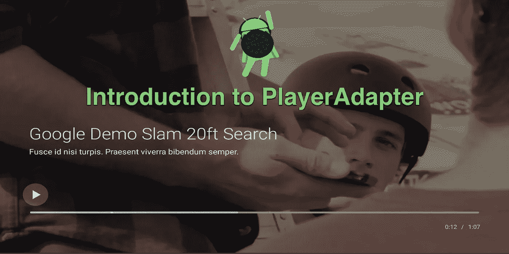
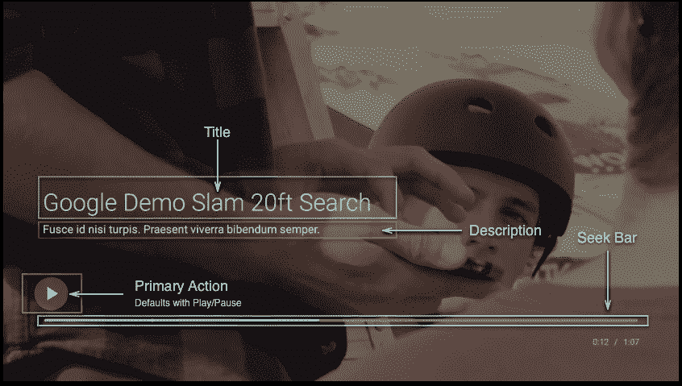
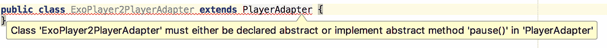
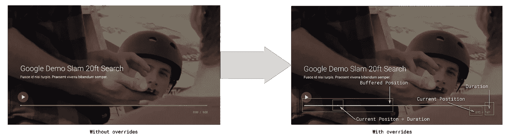
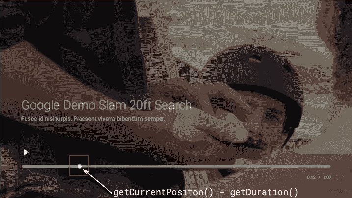
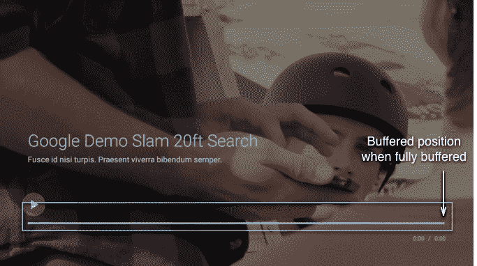

# Leanback 的新特性:第 1 部分

> 原文：<https://medium.com/androiddevelopers/whats-new-in-leanback-part-1-a895683c1567?source=collection_archive---------5----------------------->

## Android TV player adapter 简介



安卓电视新手？好奇 26.0.0 支持库的新变化？在这一系列文章中，我们将研究几个组件。在这第一篇文章中，我们从探索新组件如何帮助管理搜索栏/时间线开始。

从版本 [26.0.0-beta1](https://developer.android.com/topic/libraries/support-library/revisions.html#26-0-0-beta1) 开始，向后倾斜库有了一个名为[PlaybackTransportControlGlue](https://developer.android.com/reference/android/support/v17/leanback/media/PlaybackTransportControlGlue.html)的新组件。这是一个助手类，它管理主要和次要的操作，例如，倒回和跳到下一个，并为寻道控制提供挂钩。

请注意，没有 seek 支持的旧播放方式可以通过使用[playback banner control glue](https://developer.android.com/reference/android/support/v17/leanback/media/PlaybackBannerControlGlue.html)获得。UI 看起来与使用 [PlaybackControlGlue](https://developer.android.com/reference/android/support/v17/leanback/media/PlaybackControlGlue.html) 时相同，但是，PlaybackBannerControlGlue 在内部使用了一个 [PlayerAdapter](https://developer.android.com/reference/android/support/v17/leanback/media/PlayerAdapter.html) 。



*Components managed by PlaybackTrasportControlGlue*

PlaybackTrasportControlGlue，或者您创建的子类，需要一个 [PlayerAdapter](https://developer.android.com/reference/android/support/v17/leanback/media/PlayerAdapter.html) 的实例。后倾库提供了[media player 适配器](https://developer.android.com/reference/android/support/v17/leanback/media/MediaPlayerAdapter.html)，以便与 [MediaPlayer](https://developer.android.com/reference/android/media/MediaPlayer.html) 一起使用。

如果你更愿意使用 [ExoPlayer](https://google.github.io/ExoPlayer/guide.html) 你可以扩展 PlayerAdapter 并提供你自己的播放器实现。

为了正确地激活搜索栏，您必须覆盖 PlayerAdapter 中的一些方法。

# 重要的事情先来

当您创建 PlayerAdapter 的一个新子类时，Android Studio 会帮助您实现两个抽象方法，如下所示。



让 Android Studio 为我编码，我得到了以下结果:

```
**public** class ExoPlayer2PlayerAdapter extends PlayerAdapter {
    @Override
    **public** void play() {

    }

    @Override
    **public** void pause() {

    }
}
```

此时，实现 PlayerAdapter 似乎很容易，但还有更多的事情要做。

# 寻求帮助

为了控制 seekbar，应该覆盖以下抽象方法(即使它们是可选的)。

*   getCurrentPosition()
*   getDuration()
*   getBufferedPosition()

当您实现这些方法时，PlaybackTrasportControlGlue 可以自动更新 seekbar。

下面的快照显示了 seekbar 如何使用这些回调:



# 当前位置

要更新当前位置，需要覆盖 *getCurrentPositon()* 。实现很简单，只需委托给你的播放器并返回它的当前位置:

```
@Override
**public long** getCurrentPosition() {
    **return** isInitialized()? **mPlayer**.getCurrentPosition() : -1L;
}
```

# 持续时间

getDuraion()的实现类似:

```
@Override
**public long** getDuration() {
    **return** isInitialized()? **mPlayer**.getDuration() : -1L;
}
```

当你定义 *getCurrentPosition()* 和 *getDuration()* 时，PlaybackTransportControlGlue 可以更新 seekbar。



*With the current position and duration available, the seekbar can update.*

# 缓冲位置

PlaybackTranslportControlGlue 在视频缓冲时更新视频的进度。你需要做的就是从播放器返回缓冲的位置:

```
@Override
**public long** getBufferedPosition() {
    **return mPlayer**.getBufferedPosition();
}
```

当播放器缓冲时，您可以使用播放器适配器的回调用缓冲位置更新 UI:

```
getCallback().onBufferedPositionChanged(**this**);
```



*The UI when only implementing* getBufferedPostion()

# 继续学习

我推荐阅读 MediaPlayerAdapter 的源代码。这是一个很好的例子。还可以读取实现 PlayerAdapter 的 [ExoPlayerAdapter](https://github.com/googlesamples/leanback-showcase/blob/master/app/src/main/java/android/support/v17/leanback/supportleanbackshowcase/app/media/ExoPlayerAdapter.java) 。

在本系列的下一部分，我们将看看如何[添加缩略图到搜索栏](/@benbaxter/whats-new-in-leanback-part-2-bcb0dece359b)。

[](/@benbaxter/whats-new-in-leanback-part-2-bcb0dece359b) [## Leanback 的新特性:第 2 部分

### 自定义搜索栏缩略图

medium.com](/@benbaxter/whats-new-in-leanback-part-2-bcb0dece359b) 

如果你想加入讨论，请在 [twitter](https://twitter.com/benjamintravels) 上留下回复或与我交谈。