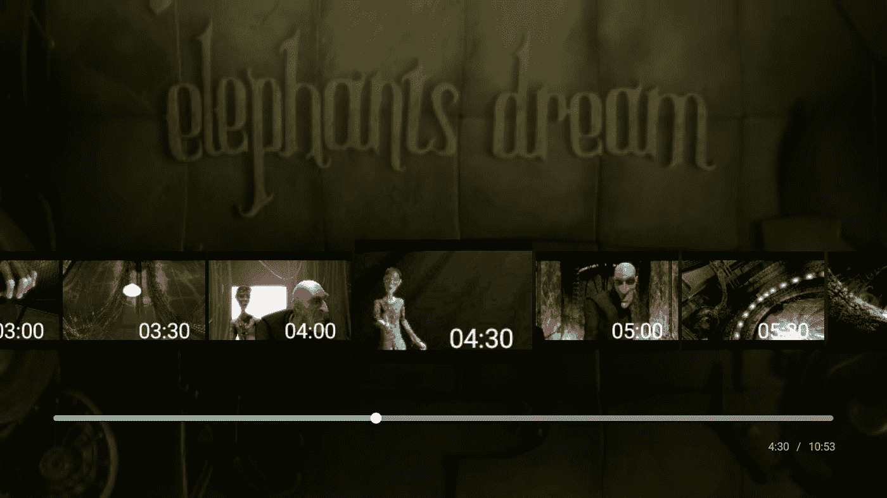

# Leanback 的新特性:第 2 部分

> 原文：<https://medium.com/androiddevelopers/whats-new-in-leanback-part-2-bcb0dece359b?source=collection_archive---------4----------------------->

## 自定义搜索栏缩略图


安卓电视新手？好奇 26.0.0 支持库的新变化？在这一系列文章中，我们将研究不同的组件。在阅读这篇文章之前，你不必阅读关于[播放器适配器](https://developer.android.com/reference/android/support/v17/leanback/media/PlayerAdapter.html)的[第一部分](/@benbaxter/whats-new-in-leanback-part-1-a895683c1567)。

[](/@benbaxter/whats-new-in-leanback-part-1-a895683c1567) [## Leanback 的新特性:第 1 部分

### Android TV player adapter 简介

medium.com](/@benbaxter/whats-new-in-leanback-part-1-a895683c1567) 

在这第二篇文章中，我们将探索新组件如何帮助增强搜索体验。

目前，当不同的应用程序选择不同的方式在流中搜索时，用户的播放控制体验可能不一致。在 [26.0.0-beta1](https://developer.android.com/topic/libraries/support-library/revisions.html#26-0-0-beta1) 中，我们引入了一种简单的方法来以一致且简单的方式增强搜索。有一个新组件叫做 [PlaybackSeekDataProvider](https://developer.android.com/reference/android/support/v17/leanback/widget/PlaybackSeekDataProvider.html) 。这个类与[PlaybackTransportControlGlue](https://developer.android.com/reference/android/support/v17/leanback/media/PlaybackTransportControlGlue.html)无缝协作。

当用户搜索时，缩略图的覆盖出现在搜索栏上方，给出了用户搜索后将在视频中的位置的视觉线索。


# 设置

启用这个特性非常简单；只需在您的传输控制胶上设置提供程序。

```
mGlue.setSeekProvider(**new** MyPlaybackSeekDataProvider(**...**));
```

真正的工作发生在 seek 数据提供程序的实现中。

# 应用程序接口

这个 API 非常简单明了。您需要扩展[PlaybackSeekDataProvider](https://developer.android.com/reference/android/support/v17/leanback/widget/PlaybackSeekDataProvider.html)并实现三个方法:

*   getSeekPositions()
*   getThumbnail(int index，PlaybackSeekDataProvider。ResultCallback 回调)
*   重置()

由于 PlaybackSeekDataProvider 是一个空的实现，如果这三个方法对您的用例没有意义，您不需要重写它们。那么每个方法的职责是什么呢？

**getSeekPositions()** —是可以显示缩略图的位置列表。可以将此想象为离散时刻的时间轴，其中缩略图可以捕捉视频中的当前场景。类似于 DVD 场景选择的概念，但是更加精细。

**getThumbnail(int，ResultCallback)** —这个方法包含了你检索那些时刻的神奇秘方。我们稍后将深入探讨细节。

**reset()** —这是一个挂钩，通知您释放资源、清除缓存或执行您的实现所需的任何其他清理。



# 履行

谈论一个 API 很容易，但是一旦你看到一个例子，理解如何创建你的实现就更有意义了。

使用 [MediaMetadataRetriever](https://developer.android.com/reference/android/media/MediaMetadataRetriever.html) 来帮助我们提取缩略图，实现变得几乎微不足道。请注意，这要求您的视频流中嵌入更多元数据。您不必使用 MediaMetadataRetriever，有许多方法可以获得位图。我只是为了这个例子而使用它。

我们要做的第一件事是计算我们的搜索位置。有一个确定的区间使这成为一个简单的数学问题。如果您在元数据中跟踪时间轴，那么就不需要这种额外的数学计算，只需沿着时间轴传递查找位置即可。

现在我们已经计算了我们的查找位置，我们要实现的第一个方法变成了一个简单的 getter 方法:

```
@Override
**public long**[] getSeekPositions() {
    **return mSeekPositions**;
}
```

大部分神奇的事情发生在 *getThumbnail()* 方法中。我们收到一个索引，它对应于我们的查找位置数组中的 a 位置。目的是 leanback 给我们一个索引作为参考标记。我们可以将参考标记与我们搜索位置相结合来获得缩略图的时间。

为什么我们没有从 *getThumbnail()* 返回任何东西，为什么我们被传递了一个回调？这种模式暗示了一种异步架构。

getThumbnail() 在 UI 线程上被调用，所以最好将大部分工作卸载到后台。在这个例子中，我使用了一个 AsyncTask。**注意**注意*retriever . getframeattime()*真的很慢。在现实世界的应用程序中，视频缩略图通常在云中进行预处理，并在播放时下载。

我们现在需要适当地管理 AsyncTask 的生命周期。

如果我们实现了 *reset()* 方法，我们可以用它来释放正在运行的线程。首先，我们需要在启动异步任务时捕获它们；将它们存储在一个稀疏数组、列表或某个集合中。因为每个索引的图像都是相同的，所以每个索引只需要一个任务。因此，给定的索引映射到一个查找位置、一个缩略图和一个 AsyncTask。

然后在我们的 *reset()* 方法中，我们应该取消并释放任务。

在其他优化中，我们可以应用这种模式，用一个 [LruCache](https://developer.android.com/reference/android/util/LruCache.html) 缓存缩略图。

综上所述，我们有三种方法可以做任何我们需要的事情。只要我们明白每个人的目的，一切都会水到渠成。

getSeekPositions() —控制我们的索引范围

getThumbnail() —奇迹发生了

reset() —释放资源

# 继续学习

我推荐阅读[PlaybackSeekAsyncDataProvider](https://github.com/googlesamples/leanback-showcase/blob/master/app/src/main/java/android/support/v17/leanback/supportleanbackshowcase/app/media/PlaybackSeekAsyncDataProvider.java)的源代码，它演示了缓存和预取；以及[PlaybackSeekDiskDataProvider](https://github.com/googlesamples/leanback-showcase/blob/master/app/src/main/java/android/support/v17/leanback/supportleanbackshowcase/app/media/PlaybackSeekDiskDataProvider.java)。

如果您想加入讨论，请在 [twitter](https://twitter.com/benjamintravels) 上留下您的回复或与我交谈。