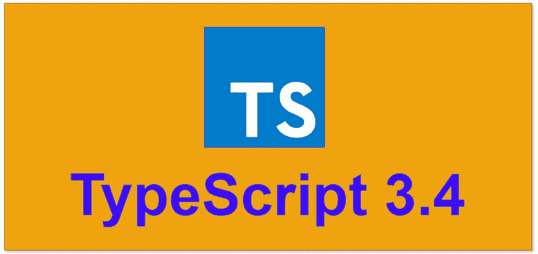

# Typescript 3.4 中的新功能

> 原文：<https://medium.com/bb-tutorials-and-thoughts/whats-new-in-typescript-3-4-5271421624d4?source=collection_archive---------4----------------------->

## 包含一些示例的新功能逐步指南

**TypeScript 3.4**

TypeScript 是一种基于 Javascript 的编程语言，提供可选的静态类型。如果你不熟悉它，请查看官方网站[这里](https://www.typescriptlang.org)。

Typescript 发布了 3.4 版。让我们马上开始，看看有什么新消息。以下是本文涵盖的主题