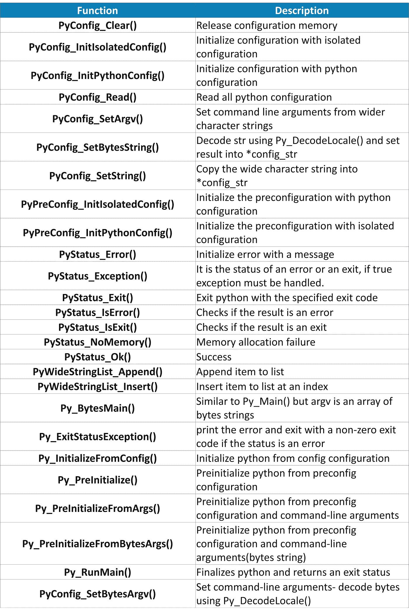

# Python 3.8 有什么新特性？—快速指南

> 原文：<https://medium.com/edureka/whats-new-python-3-8-7d52cda747b?source=collection_archive---------0----------------------->


随着 Python 3.8 的发布，人们很想了解 Python 编程语言有哪些重大变化。在本文中，我们将了解 Python 3.8 的新特性、新特性、新模块等。本博客涵盖了以下主题。

*   Python 3.8 中的新特性

1.  赋值表达式
2.  仅位置参数
3.  并行文件系统缓存
4.  调试版本
5.  f 弦支持
6.  Python 运行时审计挂钩
7.  Python 初始化配置
8.  向量呼叫
9.  泡菜协议 5

*   新模块
*   其他语言变化

# Python 3.8 中的新特性

Python 3.8 于 2019 年 10 月 14 日发布。随着 Python 3.8 的发布，关于该版本带来的新特性，还有很多需要补充的内容。开发人员必须了解新特性将如何影响他们项目的结果，以及对旧模块和添加到编程语言中的新模块进行了哪些修改，才能走上正轨。


在新的版本中，需要理解移植是如何工作的，以及即使在移植完成后，需要做什么样的改变才能使代码高效。考虑到这一点，让我们来看看 Python 3.8 新版本中引入的新特性。

# 赋值表达式

Python 3.8 以海象算子的形式发布了一个新特性，名字类似于海象的眼睛和长牙。


赋值运算符 **":="** 用于将值赋给变量，作为表达式的较大部分。让我们看一个例子来理解它是如何工作的。

```
if (n := len(a)) > 10:
    print(f"List is too long ({n} elements, expected <= 10)")
```

walrus 操作符在 while 循环中很有用，while 循环需要一个值作为循环的终止值，然后在循环体中再次使用相同的值。它也可以用在列表理解中，其中过滤条件中需要的值在表达式体中也是需要的。

**While 循环示例**

```
# Loop over fixed length blocks
while (block := f.read(256)) != '':
    process(block)
```

**列举理解示例**

```
[clean_name.title() for name in names
 if (clean_name := normalize('NFC', name)) in allowed_names]
```

因为 walrus 操作符是一个表达式，所以它可以用于 lambda 函数和表达式，其中的语句是非法的。下面列出了 walrus 操作符的一些限制。

*   不直接支持多个目标
*   不支持单个名称以外的单个分配目标
*   逗号前后的优先级不同
*   不支持可重复打包和解包
*   不支持内联类型批注
*   不支持增加的赋值

让我们看一个例子，看看它是如何改进代码的。

```
if self._is_special:
    ans = self._check_nans(context=context)
    if ans:
        return ans
```

**改进代码**

```
if self._is_special and (ans := self._check_nans(context=context)):
    return ans
```

# 仅位置参数

有一个新的函数参数语法**“/”**，用来表示某些参数可以位置使用，不能作为关键字使用。

让我们看一个例子来理解它是如何工作的。

```
def f(a, b, /, c, d, *, e, f):
    print(a, b, c, d, e, f)

f(10, 20, 30, d=40, e=50, f=60)
```

它允许纯 python 函数完全模拟现有的 C 编码函数。pow()函数不能使用位置参数。

使参数仅具有位置性的另一个好处是，它允许在将来更改参数名，而没有破坏代码的风险。仅位置参数极大地解决了需要接受任意关键字参数的函数和方法的实现。

# 编译后的字节码文件的并行文件系统缓存

python 3.8 中有一个新的 PYTHONPYCACHEPREFIX 设置，它将隐式字节码缓存配置为使用单独的并行文件系统树。

缓存的位置在 **sys.pycache_prefix** 中报告， **none** 表示 __pycache__ 目录中的默认位置。

Python 3.8 中的-X pycache_prefix 也是可用的。

# 调试版本使用与发布版本相同的 ABI

对于 Python 3.8，无论是在调试模式还是发布模式下构建，都使用相同的 ABI。当 Python 在调试模式下使用 UNIX 时，现在可以加载在发布模式下构建的 C 扩展，并且扩展使用稳定的 ABI 构建。

发布版本和调试版本已经成为与 Python 3.8 兼容的 ABI 版本。在 UNIX 上，除了 android 和 Cygwin，C 扩展不再需要链接到 libpython。我们可以使用共享库 python 轻松加载 C 扩展。

现在，当 UNIX 以调试模式构建时，import 还会查找以发布模式和稳定 ABI 编译的 C 扩展。

# f 字符串支持=用于自记录表达式和调试

Python 3.8 为 f 字符串增加了一个 **=** 说明符。让我们举个例子来理解这一点。

```
user = 'eric_idle'
member_since = date(1975, 7, 31)
f'{user=} {member_since=}'
```

**输出:** `**"user='eric_idle' member_since=datetime.date(1975, 7, 31)"**`

通常的 f 字符串说明符允许对结果的显示方式进行更多的控制，但是 **=** 说明符显示整个表达式，因此可以显示计算结果。

# Python 运行时审计挂钩

新的 python 版本增加了审计挂钩和验证开放挂钩，它们允许用纯 Python 代码编写的应用程序和框架利用额外的通知。它们还允许系统管理员或嵌入者在审计始终可用的地方部署 python 的构建。

**审计挂钩**

应用程序中的审计挂钩是一个出口点，它允许审计人员随后添加模块。这是通过激活钩子将控制转移到审计模块来实现的。

**已验证的开放式挂钩**

经验证的开放钩子允许 python 嵌入器在启动脚本或导入 Python 代码时集成操作系统支持。

# Python 初始化配置

Python 3.8 增加了新的 C API 来配置初始化，以获得更好的控制和更好的错误报告。添加了以下新结构。

*   PyConfig
*   PyPreConfig
*   PyStatus
*   PyWideStringList

以下是添加的功能列表。



# 向量呼叫

它是 CPython 的快速调用协议，被添加到 Python/C API 中。它基本上意味着将已经为各种类进行的现有优化形式化。vector 调用只处理 Python/C API，不对 Python 语言和标准库做任何更改。

在 Python 3.8 中，任何实现可调用的扩展类型都可以使用该协议。

虽然在当前版本中已经添加了它，但它仍然是临时的，将在 Python 3.9 的下一个版本中完全公开。

# 带外数据缓冲区的 Pickle 协议 5

Python 对象层次结构转换为字节流的过程称为“酸洗”。也称为序列化、编组等。

当 pickle 用于在 python 进程之间传输大型数据以充分利用多核或多机处理时，通过减少内存副本来优化传输非常重要。

pickle 5 协议引入了对带外缓冲区的支持，其中数据可以与主 pickle 流分开传输。

*   它涵盖了带外数据缓冲区所需的额外元数据
*   Pickle 5 有一个新的 **PickleBuffer** 类型，用于 **__reduce_ex__** 实现返回带外数据缓冲区
*   pickling 时有一个新的 **buffer_callback** 参数，用于处理带外数据缓冲区
*   它还有一个新的 **buffers** 参数，用于在解包时提供带外数据缓冲。

# 新模块

Python 3.8 中增加了一个新模块，新的 importlib.metadata 模块为从第三方包中读取元数据提供了临时支持。让我们看一个例子，在这个例子中，它被用来提取一个已安装的包的版本号、入口点列表等。

```
from importlib.metadata import version, requires, files
version('requests')
```

**输出:**

```
list(requires('requests'))
```

**输出:** `['chardet (<3.1.0,>=3.0.2)']`

```
list(files('requests'))[:5]
```

**输出:**

```
[PackagePath('requests-2.22.0.dist-info/INSTALLER'),
PackagePath('requests-2.22.0.dist-info/LICENSE'),
PackagePath('requests-2.22.0.dist-info/METADATA'),
PackagePath('requests-2.22.0.dist-info/RECORD'),
PackagePath('requests-2.22.0.dist-info/WHEEL')]Other Language Changes
```

# 其他语言变化

这里有一些其他的语言变化，在使用 Python 3.8 时会非常有用。

**多处理共享内存**

在 python 3.8 中，在多处理模块中，有一个新的 SharedMemory 类，它允许在不同的 python 进程之间创建和共享内存区域。


# **打字模块改进**

Python 3.8 对类型模块进行了新的修改，使健壮的检查成为可能。

*   final 类型注释和 Final 关键字表示对象在任何时候都不应该被覆盖、子类化或重新分配。
*   文字类型将表达式限制为特定的值或值列表。
*   TypeDict 类型允许您创建字典，其中关联的值被限制为一个或多个类型。

**可逆词典**

Python 3.8 允许字典的 reversed()。这里有一个简单的例子来说明它是如何工作的

```
my_dict = {a: 'edureka', b: 'python'} list(reversed(my_dict.items()))
```

**输出** : `[(b, 'python'), (a, 'edureka')]`

**语法警告**

随着 Python 3.8 的发布，如果在 Python 代码中出现语法错误，Python 解释器会抛出语法警告。通过警告可以更清楚地识别真正丢失了什么。

这就把我们带到了本文的结尾，我们已经了解了 Python 3.8 中的新特性。我希望你清楚本教程中与你分享的所有内容。

如果你想查看更多关于人工智能、DevOps、道德黑客等市场最热门技术的文章，那么你可以参考 [Edureka 的官方网站。](https://www.edureka.co/blog/?utm_source=medium&utm_medium=content-link&utm_campaign=whats-new-python-3-8)

请留意本系列中的其他文章，它们将解释 Python 和数据科学的各个方面。

> 1.[Python 中的机器学习分类器](/edureka/machine-learning-classifier-c02fbd8400c9)
> 
> 2. [Python Scikit-Learn 备忘单](/edureka/python-scikit-learn-cheat-sheet-9786382be9f5)
> 
> 3.[机器学习工具](/edureka/python-libraries-for-data-science-and-machine-learning-1c502744f277)
> 
> 4.[用于数据科学和机器学习的 Python 库](/edureka/python-libraries-for-data-science-and-machine-learning-1c502744f277)
> 
> 5.[Python 中的聊天机器人](/edureka/how-to-make-a-chatbot-in-python-b68fd390b219)
> 
> 6. [Python 集合](/edureka/collections-in-python-d0bc0ed8d938)
> 
> 7. [Python 模块](/edureka/python-modules-abb0145a5963)
> 
> 8. [Python 开发者技能](/edureka/python-developer-skills-371583a69be1)
> 
> 9.[哎呀面试问答](/edureka/oops-interview-questions-621fc922cdf4)
> 
> 10.[Python 开发者简历](/edureka/python-developer-resume-ded7799b4389)
> 
> 11.[Python 中的探索性数据分析](/edureka/exploratory-data-analysis-in-python-3ee69362a46e)
> 
> 12.[带 Python 的乌龟模块的贪吃蛇游戏](/edureka/python-turtle-module-361816449390)
> 
> 13. [Python 开发者工资](/edureka/python-developer-salary-ba2eff6a502e)
> 
> 14.[主成分分析](/edureka/principal-component-analysis-69d7a4babc96)
> 
> 15. [Python vs C++](/edureka/python-vs-cpp-c3ffbea01eec)
> 
> 16.[刺儿头教程](/edureka/scrapy-tutorial-5584517658fb)
> 
> 17.[蟒蛇 SciPy](/edureka/scipy-tutorial-38723361ba4b)
> 
> 18.[最小二乘回归法](/edureka/least-square-regression-40b59cca8ea7)
> 
> 19. [Jupyter 笔记本小抄](/edureka/jupyter-notebook-cheat-sheet-88f60d1aca7)
> 
> 20. [Python 基础知识](/edureka/python-basics-f371d7fc0054)
> 
> 21. [Python 模式程序](/edureka/python-pattern-programs-75e1e764a42f)
> 
> 22.[Python 中的生成器](/edureka/generators-in-python-258f21e3d3ff)
> 
> 23. [Python 装饰器](/edureka/python-decorator-tutorial-bf7b21278564)
> 
> 24. [Python Spyder IDE](/edureka/spyder-ide-2a91caac4e46)
> 
> 25.[在 Python 中使用 Kivy 的移动应用](/edureka/kivy-tutorial-9a0f02fe53f5)
> 
> 26.[十大最佳学习书籍&练习 Python](/edureka/best-books-for-python-11137561beb7)
> 
> 27.[用 Python 实现机器人框架](/edureka/robot-framework-tutorial-f8a75ab23cfd)
> 
> 28.[使用 PyGame 的 Python 中的贪吃蛇游戏](/edureka/snake-game-with-pygame-497f1683eeaa)
> 
> 29. [Django 面试问答](/edureka/django-interview-questions-a4df7bfeb7e8)
> 
> 30.[十大 Python 应用](/edureka/python-applications-18b780d64f3b)
> 
> 31.[Python 中的哈希表和哈希表](/edureka/hash-tables-and-hashmaps-in-python-3bd7fc1b00b4)
> 
> 32.[Python 中的套接字编程是什么](/edureka/socket-programming-python-bbac2d423bf9)
> 
> 33.[支持向量机](/edureka/support-vector-machine-in-python-539dca55c26a)
> 
> 34. [Python 教程](/edureka/python-tutorial-be1b3d015745)

*原载于 2019 年 11 月 19 日*[*https://www.edureka.co*](https://www.edureka.co/blog/whats-new-python-3-8/)*。*