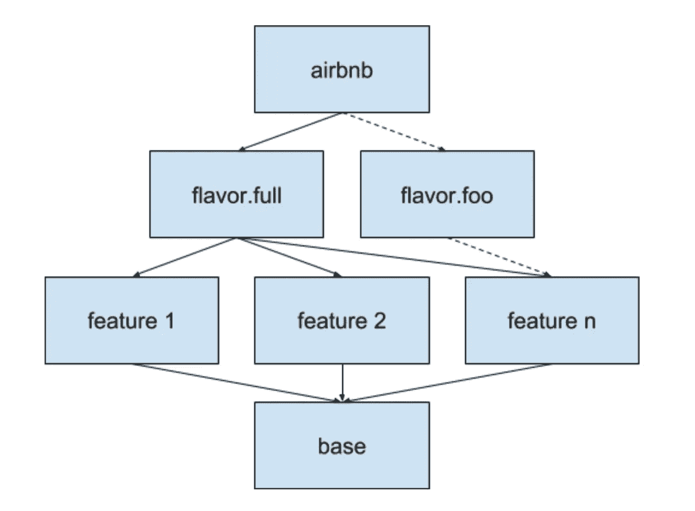
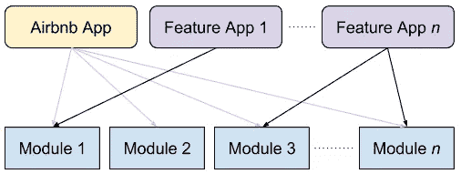

# Airbnb 的下一步是什么

> 原文：<https://medium.com/airbnb-engineering/whats-next-for-mobile-at-airbnb-5e71618576ab?source=collection_archive---------3----------------------->

## 将最好的带回本土

*这是* [*系列博文*](/airbnb-engineering/react-native-at-airbnb-f95aa460be1c) *中的第五篇，在这篇博文中，我们概述了 React Native 的使用体验以及 Airbnb 的下一步移动应用。*

# 激动人心的时刻即将到来

即使在试验 React Native 的同时，我们也继续在 Native 上加速努力。今天，我们有许多令人兴奋的项目正在生产或筹备中。其中一些项目的灵感来自我们使用 React Native 的经验和教训。

## 服务器驱动的渲染

即使我们没有使用 React Native，我们仍然看到了编写一次产品代码的价值。我们仍然严重依赖我们的通用设计语言系统( [DLS](https://airbnb.design/building-a-visual-language/) )，许多屏幕在 Android 和 iOS 上看起来几乎一样。

几个团队已经尝试并开始围绕强大的服务器驱动的渲染框架进行统一。通过这些框架，服务器向设备发送数据，描述要呈现的组件、屏幕配置和可能发生的动作。然后，每个移动平台解释这些数据，并使用 DLS 组件呈现本机屏幕甚至整个流程。

服务器驱动的大规模渲染带来了一系列挑战。这里有一些我们正在解决的问题:

*   安全地更新我们的组件定义，同时保持向后兼容性。
*   跨平台共享组件的类型定义。
*   响应运行时的事件，如点击按钮或用户输入。
*   在多个 JSON 驱动的屏幕之间转换，同时保持内部状态。
*   呈现在构建时没有现有实现的完全自定义的组件。我们正在为此试验 [Lona](https://github.com/airbnb/Lona/) 格式。

服务器驱动的渲染框架已经提供了巨大的价值，它允许我们通过无线方式即时试验和更新功能。

## 环氧成分

2016 年，我们为 Android 开源了[环氧](https://github.com/airbnb/epoxy)。Epoxy 是一个框架，支持简单的异构 RecyclerViews、UICollectionViews 和 UITableViews。今天，大多数新屏幕使用环氧树脂。这样做可以让我们将每个屏幕分解成独立的组件，实现延迟渲染。今天，我们在 Android 和 iOS 上有环氧树脂。

这是它在 iOS 上的样子:

在 Android 上，我们利用了用 Kotlin 编写[DSL 的能力，使得实现组件变得容易编写并且类型安全:](https://kotlinlang.org/docs/reference/type-safe-builders.html)

## 环氧树脂扩散

在 React 中，您从 [render](https://reactjs.org/tutorial/tutorial.html#what-is-react) 返回一个组件列表。React 性能的关键在于，这些组件只是您想要呈现的实际视图/HTML 的数据模型表示。然后，组件树被区分，并且仅分派变更。我们为环氧树脂建立了类似的概念。在 Epoxy 中，你在 [buildModels](https://reactjs.org/tutorial/tutorial.html#what-is-react) 中声明整个屏幕的模型。这与优雅的 Kotlin DSL 相结合，使得它在概念上与 React 非常相似，如下所示:

每当您的数据发生变化时，您调用 requestModelBuild()，它将使用分派的最佳 RecyclerView 调用重新呈现您的屏幕。

在 iOS 上，它看起来像这样:

## 新的 Android 产品框架(MvRx)

最近最令人兴奋的进展之一是我们正在开发的新框架，我们内部称之为 MvRx。MvRx 结合了 Epoxy、 [Jetpack](https://developer.android.com/jetpack/) 、 [RxJava](https://github.com/ReactiveX/RxJava) 和 Kotlin 的最佳技术，并采用 React 的许多原则，使构建新屏幕比以往任何时候都更容易、更无缝。这是一个自以为是但灵活的框架，它是通过采用我们观察到的通用开发模式以及 React 的最佳部分开发的。它也是线程安全的，几乎所有的东西都在主线程之外运行，这使得滚动和动画看起来流畅流畅。

到目前为止，它已经在各种屏幕上工作，几乎消除了处理生命周期的需要。我们目前正在一系列 Android 产品上测试它，如果它继续成功，我们计划开源它。这是创建发出网络请求的功能屏幕所需的完整代码:

MvRx 具有处理片段参数、跨进程重启的 savedInstanceState 持久性、TTI 跟踪和许多其他特性的简单构造。

我们也在为 iOS 开发一个类似的框架，目前处于早期测试阶段。

期待很快听到更多关于这方面的消息，但我们对迄今为止取得的进展感到兴奋。

## 迭代速度

当从 React Native 切换回 Native 时，有一点非常明显，那就是迭代速度。从一个可以在一两秒内可靠地测试您的更改的世界到一个可能要等待 15 分钟的世界是不可接受的。幸运的是，我们也能够在那里提供一些急需的救济。

我们在 Android 和 iOS 上建立了基础设施，使您能够只编译应用程序的一部分，包括一个启动器，可以依赖于特定的功能模块。

在 Android 上，这使用了 [gradle 产品口味](https://developer.android.com/studio/build/build-variants#product-flavors)。我们的 gradle 模块看起来像这样:

这种新层次的间接性使工程师能够在应用程序的一个薄片上进行构建和开发。这与 [IntelliJ 模块卸载](https://blog.jetbrains.com/idea/2017/06/intellij-idea-2017-2-eap-introduces-unloaded-modules/)相结合，极大地提高了 MacBook Pro 的构建和 IDE 性能。

我们构建了脚本来创建新的测试风格，在短短几个月的时间里，我们已经创建了 20 多个。使用这些新风格的开发构建平均快 2.5 倍，耗时超过 5 分钟的构建百分比下降了 15 倍。

作为参考，[这是 gradle snippet](https://gist.github.com/gpeal/d68e4fc1357ef9d126f25afd9ab4eee2) 用于动态生成具有根依赖模块的产品风格。

同样，在 iOS 上，我们的模块看起来像这样:

相同的系统导致构建速度提高 3 到 8 倍

# 结论

在一家不害怕尝试新技术但努力保持质量、速度和开发人员体验的高标准的公司工作是令人兴奋的。说到底，React Native 是发布特性的一个重要工具，它给了我们思考移动开发的新方法。如果这听起来像是你想参与的旅程，[请告诉我们](https://www.airbnb.com/careers/departments/engineering)！

这是一系列博客文章的第五部分，重点介绍了我们在 React Native 的体验以及 Airbnb 的下一步移动应用。

*   [第 1 部分:在 Airbnb 反应原生](/airbnb-engineering/react-native-at-airbnb-f95aa460be1c)
*   [第二部分:技术](/airbnb-engineering/react-native-at-airbnb-the-technology-dafd0b43838)
*   [第 3 部分:建立跨平台移动团队](/airbnb-engineering/building-a-cross-platform-mobile-team-3e1837b40a88)
*   [第 4 部分:做出反应原生的决定](/airbnb-engineering/sunsetting-react-native-1868ba28e30a)
*   [*第五部分:移动的下一步*](/airbnb-engineering/whats-next-for-mobile-at-airbnb-5e71618576ab)