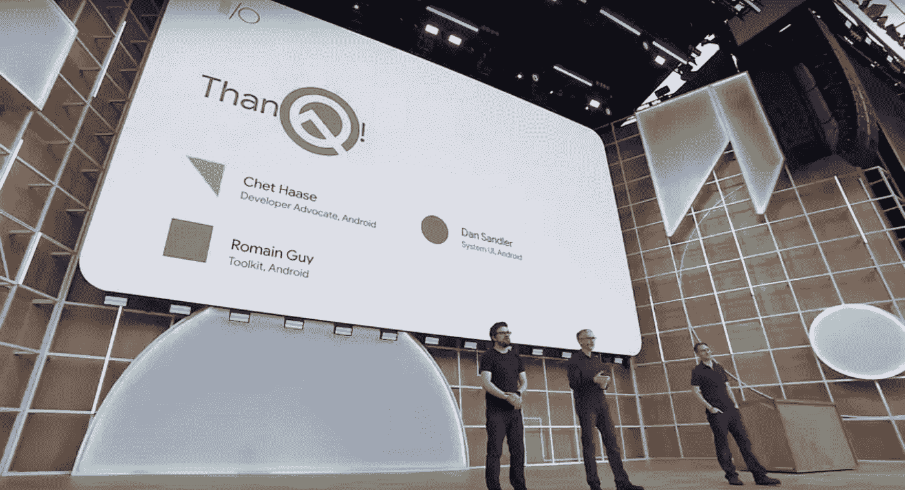

# Android 有什么新功能

> 原文：<https://medium.com/androiddevelopers/whats-now-in-android-d78061ac8b92?source=collection_archive---------4----------------------->

## 谷歌输入输出 2019

谷歌 I/O 最令人惊叹的事情之一是活动的直播/视频部分。如果你能亲自参加这个活动，那就太好了，特别是因为我们可以和你交谈，看看你有什么问题。但是不是每个人都能买到票，或者去旅行，或者把时间从他们的代码中抽出来。因此，我们直播了几乎所有的内容，并发布了所有技术会议的录音，以确保各地的每个人都可以看到演示文稿，并获得会议的亮点和 Android 的当前状态。

近年来，制作团队在工作上做得非常好，以至于视频在演讲结束后很快就被上传了。总有一天，他们会比实际的演讲更快地发布录音，这将大大减少演讲者的工作量。

但问题是，我发现，有这么多视频内容的是……**有这么多视频内容*。如果我不知道我在 YouTube 的各种播放列表中到底要找什么，那就需要一段时间来找到它，或者我可能会放弃，回去看猫视频。(他们太可爱了，amiright？)*

*因此，我想今年我会尝试为 Android 开发者整理一个播放列表，尝试对我们在大会上展示的内容进行分类，以帮助你找到你可能想要观看的内容，并在适当的时候链接其他相关内容。也许我已经迟到了，现在 I/O 已经过去两个月了，但是希望它对你们当中那些拖延者(甚至是业余疯狂者)仍然有用，他们还没有抽出时间来观察 I/O。*

*如果这有帮助，我们可以在未来尝试这样做。如果没有，也许我会为了自己的游戏列表乐趣而继续这样做；无论如何，我都要费力地浏览视频列表，我还不如试着去了解未来的观看和流行在哪里。*

*所以在这里，我的 2019 Android I/O 播放列表，分类。有些会议出现了多次，其内容与类别重叠，或者我无法做出决定。一些会议有我感觉需要他们的描述，但是大多数会议有足够的标题。*

## *播放列表*

*   *[Google I/O 2019 所有会议](https://www.youtube.com/watch?v=lyRPyRKHO8M&list=PLOU2XLYxmsILVTiOlMJdo7RQS55jYhsMi) 面向那些不仅仅关注 Android 的开发者*
*   *[Android &在 Google I/O 2019](https://www.youtube.com/watch?v=EeQr0zfvF04&list=PLWz5rJ2EKKc9FfSQIRXEWyWpHD6TtwxMM) 所有 Android 会议上播放*

## *主题演讲*

*   *[谷歌主题演讲](https://youtu.be/lyRPyRKHO8M?t=3276)
    在内部，我们称之为消费者主题演讲*
*   *[开发者主题演讲](https://youtu.be/LoLqSbV1ELU?t=332)
    Android 开发者集锦…以及其他一切*

## *概述*

*通常，你想从更深的潜水中获得技术细节，但概述会议有助于解释正在发生的事情的全貌，以及在哪里寻找这些细节。*

*   *[安卓
    新功能](https://youtu.be/td3Kd7fOROw)我尽量不错过这个，尤其是如果我错过了，我的同事会很不高兴。我们试图对平台和 Jetpack 库中开发人员应该关心的大部分事情给出一个真正宽泛的概述，包括相关演讲和其他资源的链接。*
*   *[Android 开发工具中的新特性](https://youtu.be/8rfvfojtRss)
    有许多工具专题讲座(见下文)，但这一次将对新特性进行概述。*
*   *[Google Play 的新功能](https://youtu.be/o_oUeciBknU)
    各种政策变化和分发功能，如应用内更新。*

## *喷气背包*

*Jetpack 提供了兼容性 API，允许新功能在旧版本上工作，而无需那些烦人的 API 检查，并引入了新的开发库，可以追溯到 API level 14。这些会议包括关于架构组件和其他实用程序库的讨论，以及一般的 Jetpack 架构指南。*

*   *[架构组件的新特性](https://youtu.be/Qxj2eBmXLHg) 架构组件正在发生很多事情:生命周期、空间、分页、导航、工作管理器等等。有一个总体的了解是很好的，特别是对于一些在专门的会议中没有涉及到的部分。*
*   *[Android Jetpack:了解 CameraX 相机支持库](https://youtu.be/kuv8uK-5CLY)
    CameraX 是一个新的库(目前在 alpha 中),使相机应用程序的开发变得更加容易，并且与 Lollipop 版本保持一致。*
*   *[Jetpack 导航](https://youtu.be/JFGq0asqSuA)
    导航今年走了 1.0；这是使用 API 和工具的一个很好的概述。*
*   *[构建模块化的 android 应用架构](https://youtu.be/PZBg5DIzNww)
    本课程并不针对 Jetpack 或架构组件，而是现代 Android 应用架构的指南(使用 Jetpack 提供的一些组件)。*
*   *[通过性能指标评测提高应用性能](https://youtu.be/ZffMCJdA5Qc)
    性能指标评测是一个新的 Jetpack 库，可以用来帮助测试和提高应用的性能。*

## *工具(AndroidStudio)*

*IDE 是开发的第一线。这些会议讨论了 Android 工具的改进，以及如何更好地使用这些工具提供的功能。*

*   *[Android 开发工具的新功能](https://youtu.be/8rfvfojtRss)*
*   *[约束布局的新功能](https://www.youtube.com/watch?v=29gLA90m6Gk)*
*   *[Android Studio UI 设计和调试工具的新特性](https://youtu.be/oWTG5g5rT4s)*
*   *[打造更大、更好的产品:Gradle for Large project](https://youtu.be/sQC9-Rj2yLI)*
*   *[Android Studio:提示和技巧](https://youtu.be/ihF-PwDfRZ4)*
*   *[Android Studio 构建系统的新特性](https://youtu.be/LFRCzsD7UhY)*
*   *[使用 Android 模拟器的最佳实践](https://youtu.be/Up3hyBSDAMA)*

## *科特林*

*Android 在两年前宣布 Kotlin 作为支持语言，我们正在增加对 Kotlin 培训和 API 的投资；可能是时候检验一下这种新语言了，看看它是如何工作的。*

*   *[Android 上 Kotlin 的新功能，2 年后](https://youtu.be/ldM6QZy9e0s)*
*   *[了解 Android 上的 Kotlin 协同程序](https://youtu.be/BOHK_w09pVA)*
*   *[科特林引擎盖下:理解内部原理](https://youtu.be/Ta5wBJsC39s)
    与其说是如何使用这门语言，不如说是这门语言的一些神奇特性是如何工作的，以及何时应该(或不应该)使用它们。*

## *用户界面*

*Android 上的 UI 开发涵盖了从 UI 工具包 API 到系统 UI 到旨在简化应用程序开发的新开发库的所有内容。*

*   *[声明式 UI 模式](https://youtu.be/VsStyq4Lzxo)
    这个演示是关于 Jetpack Compose 使用的 UI 编程的声明式范例，Jetpack Compose 是一个用于 Android UI 编程的开发中 API。*
*   *[运动智能:构建更智能的动画](https://youtu.be/f3Lm8iOr4mE)*
*   *[Android 操作系统用户界面的新功能](https://youtu.be/nWbW58RMteI)
    详细介绍系统用户界面的功能，如气泡和通知。*
*   *[黑暗主题&手势导航](https://youtu.be/OCHEjeLC_UY)*
*   *[在 Android 中使用文本的最佳实践](https://youtu.be/fpSfCvP36aA)*

## *平台*

*这些讲座是关于 Android 核心平台的变化或功能，包括框架 API、Android 运行时(ART)、NDK 和媒体。在 Q 预览版中有几个重要的隐私相关的变化；这些变化包含在三个不同的平台会话中。*

*   *[安卓 Q 隐私变化概述](https://youtu.be/bFp2n5OxYEE)*
*   *[更新您的应用程序以适应 Android Q](https://youtu.be/L7zwfTwrDEs)
    中与隐私相关的更改*
*   *[共享存储的新特性](https://youtu.be/3EtBw5s9iRY)
    隐私相关的变化*
*   *[了解面向更快应用的 Android 运行时(ART)](https://youtu.be/1uLzSXWWfDg)*
*   *[安卓安全:下一步是什么](https://youtu.be/0uG_RKiDmQY)*
*   *[音爆！Android 和 Chrome 上的音频编程](https://youtu.be/EeQr0zfvF04)*
*   *[Android c++开发中的新特性](https://youtu.be/L9GF_X-cq3E) 了解 NDK 的改进。*
*   *[安卓内存和游戏](https://youtu.be/Do7oYWwOXTk)
    内存管理对于游戏来说可能特别棘手；本次会议将讨论 Android 内存的工作原理以及我们提供的帮助工具。*
*   *[Android 炉边聊天](https://youtu.be/Xp4RSkHqaxc)
    针对 Android 开发、平台、生态系统中的随机话题开 Q & A。*

## *易接近*

*今年有这么多关于可访问性(一个核心平台特性)的讨论，他们在平台之外有了自己的类别。*

*   *[Android 可访问性的新功能](https://youtu.be/Y_8ZlUP2C5o)*
*   *[揭开 Android 可访问性开发的神秘面纱](https://youtu.be/bTodlNvQGfY)*
*   *[无障碍音频:Android 助听器支持和音频框架](https://youtu.be/Es8ghP2M-m4)*
*   *【Android 开发者的 Chrome 操作系统可访问性*

## *玩*

*这些讲座是关于谷歌 Play 商店的特性、API 和功能，可以用来更好地分发您的应用程序。*

*   *[Google Play](https://youtu.be/o_oUeciBknU)的新功能
    各种政策变化和分发功能，如应用内更新。*
*   *[使用 Android Vitals 提高您的应用和游戏质量](https://youtu.be/RZSR4a1SBCY)*
*   *[使用应用捆绑包进行可定制交付，轻松共享测试版本](https://youtu.be/flhib2krW7U)*
*   *[优化您的应用程序大小并提高 Google Play 安装量的新工具](https://youtu.be/rEuwVWpYBOY)*
*   *[使用 Google Play 控制台的应用增长最佳实践和决策](https://youtu.be/WyIcJd55l1M)*
*   *[Google Play 计费的新功能](https://youtu.be/N4004Set4F8)*
*   *[释放 Play Store Discovery 的威力](https://youtu.be/Nz_Ilg4BbKE)*

## *其他(非手机)外形*

*安卓不只是在手机上。笔记本电脑(Chrome OS)怎么样？电视？汽车？….*

*   *[Android for Cars 的新特性](https://youtu.be/v3BKLMU-8Hg) 有关 Android Auto 的最新信息*
*   *[如何为汽车开发安卓应用](https://youtu.be/AHHERLwjUGo)*
*   *[在 Android TV 上开发的最佳实践](https://youtu.be/Vo-UQDVykIs)*
*   *[为可折叠、多显示器和大屏幕设备开发应用](https://youtu.be/8uQEzv3upy8)*
*   *[为 Chrome OS 生态系统开发 Android 应用](https://youtu.be/06xJOOs_KvQ)*
*   *[Android 开发者的 Chrome 操作系统可访问性](https://youtu.be/vnSDqh6zT6Y)*

## *比赛*

*有各种关于游戏和游戏开发的讲座。其中一些交叉到一般的 Android 性能主题，一些是特定的游戏问题。*

*   *[安卓内存和游戏](https://youtu.be/Do7oYWwOXTk)
    内存管理对于游戏来说可能特别棘手；本次会议将讨论 Android 内存的工作原理以及我们提供的帮助工具。*
*   *[用 Vulkan 让高保真安卓游戏成为可能](https://youtu.be/2Cf8RHEAPLM)*
*   *[优化安卓游戏性能](https://youtu.be/feb-Hl_Cl3g)*
*   *[改编手机以外的安卓游戏](https://youtu.be/3S0P6Sf0Mw4)
    将游戏改编成不同的外形，比如 ChromeOS 和安卓电视。*
*   *[Android 上的统一状态](https://youtu.be/Dt8zrnX4dQ0)*
*   *[开源的大型多人游戏](https://youtu.be/_mgUGCD5vBQ)*
*   *[从 Systrace 到 Safetynet: Android 游戏开发案例研究](https://youtu.be/1xTl9o_agGc)*

## *其他的*

*这是我的“杂项”桶，其中包括不容易归入其他类别的会话，可能是因为它们是一个类别中唯一的一个(如测试，或 ML)。*

*   *[使用 Firebase 为 Android 应用添加无服务器功能](https://youtu.be/Gjx3CspYYeg)*
*   *[使用 Android 应用登录的最佳实践](https://youtu.be/GVhUFkKaLHA)*
*   *[改善数字福利:谷歌的方法和给开发者的建议](https://youtu.be/8dH7gmpF5WQ)*
*   *[Android 机器学习的新功能](https://youtu.be/wpKJpeOy-68)
    ML 套件，TensorFlow…听听所有这些 ML 东西都发生了什么。*
*   *[为下一个十亿用户开发应用](https://youtu.be/UPZPpuWNCp8)*
*   *[为 Android 开发可测试的应用](https://youtu.be/VJi2vmaQe6w)*
*   *[安卓紧急定位服务:在无线世界定位紧急呼叫](https://youtu.be/8HvOGXld-2A)*

*就这些，就这些。显然还有大量其他优秀的 Android 开发者内容可供使用。但是，如果谷歌 I/O Android 会话是你所追求的，这些就是。所以，拿些爆米花，听一些开发者演讲吧。*