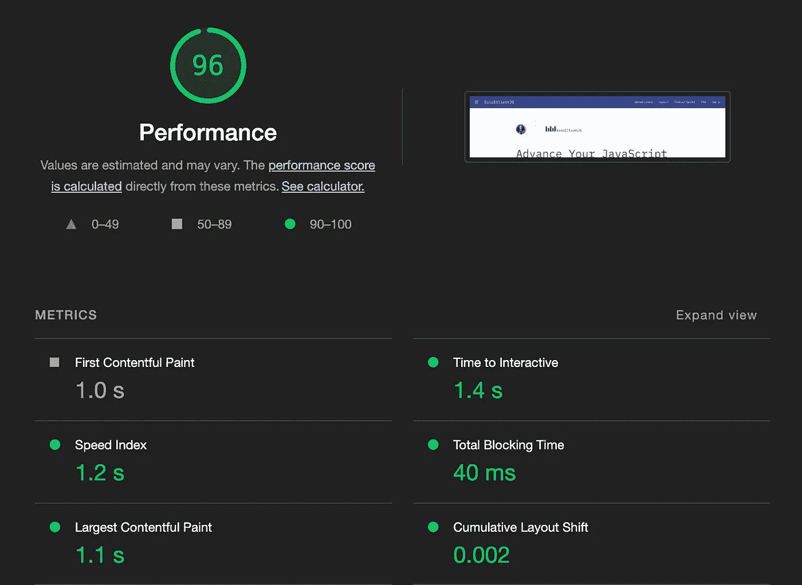

# 无服务器是怎么回事？

> 原文：<https://medium.com/javascript-scene/whats-up-with-serverless-1b9bfa80f21f?source=collection_archive---------2----------------------->

> "每一个新的应用程序都应该无服务器启动."

Adobe Creative Cloud 早期的服务都是用 Ruby 写的，但是表现并不好。所以我们决定用 Node 来重建它们。那是我工作的一部分。

开发和维护始终在线的 API 路由是一个昂贵的过程。我们有定制的车队管理软件。每个服务都有一条`/version`路径，我们会自动频繁地 ping 以检测停机时间，并从负载均衡器中淘汰离线服务，用新实例替换它们。每个服务器实例运行一个为云操作设计的最小 Linux 发行版。运营团队每周都要花几个小时了解最新动态，并定制我们的虚拟机配置。

我们还有一个定制的自动缩放器，可以监控流量和服务器负载，并在繁忙时间自动启动更多服务器。我们有专门的服务器操作支持人员，他们帮助我们构建和维护一个发布系列系统，大约每小时一次将新的变更推向生产。我们的构建和部署管道是使用 Jenkins 自动化的——这种配置花了相当长的时间才发展成对我们很有用的东西。

我们有自定义的日志记录服务，可以汇总我们所有的服务器日志，这样，如果出现问题，我们需要调查和调试时，我们可以轻松地查询特定的请求。我们还花了很多时间与 MongoDB 的人员交谈，以了解如何横向扩展我们的数据库操作，以跟上 Creative Cloud 产品的快速增长。每次我们推出一项新服务，我们都必须进行负载测试和水平扩展测试，以确保它能够很好地扩展。

在 Adobe Creative Cloud 的早期，Adobe 已经是一家成功的软件企业，拥有大量的运营预算和数千名开发人员。运行所有这些操作是昂贵的，在 Creative Cloud 的早期，我们根本不确定我们会很快找到适合市场的产品。我们有预算承担风险并取得成功，今天，Adobe Creative Cloud 是一个每年 100 亿美元的企业。

如果我们今天从头开始构建创意云，我们可以用很少的预算来完成，而且我们还可以免费获得可扩展性。

在产品成功上市和发展的道路上，无服务器可以为新的开发团队节省数十万美元，有时是数百万美元。除了极少数例外，几乎所有新软件产品都应该是无服务器优先的，并且只在需要时扩展以添加托管服务。

# 什么是无服务器？

无服务器架构是一种构建和运行应用程序的方式，不需要传统的服务器基础架构、维护或扩展操作。无服务器应用使用第三方后端服务和 API 的组合，如 [Google Firebase](https://firebase.google.com/) 或 [FaunaDB](https://fauna.com/) 。这些服务通常平滑透明地扩展，从涓涓细流到海啸般的高峰，淹没传统服务器架构的速度比您自动扩展以满足需求的速度还要快。

使用无服务器架构有许多好处，包括:

1.  **降低运营成本:**在早期增长期间，流量高峰通常会带来比平时多得多的流量。为了防止服务过载，许多初创公司支付的容量远远超过了他们的需求。例如，在 DevAnywhere 的早期，我们的托管成本是每月 1，000 多美元，以跟上大约每周一次的流量高峰。在切换到无服务器架构后，服务器成本降至不到 100 美元。当预算紧张时，重点是找到产品与市场的契合度，这些差异可以成就或摧毁一家公司。
2.  **提高开发人员的工作效率:**无服务器架构允许开发人员专注于特性和功能的构建，而不是担心服务器基础设施，从而提高开发人员的工作效率。
3.  **提高可靠性:**无服务器架构允许应用程序根据需求变化进行动态扩展，从而提高应用程序的可靠性。无服务器架构以相对较低的延迟响应流量高峰。相比之下，传统的弹性伸缩可能需要几分钟来响应流量的突然激增，让第一批用户看到的是错误消息，而不是你的产品。

# 我们什么时候需要服务器？

首先，无服务器并不意味着“没有服务器”虽然仍然有服务器，但是您不需要管理或维护它们，因为您的内部 API 比服务器更细粒度:它们是随需应变的功能和数据查询，而不是永远在线的专用 web 服务器。换句话说，不是在 Docker 容器上启动 Node、Apache 或 HAProxy，而是构建函数并让云服务提供商为您处理函数调用。大多数应用程序在没有永远在线的节点运行时监听请求的情况下也能很好地工作。

您可能需要用于持续运行或长时间运行流程的服务器，如高速、低延迟 PVP 游戏服务器，或使用定制硬件(如 ASICs、神经集群)进行优化。即使您需要这些东西，您的大部分应用程序仍然可以受益于无服务器(例如，您的 UX 或业务逻辑服务)。

# 无服务器堆栈

这部分是固执己见的:没有详尽的选项清单，没有利弊来帮助你做出明智的决定。相反，我们将只列出我最喜欢的选项。如果你知道一些不错的选择，请在评论中分享。让我们发挥一下群众的智慧。

让我们看看一些常见的要求:

*   **应用框架和部署**
*   **认证**
*   **数据库**
*   **内容管理**
*   **商业**
*   **媒体和存储**

# 应用程序框架和部署

很长一段时间以来，我一直在说，使用 [Vercel](https://vercel.com/) 就像是雇佣了世界上最好的 DevOps 团队，但是他们没有支付他们薪水，而是为你省钱。他们没有发明它，但 Vercel 已经使使用无服务器工作变得轻而易举。

[AWS Lambda](https://aws.amazon.com/lambda/) 可能更广为人知，但集成起来也很有挑战性。你会花上几个小时阅读文件。与下一个。JS，你要做的就是把一个函数放到一个 API 文件夹里。首先，`npm install -g vercel`，用`npx create-next-app`创建一个新的 React+NextJS 应用，用`vercel push`推送你的第一个无服务器网站。尝试一下——您可以在几分钟内完成第一次部署。

我强烈建议使用 Next.js 构建您的应用程序。Next 是一个无服务器的原生框架，支持无服务器功能、边缘功能/API 路由、服务器端渲染(SSR)、[静态 CDN/边缘网络部署](https://vercel.com/docs/concepts/edge-network/overview)、[增量静态再生](https://vercel.com/docs/concepts/incremental-static-regeneration/quickstart)、自动图像优化、捆绑包分割、页面加载时间优化、缓存管理等功能。

我曾经是 NBC、BBC、CBS 和华尔街日报使用的视频社交网络的技术负责人。在我的其他职责中，我需要减少华尔街日报世界流页面加载时间，从 20 多秒。

在这个过程中，我们优化了一切:我们将每个文件压缩到适合网络的大小和格式。我们缓存了所有的资产，并将它们推送到靠近访问用户的 CDN 服务器上。我们花了一周时间单独研究缓存优化策略。我花了几天时间梳理我们的 JavaScript 包，手动拆分和优化(这是在 bundlers 有树抖动之前)。我编写了一个自定义框架，允许我们有选择地推迟 JavaScript 的加载。我尽我所能偷懒装载了所有资产。

当该说的都说了，该做的都做了，我把我们的慢速移动加载时间从 20 多秒减少到了 4 秒，把我们的宽带加载时间减少到了 2 秒。我们获得了威比提名，成为众包社交视频的首批大规模演示之一。想象一下抖音之前的抖音。在我们的应用之前，电视网络没有一个好的方法来邀请观众参与众包视频。但它只是通过大量具有挑战性的优化工作才获得了牵引力。

但是我用 Next 开发的每个应用。JS 的优化要好得多。没有比赛。你必须做一些真正错误的事情，才能在 Vercel 上获得好的灯塔分数。自己看吧:我们用 Next 打造了[EricElliottJS.com](https://ericelliottjs.com/)。JS 在 Vercel 上，我们没有做什么特别的优化。在撰写本文时，我们的 lighthouse 性能得分是 96。

通过将服务器抽象化，Vercel 和 Next.js 使他们极其高效的运营团队优化部署堆栈的每个部分成为可能。我们不用担心 NodeJS、Apache 或 HAProxy 中哪个服务器的响应延迟最低，而是可以专注于构建我们的应用程序，并在默认情况下实现世界一流的性能。

# 证明

关于身份验证，有两件事您绝对必须了解:

1.  **密码已经过时，使用起来不安全。**
2.  **永远不要构建自己的认证。**这需要全职、专门的安全专家来确保安全。

出于这些原因，自从 Magic 推出以来，我为自己开发的每个应用程序都使用了它的 Web3 认证。他们是目前我唯一信任的*身份认证提供商。也就是说，像谷歌这样的大提供商的社交认证也是可以接受的。[谷歌 Firebase](https://firebase.google.com/) 也提供社交认证来完成工作。**无论如何，不要启用用户名/密码流。***

# 数据库ˌ资料库

对于 GraphQL 支持、事件流、可伸缩性、超低延迟读写性能和可靠性，我更喜欢 [Fauna](https://fauna.com/) 。好处:您可以使用 Fauna DB 事件流功能将数据库作为复杂应用程序的消息总线和作业队列，浏览器内查询订阅可以让您的客户端随时了解情况。

过去，我也使用过 [Firebase](https://firebase.google.com/) ，但是我更喜欢动物群的特性和查询灵活性。

# 内容管理

这个技巧来自我建议和指导的一家公司([联系](https://devanywhere.io/help?subject=Advise+My+Team)如果你也想让我建议你的公司):[概念](https://www.notion.so/pricing)有[一个 API](https://developers.notion.com/) 和易于使用的内容管理，许多公司已经在内部团队文档中使用。不像大多数的无头 CMS 系统，它的预算非常友好。接下来把他们的 API 和[结合起来。JS 增量静态生成](https://nextjs.org/docs/basic-features/data-fetching/incremental-static-regeneration)带有按需重新验证，您可以避免让您的用户等待到概念 API 的往返。

# 贸易

[Stripe](https://stripe.com/) 非常适合简单的订阅和支付处理。对于更复杂的商务，查看 [Shopify](https://www.shopify.com) 或 [BigCommerce](https://www.bigcommerce.com/solutions/headless-commerce/) 。两者都支持无头 API。对于加密货币交易， [Magic Connect 提供交钥匙菲亚特 onramps](https://magic.link/docs/connect/additional-features/fiat-on-ramp) ，包括即时 ACH、信用卡、借记卡、Apply Pay、Google Pay 和 SEPA transfer。

# 媒体和存储

如果你的内容都是你做的，接下来。JS 已经用它的自动优化图像标签系统覆盖了你。如果你需要托管大量用户生成的内容，我最喜欢的可编程媒体 API 服务是 [Cloudinary](https://cloudinary.com/products/programmable_media) 。如果你需要永久的、不可变的 NFTs 存储，你需要[NFT . storage](https://nft.storage/)——托管在 IPFS 上，由 Filecoin 支持。

# 后续步骤

想了解更多关于无服务器的信息吗？在 [DevAnywhere.io](https://devanywhere.io) ，我们可以使用 Vercel 上的 React/Next.js 帮助您快速使用无服务器。伸出手来！

***埃里克·埃利奥特*** *是 Webby 提名的技术产品和平台顾问，《 [*【作曲软件】*](https://leanpub.com/composingsoftware) *的作者，*[*EricElliottJS.com*](https://ericelliottjs.com/)*和*[*devanywhere . io*](https://devanywhere.io/)*的联合创始人，以及 dev 团队导师。他曾为 Adobe Systems、* ***、Zumba Fitness、*** ***【华尔街日报、*******【ESPN、*******【BBC】****等顶级录音艺人和包括* ***Usher、【Metallica】******

*他和世界上最美丽的女人享受着与世隔绝的生活方式。*