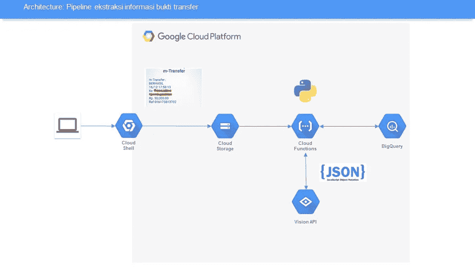
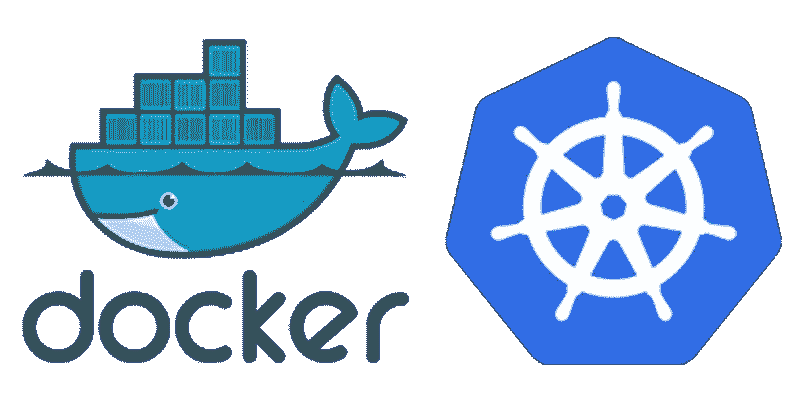

# 你今年的决心是什么？

> 原文：<https://medium.easyread.co/whats-your-resolutions-this-year-26261a18a989?source=collection_archive---------6----------------------->

你的目的是什么？你的梦想是什么？容易，关键是一致！坚持你的梦想，坚持你的想法，坚持学习新的东西。今年是一致性年。我相信你会在旅途中收获一些珍贵的东西。

Photo by [NordWood Themes](https://unsplash.com/photos/C0sW3yscQXc?utm_source=unsplash&utm_medium=referral&utm_content=creditCopyText) on [Unsplash](https://unsplash.com/search/photos/2019?utm_source=unsplash&utm_medium=referral&utm_content=creditCopyText)

你好*easy readers* Berikut top artikel[easy reader](https://medium.com/easyread)杨沙阳。

# 生产力

## [对一个人来说，最重要的是什么？](https://medium.com/easyread/bagaimana-cara-menentukan-pilihan-bahasa-pemrograman-yang-akan-dipelajari-selanjutnya-25fdd04b8391)

由[伊曼肿瘤公司](https://medium.com/u/ef42567fbbae?source=post_page-----26261a18a989--------------------------------)

一个人的未来是什么样的呢？Bagaimana menentukannya？

## [彭加曼·赛亚裙·贝拉加·戈朗](https://medium.com/easyread/pengalaman-saya-belajar-golang-94478b98331d)

由[穆夫提](https://medium.com/u/fabd581dd3a9?source=post_page-----26261a18a989--------------------------------)

你好，塞拉姆·马拉姆！这是我的第二份工作，在我的第一份工作中。

## [Aplikasi Penunjang Pekerjaan 产品经理](https://medium.com/easyread/aplikasi-penunjang-pekerjaan-product-manager-4c934243f40d)

由[大卫·奥兰多·库尔尼亚万](https://medium.com/u/8e043be2b0fc?source=post_page-----26261a18a989--------------------------------)

此外，这种方法还可以帮助农民提高产量。

Tampilan antarmuka Slack (sumber: [Slack](https://a.slack-edge.com/b47f5/marketing/img/features/unfurl_why_slack.png))

## [我从 UI/UX 设计师的第一份工作中学到的 8 件事](https://medium.com/easyread/8-things-i-learned-from-my-first-job-as-ui-ux-designer-d7f7016ef1bd)

由[阿勒菲娜](https://medium.com/u/e96f6bff56dd?source=post_page-----26261a18a989--------------------------------)

从我找到全职 UI/UX 设计师工作的第一天起，已经过去了 3 个半月。这些是我学到的一些东西，你可能也经历过。

# 数据

## [Membuat 实时数据管道登安云愿景、云功能、云存储、dan BigQuery](https://medium.com/easyread/real-time-data-pipeline-untuk-ekstraksi-informasi-bukti-transfer-dengan-cloud-vision-cloud-dc832ec04d40)

by [ilyas ahsan](https://medium.com/u/63a2db83d64f?source=post_page-----26261a18a989--------------------------------)

Artikel ini akan membahas cara membuat data pipeline, yang bertujuan ekstraksi informasi bukti transfer dengan platform Google Cloud seperti Cloud storage untuk penyimpanan file, pemrosesan menggunakan Cloud function, Ekstraksi informasi dengan Cloud Vision, dan Simpan hasil ekstraksi pada BigQuery.

## [Data Pipeline dengan Apache Beam (Part 1)](https://medium.com/easyread/data-pipeline-untuk-analisa-lagu-wik-wik-wik-dengan-python-apache-beam-dan-cloud-dataflow-part-3e26e50d628e)

by [ilyas ahsan](https://medium.com/u/63a2db83d64f?source=post_page-----26261a18a989--------------------------------)

Kali ini kita akan membuat data pipeline menggunakan Apache Beam dan dan Google Cloud Dataflow. Spesifikasi program yang akan dibuat adalah program akan membaca text file yang berisi lirik lagu wik wik wik, menghitung jumlah kata dan mengeluarkan output berupa file yang bersisi agregasi dari lirik lagu.

## [Streaming Data Pipeline dengan Apache Beam, Cloud Pub/Sub, dan BigQuery](https://medium.com/easyread/streaming-data-pipeline-dengan-apache-beam-cloud-pub-sub-dan-bigquery-7d9751bc3289)

by [ilyas ahsan](https://medium.com/u/63a2db83d64f?source=post_page-----26261a18a989--------------------------------)

Pada artikel kali ini akan membuat streaming data pipeline publish message ke Cloud Pub/Sub, Transform dengan Apache Beam, dan simpan data ke BigQuery.

# Software Engineering

## [Today I Learned: Cara Penggunaan E-Tag Dalam API Caching di REST API](https://medium.com/easyread/today-i-learned-penggunaan-e-tag-dalam-api-caching-di-rest-api-91da6f353c7a)

by [Iman Tumorang](https://medium.com/u/ef42567fbbae?source=post_page-----26261a18a989--------------------------------)

Bagaimana flow penggunaan E-Tag dalam menerapkan API Caching di REST API.

## [Testing ViewModel dalam MVVM menggunakan LiveData dan RxJava](https://medium.com/easyread/testing-viewmodel-dalam-mvvm-menggunakan-livedata-dan-rxjava-855489281590)

by [Mahesa Iqbal Ridwansyah](https://medium.com/u/423a2702de9a?source=post_page-----26261a18a989--------------------------------)

Sebuah tes unit umumnya menjalankan fungsionalitas dari unit terkecil yang mungkin dari kode (yang bisa berupa metode, kelas, atau komponen) dengan cara yang berulang. Anda harus membuat tes unit ketika Anda perlu memverifikasi logika kode tertentu di aplikasi Anda.

## [信息系统——动手操作！](https://medium.com/easyread/messaging-system-hands-on-35fd853a89a0)

由 [Eko Simanjuntak](https://medium.com/u/efc3b4ea41af?source=post_page-----26261a18a989--------------------------------)

微服务的主要概念之一是分离每个服务。为了分离服务，我们可以应用领域驱动的开发概念，这意味着我们需要按照服务的领域来分离服务。

## [API 网关——简单的一个](https://medium.com/easyread/api-gateway-the-simples-on-a25a2a66e3d)

由 [Eko Simanjuntak](https://medium.com/u/efc3b4ea41af?source=post_page-----26261a18a989--------------------------------)

在我之前的文章中，我解释了消息传递系统如何帮助我们的系统更具可伸缩性。分离服务后，现在我们有多个部署在不同主机上的服务。

Photo by [Nikola Knezevic](https://unsplash.com/photos/Q3JcLtECTtE?utm_source=unsplash&utm_medium=referral&utm_content=creditCopyText) on [Unsplash](https://unsplash.com/@nknezevic?utm_source=unsplash&utm_medium=referral&utm_content=creditCopyText)

## [Vue 作为活动巴士——生活更快乐](https://medium.com/easyread/vue-as-event-bus-life-is-happier-7a04fe5231e1)

由 [Eko Simanjuntak](https://medium.com/u/efc3b4ea41af?source=post_page-----26261a18a989--------------------------------)

消息传递系统的主要概念是发布-订阅模式。简单地说，在发布-订阅模式中，有发布消息的服务，也有订阅消息的服务。消息可以是事件、对象或其他类型。

# 戈朗

Gopher by Gopherize.me

## [Belajar 对数据库进行集成测试](https://medium.com/easyread/belajar-membuat-integration-testing-di-golang-dengan-database-d7b3022fc4bc)

由[伊曼肿瘤公司](https://medium.com/u/ef42567fbbae?source=post_page-----26261a18a989--------------------------------)

使用真实数据库/服务构建 Golang 测试套件。

## [今天我学到了—修复:获取私有库返回错误终端提示被禁用](https://medium.com/easyread/today-i-learned-fix-go-get-private-repository-return-error-terminal-prompts-disabled-8c5549d89045)

伊曼·托马克

所以，几天前，我正在尝试创建一个 Golang 的项目，并将其存储在 Gitlab 中。这个项目对我的另一个库有 2 个依赖。其中一个存储在 Bitbucket，另一个在 Gitlab。

## [门科巴围棋模块 pada Golang](https://medium.com/easyread/mencoba-go-module-pada-golang-13ae343ce529)

由[伊曼托马克](https://medium.com/u/ef42567fbbae?source=post_page-----26261a18a989--------------------------------)

Kemarin saya baru 更新 golang dari v1.10.4 ke versi v1.11 .赛亚裙 meli hat ada fitur menarik yang dicantumkan dalam[发布说明- nya](https://golang.org/doc/go1.11#tools) Golang，yakni pengenalan 围棋模块。

## 今天我学习了:使用 Golang 在 MongoDB 上进行文本搜索

作者:Ridho perdana

当搜索一组**文章**时，我们通常会应用许多过滤器，如标题、日期、类别等。根据文章**的标题、内容和其他成分加入**来查找带有*关键字*过滤器的文章怎么样？

## [了解灵活性、可扩展性和可测试性](https://medium.com/easyread/understanding-the-flexibility-scalability-and-testability-b11cc145248a)

由 Pramesti Hatta K.

我说的是人与人之间的*接口*这是为了实现这一点，但我说这是一个不可思议的结果“*如果韩亚不同意，那么这个接口可能是第二个*”

# Kubernetes 系列

Docker taken from Google Image Search

杨迪·图列斯·奥莱赫的系列作品《伊曼肿瘤学》

1.  软件工程师的圣诞故事:Kube-Xmas 项目
2.  [**Membuat Kubernetes 集群 di 谷歌云**](https://medium.com/easyread/membuat-kubernetes-cluster-di-google-cloud-ae14bee317ba)
3.  [**设置 NGINX 入口控制器 di Kubernetes 谷歌云**](https://medium.com/easyread/setting-nginx-ingress-controller-di-kubernetes-google-cloud-10f2c9c0be16)
4.  [**用 OpenAPI 3 di Kubernetes**](https://medium.com/easyread/membuat-mock-server-dengan-openapi-3-di-kubernetes-b9963ed2ac40) 组装模拟服务器
5.  [**Men-dockerize Aplikasi Golang**](https://medium.com/easyread/men-dockerize-aplikasi-golang-9c32959c657e)
6.  [**Membuat Development Environment Aplikasi Golang dengan Docker Compose**](https://medium.com/easyread/membuat-development-environtment-aplikasi-golang-dengan-docker-compose-4e96542c19ea)
7.  [**Membuat Makefile untuk Aplikasi Golang**](https://medium.com/easyread/membuat-makefile-untuk-aplikasi-golang-5c2d19122b13)
8.  [**Men-deploy Aplikasi Golang ke Kubernetes**](https://medium.com/easyread/men-deploy-aplikasi-golang-ke-kubernetes-6c91c67f35b5)

*Nah,* apa saja *sih* resolusi kamu di tahun 2019 ini? Sejauh mana kamu berhasil melakukannya? Resolusi yang kamu miliki tidak harus kamu tuliskan ataupun diumbar-umbar. Bagi sebagian orang menulis resolusi mungkin menjadi pengingat di tahun berikutnya, tetapi memiliki beberapa target atau gaya hidup baru yang lebih baik juga merupakan resolusi *loh* !

Mulai rajin membaca, rajin menulis, eksplorasi, menjaga kesehatan dan gaya hidup bisa kamu awali di tahun 2019 ini. Mungkin bergabung dengan *Easyread* sebagai penulis bisa jadi salah satu pencapaian kamu di tahun ini, dan bagikan pengetahuan yang kamu miliki ke jaringan yang lebih luas.

Mari berbagi cerita kamu di tahun ini di [Easyread](https://medium.com/easyread) . Biarkan pengalamanmu menjelaskan bahwa kamu sudah melakukan gaya hidup baru di tahun ini. Easyread is calling for [submission](https://medium.com/easyread/about-easyread-74b20960e180) . 😄