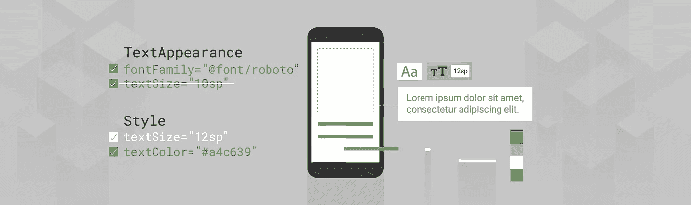
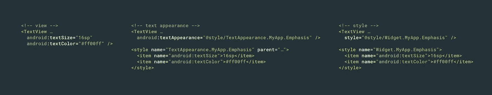
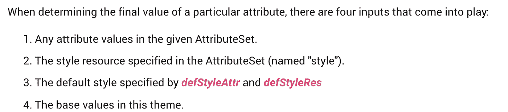
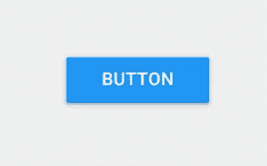

# 你的文本是什么样子的？

> 原文：<https://medium.com/androiddevelopers/whats-your-text-s-appearance-f3a1729192d?source=collection_archive---------1----------------------->



Illustration by [Virginia Poltrack](https://twitter.com/VPoltrack)

## 了解如何在 Android 上以声明方式设计文本。

在 Android 应用中设计文本样式时，`TextView`提供了多种属性和不同的应用方式。您可以直接在布局中设置属性，可以将样式应用于视图，将主题应用于布局，或者设置文本外观。但是应该用哪个呢？如果把它们结合起来会怎么样？



*Which to use and when?*

本文概述了声明式文本样式化的不同方法(例如，当您扩展 XML 布局时)，查看了它们的范围和优先级，以及何时应该使用每种技术。

# TL；dr；

你*真的应该*阅读整篇文章，但这里有一个摘要。

请注意不同样式技术的优先顺序—如果您正在尝试样式化某些文本，但没有看到预期的结果，则您的更改可能会被该层次结构中更高的内容覆盖:


*The hierarchy of text styling techniques*

我建议使用以下工作流程来设计文本样式:

1.  在你的主题中设置任何应用程序的默认样式。
2.  建立一个你的应用将要使用的`TextAppearance`的(小)选择(或者使用/扩展 MaterialComponent 的[样式](https://github.com/material-components/material-components-android/blob/master/lib/java/com/google/android/material/typography/res/values/styles.xml))并直接从你的视图中引用这些
3.  创建`styles`设置任何`TextAppearance`不支持的属性(它们自己指定你的一个`TextAppearances`)。
4.  直接在布局中执行任何独特的样式。

# 展示一些风格

虽然您可以在布局中直接设置`TextView`属性，但是这种方法可能会很繁琐并且容易出错。想象一下，尝试以这种方式更新应用程序中所有文本视图的颜色🙀。与所有视图一样，您可以(也应该！)而是使用样式来促进一致性、重用和易于更新。为此，我建议每当您想要将相同的样式应用于多个视图时，为文本创建样式。这非常简单，主要由 Android view 系统处理。

当你在一个视图上设置一个样式的时候，到底发生了什么？如果您曾经编写过自定义视图，您可能会看到对`[context.obtainStyledAttributes(AttributeSet, int[], int, int)](https://developer.android.com/reference/android/content/Context.html#obtainStyledAttributes(android.util.AttributeSet,%20int[],%20int,%20int))`的调用。*这个*就是 Android 视图系统如何将布局中指定的属性传递给视图。`AttributeSet`参数本质上可以被认为是您在布局中指定的 XML 参数的映射。如果这个`[AttributeSet](https://developer.android.com/reference/android/util/AttributeSet)`指定了一个样式，那么**样式首先被读取**，然后在视图上直接指定的属性被应用到其上。这样，我们得到了第一个优先规则。

> 视图>样式

直接在视图上定义的属性总是“有效”的，并且会覆盖那些在样式中指定的属性。注意，样式和视图属性的组合**被应用；在一个视图上定义一个也出现在样式**中的属性并不会**放弃整个样式。有趣的是，在你看来没有真正的方法来确定的风格来自哪里；这个问题由 view 系统在这个简单的调用中为您解决。你不能两者兼得。**

虽然风格非常有用，但它们也有局限性。其中之一是你只能对一个视图应用一种样式(不像 web 上的 CSS 那样可以应用多个类)。然而，`TextView`自有妙计，它提供了一个`TextAppearance`属性，该属性的功能*类似于*到`style`。如果您通过一个`TextAppearance`提供文本样式，让`style`属性自由用于其他样式，这听起来很有用。让我们仔细看看`TextAppearance`是什么，它是如何工作的。

# 文本外观

`TextAppearance`没什么神奇的(比如一个*秘密*模式去应用安卓不想让你知道的多种风格！！！1!)，`TextView`为你做一些非常有用的跑腿工作。让我们看看`TextView`的一些构造函数，看看发生了什么。

```
TypedArray a = theme.obtainStyledAttributes(attrs, com.android.internal.R.styleable.TextViewAppearance, defStyleAttr, defStyleRes);
TypedArray appearance = null;
int ap = a.getResourceId(com.android.internal.R.styleable.TextViewAppearance_textAppearance, -1);
a.recycle();if (ap != -1) {
  appearance = theme.obtainStyledAttributes(ap, com.android.internal.R.styleable.TextAppearance);
}if (appearance != null) {
  readTextAppearance(context, appearance, attributes, false);
  appearance.recycle();
}// a little later
a = theme.obtainStyledAttributes(attrs, com.android.internal.R.styleable.TextView, defStyleAttr, defStyleRes);
readTextAppearance(context, a, attributes, true);
```

这里发生了什么？实际上，`TextView`首先查看您是否提供了`android:textAppearance`，如果是，它将加载该样式并应用它指定的任何属性。稍后，它加载视图的所有属性(记住，包括样式)并应用它们。因此，我们得出第二个优先规则:

> 视图>样式>文本外观

因为首先检查文本外观，所以直接在视图或样式中定义的任何属性都将覆盖文本外观。

关于`TextAppearance`还有一个需要注意的地方，那就是它支持`TextView`提供的**样式属性子集**。为了理解这一点，让我们回到这一行:

```
obtainStyledAttributes(ap, android.R.styleable.TextAppearance);
```

我们已经看过了`obtainStyledAttributes`的 4 arg 版本，这个 2 arg 版本略有不同。相反，它会查看给定的样式(由第一个`id`参数标识),并将其过滤为出现在第二个`attrs`数组参数中的该样式的属性。同样，可样式化的`android.R.styleable.TextAppearance`定义了`TextAppearance`理解的**范围**。查看这个的定义我们可以看到`[TextAppearance](https://android.googlesource.com/platform/frameworks/base/+/refs/heads/master/core/res/res/values/attrs.xml#4414)` [支持](https://android.googlesource.com/platform/frameworks/base/+/refs/heads/master/core/res/res/values/attrs.xml#4414)许多**但不是`[TextView](https://android.googlesource.com/platform/frameworks/base/+/refs/heads/master/core/res/res/values/attrs.xml#4472)` [支持](https://android.googlesource.com/platform/frameworks/base/+/refs/heads/master/core/res/res/values/attrs.xml#4472)的所有**属性。

```
<attr name="textColor" />
<attr name="textSize" />
<attr name="textStyle" />
<attr name="typeface" />
<attr name="fontFamily" />
<attr name="textColorHighlight" />
<attr name="textColorHint" />
<attr name="textColorLink" />
<attr name="textAllCaps" format="boolean" />
<attr name="shadowColor" format="color" />
<attr name="shadowDx" format="float" />
<attr name="shadowDy" format="float" />
<attr name="shadowRadius" format="float" />
<attr name="elegantTextHeight" format="boolean" />
<attr name="letterSpacing" format="float" />
<attr name="fontFeatureSettings" format="string" />
```

*支持* `*TextAppearance*` *s* 的造型属性

不包括的一些常见的`TextView`属性有`lineHeight[Multiplier|Extra]`、`lines`、`breakStrategy`、&、`hyphenationFrequency`。`TextAppearance`作用于字符级，而非段落级，因此不支持影响整个布局的属性。

所以`TextAppearance`非常有用，它让我们定义一个专注于文本样式属性的样式，并把视图的`style`留给其他用途。然而，它的范围有限，并且位于优先链的底部，所以要注意它的局限性。

# 合理的违约

当我们看了一下 Android view 系统如何解析属性(`context.obtainStyledAttributes`)时，我们实际上把事情简化了一点。这将调用`[**theme**.obtainStyledAttributes](https://developer.android.com/reference/android/content/res/Resources.Theme.html#obtainStyledAttributes(android.util.AttributeSet,%20int[],%20int,%20int))`(使用`Context`的当前`Theme`)。检查[引用](https://developer.android.com/reference/android/content/res/Resources.Theme.html#obtainStyledAttributes(android.util.AttributeSet,%20int[],%20int,%20int))这显示了我们之前看到的优先顺序，并指定了另外两个解析属性的地方:视图的默认样式和主题。



*The styling precedence order from* [*Theme documentation*](https://developer.android.com/reference/android/content/res/Resources.Theme#obtainStyledAttributes(android.util.AttributeSet,%20int[],%20int,%20int))

我们将回到主题，但让我们看看默认的风格。默认风格到底是什么？要回答这个问题，我认为从`TextView`快速绕过去，看看不起眼的`Button`是很说明问题的。当你把一个`<Button>`放到你的布局中时，它看起来像这样。



*A standard Button*

为什么？如果你看一下`Button`的源代码，它相当稀疏:

```
public class Button extends TextView { public Button(Context context) {
    this(context, null);
  } public Button(Context context, AttributeSet attrs) {
    this(context, attrs, com.android.internal.R.attr.buttonStyle);
  } public Button(Context context, AttributeSet attrs, int defStyleAttr) {
    this(context, attrs, defStyleAttr, 0);
  } public Button(Context context, AttributeSet attrs, int defStyleAttr, int defStyleRes) {
    super(context, attrs, defStyleAttr, defStyleRes);
  } @Override public CharSequence getAccessibilityClassName() {
    return Button.class.getName();
  } @Override public PointerIcon onResolvePointerIcon(MotionEvent event, int pointerIndex) {
    if (getPointerIcon() == null && isClickable() && isEnabled()) {
      return PointerIcon.getSystemIcon(getContext(), PointerIcon.TYPE_HAND);
    }
    return super.onResolvePointerIcon(event, pointerIndex);
  }
}
```

就是这样！全班(少评论)。你可以在这里查看。我会等的。那么背景、大写的文字、波纹等等都是从哪里来的呢？你可能已经错过了，但这都在 2 arg 构造函数中；从 XML 展开布局时调用的函数。最后一个参数指定了`com.android.internal.R.attr.buttonStyle`的一个`defaultStyleAttr`。这是默认样式，本质上是一个间接点，允许你指定一个默认使用的样式。它并不直接指向一个样式，而是让**你**指向你的主题中的一个样式，它将在解析属性时检查这个样式。这正是你通常继承的所有主题所做的，为常见的小部件提供默认的外观和感觉。以 Material 主题为例，它定义了`<item name="buttonStyle">@style/Widget.Material.Light.Button</item>`，而**这个**样式提供了所有的属性，如果你不指定任何其他属性的话`theme.obtainStyledAttributes`就会提供这些属性。

回到`TextView`，它还提供了一个默认的风格:`textViewStyle`。如果你想在你的应用程序中的每一个`TextView`应用一些样式，这会非常方便。假设您想设置默认的行距倍数为 1.2。你可以通过`style` s/ `TextAppearance` s 来做到这一点，并尝试通过代码审查(或者甚至是一个奇特的定制 Lint 规则)来强制执行这一点，但是你必须保持警惕，确保加入新的团队成员，并小心重构等。

一个更好的方法可能是为应用程序中的所有`TextView`指定你自己的默认样式，编码期望的行为。您可以通过为`textViewStyle`设置您自己的样式来做到这一点，该样式从 platform 或 material components/app compat default 扩展而来。

```
<style name="Theme.MyApp"
  parent="@style/Theme.MaterialComponents.Light">
  ...
  <item name="android:textViewStyle">@style/Widget.MyApp.TextView</item></style><style name="Widget.MyApp.TextView"
  parent="@android:style/Widget.Material.TextView">
  <item name="android:textAppearance">@style/TextAppearance.MyApp.Body</item>
  <item name="android:lineSpacingMultiplier">@dimen/text_line_spacing</item>
</style>
```

因此，考虑到这一点，我们的优先规则变成:

> 视图>样式>默认样式>文本外观

作为视图系统属性解析的一部分，这将插入到后样式中(因此默认样式中的任何内容都将被应用的样式或视图属性覆盖)，但仍将覆盖文本外观。默认样式非常方便。如果您曾经编写过自己的定制视图，那么它们可能是实现默认行为的一种强大方式，同时允许轻松定制。

如果你正在创建一个小部件的子类，而**没有**指定你自己的默认样式，那么一定要在你的构造函数中使用父类的默认样式(不要只传递 0)。例如，如果你正在扩展`AppCompatTextView`并编写你自己的 2 arg 构造函数，一定要将`android.R.attr.textViewStyle`作为`defaultStyleAttr` ( [就像这个](https://github.com/nickbutcher/plaid/blob/master/core/src/main/java/io/plaidapp/core/ui/widget/BaselineGridTextView.java#L58))传递，否则你会丢失父类的行为。

# 主题

如前所述，有一种(最后，我保证)方法可以提供样式信息。另一个地方`theme.obtainStyledAttributes`看起来是直接在主题本身。也就是说，如果你在你的主题中提供了一个类似`android:textColor`的样式属性，视图系统会把它作为最后的手段。一般来说，混合主题属性和样式属性不是一个好主意，也就是说，你直接应用到视图的东西通常不应该在主题上设置(反之亦然)，但是也有一些罕见的例外。

一个例子可能是，如果你试图改变整个应用程序的字体。你可以使用上面的技术之一，但是手动设置样式/文本外观会重复且容易出错，默认样式只在窗口小部件级别有效；子类可能会覆盖这种行为，例如按钮定义它们自己的`android:buttonStyle`，它不会选择你的自定义`android:textViewStyle`。相反，您可以在主题中指定字体:

```
<style name="Theme.MyApp"
  parent="@style/Theme.MaterialComponents.Light">
  ...
  <item name="android:fontFamily">@font/space_mono</item>
</style>
```

现在，任何支持该属性的视图都会选择它，除非被优先级更高的内容覆盖:

> 视图>样式>默认样式>主题>文本外观

同样，由于这是视图样式系统的一部分，它将覆盖文本外观中提供的任何内容，但会被任何更具体的属性覆盖。

请记住这个优先顺序。在我们的应用程序宽字体示例中，您可能希望`Toolbar` s 选择这种字体，因为它们包含一个标题`TextView`。然而，Toolbar 类本身定义了一个默认样式，包含一个本身指定了`android:fontFamily`的`titleTextAppearance`，并直接在标题`TextView`上设置它，覆盖了主题级别值。主题级别的样式很有用，但是很容易被覆盖，所以一定要检查它是否按预期应用。

# 额外收获:拓展事务

整篇文章都讨论了声明性视图级别的样式，即如何在膨胀时对整个`TextView`进行样式化。膨胀后应用的任何样式(例如 `textView.setTextColor(…)`)将覆盖声明性样式。`TextView`还通过`Span` s 支持更精细的样式。我不会深入这个主题，因为它已经在[弗洛里纳·芒特内斯库](https://medium.com/u/d5885adb1ddf?source=post_page-----f3a1729192d--------------------------------)的这些文章中彻底讨论过了

[](/google-developers/spantastic-text-styling-with-spans-17b0c16b4568) [## 带跨度的文本样式

### 要在 Android 中样式化文本，使用 spans！改变一些字符的颜色，使它们可以点击，缩放…

medium.com](/google-developers/spantastic-text-styling-with-spans-17b0c16b4568) [](/google-developers/underspanding-spans-1b91008b97e4) [## 下跨跨度

### 跨度是强大的概念，通过提供对组件的访问，允许在字符或段落级别对文本进行样式化…

medium.com](/google-developers/underspanding-spans-1b91008b97e4) 

我提到它是为了完整地记住编程风格和跨度将位于我们优先顺序的顶端:

> Span >设置>视图>样式>默认样式>主题>文本外观

# 选择你的风格

虽然有多种样式化文本的方式，但是了解这些技术之间的差异及其局限性有助于您为手头的工作找到合适的工具，或者理解为什么一种技术优先于另一种技术。

快乐的文字造型！