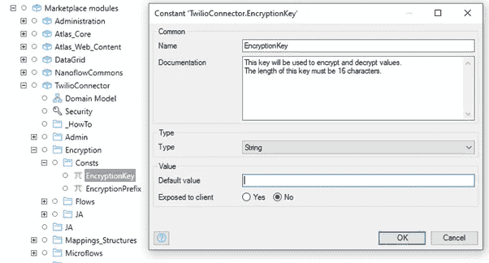
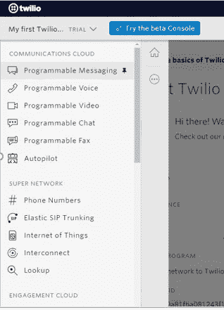
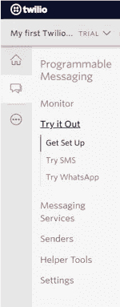
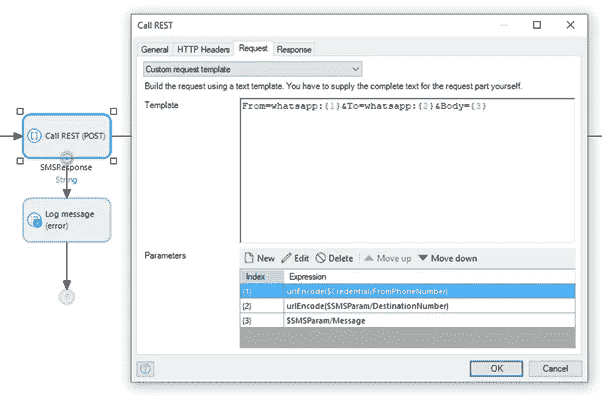

# 使用 Twilio 的 WhatsApp 消息

> 原文：<https://medium.com/mendix/whatsapp-messaging-using-twilio-abd5cf7ede9e?source=collection_archive---------1----------------------->

# 在这篇博客中，我将向你展示如何将你的企业与全球最流行的聊天应用联系起来。对于中型和大型企业，WhatsApp business API 可以增强您与世界各地客户的沟通，因此您可以在 WhatsApp 上以简单、可靠、安全的方式与他们联系。将客户期望的信息发送到他们希望收到信息的地方。

要集成到 WhatsApp 的商业 API，第一步是获取 WhatsApp 商业 API，你可以通过一个 WhatsApp 商业服务提供商(bsp)获取。

有不同的商业 API 可以与 WhatsApp 集成，我将尝试使用 [Twilio 的](https://www.twilio.com/)服务进行集成。我们可以使用 Twilio 的可编程消息传递 API 在 Mendix 平台上快速轻松地构建 WhatsApp 消息传递。集成单个 API 以可靠地发送和接收 WhatsApp 消息。

这种集成的主要依赖是 Mendix 中的 [**TwilioConnector**](https://marketplace.mendix.com/link/component/109621) 模块，该模块已经在 Mendix marketplace 中可用

将模块下载到你的项目后，在 Studio Pro- > **展开加密** - > **常量**中展开 **TwilioConnector** 模块。在 **EncryptionKey** 常量中，添加一个 16 个字符的字符串。确保是 16 个字符。

This is the key that will encrypt your Twilio API key.

接下来去 twilio.com([https://www.twilio.com/](https://www.twilio.com/))注册一个账户，如果你还没有 Twilio 账户的话。

1.确保从 Twilio 仪表板复制**账户 SID** 和**认证令牌**。

2.现在点击 Twilio 导航左侧的三个点->然后选择**电话号码**->-**已验证来电显示**->-**点击加号图标** - >选择**所需国家** &输入**手机号码进行验证**

> **注意**:确保您尝试使用的联系号码应该是当前的 WhatsApp 号码

3.现在点击 Twilio 导航左侧的三个点，然后选择**可编程消息**->-**尝试一下**->-**尝试 WhatsApp** - >保存 Twilio 提供的 WhatsApp 号码，记下 Twilio 沙盒命令。(您应该在 1 下找到这个命令。设置您的测试沙箱)

而这个命令需要每 24 小时发送一次给 Twilio WhatsApp chat。

[https://www.mendix.com/pricing/](https://www.mendix.com/pricing/)

4.从 Twilio 模块打开 **SendSMS** 微流:

打开 Rest 调用活动，并相应地更新请求模板。

SendSMS Microflow

现在，从导航菜单中的 **TwilioConnector** 模块映射**TestSMS**&**Credential _ Overview**页面，并运行应用程序。

5.配置凭据。

6.切换到 **TestSMS** 页面，通过输入凭证引用发送测试消息，输入目的地号码(您在步骤 2 中验证过)

使用目的地号码的加号，对印度人来说意味着:+918887654345，对美国人来说！例如:美国为+15551212，荷兰为+314444444 等。输入一些信息。

7.单击发送按钮。如果在第 5 步和第 6 步中配置的数据是有效的，那么你应该会收到发送到你已验证的 WhatsApp 号码的消息。

[在 WhatsApp 上使用 Twilio 电话号码](https://www.twilio.com/docs/whatsapp/api#using-twilio-phone-numbers-with-whatsapp):

要在生产应用程序中使用 WhatsApp 消息，您必须在 Twilio 号码上启用 WhatsApp。WhatsApp 目前正在有限可用性计划中开放这一访问。这意味着所有希望创建个人资料的客户都需要 WhatsApp 的批准。

我希望你觉得这个博客有用&有趣！

## 阅读更多

Twillio 的文档:

 [## WhatsApp Business API with Twilio 概述

### WhatsApp 是世界上许多地方最受欢迎的 OTT 应用。使用 WhatsApp Business API with Twilio，您可以…

www.twilio.com](https://www.twilio.com/docs/whatsapp/api) 

Twilio WhatsApp API:

 [## WhatsApp curl 快速入门 Twilio API

### 只需几行代码，您的应用程序就可以使用 Twilio API 在 WhatsApp 上发送和接收消息…

www.twilio.com](https://www.twilio.com/docs/whatsapp/quickstart/curl) 

Twilio 中的沙盒激活步骤:

 [## 开始使用 WhatsApp 的 Twilio 沙盒

### 想通过 Twilio 逐步了解 WhatsApp Business API 吗？查看我们的…

www.twilio.com](https://www.twilio.com/docs/whatsapp/sandbox) 

*来自发布者-*

*如果你喜欢这篇文章，你可以在我们的* [*媒体页面*](https://medium.com/mendix) *或者我们自己的* [*社区博客网站*](https://developers.mendix.com/community-blog/) *找到更多喜欢的。*

*希望入门的创客，可以注册一个* [*免费账号*](https://signup.mendix.com/link/signup/?source=direct) *，通过我们的* [*学苑*](https://academy.mendix.com/link/home) *获得即时学习。*

*有兴趣更多地参与我们的社区吗？您可以加入我们的*[*Slack community channel*](https://join.slack.com/t/mendixcommunity/shared_invite/zt-hwhwkcxu-~59ywyjqHlUHXmrw5heqpQ)*或对于那些想更多参与的人，加入我们的* [*会合*](https://developers.mendix.com/meetups/#meetupsNearYou) *吧。*