# 当一幅画比文字更有价值

> 原文：<https://medium.com/airbnb-engineering/when-a-picture-is-worth-more-than-words-17718860dcc2?source=collection_archive---------1----------------------->

Airbnb 如何使用视觉属性来增强客人和主人的体验

*由* [*元培【曹】*](https://www.linkedin.com/in/yuanpei-cao-792b103b/)*[*比尔*](https://www.linkedin.com/in/bulam/)*[*【王昊*](https://www.linkedin.com/in/hao-wang-2661553/)*[*黄国忠*](https://www.linkedin.com/in/hwangtt/)***

****

# ****简介****

**在 Airbnb 上，我们的主机共享全世界唯一的房源。Airbnb 上有上亿张附带的房源照片。列表照片包含关于风格和设计美学的重要信息，这些信息很难用语言或固定的设施列表来表达。因此，Airbnb 的多个团队正在利用计算机视觉从我们丰富的视觉数据中提取和整合无形资产，以帮助客人轻松找到符合他们偏好的房源。**

**在之前名为[*wide text:A Multimodal Deep Learning Framework*](/airbnb-engineering/widetext-a-multimodal-deep-learning-framework-31ce2565880c)、[*对 Airbnb*](/airbnb-engineering/categorizing-listing-photos-at-airbnb-f9483f3ab7e3) 和 [*舒适性检测和超越——Airbnb*](/airbnb-engineering/amenity-detection-and-beyond-new-frontiers-of-computer-vision-at-airbnb-144a4441b72e)的计算机视觉新前沿的博文中，我们探索了如何利用计算机视觉进行房间分类和舒适性检测，以将列表照片映射到离散概念的分类中。这篇文章超越了离散的类别，探讨了 Airbnb 如何利用图像美学和嵌入来优化各种产品表面，包括广告内容、列表展示和列表推荐。**

# **图像美学**

**在客人的 Airbnb 搜索之旅中，吸引人的照片与价格、评论和描述一样重要。为了量化照片的“吸引力”，我们开发了一个基于深度学习的图像美学评估管道。底层模型是一个深度卷积神经网络( [CNN](https://en.wikipedia.org/wiki/Convolutional_neural_network) )，它根据人类标记的图像美学评级分布进行训练。数百名摄影师根据他们个人的审美标准对每张照片进行了从 1 到 5 的评分(评分越高，审美越好)。与将照片分为低、中、高质量类别的传统分类任务不同，该模型基于推土机的距离( [EMD](https://en.wikipedia.org/wiki/Earth_mover%27s_distance) )作为损失函数来预测摄影师的评级分布。**

**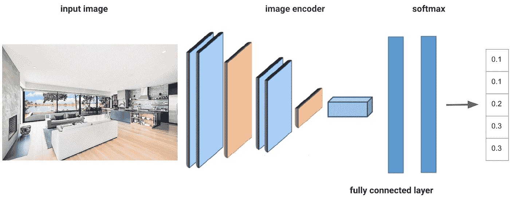**

***Figure 1\. The model that predicts image aesthetics distribution is CNN-based and trained with the EMD loss function. Suppose the ground truth label of a photo is: 10% of users give ratings 1 and 2, respectively, 20% give rating 3, and 30% give ratings 4 and 5, respectively. The corresponding prediction is [0.1, 0.1, 0.2, 0.3, 0.3]***

**预测的平均评分与图像分辨率和房源预订概率以及高端 Airbnb 房源照片分布高度相关。评级阈值是根据使用案例设置的，例如社交媒体上的广告照片推荐和上市入职流程中的照片订购建议。**

**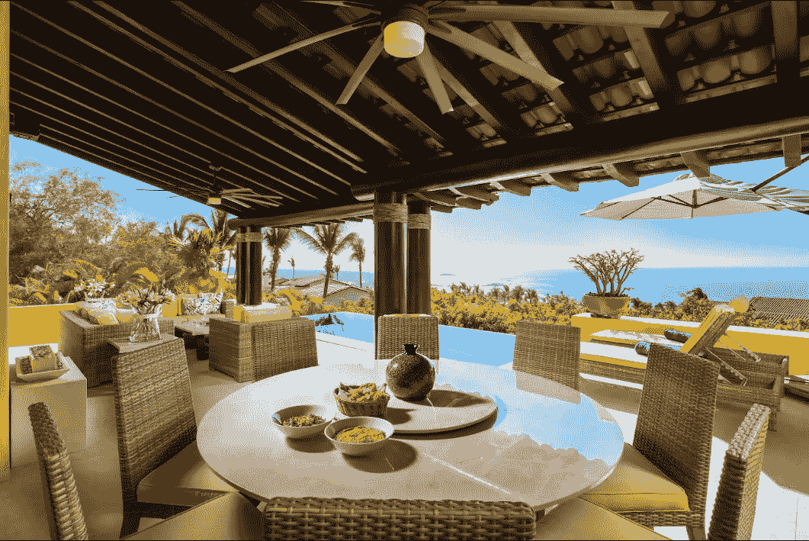****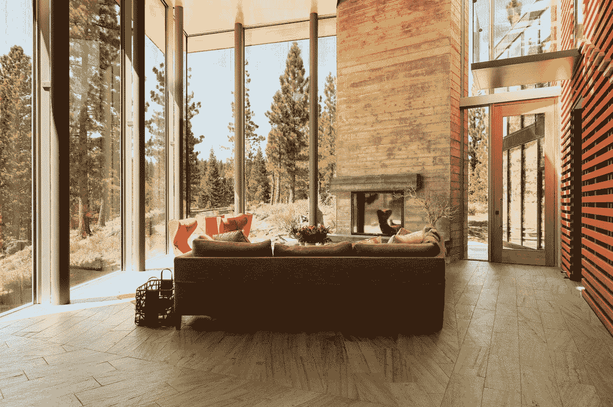**

***Figure 2\. Examples of Airbnb listing photos with aesthetics scores higher than the 90% percentile***

# **基于图像美学的广告质量改进**

**Airbnb 使用社交媒体上的广告来吸引新客户并激励我们的社区。社交媒体平台根据 Airbnb 提供的数百万张房源照片来选择投放哪些广告。**

**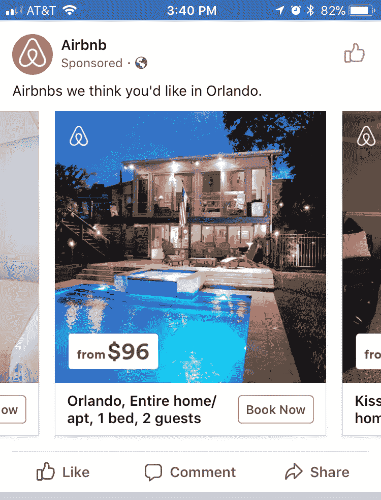**

***Figure 3\. Airbnb Ads displayed on Facebook***

**由于视觉上有吸引力的 Airbnb 照片可以有效地将用户吸引到平台上，并大大提高广告的点击率(CTR)，我们利用图像美学评分和房间分类来选择客厅、卧室、厨房和外景的最有吸引力的 Airbnb 照片。“高质量”列表照片的标准是根据审美得分的前 50%设定的，并根据对 1K 张随机选择的列表封面照片的内部人工审美评估进行调整。我们对这个用例进行了 A/B 测试，发现审美得分较高的广告候选人产生了高得多的点击率和预订率。**

**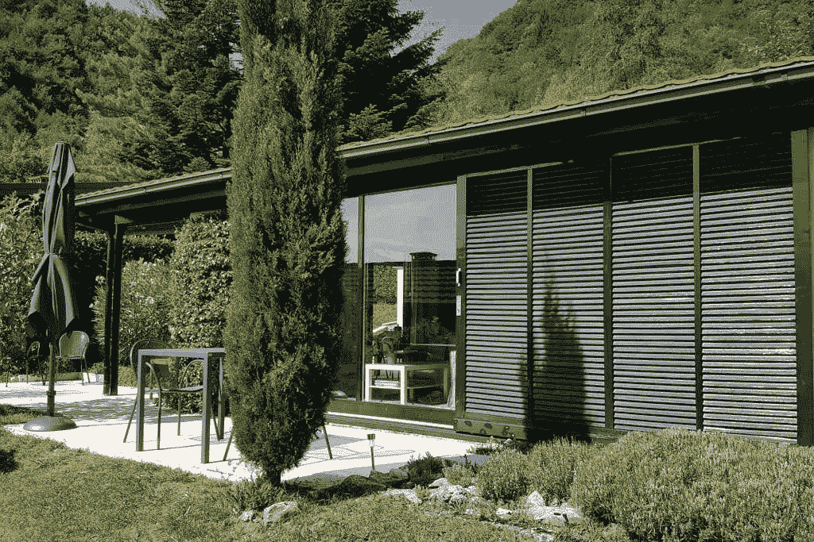****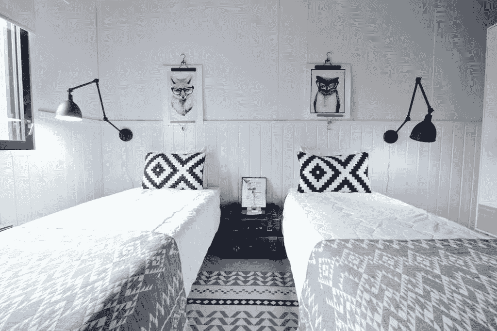****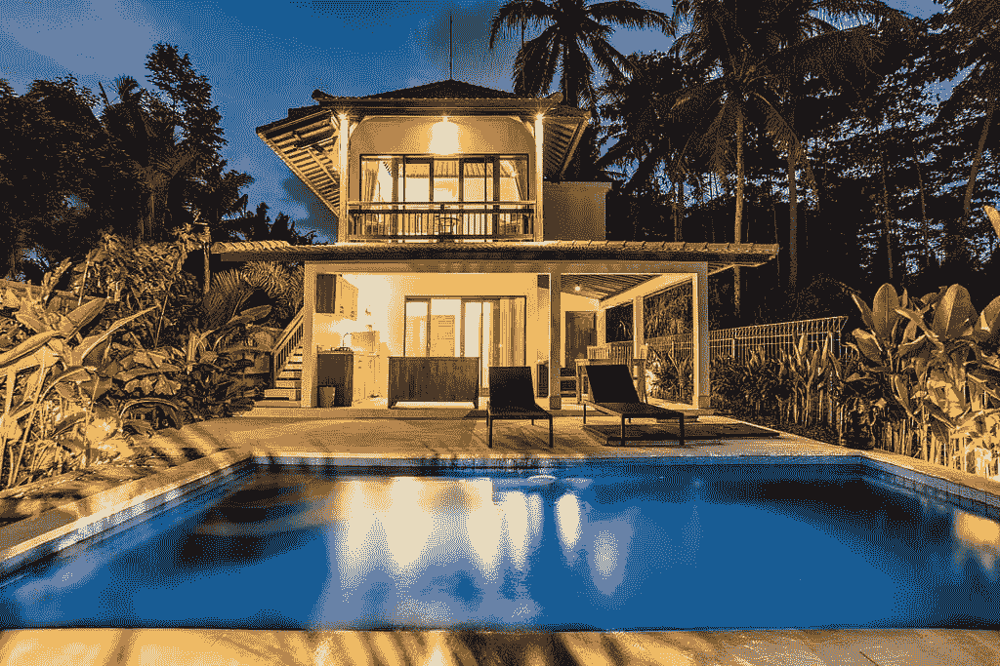**

***Figure 4\. Pre-selected Airbnb Creative Ads through image aesthetics and room type filters***

# **基于家居设计和房间类型的自动照片排名**

**在 Airbnb 上发布新房源时，主持人会上传大量照片。优化安排这些照片来突出一个家可能是耗时和具有挑战性的。主持人也可能不确定他们的图像的理想安排，因为这项工作需要在照片吸引力、照片多样性和与客人的内容相关性之间进行权衡。更具体地说，前五张照片对成功上市至关重要，因为它们是最常被浏览的照片，也是形成顾客最初印象的关键。因此，我们开发了一种自动照片排序算法，该算法利用两种视觉信号来选择和排序住宅的前五张照片:住宅设计评估和房间分类。**

**住宅设计评估从室内设计和建筑的角度评估住宅设计的好坏。基于 CNN 的家居设计评估模型是根据 Airbnb *Plus* 和 *Luxe* 资格数据训练的，这些数据评估每张照片的家居设计的美学吸引力。Airbnb *Plus* 和 *Luxe* 房源已经通过了严格的家居设计评估标准，因此来自其资格认证过程的数据非常适合用作家居设计评估模型的训练标签。然后通过房间分类模型将照片分类为不同的房间类型，如客厅、卧室、浴室等。最后，一种算法在照片房屋设计吸引力、照片相关性和照片多样性之间进行权衡，以最大化房屋的预订概率。下面是如何建议新照片顺序的示例。照片自动排名功能于 2021 年在 Host 的上市 onboarding 产品中推出，极大地提升了新房源的创建和预订成功率。**

****原始订购****

**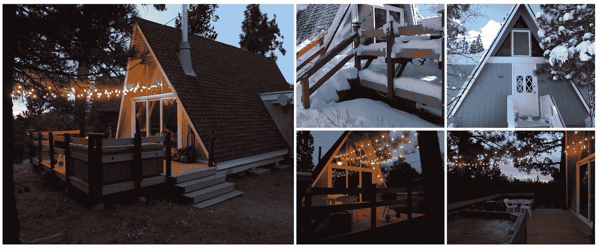**

****自动建议订购****

**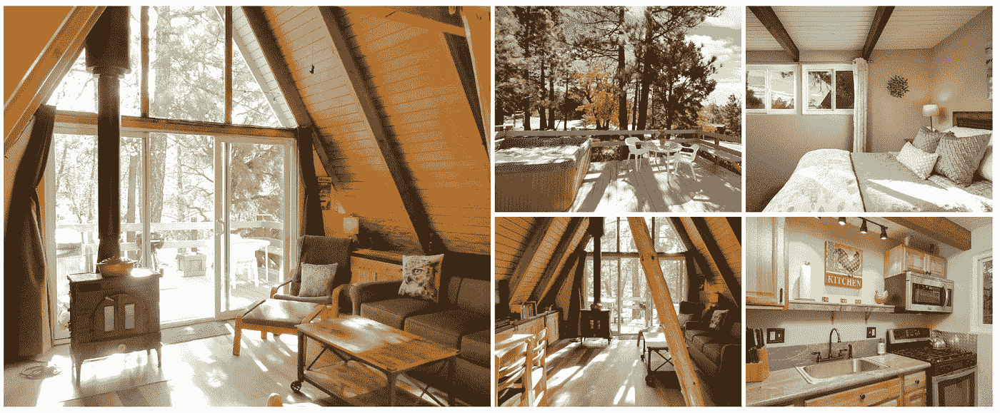**

***Figure 5\. The example of original photo order (top) uploaded by Airbnb Host and auto-suggested order (bottom) calculated by the proposed algorithm***

# **图像相似度**

**除了美学，照片还捕捉到了大致的外观和内容。为了有效地表示这些信息，我们使用计算机视觉模型将照片编码和压缩成图像嵌入。图像嵌入是表示视觉特征的图像的紧凑矢量表示。这些嵌入可以用表示该特征空间中相似性的距离度量来相互比较。**

**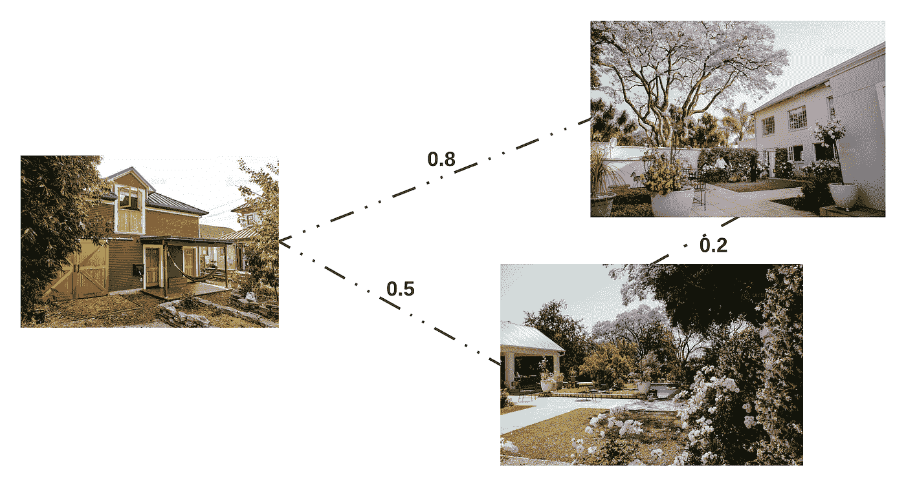**

***Figure 6\. Image embeddings can be compared by distance metrics like cosine similarity to represent their similarity in the encoded latent space***

**编码器学习的特征直接受到训练图像数据分布和训练目标的影响。我们标记的房间类型和舒适性分类数据允许我们在此数据分布上训练模型，以产生语义上有意义的嵌入，用于列出照片相似性用例。然而，随着 Airbnb 上图像的数量和多样性的增长，仅仅依靠手动标记的数据和监督训练技术变得越来越不可行。因此，我们目前正在探索自我监督的对比训练，以改善我们的图像嵌入模型。这种形式的训练不需要图像标签；相反，它用综合生成的正面和负面对来启动对比学习。我们的图像嵌入模型可以在没有人工监督的情况下，从列出的照片中学习关键的视觉特征。**

**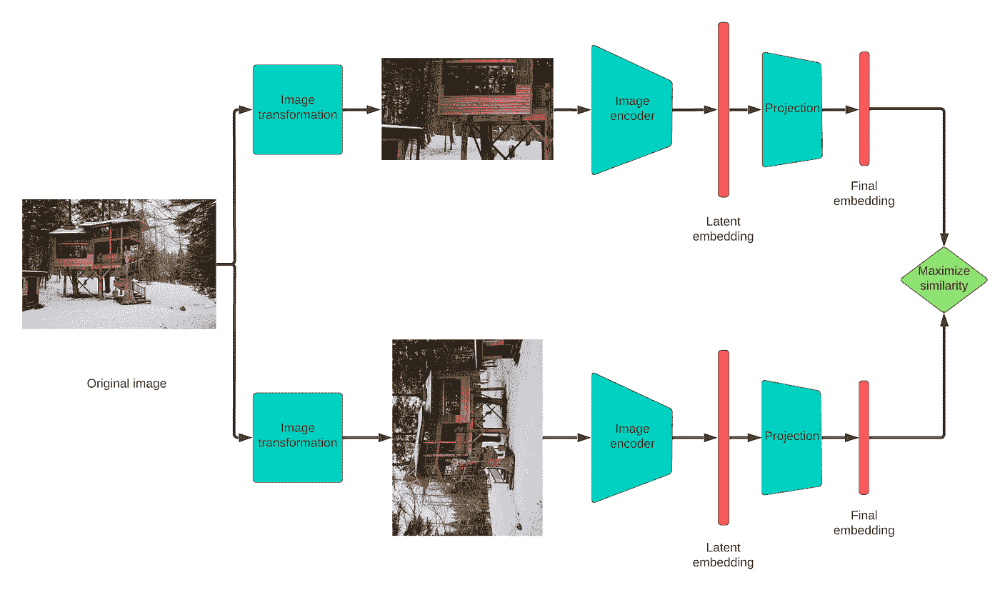**

***Figure 7\. Introducing random image transformations to synthetically create positive and negative pairs helps refine our image encoders without additional labeling.***

# **可扩展嵌入搜索**

**计算详尽的成对嵌入相似性通常是不切实际的，即使是在数百万个项目的集中子集内。为了支持实时搜索用例，例如(近)重复照片检测和视觉相似性搜索，我们改为执行近似最近邻( [ANN](https://en.wikipedia.org/wiki/Nearest_neighbor_search#Approximate_nearest_neighbor) )搜索。这一功能在很大程度上是通过一种称为分层可导航小世界( [HNSW](https://arxiv.org/abs/1603.09320) )的高效嵌入索引预处理和构建算法来实现的。HNSW 构建了一个分层的邻近图结构，在查询时极大地限制了搜索空间。我们使用 AWS OpenSearch 对此进行水平扩展，其中每个节点都包含自己的 HNSW 嵌入图和 Lucene 支持的索引，这些索引会定期更新，并可以并行查询。为了添加实时嵌入 ANN 搜索，我们实现了以下由现有 Airbnb 内部平台支持的索引水合和索引搜索设计模式。**

**为了定期水合嵌入指数，由 Airbnb 的端到端机器学习平台 [Bighead](https://ieeexplore.ieee.org/document/8964147) 计算的所有相关嵌入都被聚集并持久存储在 Hive 表中。产生嵌入的编码器模型被部署用于在线推理和离线批处理。然后，增量嵌入更新通过我们的数据管道编排服务 Airflow 同步到 AWS OpenSearch 上的嵌入索引。**

**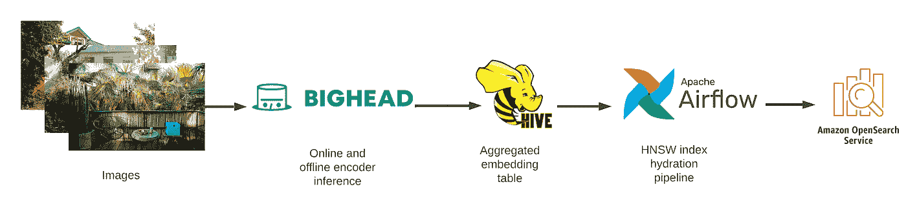**

***Figure 8\. Index hydration data pathway***

**为了执行图像搜索，客户端服务将首先验证图像的嵌入是否存在于 OpenSearch 索引缓存中，以避免不必要的重新计算嵌入。如果嵌入已经存在，OpenSearch 集群可以向客户端返回近似的最近邻结果，而无需进一步处理。如果存在缓存未命中，则调用 Bighead 来计算图像嵌入，然后请求查询 OpenSearch 集群以获得近似的最近邻居。**

**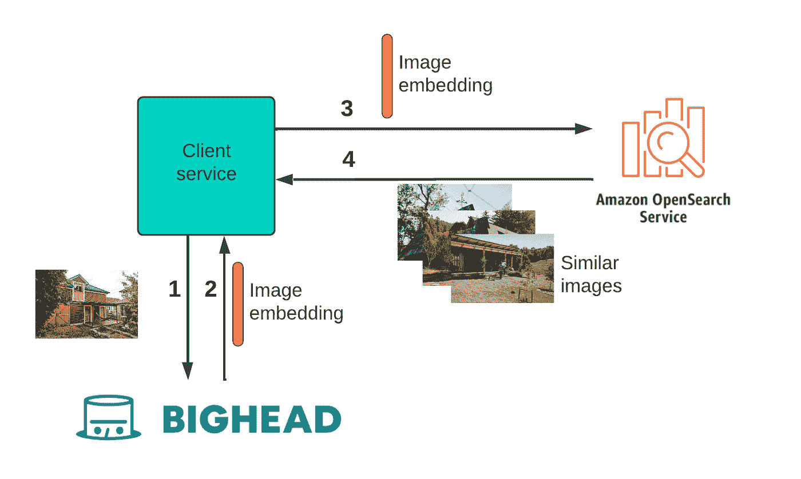**

***Figure 9\. Image similarity search for a previously unseen image***

**根据这个嵌入式搜索框架，我们正在当前的生产流程和即将发布的版本中扩展实时视觉搜索。**

# **扩展 Airbnb 类别**

**Airbnb 分类帮助我们的客人发现独特的度假方式。一些例子是“惊人的观点”，“历史家园”，和“创意空间”。这些类别并不总是共享共同的设施或离散的属性，因为它们往往代表一个鼓舞人心的概念。我们正在探索自动分类扩展，通过识别基于照片的相似列表，这确实捕捉到了设计美学。**

**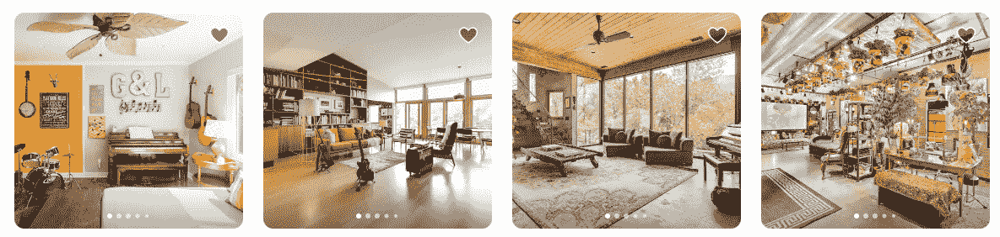**

***Figure 10\. Listing photos from the “Creative spaces” category***

# **重新预订帮助中的类似列表建议**

**在 2022 年夏季版本中，Airbnb 引入了重新预订援助，当主人临时取消时，社区支持大使可以为客人提供平稳的体验。为了在整个重新预订过程中推荐可比较的列表，双塔预订和列表嵌入模型对候选列表进行排名，每天更新。作为未来的工作，我们可以考虑用图像嵌入来增加列表表示，并实现实时搜索。**

**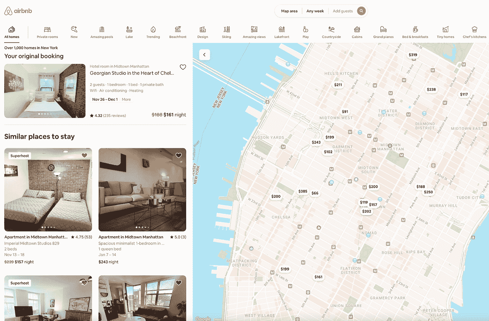**

***Figure 11\. The example of a landing page that recommends similar listings to guests and Community Support ambassadors in the Rebooking assistance.***

# **结论**

**照片包含美学和风格相关的信号，难以用语言表达或映射到离散的属性。Airbnb 越来越多地利用这些视觉属性来帮助我们的主人突出他们的房源的独特性，并帮助我们的客人发现符合他们偏好的房源。**

**有兴趣在 Airbnb 工作吗？查看我们的[空缺职位](https://careers.airbnb.com/)。**

# **承认**

**感谢、Regina Wu、、Do-kyum Kim、、Xiaohan Zeng、Mia Zhao、、Elaine Liu、Floria Wan、David Staub、Tong Jiang、、Guillaume Guy、罗维、苏汉臣、吴梵、Pei Xiong、Aaron Yin、Jie Tang、Lifan Yang、Lu Zhang、Mihajlo Grbovic、Alejandro Virrueta、Brennan Polley、Jing Xia、Fanchen Kong、William Zhao、Caroline Leung、Meng Yu、Shijing Yao、Reid Andersen、张宪军、郑玉琪、李大鹏和 ju Peng 也感谢 Jenny Chen、Surashree Kulkarni 和 Lauren Mackevich 的编辑。**

**感谢 Ari Balogh、Tina Su、Andy Yasutake、Joy Zhang、Kelvin Xiong、Raj Rajagopal 和钟仁对 Airbnb 构建计算机视觉产品的领导支持。**