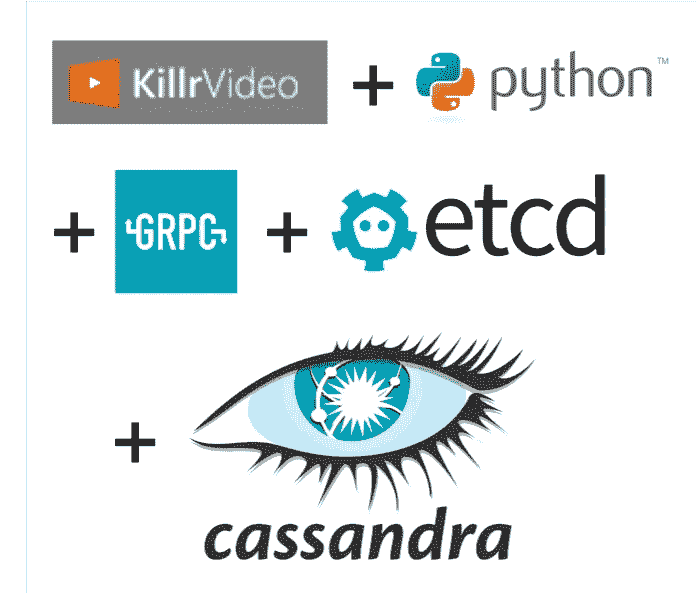

# 当数据访问是微服务中最简单的部分时

> 原文：<https://medium.com/quick-code/when-data-access-is-the-easiest-part-of-a-microservice-c7a90dee701a?source=collection_archive---------4----------------------->

## 角。KillrVideo Python 项目系列之五

在本系列的前几篇文章中，我一直在分享我构建 [KillrVideo](http://killrvideo.github.io) 微服务层的 Python 实现的经验。在之前的帖子中，我分享了[为什么我开始这个项目](/datadriveninvestor/killrvideo-python-pt-1-the-backstory-5c38191fb330)，关于[构建 GRPC 服务存根](/@jscarp/python-app-dev-with-protobuf-and-grpc-e5bff779783d)，在`etcd`中公布端点，以及[设置集成测试](/@jscarp/who-needs-unit-tests-im-building-microservices-4c8fe40d7095)来测试服务 API。

所以在实现任何业务逻辑或数据访问代码之前，用了四篇文章来描述所有的设置！所有这些工作让我想知道，相比之下，其他工作是否会更容易。

这篇文章是关于使用 Cassandra 查询语言(CQL)编写业务逻辑和读写数据到 DataStax Enterprise (DSE)的。



# 商业逻辑？什么商业逻辑？

事实证明，KillrVideo 服务层中确实没有多少业务逻辑可言。该系统的早期版本允许通过上传服务上传真实的视频文件，当然有更有趣的业务逻辑。

然而，在目前的情况下，大多数业务逻辑都是验证代码。有几个位置使用提供的输入完成少量工作，例如:

*   视频目录服务中的`AddYouTubeVideo`操作从添加到系统的 YouTube 视频的 URL 推断出视频预览图像的位置。
*   将密码转换为 md5 哈希值，并比较哈希密码字符串以支持用户登录，就像在用户管理服务中一样

# 数据访问代码—不费吹灰之力！(大部分)

正如我在上一篇文章中提到的，我为 Python 服务遵循的过程是按照[killrvideo-integration-tests](https://github.com/KillrVideo/killrvideo-integration-tests)暗示的顺序实现服务操作，从用户管理服务开始。我将带您了解用户管理服务是如何实现的，因为其他服务也遵循相同的基本模式。

## 安装驱动程序

第一步是安装 DataStax Enterprise Python 驱动程序:

```
pip install dse-driver
```

如果我们为 Cassandra(不是 DSE)使用 DataStax Python 驱动程序，我们将安装`cassandra-driver`。然而，出于 KillrVideo 的目的，我们知道我们打算在几个服务中使用 DSE 功能，特别是搜索服务的 DSE Search 和建议视频服务的 DSE Graph。KillrVideo 文档网站上有一个[特性矩阵，详细描述了 DSE 特性在实现语言中的用法。](https://killrvideo.github.io/docs/guides/feature-matrix/)

## 初始化群集和会话对象

为了向 Cassandra (DSE)读写数据，我们需要初始化驱动程序，建立到集群的连接。我们通过驱动程序提供的`Cluster`和`Session`类来实现这一点，你可以在文档的[入门页](https://datastax.github.io/python-driver/getting_started.html)中读到。

由于我已经选择在单个应用程序中实现所有的 KillrVideo 服务，所以我将连接逻辑放在应用程序的`[__init__.py](https://github.com/KillrVideo/killrvideo-python/blob/master/killrvideo/__init__.py)`文件中:

```
**from** dse.cluster **import** Cluster, ExecutionProfile, EXEC_PROFILE_DEFAULT
**from** dse **import** ConsistencyLevel
**import** dse.cqlengine.connection**def** serve():

    file = open(**'config.json'**, **'r'**)
    config = json.load(file) contact_points = config[**'CONTACT_POINTS'**]
    default_consistency_level = config[**'DEFAULT_CONSISTENCY_LEVEL'**]

    *# Wait for Cassandra (DSE) to be up, aka registered in etcd*

    *# Initialize Cassandra Driver and Mapper* profile = ExecutionProfile(consistency_level = 
        ConsistencyLevel.name_to_value[default_consistency_level])
    cluster = Cluster(contact_points=contact_points, 
                execution_profiles={EXEC_PROFILE_DEFAULT: profile})
    session = cluster.connect(**"killrvideo"**)
    dse.cqlengine.connection.set_session(session)
```

(注意:为了简洁起见，省略了与初始化驱动程序没有直接关联的代码。)

正如您可能已经注意到的，我已经选择将与驱动程序相关的配置值放在一个 JSON 配置文件中(基于一篇关于用 Python 进行配置的各种方法的[有用文章](https://hackernoon.com/4-ways-to-manage-the-configuration-in-python-4623049e841b))。JSON 配置文件非常简单，如下所示:

```
{
  **"CONTACT_POINTS"**: [**"10.0.75.1"**],
  **"DEFAULT_CONSISTENCY_LEVEL"**: **"LOCAL_QUORUM"** }
```

稍微解一下这个连接代码，第一条语句创建了一个`[ExecutionProfile](https://datastax.github.io/python-driver/execution_profiles.html)`,我们可以在其中配置设置，比如重试和负载平衡策略。这里我使用一个`ExecutionProfile`来设置 KillrVideo 应用程序中查询的默认一致性级别:

```
profile = ExecutionProfile(consistency_level = 
                ConsistencyLevel[default_consistency_level])
```

下一步是使用`ExecutionProfile`创建一个`[Cluster](https://datastax.github.io/python-driver/api/cassandra/cluster.html)`对象:

```
cluster = Cluster(contact_points=contact_points, 
                execution_profiles={EXEC_PROFILE_DEFAULT: profile})
```

然后我们创建一个绑定到我们的`killrvideo`键空间的`Session`对象。这是因为 KillrVideo 服务使用的所有表都在同一个键空间中:

```
session = cluster.connect(**"killrvideo"**)
```

最后，我们初始化`cqlengine`，它是作为 DataStax Python 驱动的一部分提供的映射器。正如我们将看到的，`cqlengine`并不适合我们应用程序中需要的每一种数据访问模式，但在许多情况下已经足够了，我尽可能使用它，因为它提供了简单性。

## 创建映射器类

为了使用映射器，我们需要一些类来定义映射到 Cassandra 表的类型。为了与[围绕我们的应用查询](https://www.oreilly.com/ideas/cassandra-data-modeling)建模 Cassandra 表的原则保持一致，有两个表用于存储数据，它们被设计为支持我们将在下面讨论的查询。

为我们的 Cassandra 表建模的实体类在文件`[user_management_service.py](https://github.com/KillrVideo/killrvideo-python/blob/master/killrvideo/user_management/user_management_service.py)`中定义:

```
from dse.cqlengine import columns
from dse.cqlengine.models import Model**class** UserModel(Model):
    *"""Model class that maps to the user table"""* __table_name__ = **'users'** user_id = columns.UUID(db_field=**'userid'**, primary_key=True)
    first_name = columns.Text(db_field=**'firstname'**)
    last_name = columns.Text(db_field=**'lastname'**)
    email = columns.Text()
    created_date = columns.Date()

**class** UserCredentialsModel(Model):
    *"""Model class that maps to the user_credentials table"""* __table_name__ = **'user_credentials'** email = columns.Text(primary_key=True)
    user_id = columns.UUID(db_field=**'userid'**)
    password = columns.Text()
```

每个实体类都扩展了`dse.cqlengine.models.Model`类。您会注意到使用了`__table_name__`属性来指定我们正在使用的 Cassandra 表(我们已经在上面指定了映射器正在使用的键空间)。我们通过引用来自`dse.cqlengine.columns`模块的适当类型，为每个表列定义一个类属性。注意使用`primary_key`标识来标识 Cassandra 主键列。这些表不涉及任何聚类键，但是`clustering_key`名称也可以用来描述这些键。最后要注意的一点是使用了`db_field`名称，它允许我们拥有一个符合 Python 命名约定但与 CQL 列名略有不同的属性名。

## 使用映射器插入数据

按照集成测试顺序，在用户管理服务中执行的第一个操作是`create_user`。注意，我们需要插入到两个不同的表中来支持我们的访问模式:

```
*# insert into user_credentials table first so we can ensure uniqueness with LWT* **try**:
    UserCredentialsModel.if_not_exists().create(user_id=user_id, email=email, password=hashed_password)
**except** LWTException:
    *# Exact string in this message is expected by integration test* **raise** ValueError(**'Exception creating user because it already exists for '** + email)

*# insert into users table* UserModel.create(user_id=user_id, first_name=first_name, last_name=last_name, email=email)
```

处理这种插入的一种方法是使用 Cassandra 的批处理特性。然而，这里有一个额外的关注点，即确保我们执行唯一性，不允许多个用户帐户使用同一个电子邮件。我们在这里使用的逻辑是首先尝试使用轻量级事务在`user_credentials`表中为用户创建一条记录——这就是`if_not_exists()`操作正在做的事情。如果帐户创建是针对一个新的电子邮件地址，插入将会成功，我们可以继续插入到`users`表中。否则，将引发一个错误。

每个插入的实际符号非常简单，使用从`Model`类继承的`create()`操作，并通过名称为每个列指定一个值。

## 使用映射器检索数据

接下来是实现检索用户帐户数据的方法的时候了。我们的应用程序需要的第一个查询用于支持`verify_credentials`操作中的登录:

```
*# retrieve the credentials for provided email from user_credentials table* user_credentials = UserCredentialsModel.get(email=email)
```

这是一个非常简单的查询——我们根据表的分区键——电子邮件地址，从`user_credentials`表中检索一条记录。然后，我们可以散列所提供的密码，并将其与从数据库中检索到的散列密码进行比较，以实施安全登录。

第二个查询用于获得关于一个或多个用户账户的信息。因为服务的 API 允许通过用户 ID 查找多个帐户，所以我们使用了`UserModel`类的`[filter()](# see: https://datastax.github.io/python-driver/cqlengine/queryset.html#retrieving-objects-with-filters)`操作，而不是`get()`:

```
*# filter().all() returns a ModelQuerySet, we iterate over the query set to get the Model instances* user_results = UserModel.filter(user_id__in=user_ids).all()
users = list()
**for** user **in** user_results:
    users.append(user)
**return** users
```

注意追加到列名的符号`__in`的使用表明我们希望使用 CQL `IN`子句。映射器会将其转换成如下所示的查询:

```
SELECT * FROM killrvideo.users WHERE user_id IN <id1>, <id2>...
```

然后，我们可以迭代结果，构建一个用户帐户信息列表返回给客户端。

注意，我们也可以遍历提供的用户 id 并执行单个的`get()`操作，但是通过使用`in`操作，我们可以一次查询多个分区键。

因为 KillrVideo 应用程序没有配置为一次请求大量用户帐户，所以我们的方法应该执行得很好，比迭代和执行单个查询更快。然而，你肯定应该在[这篇经典的博客文章](https://lostechies.com/ryansvihla/2014/09/22/cassandra-query-patterns-not-using-the-in-query-for-multiple-partitions/)中读到更多关于使用`in` 进行涉及多个分区的查询的局限性，以及一个涉及异步编程的变通方法。

# 下一次:更复杂的数据访问案例

所以，那很简单，对吧？如果你怀疑，你是对的，有些情况下“简单的方法”不起作用。

在下一篇文章中，我将展示一些更复杂的例子，包括`cqlengine`不适合的情况，以及我发现的一些关于在搜索服务中使用 DSE Search 实现查询的有趣细节。

**本系列下一篇 pos:**[**Cassandra with Python:简单到复杂**](/@jscarp/cassandra-with-python-simple-to-complex-44298391867d?source=your_stories_page---------------------------)