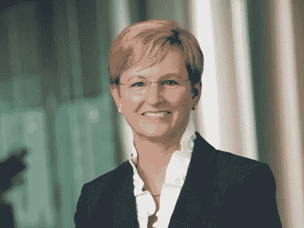

# 当员工看到你对他们的为人投入时，他们会对公司的成功投入更多

> 原文：<https://medium.com/capital-one-tech/when-employees-see-that-you-are-invested-in-who-they-are-as-people-they-are-more-invested-in-the-57e1213c75b0?source=collection_archive---------8----------------------->

*由* [到*吉莉娅*到](https://www.thriveglobal.com/authors/11572-jilea-hemmings)

我很荣幸地采访了 Capital One 技术多元化部门共享技术和执行主管高级副总裁 Julie Elberfeld。

## 非常感谢您与我们合作！你的“背景故事”是什么？

我出生在中西部的一个小镇，父母都很努力工作。作为一个年轻的女孩，我着迷于太空计划，收集我能从报纸和杂志上找到的每一篇文章。有一次，我甚至说服父母让我呆在家里不去上学，参加一次阿波罗任务的发射——这在我们家是闻所未闻的。

在我的整个教育过程中，我一直是一名数学和科学的学生，喜欢学习任何我能学的东西。我的父母满足了我的渴望，从来没有给我的未来设定任何界限。我在迈阿密大学主修数学。我带着学术界的计划开始了获得数学博士学位的道路，但发现自己不适合教书。

接下来发生的事情改变了我的生活:我被邀请去辛辛那提的一家银行学习成为一名“计算机程序员”。在研究了大量打印出来的代码后，我很快就成为了一名自学成才的 COBOL 软件工程师。我的职业生涯充满了令人兴奋的新机遇，包括 1995 年在美国实施首批家庭银行应用程序之一。我对技术领域的高要求工作如此着迷，以至于我的三个孩子周末经常出现在办公室里。我的同事会嘲笑在会议室桌子下发现的白板涂鸦或零散的拼图。我甚至让我的孩子测试银行软件，因为它需要足够简单，让我们所有的客户都能使用——在家银行是一个全新的想法。我的职业生涯经历了各种技术领导角色，直到我成为同一家银行的商业银行首席信息官。2009 年，Capital One 招聘我成为他们的第一个商业银行 CIO，这是我职业生涯中最棒的一步棋。

## 你能分享一下自从你开始在第一资本工作以来，发生在你身上最好笑或最有趣的故事吗？

当我八年前到达 Capital One 时，我的日程表上已经排满了“见面会”，这是我入职的一部分。当一个接一个的人来到我的办公室，展示他们可以如何帮助我时，我被他们的支持所淹没。我不停地问自己，“我想知道他们想从我这里得到什么？”我的条件是，这种慷慨肯定有另一个动机。我花了将近一年的时间才意识到，这只是 Capital One 的一种令人敬畏的合作文化——人们真诚地希望帮助彼此成功。我不得不笑自己投入了多少精力来等待谚语所说的“另一只鞋掉下来”。

## **你认为是什么让 Capital One 脱颖而出？可以分享一个故事吗？**

从公共云到机器学习，Capital One 不仅在一个数字颠覆已经成熟的领域做了令人惊叹的技术工作，而且我们有一种以我们的价值观为中心的令人惊叹的文化。我们还完全致力于在转变多样性和为整个技术行业创造归属感文化方面发挥作用。

四年前，我们在内部启动了我们的女性技术人员计划，以提升我们对女性技术人员的关注。事情始于我们技术开发项目中的两名软件工程师 Kaylyn 和 Katie 来到我的办公室，分享他们从媒体和大学朋友那里得到的观察结果，即科技行业中女性的比例正在下降，一些文化甚至对女性抱有敌意。这些女士想阻止这种情况影响第一资本的包容性文化。当我考虑到科技行业缺乏平衡视角的长期影响，以及科技如何从根本上改变世界时，我知道必须采取一些措施。我知道在我职业生涯开始时欢迎我的行业是许多女性都会喜欢的，如果她们能够了解各种可能性并打破陈规的话。那次会议变成了一个工作小组，发展成为地方分会，然后发展成一场运动。该倡议将 Capital One 的女性和男性聚集在一起，专注于培养女孩对技术的热爱，提高女性在技术领域的代表性，并以切实有效的方式支持女性在技术领域的职业发展。

一路走来，我们还找到了与社区合作伙伴合作并支持他们重要工作的有意义的方式，包括女性编码、黑人女孩编码、女孩编码和 AnitaB.org。我们扩大了工作范围，还关注交叉性和更广泛的技术领域代表性不足的群体，特别是非洲裔美国人和西班牙裔美国人。虽然我们为迄今为止所做的工作感到自豪，但我们并不满足——还有更多工作要做，我们致力于成为这一旅程的一部分，直到它结束。

## **你现在正在做什么新的或者令人兴奋的项目吗？**

我有业内最好的工作！我在 Capital One 领导着我们云技术之旅中一个重要而复杂的部分。我不仅要应对这个有趣的技术挑战，我还将 50%的核心工作花在了 Capital One 的技术多样性和包容性上。我认为，让一名技术高管直接关注 D&I，由人力资源支持，但不属于人力资源，这在业内是独一无二的。接受这种模式的意愿证明了 Capital One 的承诺有所提升。我担任这个新职位已经 18 个月了，我们取得的进步令人振奋——毫无疑问，这是我职业生涯中最有收获的一年。

SVP, Julie Elberfeld

## 你会给多元化领域的其他领导者什么建议来帮助他们的员工茁壮成长？

领导多元化计划可能是最有回报但也是最困难的工作，因为我们面临的挑战往往远远超出了我们公司的边界。我当然有过不得不寻求灵感和寻找小胜利来度过困难时刻的时刻，去年就有过几次。

我以热情和专业的态度对待工作。一个领导者必须真实而大胆，同时利用一切已知的解决商业问题的方法。通过使工作场所更加多样化、包容和参与来定义对你的同事、你的公司和世界的价值。

最根本的是，创造一种文化，在这种文化中，每个人都有发言权，公开对话是安全的，差异被接受，每个人都有平等的机会被关注，并从事有意义的工作，这将使他们成长。这是一个艰巨的任务，但只要真正的承诺和专注，这并不是不可克服的。

## **没有人能够在前进的道路上获得成功。有没有一个特别让你感激的人帮助你走到了今天？**

我很难将范围缩小到对我帮助最大的一个人，因为你职业生涯的每一次转折都会带来新的挑战、机遇和成为宣传板和赞助商的人。如果我父亲没有说服我接受对失败的恐惧，我永远也不会接受第一个编码角色。我的孩子们在鼓励我和激励我成为榜样方面发挥了不可思议的作用。我的丈夫一直是我最大的粉丝和共鸣板。我为一位名叫马克·比特(Mark Bitter)的绅士工作了 10 年，他代表了你对赞助商的一切看法——提供可操作的、坦诚的反馈，给我新的成长机会，并为我创造知名度。马克的赞助让我获得了第一个部门首席信息官的职位。在过去的三年里，我得到了教练和思维伙伴安迪·斯特凡诺维奇的支持，我可以诚实地说，他永远积极地改变了我的工作和生活方式；在我职业生涯中一些最困难的工作中，他鼓励我克服挑战。

## 你如何利用你的成功为世界带来好处？

我开始意识到银行在帮助人们实现梦想方面发挥的关键作用，我也非常幸运地在过去 30 年里在塑造银行业技术方面发挥了关键作用。我现在有一种无拘无束的热情，要确保未来 30 多年更广泛的技术行业是由一系列不同的观点塑造的。

我们正处于一场数字革命之中。技术正在改变我们体验世界的方式；坦率地说，它正在改变一切。机器学习(ML)将再次从根本上改变世界，改变我们的公司和日常生活。人工智能模型的好坏取决于创建它们的人，如果没有一个多元化的团队，我们可能会在充满绝对偏见的机器驱动的世界中结束。当我想到我们将留给子孙后代的世界时，我知道科技领域的多样性至关重要，这是正确的做法。计算工作的增长率是其他工作平均增长率的 3 倍。确保有色人种在科技领域拥有受欢迎的席位是我的人生使命；我的方法是改变叙述。

我经常想，“如果我是一个对计算机科学感兴趣的高中生，但我看到或读到的关于该领域的所有东西都是负面的，我会想尝试吗？”或者，“如果我的孩子要上大学并考虑选择科技专业，我会鼓励他们继续学习，还是引导他们转向其他方向？”如果不了解那些留在科技行业并获得成功的有色人种女性和男性的正面故事，很难想象这些孩子会为自己找到出路。

经常有人问我，我对从事科技行业的女性或考虑从事科技行业的女性有什么建议。我的信息总是“呆在家里”如果你不在，那就进去——然后呆在里面。这个行业需要你，我们需要未来的女性领导者，此外，这也是一件非常令人满意的事情。女孩和女人是天生的问题解决者，你可以用技术解决世界上最大的问题。像 Black Girls Code、Women Who Code 和 Anitab.org 这样的组织——我很荣幸通过 Capital One 与这些组织合作并提供支持——在提升女孩和妇女对技术的兴趣方面做了令人难以置信的工作，我个人非常感谢他们的重要努力。他们所做的一部分是为女孩和年轻女性提供榜样，无论他们是教她们编程的志愿者还是帮助她们在早期职业生涯中导航的导师。

## **你能分享一下你对增加多元化有助于公司盈利的五大方式的看法吗？**

一项又一项研究表明，多元化程度的提高推动了公司的底线。当员工看到你对他们的才能和他们的为人投入时，他们会对公司的成功投入更多，因为他们感觉自己是公司真正的一部分。我们交谈中的不同观点有助于找到更好地满足客户需求的解决方案。

以下是我认为公司应该关注的增加多样性的主要因素，无论他们目前处于这个过程的哪个阶段:

1.  首先关注领导力成长。
2.  明确你想关注什么，并衡量它。大胆一点——如果你设定了渐进式变革的目标，你就会调整你当前的流程。如果你有远大的目标，这将鼓励每个人重新评估这个系统。
3.  推动 it 发展的是利用人力资源并与之合作的业务领导，而不是相反。
4.  进行对话。要好奇，要善良，允许每个人都在自己的旅途上。例如，我们在 Capital One 的谈话性质近年来已经发生了变化。我们谈论 D & I 越多，我们的同事在使用包容性语言和提出新问题时就越感到自在。为具有潜在挑战性的对话创造安全的空间会带来知识和理解。随着我们提供更多关于多元化的教育，我们专注于培训员工如何提问来开启对话，而不是结束对话。了解其他文化会带来更好的工作文化。
5.  反思进步。这项工作很难，永远也做不完。有时候，不管你已经走了多远，你都会觉得还有很长的路要走。重要的是能够展示进步，同时推动更多进步，以保持自己和团队的积极性。

## **能不能请你说出你最喜欢的“人生课语录”？**

做正确的事，做一个好公民，关心他人——这就是一切。

这些话是我父亲说的。它们定义了他的基本信念，他如何生活，以及他如何教育他的孩子生活。它们是我是谁以及我如何努力影响我的公司、我的社区和世界的基础。

## 商业、风险投资、体育和娱乐领域的一些知名人士阅读了这篇专栏文章。在这个世界上，或者在美国，有没有一个人是你愿意与之共进私人早餐或午餐的，为什么？他或她可能只是看到这个:-)

我很想有机会和梅林达·盖茨谈谈。她本人就是一名在技术领域颇有成就的女性，她热衷于看到更多女性进入并留在技术领域。我在推特上关注她，我喜欢她在各个方面所做的工作。我很高兴有机会寻求她的建议，并分享如何可持续地改善技术多样性和文化的改变游戏规则的想法。

*作者简介:* [*吉莉娅·黑明斯*](https://www.linkedin.com/in/jileahemmings/) *CEO &联合创始人* [*最佳 Tyme*](http://www.besttyme.com) *。她正在撰写一系列关于多元化如何提高公司底线的文章。*

*这篇文章最初作为社区文章出现在* [*茁壮成长全球*](https://www.thriveglobal.com/stories/36795-when-employees-see-that-you-are-invested-in-who-they-are-as-people-they-are-more-invested-in-the-success-of-the-company) *上。*

这些是作者的观点。除非本帖中另有说明，否则 Capital One 不属于所提及的任何公司，也不被其认可。使用或展示的所有商标和其他知识产权都是其各自所有者的所有权。本文为 2018 首都一。