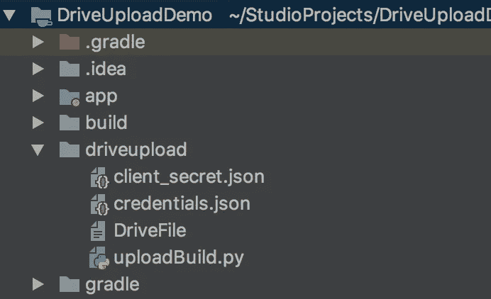
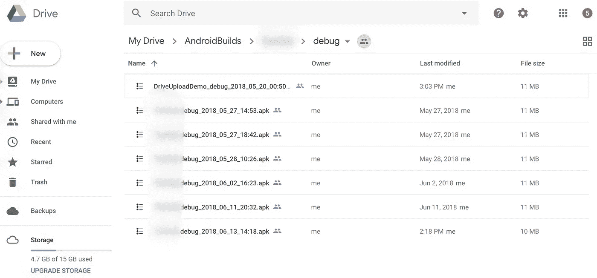

# 在 Google drive 上自动执行 Android 构建上传流程

> 原文：<https://medium.com/globant/when-google-drive-meets-python-for-android-e87ba5616c07?source=collection_archive---------1----------------------->

在我的一个 Android 项目中，我创建了 build 并上传到 Google drive 上，与 QA 分享。有一天，我觉得……啊……让我们来自动化这个吧。所以我写了一个 python 脚本来完成这个任务。如果你也像我一样懒，这就是了

## 安装 Python

检查是否安装了 Python。默认情况下，Mac 自带 Python。可能是 2.7 版本左右。但是，如果您想检查，请输入以下命令。

```
$ python --version
```

从命令行安装 Python。

```
$ brew install python
```

更多详情请参考下面的链接。

[](http://docs.python-guide.org/en/latest/starting/install3/osx/) [## 在 Mac OS X 上安装 Python 3——Python 的搭便车指南

### OS X 附带的 Python 版本对于学习来说很好，但是对于开发来说却不好。版本…

docs.python-guide.org](http://docs.python-guide.org/en/latest/starting/install3/osx/) 

## 安装 pip

从命令行安装 pip。

```
$ curl -O http://python-distribute.org/distribute_setup.py
$ python distribute_setup.py
$ curl -O https://raw.github.com/pypa/pip/master/contrib/get-pip.py
$ python get-pip.py
```

更多详情请参考下面的链接。

 [## 安装- pip 10.0.1 文件

### 如果您使用的是从 python.org 下载的 Python 2 >=2.7.9 或 Python 3 >=3.4，或者您是…

pip.pypa.io](https://pip.pypa.io/en/stable/installing/) 

## 安装 Google Api 客户端库

```
$ pip install --upgrade google-api-python-client
```

更多详情请参考下面的链接。

[](https://developers.google.com/api-client-library/python/start/installation) [## 安装 Python |客户端库| Google 开发者

### 本页包含了关于安装 Python 的 Google APIs 客户端库的信息。

developers.google.com](https://developers.google.com/api-client-library/python/start/installation) 

## 打开驱动 Api，下载 **client_secret.json** 文件

1.  使用[这个向导](https://console.developers.google.com/start/api?id=drive)在谷歌开发者控制台中创建或选择一个项目，并自动打开 API。点击**继续**，然后**转到凭证**。
2.  在**将凭证添加到您的项目**页面上，单击**取消**按钮。
3.  在页面顶部，选择 **OAuth 同意屏幕**选项卡。选择一个**电子邮件地址**，输入一个**产品名称**(如果尚未设置),点击**保存**按钮。
4.  选择**凭证**页签，点击**创建凭证**按钮，选择 **OAuth 客户端 ID** 。
5.  选择应用类型 **Other** ，输入名称“Drive API Quickstart”，点击 **Create** 按钮。
6.  点击**确定**关闭出现的对话框。
7.  单击客户端 ID 右侧的 file_download(下载 JSON)按钮。
8.  将该文件移动到您的工作目录，并将其重命名为`client_secret.json`。

## 用这些文件创建目录结构

在项目的基础文件夹中创建 **driveupload** 文件夹，并在其中添加 **client_secret.json** 、 **DriveFile** 和 **uploadBuild.py** 文件。

第一次运行时会自动生成 **credentials.json** :

```
$ python uploadBuild.py
```



## 创建 ***驱动文件***

这是您将创建的配置文件。这个文件作为 **uploadBuild.py** 脚本的输入。该脚本从这个文件中提取数据，并开始根据 **DriveFile 中给出的名称在您的驱动器上创建目录。**

**驱动文件** 会有一个 **json** 数据类似这样。

```
{
"project_name":"DriveUploadDemo",
"build_type":"debug",
"build_path":"/Users/rana.singh/StudioProjects/DriveUploadDemo/app/build/outputs/apk/debug/app-debug.apk",
"client_secret_path":"client_secret.json",
"create_build_for_me":true
}
```

***项目名称:*** 您的项目名称。在你的驱动器上的 **AndroidBuilds** 目录下将会以这个名字创建一个目录。

***build _ type:****它要么是**调试**要么是**发布**或者是你拥有的任何其他**构建版本**。*

*注意: ***build_type*** 用于在 **uploadBuild.py** 中从命令行创建构建，所以不要给出无关的构建类型，否则即使在 **DriveFile 中将 **create_build_for_me** 设置为 **true** 也不会创建构建。***

****build _ path:****你想要上传的 build 的路径。如果你的。apk 名称随着构建不断变化，我建议保持固定，因为 python 脚本在将构建上传到驱动器上之前将其重命名为**project name _ build type _ 2018 _ 06 _ 13 _ 14:36 . apk .**如果您想要一些不同的内容，可以直接从 **uploadBuild.py** 脚本**进行更改。****

*****client _ secret _ path:****下载的 client_secret.json 的路径，我会像我一样建议把这个文件保存在 **driveupload** 目录下。***

******create _ build _ for _ me:****(可选)*脚本 **uploadBuild.py** 有代码来**清理**，然后**使用 **gradlew** 命令创建**一个新的构建。如果你设置了这个值，你所需要做的就是给出下面提到的命令，剩下的就交给脚本了。***

```
**$python uploadBuild.py**
```

## **创建 uploadBuild.py 文件**

**我不是 python 专家，只是初学者，所以不要评价我的代码。但是你可以随意做你想做的改变。**

**复制粘贴到你的 **uploadBuild.py****

```
**from __future__ import print_function

import datetime
import json
import os
from apiclient.discovery import build
from apiclient.http import MediaFileUpload
from httplib2 import Http
from oauth2client import file, client, tools

FILE_PATH = ''
CLIENT_SECRET_PATH = ''
PROJECT_NAME = ''
SEPARATOR = "_"
ASSEMBLE = "assemble"
GRADLE_COMMAND = "./gradlew "
CLEAN = "clean"

DIR_ANDROID_BUILDS = 'AndroidBuilds'
DRIVE_FILE = "DriveFile"
FILE_CREDENTIALS = 'credentials.json'
SCOPES = 'https://www.googleapis.com/auth/drive'
DATE_TIME_FORMAT = "%Y_%m_%d_%H:%M"
CREATE_BUILD_ENABLED = False

class JsonKey:
    buildType = "build_type"
    projectName = "project_name"
    buildPath = "build_path"
    clientSecretPath = "client_secret_path"
    createBuildEnabled = "create_build_for_me"

# Function defination section ___________________________________

# Function to read DriveFile
def readDriveFile():
    print("Reading DriveFile ...")
    dirPath = os.path.dirname(os.path.realpath(__file__))
    drivePath = dirPath + "/" + DRIVE_FILE
    with open(drivePath) as driveFile:
        jsonData = json.load(driveFile)
        return jsonData

# Function to create a root folder by name AndroidBuilds.
def createRootFolder():
    folder_metadata = {'name': [DIR_ANDROID_BUILDS],
                       'mimeType': 'application/vnd.google-apps.folder'}
    folder = service.files().create(body=folder_metadata, fields='id').execute()
    folderId = folder.get('id')
    print("ROOT DIRECTORY CREATED - " + DIR_ANDROID_BUILDS)
    print('\n')
    return folderId

# Function to create a folder with given folder inside AndroidBuilds directory with given project name.
def createProjectFolder(rootDirectoryId, projectName):
    folder_metadata = {'name': [projectName],
                       'mimeType': 'application/vnd.google-apps.folder',
                       'parents': [rootDirectoryId]}
    folder = service.files().create(body=folder_metadata, fields='id').execute()
    folderId = folder.get('id')
    print('PROJECT DIRECTORY CREATED - ' + projectName)
    print('\n')
    return folderId

# Function to upload a new build in  given folder
def uploadBuild(parentId):
    print('UPLOADING BUILD ...')
    filename, fileExtension = os.path.splitext(FILE_PATH)
    buildName = createBuildName(fileExtension)
    file_metadata = {'name': [buildName], 'parents': [parentId]}
    media = MediaFileUpload(FILE_PATH)
    file = service.files().create(body=file_metadata, media_body=media, fields='id').execute()
    print('BUILD UPLOADED SUCCESSFULLY')
    print('\n')

# Function to create new build name
def createBuildName(fileExtension):
    time = datetime.datetime.now().strftime(DATE_TIME_FORMAT)
    buildName = PROJECT_NAME + SEPARATOR + BUILD_TYPE + SEPARATOR + time + fileExtension
    print("Build: " + buildName)
    print('\n')
    return buildName

# Function to check if the root directory exists or not.
def isDirectoryPresent(directoryName):
    print("Looking for directory: " + directoryName)
    query = "name = '" + directoryName + "'"
    response = service.files().list(q=query).execute()
    file = response.get('files', [])
    if not file:
        print("Directory: " + directoryName + " - Not Found")
        print('\n')
        return False
    else:
        print("Directory:" + directoryName + " - Found")
        print('\n')
        return True

# Function to check if the root directory exists or not.
def getDirectoryId(directoryName):
    print("Fetching id for directory: " + directoryName)
    query = "name = '" + directoryName + "'"
    response = service.files().list(q=query).execute()
    file = response.get('files', [])
    if not file:
        print("Directory ID: " + "Not Found")
        print('\n')
        return ""
    item = file[0]
    print("Directory ID: " + item["id"])
    print('\n')
    return item["id"]

# ________________________________________________________________

# Setup the Drive v3 API
dirPath = os.path.dirname(os.path.realpath(__file__))
credPath = dirPath + "/" + FILE_CREDENTIALS

store = file.Storage(credPath)
creds = store.get()
if not creds or creds.invalid:
    flow = client.flow_from_clientsecrets(CLIENT_SECRET_PATH, SCOPES)
    creds = tools.run_flow(flow, store)
service = build('drive', 'v3', http=creds.authorize(Http()))

# Read data from DriveFile
jsonDriveFile = readDriveFile()

# Set values
FILE_PATH = jsonDriveFile[JsonKey.buildPath]
CLIENT_SECRET_PATH = jsonDriveFile[JsonKey.clientSecretPath]
PROJECT_NAME = jsonDriveFile[JsonKey.projectName]
BUILD_TYPE = jsonDriveFile[JsonKey.buildType]
CREATE_BUILD_ENABLED = jsonDriveFile[JsonKey.createBuildEnabled]

rootDirectoryId = ""
projectDirectoryId = ""
buildDirectoryId = ""
# Check if the root directory present
if not isDirectoryPresent(DIR_ANDROID_BUILDS):
    # If root directory is not present, create new one
    rootDirectoryId = createRootFolder()
else:
    # Else get the id for existing root directory
    rootDirectoryId = getDirectoryId(DIR_ANDROID_BUILDS)

# Check if the project directory is present
if not isDirectoryPresent(PROJECT_NAME):
    # If project directory is not present, create new one
    projectDirectoryId = createProjectFolder(rootDirectoryId, PROJECT_NAME)
else:
    # Else get the id for existing project directory
    projectDirectoryId = getDirectoryId(PROJECT_NAME)

# Check if the build directory is present
if not isDirectoryPresent(BUILD_TYPE):
    # If build directory is not present, create new one
    buildDirectoryId = createProjectFolder(projectDirectoryId, BUILD_TYPE)
else:
    # Else get the id for existing build directory
    buildDirectoryId = getDirectoryId(BUILD_TYPE)

# Create build
if CREATE_BUILD_ENABLED:
    # Create command to generate build from command line. eg. ./gradlew assembleDebug
    buildCommand = GRADLE_COMMAND + ASSEMBLE + BUILD_TYPE
    print("Creating build, executing command: " + buildCommand)
    os.system(GRADLE_COMMAND + CLEAN)
    os.system(buildCommand)

# Upload the build
uploadBuild(buildDirectoryId)**
```

# **奔跑**

**完成所有配置后，运行以下命令:**

```
**$python uploadBuild.py**
```

# **结果**

**在你的车道上找找这个。**

****

**整个目录结构看起来像这样。**

****