# 数据科学什么时候成了纸牌屋？

> 原文：<https://medium.com/pinterest-engineering/when-is-data-science-a-house-of-cards-86c9ab0a2c6f?source=collection_archive---------1----------------------->

June Andrews | Pinterest 数据科学工程师

作为数据科学家，当我们找到答案时，我们通常会交流答案并继续前进。但是，当有多个数据科学家给出不同的答案时，会发生什么呢？复制和测试工作质量的费用通常会使关键的业务挑战无人问津。在 Pinterest，我们将复制成本降低到可以进行实验的水平。我们照做了。同一天，在相同的环境下，我们问了九位数据科学家和机器学习工程师同样的问题。我们收到了九个不同的结果。

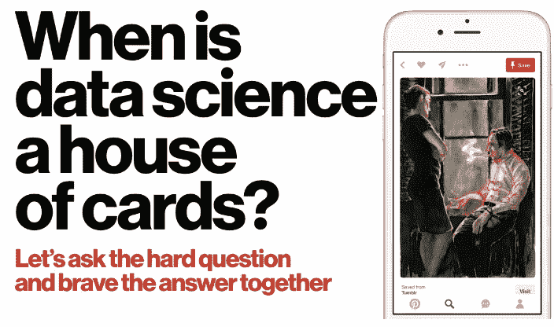

## 降低数据科学的成本

为了高效地将结果复制九次，我们使用了一种新的迭代监督聚类方法。它非常容易搜索，并带有一个预加载数据的三步 Python 笔记本。这又让分析变得有趣了。该算法是 Klaufman 和 Kleinberg 的 [KDD 论文](https://www.cs.cornell.edu/home/kleinber/kdd14-seed.pdf)的扩展，并在下图中进行了解释。

**第一阶段:**用自己喜欢的聚类算法把数据分解成候选聚类。

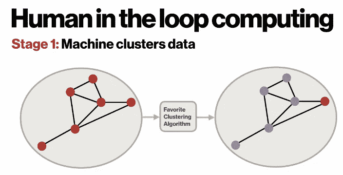

**阶段 2:** 请领域专家与每个集群的可视化交互，选择最符合人类理解的描述并定义该集群。聚类定义包括名称、描述和一个简短的 Python 函数，用于确定某个点是否属于该聚类。

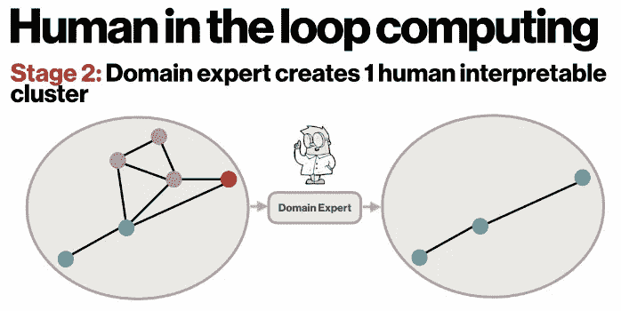

**阶段 3:** 现在我们有了人类可解释的集群，我们不需要机器关注该集群中的数据，因此删除标记的数据。从阶段 1 开始重复，当领域专家对剩余数据不再感兴趣时停止，并将剩余点标记为未分类。

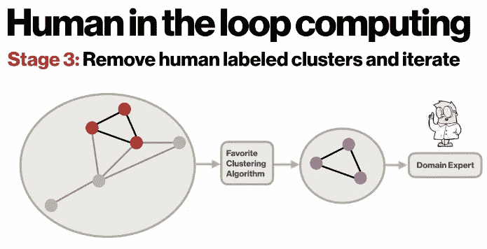

我们走吧！人类可解释聚类的力量现在掌握在您的手中。

## 挖掘数十亿个数据丰富的 pin

有一个特别的问题我们想用这个来回答。作为一个想法目录，Pinterest 建立在+1 亿月活跃用户在+10 亿个论坛上保存的+750 亿个 pin 的兴趣图之上。董事会阐明想法如何变成现实。这是令人难以置信的数据。有一个微小的细节非常有效，你很少会注意到它——每个别针后面都有一个到 wild wild web 的链接。对于 pin 背后的来源，我们想知道 Pinners 是如何与[链接域](https://engineering.pinterest.com/blog/building-country-and-language-detection-pipeline)结合的？

## 测量针接合

为了回答这个问题，我们抽取了 10 万个链接域的样本，观察 Pinners 在 Pinterest 的第一年是如何处理内容的。特别是，我们从 Pinterest 保存按钮中提取了创建的 pin，无论是在 Pinterest 上还是在 Pinterest 外。新 pin 的数量反映了一个域名在网络上的表现，而 repins 反映了一个域名在 Pinterest 上的表现。数据被清理、标准化并加载到 Python 笔记本中。(我们热爱我们的应用程序美学，忍不住让我们的笔记本效仿。)

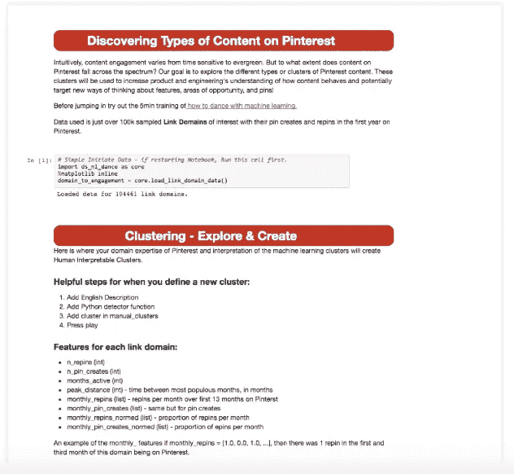

在我在奥赖利地层会议上的演讲中可以找到更多的聚类细节。

你会发现链接域名属于一个有趣的集群。我最喜欢的是“Pinterest Specials”，这些域名在网络上的受欢迎程度或可达性已经大大降低，但其内容在 Pinterest 生态系统中仍然存在并蓬勃发展。以下是我们的链接域名类型的名称:

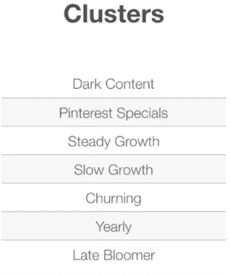

## 复制数据科学

我们问了 Pinners 如何参与链接域的问题，并找到了一个有趣而有见地的答案，帮助我们了解应该构建什么类型的产品。让我们再问一次这个问题。这就是我们问 9 个数据科学家和机器学习工程师同样问题的地方。他们都是业内资深人士，在 Pinterest 工作了一年多。他们与 Pinterest 内容合作，并且是每年通过 1.5 万亿次推荐帮助 Pinners 获得优秀内容的团队的一部分。通过上述算法和数据处理，每个人在一个小时内完成了链接域的聚类。在与同事共享集群之前，剩下的唯一一步是从每个集群中提取领域示例。

在我们揭示结果之前，让我们花几分钟时间回顾一下现有的触及可复制性分析的工作。去年，三项令人难以置信的行业研究浮出水面。第一项是关于肤色如何影响足球比赛中红牌发生率的研究，发表在[自然](http://www.nature.com/news/crowdsourced-research-many-hands-make-tight-work-1.18508)杂志上。29 名众包研究人员分析了相同的数据，并分享了对彼此方法的评论。虽然有一个相对一致的答案是肯定的，但这有一点点不同。29 个团队中有 10 个团队的结果偏离了相反的结论，具有惊人的强相关性。

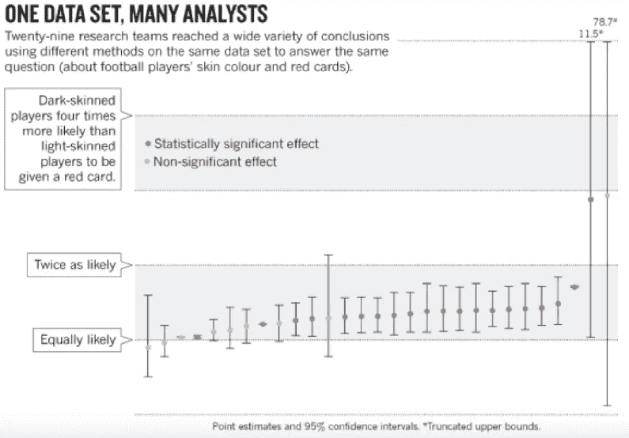

在这种情况下，医学和科学中的复制危机至少值得一提。去年，贝格利和约安尼迪斯[[科学再现](http://circres.ahajournals.org/content/116/1/116)]认为 75%到 90%的临床前研究是不可再现的。如果你关心癌症治疗的有效性，你会看到一篇可怕的文章。虽然一些缺陷来自捏造数据的丑闻，如[迪德里克·斯塔佩尔](https://en.wikipedia.org/wiki/Diederik_Stapel)的丑闻，但大多数缺陷都归咎于数据分析和在产生可公布结果的压力下的人为错误。

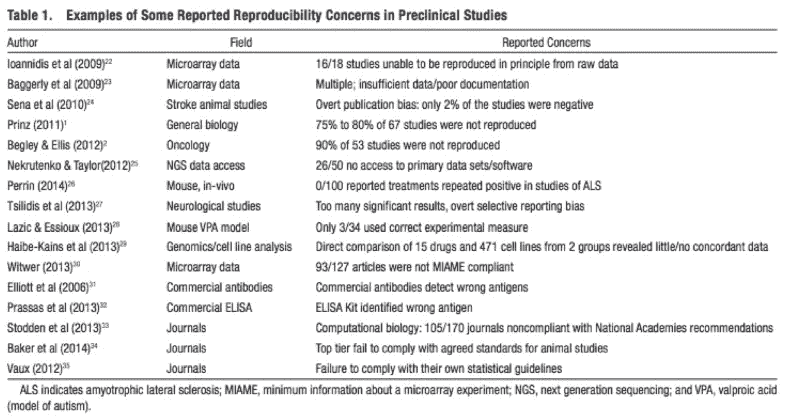

在最近一次对相同数据提出相同问题的测试中,*《纽约时报》*将相同的民意调查结果发给了另外四家知名的民意调查机构。虽然克林顿+3 和克林顿+4 之间的差异似乎可以忽略不计，但一位著名的民调专家报告了特朗普赢得佛罗里达州的结论，这是一个天文数字上的不同结果。

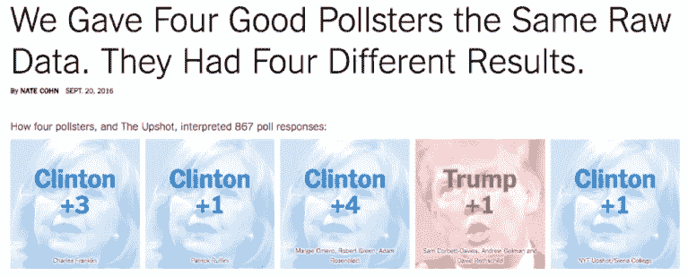

对于数据科学来说，我们的结果的多样性是在克林顿水平的一分之内，还是数据科学的结果在光谱的两极？

回到我们与九位数据科学家和机器学习工程师的测试，通过开发轻量级交互算法和使用预载数据的 Python 笔记本，我们降低了复制数据科学工作的成本，以至于我们可以问每个人同样的问题:Pinners 如何参与链接域？

## 结果

我们收到了九个不同的结果，这些结果是如此的不同，它们就像之前的研究一样具有不同的可重复性。

我们发现了两种不同结果的原因。较小的影响是一些结果包含错误的答案。首先，这些答案是由两种技能引起的，我们可以发现并提高人们的水平:

1.  在查看数据之前，先入为主地理解数据的含义。
2.  在不了解全局的情况下，对部分功能进行挑剔。

第二个原因来自于视角的不同。一些数据科学家专注于增长的病毒方面，而其他人则专注于 Pinterest 生态系统内的投资回报。对于 Pinterest 内容的不同视角的样本，以下是不同结果中集群的独特名称:

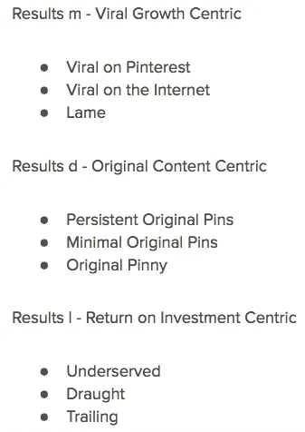

## 不切实际无法实现的计划

我们问了同样的问题九次，得到了九个截然不同的答案。我们什么时候在不可复制的分析之上建立了不可复制的分析，以至于数据驱动的决策不再得到数据的支持？如果我们想在未来前进，我们必须问这个难题，我们必须说出伏地魔的名字。数据科学什么时候成了纸牌屋？

我相信在不久的将来，大量的支持工作将使数据科学作为一个领域来回答这个问题。一个关键的组成部分是硅谷许多公司的基础设施投资，使实验系统和快速访问数据成为标准。另一个原因是，整个行业招募和培训数据科学家的努力使数据科学家从稀缺资源变得触手可及。最近的关键努力是在再现性方面，可再现性的自然先兆是用相同的参数对相同的数据进行两次相同的分析的能力。设置这些参数和设计模型仍然是一个昂贵的过程，一个宽泛的问题需要一周或更长时间。随着更快的人在回路算法的发展，我们正在降低让多个数据科学家回答同一个问题的成本。所有这些因素结合在一起，带来了一场完美风暴，让我们来试验和了解不同的数据科学实践如何影响业务底线。

这是个难以回答的问题。但作为一个领域，我相信我们可以承担它。为了保持消息灵通并参与未来的努力，[加入我们的](http://pin.it/Data)。

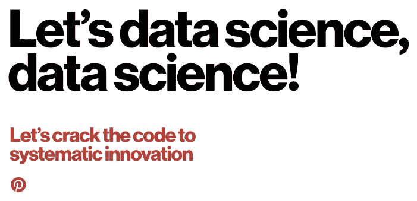