# 截屏变成 API 调用——用 Node.js 聚集 OpenWorld 2017 会议目录

> 原文：<https://medium.com/oracledevs/when-screen-scraping-became-api-calling-gathering-oracle-openworld-2017-session-catalog-with-node-c5e9a89b043a?source=collection_archive---------0----------------------->

拥有一个包含即将到来的甲骨文全球大会 2017 大会所有会议的数据集是很好的——用于许多技术的实验和演示。会议目录公布在网站上—[https://events . ra focus . com/catalog/Oracle/oow 17/catalogow 17](https://events.rainfocus.com/catalog/oracle/oow17/catalogoow17)

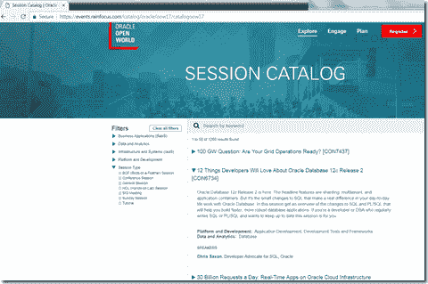

通过搜索、过滤和滚动，可以检查所有可用的会话。如果数据在浏览器中可用，则可以通过编程方式进行检索，并在本地保存在例如 JSON 文档中。一种典型的方法是 web 抓取:让服务器端程序像浏览器一样，从 web 站点检索 HTML，并从响应中查询数据。在这篇文章中描述了这个过程的例子——[https://code burst . io/an-introduction-to-web-scraping-with-node-js-1045 b 55 c 63 f 7](https://codeburst.io/an-introduction-to-web-scraping-with-node-js-1045b55c63f7)——用于 Node 和 [Cheerio 库](https://github.com/cheeriojs/cheerio)。

然而，只有当 HTML 是静态的时，HTML 的服务器端屏幕抓取才会成功。动态 HTML 是通过执行操纵浏览器 DOM 的 JavaScript 代码在浏览器中构建的。如果这是网站背后的机制，服务器端抓取至少要复杂得多(因为它要求服务器在很大程度上模拟现代的 web 浏览器)。Selenium 已经在这样的情况下使用了——提供一个服务器端的、可编程访问的浏览器引擎。或者，屏幕抓取也可以在浏览器内部执行——例如由 [Getsy 库](https://github.com/epiqueras/getsy)支持。

正如您将在本文中发现的——当服务器端抓取失败时，客户端抓取可能是一个非常复杂的解决方案。富客户端 web 应用程序很有可能使用 REST API，以 JSON 文档的形式提供数据。一个我们的服务器端程序也可以轻松利用的 API。OOW 2017 网站的情况就是如此——因此，与复杂的 HTML 解析和服务器端甚至客户端抓取不同，手头的挑战只不过是一点点 REST 调用。

# 服务器端抓取

服务器端抓取从客户端检查网站开始，使用您喜欢的浏览器中的开发工具。

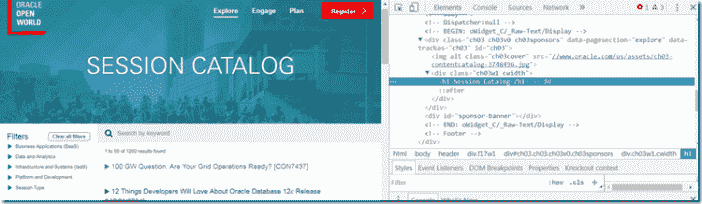

对于 cheerio 来说，了解 H1 标签内容的第一步很简单:

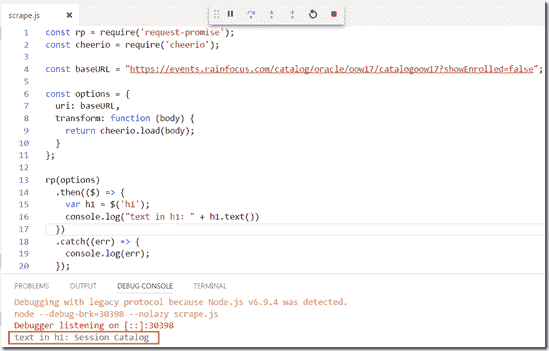

现在让我们检查一下网页，在那里我们可以找到这些会话的详细信息:

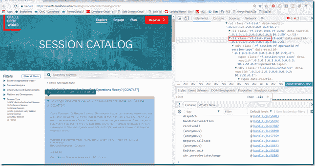

我们正在寻找一个 RF-list-item CSS 类的 LI 元素。通过查询这些元素来扩展我们的小节点程序:

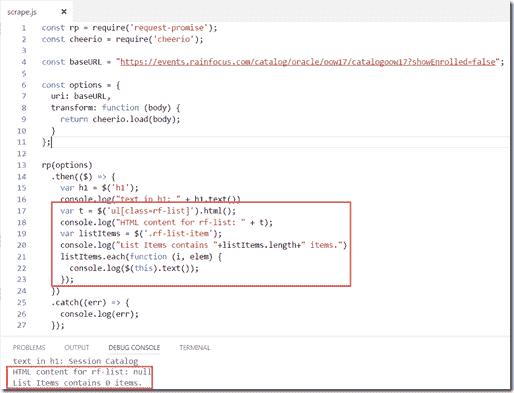

结果令人失望。显然，我们用请求-承诺提取的文档不包含这些列表项。正如我前面提到的，这并不奇怪:这些项目是在运行时由 JavaScript 代码添加到 DOM 中的，这些代码是在 Ajax 调用用于获取会话数据之后执行的。

# 分析 REST API 调用

使用浏览器中的开发工具，不难发现是哪个调用获取了这些结果:

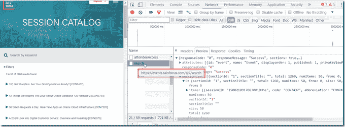

URL 就在那里:[https://events.rainfocus.com/api/search.](https://events.rainfocus.com/api/search.)现在的问题是:作为请求的一部分，向 API 发送什么头部和参数——应该是什么 HTTP 操作(GET，POST，…)？

浏览器工具中的信息揭示了:

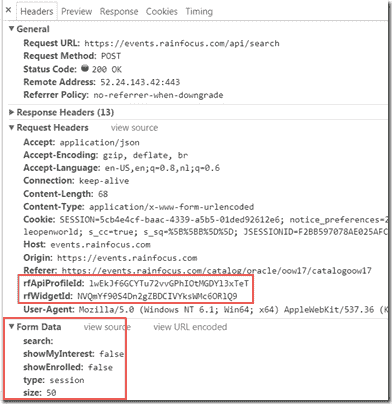

对 Postman 中 API 的自定义调用做了一点试验，结果表明 rfWidgetId 和 rfApiProfileId 是表单数据所必需的。

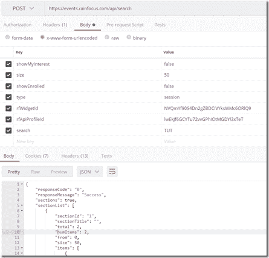

Postman 提供了一个优秀的特性，可以快速地使用许多技术中的源代码来进行您刚刚整理好的 REST 调用:

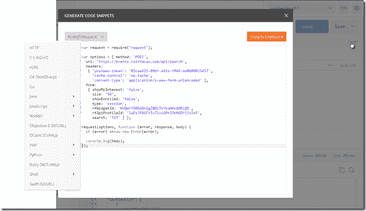

# 节点中的剩余呼叫

我的第一次尝试:

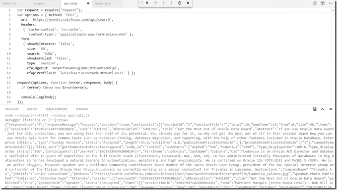

以 Postman 生成的示例为起点，创建将遍历所有会话类型的节点应用程序并不困难— TUT、BOF、GEN、CON 等等；

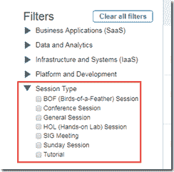

为了限制单个(请求和)响应的大小，我决定在 9 个块中搜索每种类型的会话，例如 CON1、CON2、CON3 等。搜索字符串用通配符填充，因此 CON1 将返回标识符以 CON1 开头的所有会话。

为了善待 OOW 2017 服务器，并防止被任何过滤器和保护措施阻挡，我将间隔发射请求(每个请求之间有 500 毫秒的延迟)。

因为这段代码仅供一次性使用，并且不受时间限制，所以我没有在并行化工作、创建世界上最优雅的代码等方面投入太多精力。简直不值得。这就够了——一次——这就是我所需要的。(虽然我想扩展代码来帮助我以自动化的方式下载演示文稿的幻灯片；每次会议，我都要花几个小时手动下载幻灯片，以便在回家的飞机上带走——结果每年我都发现自己太累了，无法浏览这些演示文稿。

用于构建包含所有 OOW 2017 会话的本地文件的节点代码:

[https://gist . github . com/061993 cfae 25 ffbf 8 e 311 c 88 DBC 84 b 0 . git](https://gist.github.com/061993cfaee25ffbf8e311c88dbc84b0.git)

*原载于 2017 年 8 月 10 日*[*technology . amis . nl*](https://technology.amis.nl/2017/08/10/when-screen-scraping-became-api-calling-gathering-oracle-openworld-2017-session-catalog-with-node/)*。*