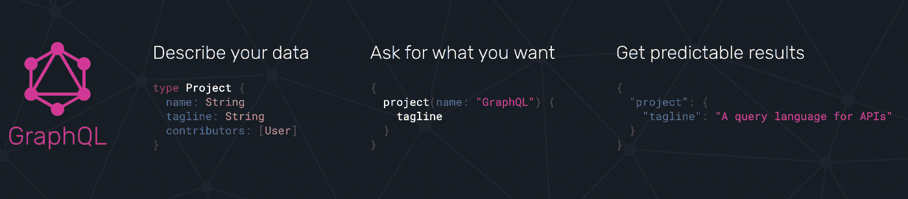

# 何时使用 GraphQL 以及它与 REST 相比如何

> 原文：<https://medium.com/capital-one-tech/when-to-use-graphql-and-how-it-compares-to-rest-632afc621160?source=collection_archive---------0----------------------->

## GraphQL 作为新的 BFF(后端对前端)、AWS Appsync 和 Apollo 服务器

在过去的十年中，许多组织采用微服务来支持他们的网站、移动应用和桌面应用。也许你已经看过一些 [Capital One 关于我们微服务之旅](/capital-one-tech/search?q=microservices)的文章。在这种架构风格中，随着所有业务逻辑转移到服务器端，出现了一些显著的变化和趋势，包括构建一次 API，然后跨渠道重用它们的理念。

# 跨渠道直接重用 Web APIs 的限制和挑战

跨多个渠道(如 web、移动、桌面、物联网等)重用相同的 API。会带来一些挑战。

在下面展示的场景中，客户端与后端微服务紧密耦合。很多时间被浪费在试图找出调用哪个 API，集成到所有后端服务，然后与多个团队协调上。此外，这增加了客户端的复杂性，并增加了出错和停机的可能性。

[*“Direct Client-To-Microservice communication Architecture”*](https://docs.microsoft.com/en-us/dotnet/architecture/microservices/architect-microservice-container-applications/direct-client-to-microservice-communication-versus-the-api-gateway-pattern) *from Microsoft .NET Docs is licensed under* [*CC BY 4.0*](https://creativecommons.org/licenses/by/4.0/)*.*

此外，对于移动等渠道，集成为 web 构建的 API 会导致网络带宽瓶颈和内存限制。这个问题也被称为 [*过度提取*](https://graphql.org/)——即获取比客户端实际需要的更多的信息。

此外，由于微服务环境的分布式性质，这些客户端还会遇到第二个问题，在微服务环境中，用户需要在单个屏幕上看到的数据可能会分散在多个微服务中。因此，移动应用程序必须与多个后端集成，并进行多次网络调用来获取加载屏幕所需的数据。更糟糕的是，这些调用需要按顺序执行。这可能会影响性能并降低屏幕加载时间。

下面的例子显示了多个 REST 调用，这些调用需要按顺序进行，以从应用程序加载特定用户的关注者及其提要。

*Sequential calls from client apps to backend Microservices from* [*GraphQL is the better REST*](https://www.howtographql.com/basics/1-graphql-is-the-better-rest/)*Copyright Graphcool. Licensed under the* [*MIT license*](https://github.com/howtographql/howtographql/blob/master/LICENSE.txt)*.*

# 通过体验 API 和 BFF 克服挑战

为了克服上述所有挑战，采用了一些设计模式，如[体验 API](https://blogs.mulesoft.com/api-integration/strategy/experience-api-ownership/)或[前端后端(BFF)](https://docs.microsoft.com/en-us/azure/architecture/patterns/backends-for-frontends) 。

API 体验层位于现有 API 之上，允许每个 UI 团队为其特定的应用程序或设备优化 API 体验。顾名思义，后端对前端(BFF)是每个 UI 界面的独立后端，它针对前端进行了优化，而不用担心影响其他前端体验。

这看起来有点像下图。BFF 上的单个定制端点聚合来自多个微服务的数据，过滤移动通道所需的数据，然后仅返回必要的数据。这不仅减少了客户端和后端之间的网络往返，还提供了抽象。

Multiple Backends for FrontEnd supporting different clients

现在想象一下，多个 BFF 或 Experience APIss 支持一个移动应用，包括维护多个应用所需的每个 BFF 或 Experience API 的不同变体。很多，对吧？大量的维护工作包括为每个客户端调整和优化这些功能、处理故障恢复、断路器实现等。此外，如果前端的视图发生变化，这些 API 也会不断变化。

这也会导致不同 BFF 之间的代码重复。例如，一个移动团队可能甚至没有意识到 web 团队为一个相似的流构建了另一个 BFF。或者，假设您的组织中有一个计划，要将您的 API 与 Alexa 等智能设备集成，或者最终为苹果或三星手表开发一个应用程序。是不是又要为他们打造新的体验 API？嗯，我想知道是否有更好的方法来处理多个客户…

# 一种新的选择——使用 GraphQL 来改进架构

## GraphQL 是什么？

GraphQL 是 API 的查询语言，也是执行这些查询的运行时。它于 2012 年在脸书开发，并于 2015 年公开。GraphQL 被认为是 REST 的替代方案，因为它旨在使 API 开发更快、更灵活，以处理不断变化的客户端需求。

GraphQL supporting multiple clients

## 使用 GraphQL 有什么好处？

GraphQL 提供了以下好处:

**1。对客户端的灵活性** —使用 GraphQL，移动等客户端可以准确地查询他们需要的信息，而服务器将只响应这些数据。*也就是说，相对于服务器，客户端指定服务器需要响应什么数据，从而避免了 REST 的溢出问题。*想象一下这对移动有多有用，尤其是在网速很慢的情况下。

使用 GraphQL，客户端只需进行一次 API 调用就可以获取所需的信息。这减少了集成开销并提高了网络性能。不再有客户端连接或错误处理。

*“GraphQL” from* [*https://graphql.org/*](https://graphql.org/) *is licensed under CC BY 3.0.*

**2。API 开发人员的灵活性** — GraphQL 节省了 API 开发人员在编排层中构建自定义端点或为所有可能的查询组合体验 API 所需的工作，因为您可以使用相同的端点和模式在客户端上构建不同的页面视图。此外，我们可以重用这个聚合逻辑来支持具有不同查询需求的不同客户端，而不是为每个客户端构建单独的 BFF。这简化了需要维护的编排层。

**3。版本控制** —使用 GraphQL，更容易知道 API 中的哪些字段被哪些客户端使用，哪些没有被使用。利用这些信息，API 开发人员可以更加自信地对现有的 API 进行修改。这意味着当删除某些未使用的字段或添加新的字段或类型时，您不需要实现新的版本。API 可以保持增长，客户不必担心升级到最新版本。这和休息有着天壤之别。

**4。文档&模式** — GraphQL 使用一个强类型的[模式](https://graphql.org/learn/schema/)来验证查询。通过 GraphQL [自省](https://graphql.org/learn/introspection/)，可以请求模式并知道支持什么查询；这可以用来自动生成文档。此外，像 [GraphiQL](https://www.gatsbyjs.com/docs/how-to/querying-data/running-queries-with-graphiql/) 这样的工具可以帮助您直观地探索数据图表，并帮助您创作和向服务器提交 GraphiQL 查询。在 REST API 中，这种文档必须使用 Swagger 或其他机制显式创建。

[*GraphQL query.*](https://www.howtographql.com/basics/1-graphql-is-the-better-rest/)

您还可以指定模式中哪些字段可以为空。*也就是说，如果获取某些字段时出现错误，其他字段仍然可以在响应中返回。*

# GraphQL 实现

GraphQL 拥有丰富的语言支持，并且有几种 [GraphQL 服务器](https://graphql.org/code/)实现可用。

## Apollo 服务器和 GraphQL

[Apollo](https://www.apollographql.com/docs/apollo-server/) Server 是 GraphQL 规范的一个流行的开源实现。使用 Apollo 平台，您可以通过连接数据源或外部 API 来构建、查询和管理您的数据图。

[*Apollo Server*](https://www.apollographql.com/docs/intro/platform/) *from the Apollo Server documentation. Copyright Meteor Development Group, Inc. Licensed under the* [*MIT license*](https://github.com/apollographql/apollo/blob/main/LICENSE)*.*

该平台由一个 JavaScript GraphQL 服务器组成，您可以在其中定义模式和解析器函数。它还包含一个 JavaScript Apollo 客户端组件，可以与 React、Angular 或 Vue 框架一起使用。还支持 iOS 和 Android 客户端组件。

Apollo 客户端的特性可以在查询结果到达或改变时直接更新 UI 组件，并从 UI 组件声明性地定义查询。[这里](https://blog.bitsrc.io/should-i-use-apollo-for-graphql-936129de72fe)是一篇关于为什么要用 Apollo 的好文章。

## AWS AppSync 和 GraphQL

2019 年，AWS 发布了 [AWS AppSync](https://aws.amazon.com/appsync/) ，这是一个完全托管的服务，用于构建 GraphQL APIs。它可以组合来自多个数据源、API 和 Lambda 函数的数据，与缓存集成以获得更快的性能。AppSync 管理基于负载的 GraphQL 执行引擎的自动缩放。它还与 Cloudwatch 集成。

*AppSync**Resolvers calling backend Microservices as taken from the* [*AWS AppSync documentation*](https://aws.amazon.com/appsync/)

您可以使用 Lambda 作为解析器函数，并将这些函数的所有权分离给最了解如何获取数据的团队。这些功能甚至可以存在于多个 AWS 账户中。

# GraphQL 中的查询执行

客户机提供的查询在 GraphQL 服务器上执行。服务器解析查询，根据模式进行验证，最后将执行传递给解析器函数。

让我们来看看查询执行所面临的一些挑战。

## GraphQL 中查询执行的挑战

***1。防止昂贵查询的安全控制***

GraphQL 为客户提供了查询所需信息的控制权，从而简化了事情。然而，这意味着客户端可能会通过在服务器上进行大量数据库调用来请求一些资源密集型的东西。

这是因为 GraphQL 为 GraphQL 模式中的每个字段执行一个解析函数。[可以使用技术](https://www.howtographql.com/advanced/4-security/)，例如在执行查询之前设置查询超时或分析最大查询深度，或者预先分析查询复杂性。

GraphQL 需要注意的另一个细微差别是，基于 API 请求数量的节流并不是一个好的因素，因为单个请求可能会导致多个查询。

***2。解析器功能、批处理和性能*和**

GraphQL 模式中的每个字段都映射到一个**解析器**函数，该函数具有获取数据的业务逻辑。解析器可以通过调用另一个 API 或从数据库或缓存等获取数据。GraphQL 也有一个称为默认解析器的东西，所以您不必为每个字段指定一个解析器。如果指定的字段没有解析器，GraphQL 将在父解析器中查找该字段名。

与 REST 相比，使用 GraphQL 的性能成本并不明显。即使客户端通过 GraphQL 使用单个 API 调用获取信息，API 开发人员仍然需要警惕通过进行大量后端数据库调用而将*溢出*转移到服务器端的可能性。

了解如何构造解析器以及从哪里获取数据(父对象和子对象)的复杂性是提高性能的关键。这里有一个有趣的[博客](/paypal-engineering/graphql-resolvers-best-practices-cd36fdbcef55)，它解释了查询解析是如何工作的，以及一些关于 GraphQL 解析器的最佳实践。

# 结论

有很多 GraphQL 和 REST 的比较，也有关于 GraphQL 取代 REST 的讨论。REST 得到了很好的证明，GraphQL 是一个相当新的和不断发展的东西，它在许多组织中的采用正在迅速增长。与任何其他新技术一样，GraphQL 也有一个学习曲线。GraphQL 带来了许多好处和一些挑战；应对这些挑战的解决方案正在有效构建。

在我看来，在客户端需要像移动设备一样灵活地一次性获取最少数据的场景中，或者在客户端需求快速变化并且您希望最小化服务器端开销的场景中，GraphQL 提供了大量的价值。对于在 REST 之上构建组织 API 来说，这也是一个巨大的好处，因为您需要在 REST 之上支持各种各样的客户端。

但是，如果您没有这样的需求，并且有简单的 API，静态的、简单的查询需求，那么与 REST 相比，GraphQL 会增加不必要的复杂性。

【几何头像照片】由[*rawpixel.com*](https://www.freepik.com/rawpixel-com)*上*[*www.freepik.com*](http://www.freepik.com)

*披露声明:2021 资本一。观点是作者个人的观点。除非本帖中另有说明，否则 Capital One 不隶属于所提及的任何公司，也不被这些公司认可。使用或展示的所有商标和其他知识产权是其各自所有者的财产。*