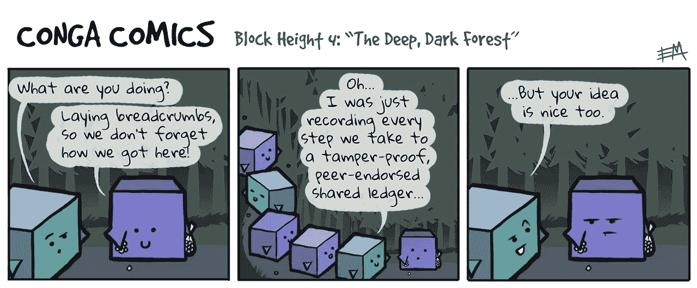
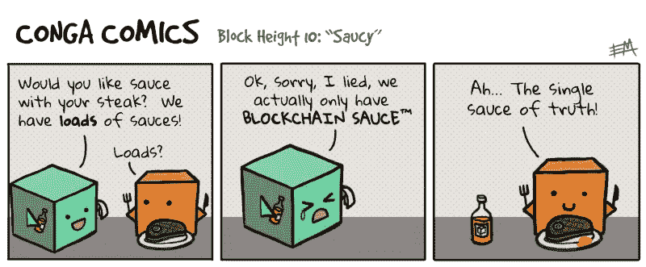
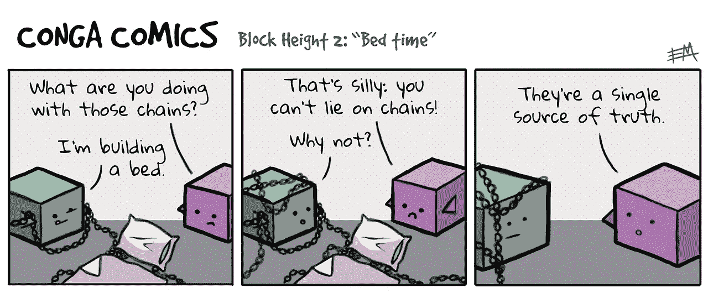
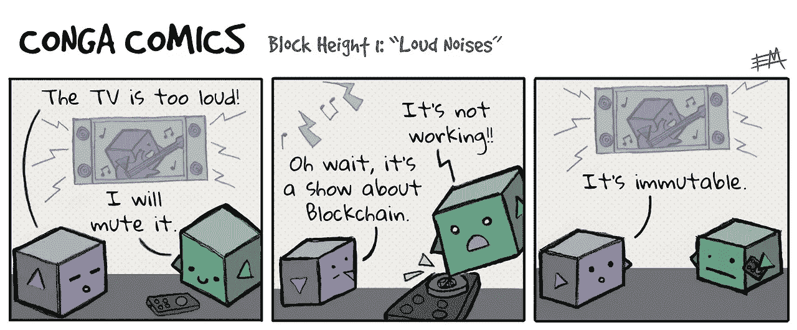
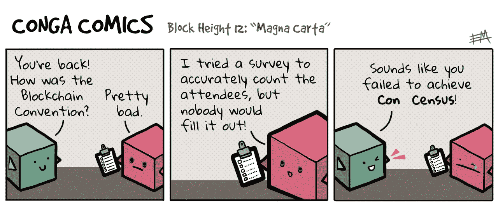
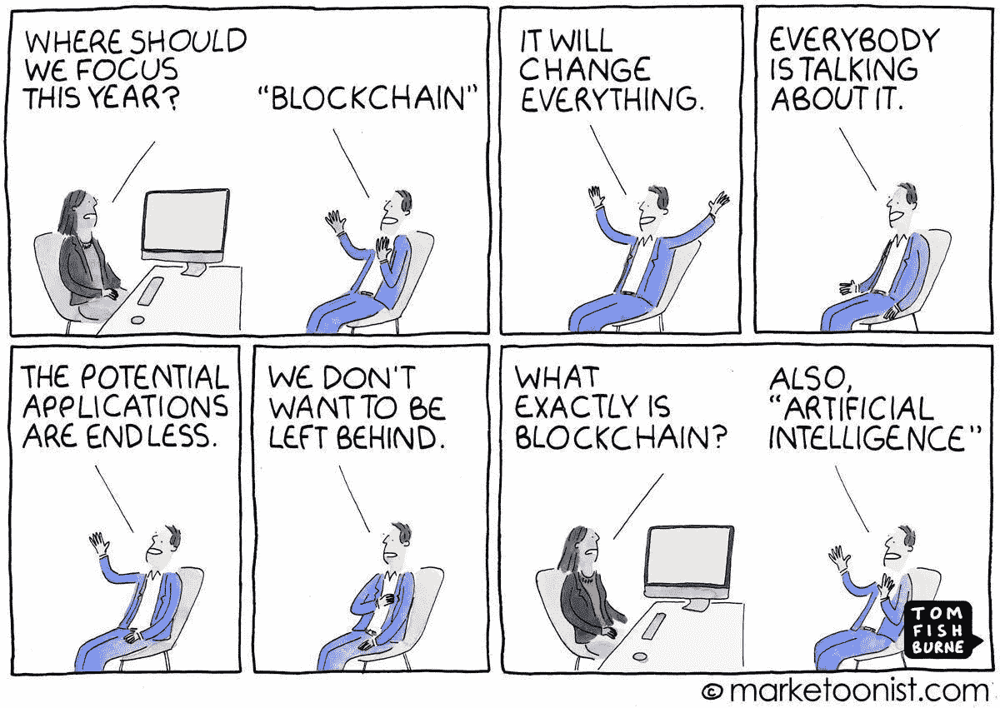

# 区块链在哪里以及如何成为比传统集中式系统更好的选择？—一个非常普通的问题的简单答案

> 原文：<https://medium.com/oracledevs/where-and-how-blockchain-can-be-a-better-option-than-the-traditional-centralized-system-model-edb0e3e1c9ee?source=collection_archive---------0----------------------->

在撰写了这篇解释当今可用的区块链的各种共识机制的[文章](/@aboavent.ab/demystifying-blockchain-and-consensus-mechanisms-everything-you-wanted-to-know-but-were-never-aabe62145128)之后，我收到了数百条评论和积极的反馈，这些评论和反馈来自那些努力理解加密货币和区块链以去中心化方式安全工作的人，一旦他们在阅读了我的文章之后清楚地理解了支持区块链实现的基础(顺便感谢我的所有读者)。然而，还有其他人仍在努力理解区块链相对于传统的基于模型的系统的优势，以及与利用集中式系统模型所能完成和实现的相比，区块链可以真正成为一个“突破”。

在我收到的几十封关于同类问题的邮件中，也就是说，区块链可以比我们已经使用了几十年的传统系统更好，我决定与这些同事之一分享我的一个答案，因为我注意到这可能有利于其他人，他们最终可能会就同一主题质疑自己。

# 这个问题

所以，这是我从一位来自英国的同事那里收到的一个与上述担忧相关的问题样本。

> 嗨，安德烈
> 
> 我已经阅读了你的综合文章，非常感谢它的有用和信息。我承认，我可能需要再读一遍，才能正确理解错综复杂的细节和“证据”。。."机制及其利弊，但我认为我理解协商一致机制的原则。
> 
> 我的根本问题(也是给你这个回复的原因)是“*区块链在现实世界中有什么应用，还有(故意唱反调，请原谅，为什么它只是一个有趣的计算机科学项目？*”。我可以很容易地看到它在比特币等虚拟货币上的应用(其批评者会谴责它只不过是一种毫无根据的投机机制)，但我很难想象为什么我需要一个区块链，或者为什么它在某种程度上比现有的更好。
> 
> 举个例子——假设我要给你汇 100(或 100 雷亚尔)。我联系我的银行，告诉他们你的银行信息，并发出汇款指令:钱会在适当的时候通过国际银行系统到达你的账户。虽然我可以想象如何通过你我都参与的区块链来实现同等效果，但这样做为什么会比现有机制“更好”呢？我推测你的答复将包括取消两家银行作为中间人的必要性，但这是唯一的好处吗？
> 
> 还是我想象了一个很差的例子？
> 
> 提前感谢专家回复。

# 答案

以下是我对他的回答(除了我在写这篇文章时加进去的漫画):

*首先，感谢您花时间看我的* [*文章*](/@aboavent.ab/demystifying-blockchain-and-consensus-mechanisms-everything-you-wanted-to-know-but-were-never-aabe62145128) *关于当今一些最流行的区块链实现中发现的共识机制。希望它对您有所帮助，并提供了一些关于在讨论分布式分类帐技术时变得越来越流行的关键术语的见解。*

*正如我在这篇* [*文章*](/@aboavent.ab/demystifying-blockchain-and-consensus-mechanisms-everything-you-wanted-to-know-but-were-never-aabe62145128) *中最初提到的，人们通常理解(也联想到)这项技术与加密货币的用法，这确实是很自然的，因为它是由于不可否认的巧妙发明而诞生的，被用作我们今天所知的最流行和最有价值的加密货币的基础:比特币。*

*然而，有时(我也同意你的观点)很难开始使用区块链，并根据银行账户之间的货币兑换这一非常常见的例子，想象出不同于传统模式的其他东西。因此，让我试着给你提供一些区块链技术可以带来的其他好处和用法的例子，这些好处和用法超越了比特币的创始人中本聪最初的用法。*

*人们应该问的第一个问题是:为什么区块链如此重要，以至于每个人都在谈论它？从根本上说，它加密地解决了* ***共享信任*** *的问题。然而，互不信任的实体如何进行交易呢？

在回答这个问题之前，让我们尝试回答以下问题:金融服务公司目前使用的解决这个问题的方法有哪些(在您的上述用例中使用的方法也适用于此处:

1)可信中介，例如:Visa/MC、SWIFT、DTCC、EuroClear* ***问题:*** *成本、延迟、单点故障* ***区块链【T24***

*2)由所有不同实体存储的单独记录* ***问题*** *:对账成本高且容易出错，无法规模化，延迟结算* ***区块链*** *的分布式分类账是唯一的真实来源—无需对账*

*简而言之，区块链作为一个去中心化的点对点网络，没有中央或控制机构，意味着消除中介，导致* ***降低交易成本*** *和* ***接近实时交易*** *执行，这是一种不同于金融机构所做的方式，特别是在向海外转移资金时，这正是您在下面用来说明您的问题的使用案例中所描述的。此外，作为基于分布式分类帐的技术，其中所有参与者维护分类帐的副本，它* ***消除了手动工作*** *和由于对账需要而导致的延迟，因为* ***数据一致性*** *是分布式分类帐的关键属性。通常，记录系统(sor)之间的数据集成是由离线或批量对账过程驱动的，其特点是延迟和手动异常处理。因此，区块链可以通过使用加密保护的共识协议来提供帮助，这些协议可以确保所有相关方的验证和协议，以及将数据实时复制到每个参与者的账本副本。

所以，回到第一个问题，区块链很重要，与现有的不同，因为它支持分布式和自治的市场，减少商业交易和对账中的摩擦，安全地维护和共享分散的记录，可以用于各种用例，如产品、文档、材料等的出处，不一定只与可以注意到的财务角度相关，但可以应用于无数的用例，顺便说一下，为了方便起见，我在下面将它们放在一起。*

# *区块链的潜在用例*

*这里是一个潜在用例的示例列表(当然不仅限于下面列出的那些)，通过利用关键的区块链功能，您可能会获得真正的好处，例如* ***单一真实来源*** *，* ***可信事务*** *，* ***不可变分类帐存储*** *和* ***接近真实* ***供应链*****

*   *零件、部件、配料的谱系和可追溯性*
*   *多层配送中的维修件跟踪*
*   *零件&飞机维修跟踪&其他管制资产*
*   *从农场到餐桌的食物来源*
*   *原产地溯源*
*   *电子合规记录*
*   *质量控制记录*
*   *防篡改物联网传感器数据，监控活动的不可否认性*

***公共部门***

*   *政府记录(头衔、出生证明、执照等。)分享*
*   *海关(进出口许可证、消费税)*
*   *监管认证(食品、制药等。)*
*   *采购/收购*
*   *公民服务，例如福利、多机构计划*

***医疗***

*   *电子健康记录*
*   *服务提供商凭证管理*
*   *临床防篡改物联网传感器数据、受监控活动的不可否认性、试验*
*   *防伪追踪&药品追踪*
*   *冷链追踪&追踪*
*   *与监控健康或设备的物联网设备集成*

**T43【电信】T44**

*   *漫游&互联计费*
*   *第三方服务提供商*
*   *eSIM*

# 要记住的关键特征

在查看答案后，我们可以总结一些关键特征，这些特征使区块链与传统的基于集中式模型的系统相比具有独特性、不同性、更好和更具创新性。

**分散与分布式(台账存储&完整性)**

*   维护事实和更新历史的分布式分类帐
*   所有参与者看到一致的数据
*   在参与者之间分配
*   参与者之间复制的更新
*   授权参与者访问数据

**不可逆和不可变(有效/不可否认交易)**

*   每个新块都包含创建链的前一个块的散列
*   所有记录都是加密的，只有获得相应密钥授权的人才能查看数据
*   记录不能被不可察觉地更改或删除，只能被追加
*   来自节点子集的关于新数据块/交易的共识
*   记录的存在和有效性是不可否认的
*   当在网络的政策下达成共识时，交易和它们的结果被分组到块中，这些块被附加到具有加密安全散列的分类帐中以实现不变性

**接近实时(交易在几分钟内验证和结算，而不是几天)**

*   各方直接互动。没有中介
*   当外部应用程序的事务触发时，智能合约(业务逻辑)会对分类帐进行更改
*   参与者在验证节点(对等节点)上执行智能合同，并遵循共识协议来验证结果

# 区块链不是所有问题的解决方案！

我们过去常说“有一个应用程序”，但现在似乎一切都有一个区块链。那么，区块链到底有什么用？除了围绕比特币和它让人们致富的炒作之外，真正的应用有哪些？

The Hype around Blockchain

我们听到的很多关于区块链的信息并不是它在做什么，而是它*能*做什么。在许多方面，你可以用集中式系统做区块链承诺要做的事情——只有一个核心区别；*信任*。这是区块链的一大优势，但是如上所述，区块链并不是解决所有用例的灵丹妙药，因此应该提出一些有用的问题来确定区块链的适用性。因此，如果您的企业/客户能够对下面的这些问题做出 ***是*** 的回答，那么区块链很可能非常适合他们。所以，这里有一些问题可以作为区块链选择(或不选择)的指南:

*   我的业务流程是否优先**跨部门/跨组织**？
*   是否有跨系统**的差异拖慢了**业务？
*   交易各方之间是否缺乏完全信任？
*   是否**涉及中介**，可能收取昂贵的费用，增加风险或延误？
*   是否需要**定期离线(批量)对账**？
*   是否有**改进可追溯性**或审计追踪的需求？
*   我们需要多方交易当前状态的实时可见性吗？
*   我可以通过自动化其中的某些步骤来改进**多方业务流程吗？**

尽管区块链技术非常适合记录某些类型的信息，但数据库系统等传统系统更适合记录其他类型的信息。对于每一个组织来说，了解他们想从这些不同的方法中得到什么是至关重要的，并在选择一种解决方案之前，根据每种解决方案的优势和弱点来衡量这一点。

# 结论

区块链是推测，但潜力巨大。技术变得越来越好，对于我上面提到的许多问题，都有解决方案。当务之急是要看看一个拟议中的区块链项目是否真的是*解决上述问题的*(即不使用区块链就无法完成)，或者只是试图利用炒作。

> **如果这篇文章帮助您了解了一些关于区块链的知识，以及它可以在哪里以及如何正确地应用于潜在的用例，并且帮助您了解了它与传统的集中式系统模型之间的区别，请为它鼓掌。请留下你的评论和反馈。这对帮助我继续写关于这类内容的新文章非常重要。**