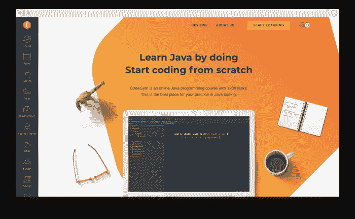
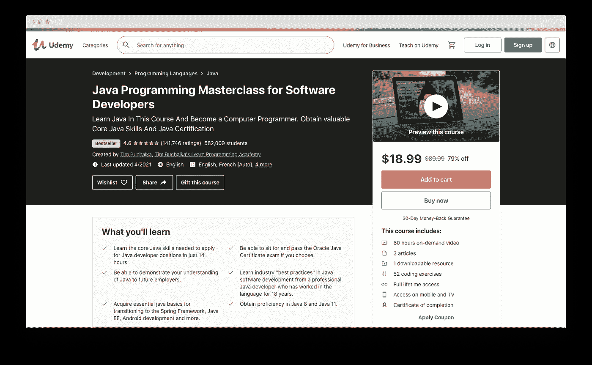
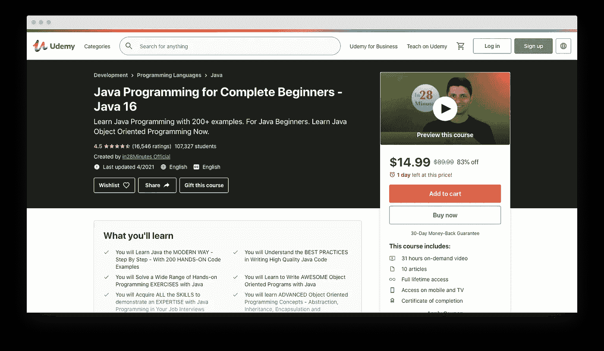
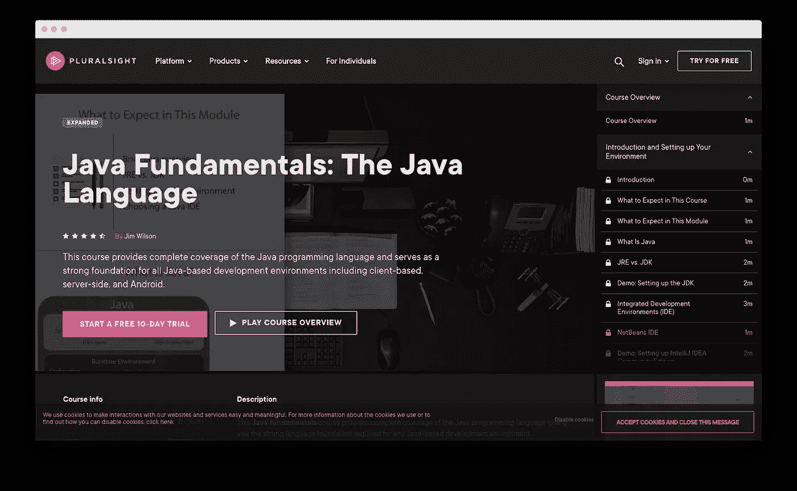
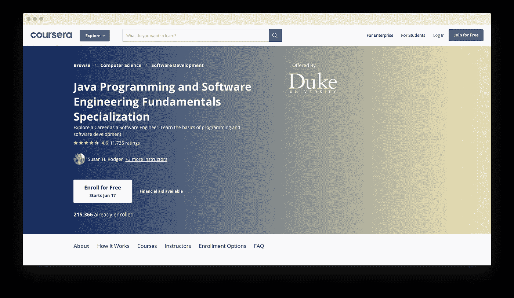

# 您可以从零开始学习 Java，以及如何正确地学习

> 原文：<https://medium.com/quick-code/where-you-could-learn-java-from-scratch-and-how-to-do-this-right-fba56ec264eb?source=collection_archive---------4----------------------->

编程世界是一个令人难以置信的快节奏和不断发展的环境。Java，作为当今最流行和最受欢迎的编程语言之一，也不是一成不变的。Java 生态系统和 Java 社区都在不断成长和发展。

初学者学习 Java 的方法也是如此。关于 Java 编程的新工具、课程和材料每年都会发布，而现有的工具、课程和材料也会得到改进和更新。这很好，除了这种巨大的多样性经常给这些产品的最终用户带来头痛——那些试图从头开始学习 Java 编码技能的人。

所以我决定现在是对学习 Java 的最佳平台做一个最新的概述的好时机。并且，为了不使这篇文章成为又一个无聊的列表，我还将分享一些关于如何使从头开始学习 Java 的过程尽可能有效和快速的技巧。

所有这些都是第一手的知识和工作工具。为了成功，你需要的是学习的一致性，或许还有某种不放弃的决心。

# 如何让 Java 学习过程变得有效？

以下是一些建议，应该会对你的旅程有所帮助。

## **1。创建一个学习计划并一致地编码**

我从最基本的建议开始，但是你绝对不应该低估它们的重要性。这些是学习过程的核心基础。这听起来可能是老生常谈，但是将学习 Java 的整个过程视为一个旅程而不是一个目的地要有效得多。创造这种态度，坚持下去，会有回报的。

从更实际的角度来说，你绝对应该有一个学习计划。我所说的“学习计划”是指持续地计划和组织你的学习过程。首先列出你的目标——你想在课程结束时达到的目标。完成后，你可以选择一门与你的目标、学习进度和其他个人偏好相一致的课程。

## **2。不要只写代码，也要读代码**

所有 Java 专家可能都同意的对初学者的一个基本建议是尽可能多的练习。我会更进一步，建议你不仅要定期写代码，还要阅读它。

让在 GitHub 或 StackOverflow 上阅读代码成为你的习惯。在阅读时，总是试图理解代码。在某些情况下，阅读别人的代码会启发你找到解决问题的方法，而不是当前代码中使用的方法。当你有灵感时，写一些你自己的代码，试着改进程序的一部分总是好的。与社区分享你的代码，这是一个很好的方式来获得额外的动力，并在学习过程中为你未来的编码组合做出贡献。

## **3。学习如何以正确的方式处理被卡住的情况**

我们任何级别的开发人员，从完全的初学者到经验丰富的高级编码人员，在我们的生活中一直面临的最常见的问题之一就是不得不处理问题并在过程中陷入困境。如果你不知道如何处理这个问题，这将使你更难进步，因为寻找问题的解决方案是开发人员的工作。

*   **如何解决编码问题？**

因此，让我给你一个方法，一个战斗策略，如果你愿意，屠杀那些编码问题。

1.首先，你需要了解病情。

1.1.如果你看了几遍还是不明白，那就进行第二步。

1.2.如果你得到了条件，不要急于立即编码。建立解的近似算法。使用不同的工具和资源:

*   调试
*   阅读文档
*   请走开，稍后再试
*   谷歌

1.2.1.有算法出现了吗？

1.2.2.如果没有，请转到步骤 2。

1.2.3.如果是，开始编码。

1.4 还不行？分析算法。试着改变它。

1.4.1 如果你根本不知道该怎么做，那就该到第二步了。

1.4.2 如果你知道该做什么，那就去做吧。

2.求助。使用开发者社区和论坛，如 StackOverflow、Reddit、CodeGym 的论坛、GitHub。

2.1.如果你得到了帮助，回到你离开问题的地方。如果你没有得到帮助，暂时放下这个任务，尝试解决另一个问题。

## **4。尽你所能与其他开发人员一对一合作**

初学者经常容易忽略的另一个有价值的方面是编程都是关于协作的。所以你应该尽可能多地寻找与其他开发者合作的机会。与有经验的开发人员合作是从他们那里获得知识和动力的方法。你从他们那里得到的反馈是无价的，对你的成长有很大的帮助。

*   在在线社区和论坛中与有经验的开发人员联系。

1.  Reddit 频道。

—专门的节目频道:

*   r/编程
*   学习编程
*   r/代码在一起
*   r/编程工具
*   r/游戏开发
*   r/Prog articles
*   r/webdev
*   r/每日程序
*   r/java，r/javahelp

—通用软件开发渠道:

*   标签开发者
*   欧洲发展探索者
*   DevOps 聊天
*   StackOverflow
*   站点点

## **5。永远不要停止学习**

成功的职业程序员从不停止学习。编程就是要一直学习新的东西，所以我建议你从一开始就采取这种态度，并且在你还是一个初学者的时候，就自学不断学习编程的新技能。

# 学习 Java 的五大平台

现在让我们开始 Java 学习平台的概述。以下是我个人对于想要最有效率的学习 Java 和实用 Java 编码技巧的初学者的五大选择。

## [CodeGym](https://codegym.cc/)

**价格**:免费版可用，付费订阅每月 50 美元。

**主要特点**

*   **注重实践。**该课程侧重于通过解决实际的编码任务来学习。
*   **完整的 Java 知识。**涵盖了 Java 的基础知识和高级主题。
*   **手机 app。用户友好的移动应用程序可以让你随时随地学习。**
*   **虚拟导师。**通过虚拟导师支持学生的旅程。
*   **用户社区。**大型、活跃和支持的用户社区，当你陷入困境时可以寻求帮助。
*   **课程结构不错。**结构良好的课程课程表，按照 Java 知识领域划分，顺序简单易懂。
*   许多任务。超过 1200 个实际任务，以及数百个关于 Java 理论的精彩讲座。
*   **即时任务解决方案评估。学生们可以立即检查任务并评分。**
*   小型讲座。授课时间很短，这使得学生可以在很短的时间间隔内学习。
*   对 Java 初学者和高级学习者都有好处。这门课程内容广泛，可以满足初学者和有经验的 Java 程序员的需求。
*   课程的 Java 基础部分是免费的。课程的初始 Java 语法部分是完全免费的。

**描述**

CodeGym 是一门以互动实践为导向的 Java 编程课程。该课程对于绝对的初学者以及希望扩展技能的软件开发人员来说都是有价值的。CodeGym 的一个显著特点是使用多种引人注目的教学技术，如游戏化、可视化和讲故事，使学习更加有效和有趣。

## [完整的 Java Masterclass](https://www.udemy.com/course/java-the-complete-java-developer-course/?LSNPUBID=alxeonBJ61w&ranEAID=alxeonBJ61w&ranMID=39197&ranSiteID=alxeonBJ61w-Np_gJAWJZU0MGZAceDZq2w&utm_medium=udemyads&utm_source=aff-campaign)

**价格**:89.99 美元

**主要特点**

*   **最新课程(更新和改进)。讲师实际上会花时间根据学生的反馈进行改进，因此课程会定期更新。**
*   **一致的课程结构。教师倾向于在开始新的讲课之前回顾以前讲课的材料。**
*   **不限于 Java。在整个课程中，除了 Java，你还将了解开发人员用来提高生产力的工具和实践。**
*   **广泛的学习材料。**总共 80 多小时的内容。
*   **实际任务。** 52 个编码练习。
*   **理论-实践平衡。**每道题目后，你都要解决编程难题。
*   **认证。所有课程的毕业生都将获得结业证书。**
*   **平台无关。**该课程可在手机和智能电视上访问。

**描述**

面向软件开发人员的 Java 编程大师班是最完整、最深入的 Java 编程在线课程之一。注册学生超过 480，000 人，这些全面的 Java 教程涵盖了学习如何用 Java 编程所需的一切。

## [Java 编程完全初学者 250 步](https://www.udemy.com/course/java-programming-tutorial-for-beginners/)

**价格**:89.99 美元。

**主要特点**

*   **均衡的课程结构。本课程讲解清晰，结构合理，理论与实践相结合。**
*   不需要太多时间。该课程时长约 30 小时，主要由点播视频讲座组成。
*   **关注 Java 的基础知识。对完全的初学者来说非常好，因为 Java 的基础得到了很多关注。**
*   **认证。所有课程的毕业生都将获得结业证书。**
*   **常见问题及故障排除。**有 200 多个常见问题解答的故障排除指南。

**描述**

本课程采用实际操作的方法，使用 JShell 和 Eclipse 的组合作为 IDE 来演示 200 多个 Java 编码练习、难题和代码示例。在 250 多个步骤中，它探索了最重要的 Java 编程语言特性。

## [Java Fundamentals by plural sight](https://www.pluralsight.com/courses/java-fundamentals-language)

**价格**:

*   包月 29 美元，包年 299 美元，包年 449 美元。

团队和企业包也是可用的。

**主要特点**

*   **很好的基本概念介绍。本课程提供了 Java 编程基本概念的基础介绍。**
*   **练够了。课程中的任务是实践驱动的。**
*   **没太多理论。这门课程包括一些简短的讲座，很容易在几天内完成。**
*   **互动内容。**互动视频和测验有助于让学习过程更有吸引力。
*   **短小精悍的课程。**与列表中的其他课程相比，完成该课程所需的时间更少。
*   **真实的例子。**所有概念都有真实的例子
*   **Cyntax 和设计好的图案。**涵盖了所有 Java 语法以及设计模式。

**描述**

本课程全面介绍了 Java 编程语言，为所有基于 Java 的开发环境打下了坚实的基础，包括基于客户端、服务器端和 Android。

## [杜克大学的 Java 编程和软件工程基础](https://www.coursera.org/specializations/java-programming)

**价格**:免费。

**主要特点**

*   **以项目为中心。本课程以项目为中心，所以你可以为你的编码组合找到一些项目。**
*   **有同伴反馈的作业。每个修这门课的人都将得到带同伴反馈的评分作业。**
*   **证书。**您可以选择获取证书，并在您的 LinkedIn 页面上分享。
*   **注重基本的编码技能。**这门课程旨在教你软件开发人员解决现实问题所需的基本技能。
*   **算法、测试和调试。算法、设计模式、测试和调试等主题和技能也是课程的一部分。**
*   **5 个子课程。这个项目分为 5 门课程，涵盖了 Java 的不同方面。**
*   **大实事项目。本课程最后还包括一个顶点项目，帮助你实际应用在整个项目中学到的一切。**

**描述**

这门课程是为初学者设计的，它将教会你核心的 Java 编程概念，并使你具备编写程序解决复杂问题的能力。此外，您将获得软件工程师解决现实世界问题所需的基本技能，从设计算法到测试和调试您的程序。

# 结论

所以在我看来，这五门课程是现在，2021 年，初学者最好的 Java 学习来源。我在本文开头给出的建议是这个过程中成功的基石。希望这些信息会有所帮助，并让我知道你在评论中的想法。