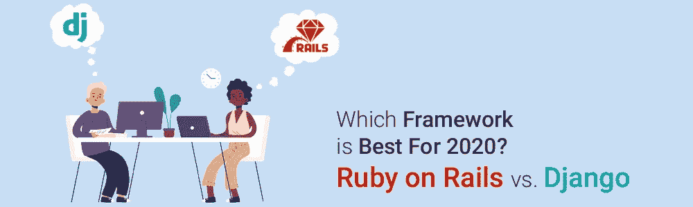

# 哪个框架最适合 2020 年——Ruby on Rails 和 Django？

> 原文：<https://medium.com/quick-code/which-framework-is-best-for-2020-ruby-on-rails-vs-django-a73290ffc625?source=collection_archive---------0----------------------->

Ruby on Rails 和 Django 都是最好的 web 开发框架——但是如何选择一个呢？它们的共同点包括编程语言的相似性(Ruby 和 Rails 都是面向对象和动态类型的),以及它们的输出对于每个任务都是唯一的。

在编程世界中，有各种各样的最佳 Web 开发框架可供程序员使用，但大多数都很突出，正如我们都知道的 Django 和 Ruby on Rails。它们作为流行的 web 框架出现，并且预计这种流行将持续到 2020 年。

如果你试图在这两者之间做出选择，Django 和 Rails 都是很好的选择——这里有一些可以帮助你做出正确选择的事情。欲了解更多信息，请访问 [**Ruby On Rails 在线培训**](https://onlineitguru.com/ruby-on-rails-online-training-placement.html) **。**

# 这两个框架有什么共同点？

可以肯定地说，Ruby on Rails 和 Django 就像一对双胞胎，区别仅在于使用的词汇和应用的哲学——每个都出生在不同的环境中。

*   **语言**

如上所述，Python 和 Ruby 是面向对象的动态类型语言——它们与公司中 Java 等架构中使用的语言非常不同。

一个主要的区别是 Python 和 Ruby 都是开源的，它们各自的社区都非常活跃和健壮。这意味着如果你坚持使用这些工具，你就不会费力去寻找答案或信息。

*   **性能**

Ruby 和 Python 具有几乎相同的性能水平——对于一个典型的 CRUD 应用程序来说，差异并不明显。在更广泛的应用中，这种差异同样可以忽略不计——但是如果质量是您优先考虑的事情，并且您需要同时支持成千上万的用户，那么这两者都不是正确的选择。

让我们这么说吧，两者都擅长高成本的 CPU 操作，比如图像处理，并且可以支持数千个用户(性能不是很好，但是还可以),但是配置这样大小的 Ruby 和 Python 需要更多的努力。

*   **架构**

基于 MVC 模板，两种语言的架构都是结构良好的——应用程序将被适当地组织起来，并将在框架内的各层之间进行简单的划分，例如指定的路线、控制器、模型和有界视图。

Rails 和 Django 中的条目排列略有不同，但这只是一种格式，所以没什么好考虑的。

# 姜戈到底是什么？

Django 于 2005 年推出，是一个基于 Python 的网络应用程序，也是创建 Python 应用程序的主要选择。它之所以如此受欢迎，是因为它是一个开源、通用和免费的应用程序，易于使用。Django 的特性受到开发者的高度赞扬。它旨在简化复杂的数据库驱动网站的创建过程。该系统以简洁实用的模式促进了快速发展。此外，Python 是最容易学习和编写的语言。Python 可以构建不同类型的应用程序。此外，学习姜戈很容易，因为它可以让你轻松创建复杂的网站。

## 姜戈框架的缺点

*   缺乏同时处理多个请求的能力
*   在 ORM 系统上高度可靠
*   使 web 应用程序组件紧密耦合
*   过于单一

## 姜戈框架的优点

*   可攀登的
*   姜戈有代表性国家转移框架
*   拥有众多插件的成熟软件
*   高度可定制
*   有效的管理面板
*   与数据库和操作系统高度兼容
*   采用电池供电的方式
*   支持 MVC 编程

# Ruby on Rails 是关于什么的？

Ruby on Rails 是根据麻省理工学院的许可证编写的，被称为 RoR，是服务器端的一个开源网络应用平台。作为一个模型-视图-控制器，Rails 提供了令人难以置信的默认服务器、web 服务和页面结构。众所周知，开发人员编写代码是一个节省时间的过程。

该系统主要基于两个概念工作——DRY(不要重复自己)和 Setup 约定。后者是自我解释的，不需要重复做同样的编程功能，而后者意味着根据定义，你操作的世界，如结构、数据库、语言等等，允许许多逻辑场景。这意味着您不必每次都开发自己的规则，您可以适应它们，使整个编程过程变得更加容易。

## Ruby on Rails 的优点

*   易于修改和迁移
*   优越的测试环境
*   活跃的 RoR 社区
*   高速发展
*   多样的工具和预设

## Ruby on Rails 的缺点

*   文件的质量和标准各不相同
*   运行速度低
*   创建应用编程接口很棘手
*   缺乏灵活性

 [## Ruby 与 Python | Ruby 与 Python 的区别| OnlineITGuru

### Ruby 是灵活的，它赋予程序员权力。有了 Ruby，我们可以设计许多漂亮的网站…

onlineitguru.com](https://onlineitguru.com/blog/ruby-vs-python) 

# Rails 和 Django 框架之间的主要区别

*   **语言**

虽然姜戈使用 Python，但是 Rails 早在 1995 年就已经推出了，并且是使用 Ruby 构建的。Python 是顶级编程语言之一，以强调代码的简单性和可读性而闻名，而 Ruby 以其灵活性和平等性以及可理解的语法而闻名。

Ruby 设计为“享受”在桌子的另一边编写语言，所以它本质上是令人愉快的。尽管使用它们中的任何一个开发的应用程序在外观和功能上都是一样的，但是在幕后，您可以看到主要的区别。

*   **架构**

两个 web 开发系统的一个共同点是都实现了 MVC(模型-视图-控制器)。不过，它被 Django 命名为 MVT(模型-视图-模板)。在很大程度上，MVC 和 MVT 是相同的，所以略有不同。

Django 中的模型代表数据库，它定义了数据结构，视图是基于正则表达式的 URL Dispatcher，它控制用户应该看到什么。最后，也是最重要的，模板指的是一个与 Django 模板语言(DLT)合并的 web 模板框架。Django 自己做控制器的这一部分。

RoR 的模板适用于评论、图片、消息等服务器信息。活动记录会处理好这一切。这里的视图覆盖了 HTML 模板中的信息，然后将它发送给控制器，活动视图稍后将管理该控制器。动作控制器现在链接模型和视图并管理请求，同时还管理 web 浏览器响应

*   **用户界面**

当在用户界面方面比较 Django 和 Rails 时，两者都是赢家。这是因为它们都旨在提供高品质的体验。这种以网络为中心的框架使得移动应用程序开发公司能够创建功能强大的网站，其中包含完美的附加组件和插件

*   **速度和性能**

在 RoR 和 Django 之间的战斗中，Rails 被发现要快 0.7%。这是因为 Rails 拥有丰富的令人敬畏的库和插件库，可以提高这个框架的速度并最终提高性能。尽管如此，Django 也促进了快速开发过程，并且是 web 应用程序的一个令人惊奇的选择。

尽管如此，Django vs. Rails 的性能还是很高的，因为它们利用了现代编程语言，同时提供了优化软件的工具

*   **稳定性**

对于创造来说，创新和稳定是两个平行的元素。能够成功做到这两点的赢家可以被称为。Ruby on Rails 可以兼顾这两者，因为它允许用户重用代码来消除依赖性。它还使用配置约定技术，将编码人员从进一步的工作中解放出来。

另一方面，通过坚持使用任何经过验证的方法来解决手头的问题，Python 遵循了一种更传统的方法，提供了稳定性。

*   **安装**

根据安装过程的不同，比较 Django 和 Ruby on Rails 并不难。Django 的安装过程非常简单，因此完全安装它只需要大约一分钟。

但是 RoR 就不一样了。首先你需要理解什么是 bundle 和 Gems，因为它们是安装 Ruby 的包所必需的。首先下载这两个程序，然后运行 Gem Install Rails 命令，最终安装 Rails 框架的最新版本。

 [## 为什么我们在 web 应用中使用 Ruby on Rails

### Rails 是 Ruby 的第一个 web 框架，Ruby 编程语言设计用于 rails web 应用程序…

onlineitguru.com](https://onlineitguru.com/blog/why-we-use-ruby-on-rails-for-web-applications) 

*   **安全**

与 Django vs Rails 相比，我们必须考虑安全因素，因为它是任何网站或应用程序的重要组成部分。

Django 无疑从 Python 中获得了这一功能。是的，NASA 也使用 Django 框架，这本身就足以证明它有多稳定。Django 由中间件支持，而 Rails 由活动文件支持。Django 拥有保护 Django 应用免受 SQL 注入、跨站点(XSS)脚本等攻击的工具。

总的来说，这两种 web 开发框架都是可靠的选择，在安全性方面可以信赖。

*   **可扩展性**

虽然 Python 的可伸缩性继承了 Django web 平台，但它仍然比 Rails 落后一些。由于其自由性和代码灵活性等属性，它具有更好的可扩展性。两者都是重量级的 web 开发框架，所以两者都是为了保持可伸缩性而设计的，但是这里的冠军头衔是 Ruby on Rails development。

*   **语法**

众所周知，Ruby 的语法非常通用。嗯，Ruby on Rails 的优势并不总是与此相关。这可能会导致问题，并使任务更难传递给其他团队成员，因为一个功能可以用许多不同的方式完成，从而造成混乱。

然而，Python 认为应该只有一种显而易见的方法来做某事，使调试和阅读代码更容易。

*   **开发原则**

原则就像胶水一样将整个 web 应用程序开发过程粘在一起。Django 有两个显著的原则——DRY(我们已经讨论过了)和“显式比隐式好”这种想法有助于开发人员创建由多人管理的易于理解的软件。

Ruby on Rails 也不缺乏设计原则。它还使用了 DRY 和配置约定，这表明，你必须遵循约定才能成功，而不是自己进行配置。这提高了速度和效率

*   **框架文档**

在这方面，说清楚一点，就是 Django vs. Rails 的设计框架之间的联系。所有的框架都是众所周知的，使得最常见的 FAQ 和问题的答案很容易找到。两者的文档语言都非常简单、易懂、清晰，不会让读者陷入混乱状态。

*   **平台成熟度**

Django 于 2005 年首次发布，此后一直是 web 开发的最佳框架之一。他最近的版本于 2019 年 4 月发布，具有许多新功能和改进的可用性。Ruby on Rails 于 2003 年首次发布，并于 2004 年正式宣布为开源应用程序。由于它的最新版本已于 2018 年 8 月发布，它还会定期更新。

*   **HTML 模板**

尽管 Django 和 Ruby on Rails 框架的核心特性都是模板，但是 Django 使用一种简单的模板语言，允许开发人员用最少的编程和 HTML 功能创建模板。相反，Rails 的视图往往更复杂(单个页面模板)。

*   **用法**

如果你正在寻找一个框架来帮助在更短的时间内创建复杂的数据库驱动的网站和 web 应用程序，具有系统管理、科学编程、数据分析和操作性能，那么 Django 就是前进的方向。

另一方面，Rails 也通过为开发人员提供改进的功能和自主权来帮助开发数据库后端 web 应用程序。它是元编程和构建有趣代码的理想选择，因为 Ruby 在设计上是通用的。您可以通过[最佳 ruby on rails 教程](https://blog.coursesity.com/best-ruby-on-rails-tutorials/)更自由地探索应用程序开发过程。

*   **社区支持和生态系统**

作为一个开源平台，Django 也有一个开源生态系统，这意味着开发者可以访问大量的库和软件，包括付费和免费的。此外，如果您需要对任何问题做出回应，Django 的官方文档完全可以作为参考。

Django group 拥有超过 11，000 个用户，供拥有超过 4，000 个现成产品的开发人员使用。此外，Ruby on Rails 还有一个由 5000 名忠诚的人组成的非常活跃的团队，他们已经贡献了许多具有可重用软件的宝石

> 要深入了解 Ruby，请注册参加 [**Ruby On Rails 在线课程**](https://onlineitguru.com/ruby-on-rails-online-training-placement.html) 的现场免费演示

*   **学习曲线**

众所周知 Python 是竞争对手中非常容易学习的编程语言，这也使得 Django 的学习曲线很小。众多线下和线上资源开放，更容易回答查询。相反，由于个别原则的原因，Rails 有一个非常陡峭的学习曲线，开发人员需要完善它才能成为 Rails 专业人员。所以，只推荐有经验的程序员和开发者。

Django 的用例

*   迪斯克斯
*   照片墙
*   Spotify
*   油管（国外视频网站）

Ruby on Rails 的用例

*   大本营
*   幻灯片共享
*   Crunchbase
*   葫芦
*   爱彼迎

## 选择哪个框架以及何时选择

总的来说，在 Rails web 框架上，Django 和 Ruby 都是同类中的佼佼者，给彼此带来了激烈的竞争。尽管如此，还是有一些地方一个压倒另一个。

举例来说，如果你想要一个非常详细的应用程序，里面有很多出色的特性，你应该选择 Django。然而，如果你想快速发布，然后关注网站细节或 web 应用，那么 Ruby on Rails 是你的最佳选择。这是因为它具有快捷方式和配置特性，使得 web 应用程序能够更简单地集成复杂的特性。

## 关键外卖

那么，Rails 和 Django 谁是更好的 Ruby？好吧，一句话，这个问题很难回答。Django 和 Rails 有很多相同点和不同点。两人在各种任务中都很成功。低效率、速度、社区支持、可扩展性、安全性等等，它们都给彼此带来了激烈的竞争。

然而，学习 Ruby on Rails 是绝对值得的，因为它是开发人员和程序员创建网站和 web 应用程序最喜欢的选项之一。事实上，它预测 RoR 的成功将持续到 2020 年，这使得学习它势在必行。