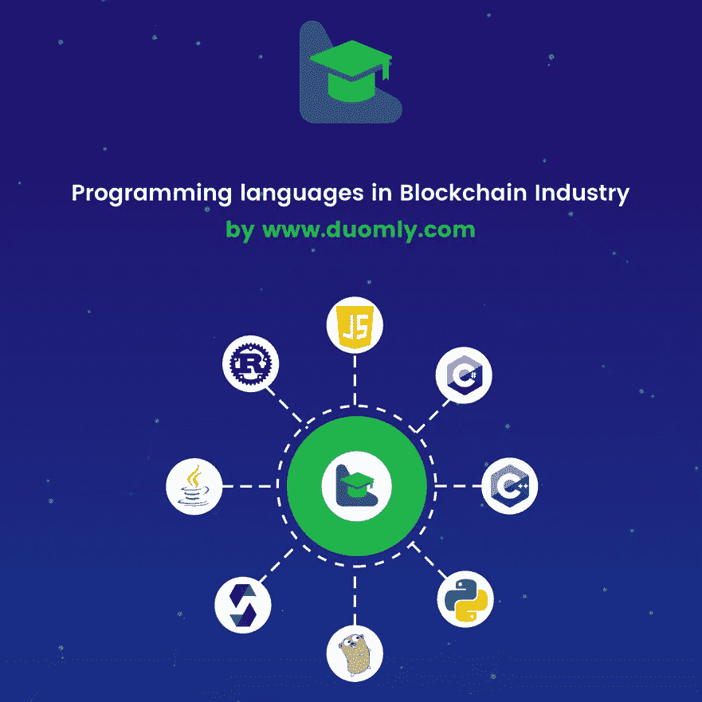
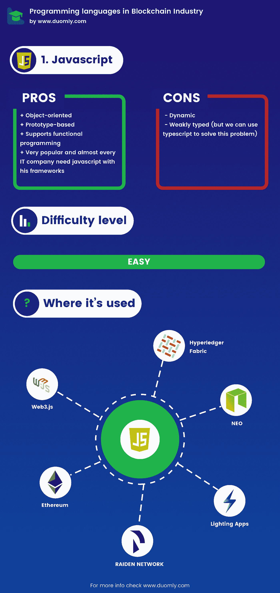
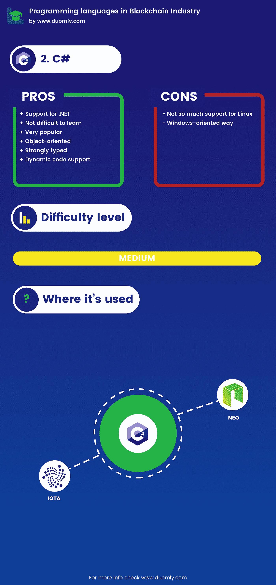
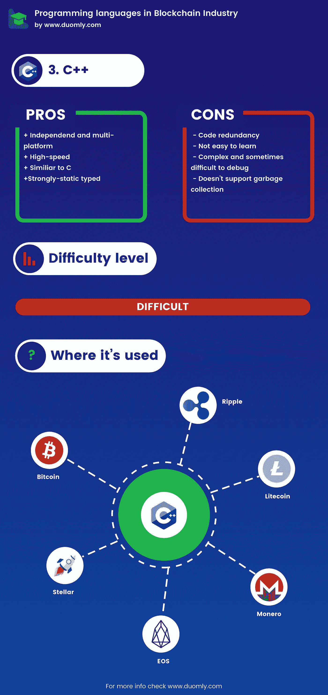
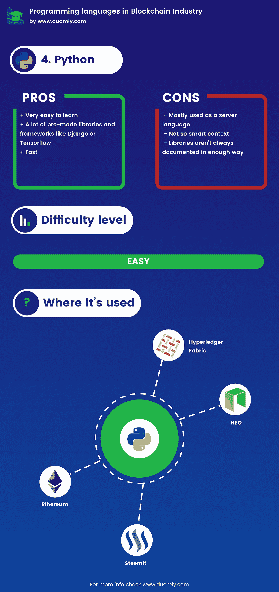
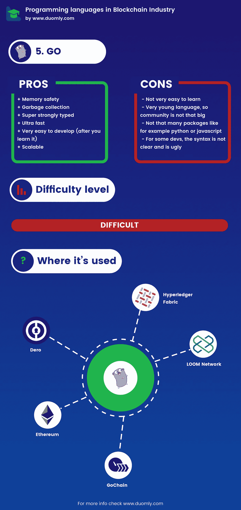
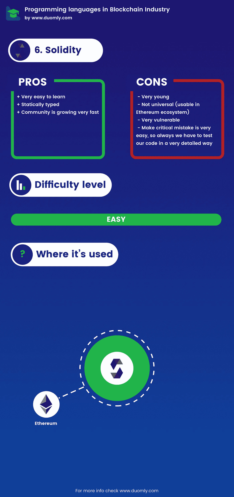
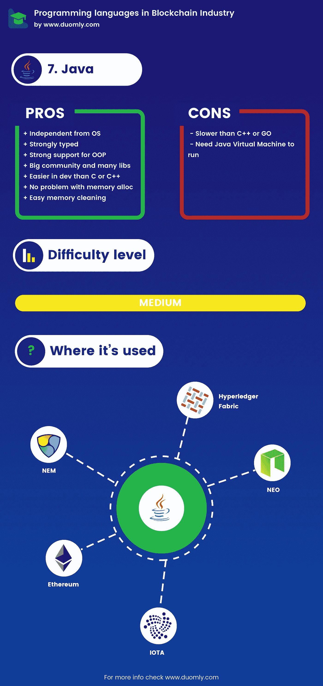
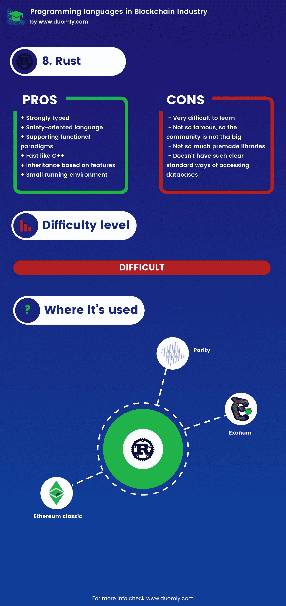

# 哪种编程语言最适合做区块链开发者

> 原文：<https://medium.com/duomly-blockchain-online-courses/which-programming-language-is-the-best-to-be-a-blockchain-developer-2cb288e14765?source=collection_archive---------0----------------------->

[www.duomly.com](https://www.duomly.com/)

本文最初发表于:[https://www . blog . duomly . com/which-programming-language-is-the-best-for-区块链/](https://www.blog.duomly.com/which-programming-language-is-the-best-for-blockchain/)

区块链因为安全、快速和去中心化(不总是这样，但在大多数情况下是这样)是一种技术，它正在以非常快的速度进入我们的世界、商业、生活和企业。

数以千计的区块链项目正在开发或已经开发并部署到互联网上。各公司都在寻找新的区块链创意，或者试图改进其他公司疯狂创造的东西，而这只是区块链科技管理世界的开始。

对我们来说，开发商或想在区块链行业开始工作的人就像一个梦想。我们可以马上找到一份薪水很高、条件很好的工作。然而，这是一个重要的问题。

**成为区块链开发者应该学习哪种编程语言？**

在区块链开发区，我们有几种最流行的语言，它们是 Javascript、C#、C++、Python、Golang、Solidity、Java 和 Rust。

现在，我将尝试向您解释每种语言的简短描述、优缺点、从头学习该语言的难度，以及哪个区块链项目正在使用该语言。

**1。Javascript**

[www.duomly.com](https://www.duomly.com/)

Javascript 是被定义为高级的解释编程语言。

对我们来说最重要的是 javascript 是基于原型的、动态的和弱类型的，是领先的 web 技术之一。

几年前的 Javascript 非常流行，许多公司正在为 javascript 创建新的框架，如 angular/react/vue/node.js，它们可以帮助我们开发代码。

**优点**

-面向对象

-基于原型

-支持函数式编程

-非常流行，几乎每个 IT 公司都需要 javascript 和他的框架

**缺点**

-动态

-弱类型(但是我们可以使用 typescript 来解决这个问题)

**难度等级**

Javascript 的入门难度比较低，我们不需要学很深就能使用它。

要开始使用 javascript，我们需要学习基础知识，并在以后需要时进行更深入的学习。

事实上，互联网上有很多课程和教程，比如 Duomly 的 [javascript 课程，不仅针对纯 Javascript，也针对流行的框架。](https://www.duomly.com/course/javascript-course)

**在区块链哪里使用**

最受欢迎的地方是 web3.js 和 ethereum.js，它们帮助我们将应用程序的前端与 ethereum 网络和智能合约连接起来。

开发人员使用 javascript 的下一个流行方式是 Hyperledger Fabric SDK for node.js，这是一个在大公司和企业中经常使用的巨大框架，所以如果你喜欢这种工作方式，它可能是你的一个好选择。

另一个更受欢迎的区块链是 NEO，它可以使用 javascript 处理合同，速度非常快，每秒可以处理几千笔交易。

不太出名但仍然经常使用的 javascript 用例是 lighting apps，它是基于比特币区块链构建的超高速网络，我想提到的第二个是 Raiden network，它是基于以太坊区块链的高速基础设施。

**2。C#**

[www.duomly.com](https://www.duomly.com)

C#是一种高级的、编译过的、面向对象的编程语言，创建于 90 年代末—2000 年代初，为微软所用。

它非常类似于 Java 或 C++语言，类似于 Java C++代码是类的集合并使用继承。

**优点**

-支持。网

-有点容易学

-非常受欢迎

-面向对象

-强类型

-动态代码支持

**缺点**

-不太支持 Linux

-面向 Windows 的方式

**难度等级**

对我来说，这是比 javascript 更难学的语言，因为语法和类型，但不像例如 Go 那样困难和复杂。

此外，大量好的免费学习资源使这门语言成为最容易学习的语言之一。

**用在什么地方**

C#在一些流行的区块链项目中使用，其中最流行的是 NEO，它被命名为中国版的以太坊。

Neo 是一个高速区块链平台，每秒可以处理甚至几千个交易。

我们使用 C#的下一个流行项目是 IOTA，这是一个面向物联网的高度可扩展、零费用交易的 tangle 类型项目。

**3。C++**

[www.duomly.com](https://www.duomly.com/)

C++是一种强静态类型、高速、面向对象的编译语言。

重要的是，C++具有高水平的效率和对硬件的访问。

有趣的是，C++是在 70-80 年代创建的，是对 C 的扩展。

**优点**

-独立和多平台

-高速

-类似于 C

-强静态类型

**缺点**

-代码冗余

-不太好学

-复杂，有时难以调试

-不支持垃圾收集

**难度等级**

C++因为它比 C 更复杂，学起来更有挑战性，而 C 至少是中等/难学的。

对于初学者来说，这绝对不是一门简单的语言。

**用在什么地方**

C++用于许多流行的区块链加密货币和重要的区块链项目，如:

-比特币(最著名的加密货币)

- Ripple(集中式超快速货币)

-比特币现金(加密货币)

-莱特币(加密货币)

- Monero(加密货币)

- Eos(拥有名为 Eos 的加密货币的快速区块链网络)

- Stellar(支付网，创始人之一是电驴的创造者)

- QTUM(以太坊和比特币的混合体)

-Cpp-以太坊(以太坊的 C++实现)

**4。Python**

[www.duomly.com](https://www.duomly.com/)

时髦的高级动态类型编程语言。

Python 支持面向对象和函数式编程。

这种语言比以前更受欢迎了。Python 是开发机器学习和人工智能功能的优秀语言。

IT 巨头通过创建 dialogflow 或 tensorflow 等智能工具和框架来支持 Python。

Python 是创建聊天机器人最常用的语言之一。

**优点**

-非常容易学习

-许多预制的库和框架，如 Django 或 Tensorflow

-快

**缺点**

-主要用作服务器语言

-不太聪明的上下文

-库并不总是以足够的方式记录

**难度等级**

Python 非常流行，经常被选为第一编程语言。

互联网包含大量的教程和课程，如 Duomly 的 [Python 课程，这使得 Python 成为最容易学习的编程语言之一。](https://www.duomly.com/course/python-course)

**用在什么地方**

在区块链工业中，Python 被用于许多好的项目，例如，有自己的以太坊(pyethereum)实现，我们可以用它来创建 NEO 的合同和 Hyperledger 的 smartcontracts。

还有一件事我想提的是史蒂芬森。这是 steemit 的 pythons 实现，steemit 是一种流行的社交媒体——内容提供生态系统。

**5。戈朗**

[www.duomly.com](https://www.duomly.com/)

Go 是由 Google 员工创建的静态类型、编译的编程语言。

第一个想法是，Go 应该包含像 Python 这样易于开发的代码和像 C++这样高效的编译语言。

**优点**

-内存安全

垃圾收集

-超级强类型

-超快

-非常容易开发，在你学会之后

-可扩展

**缺点**

-不太好学

-非常年轻的语言，所以社区没有那么大

-没有那么多像 python 或 javascript 这样的包

-对于一些开发人员来说，语法不清晰而且难看

**难度等级**

围棋在互联网上没有像 javascript 那样的好教程，JavaScript 可以从各个地方攻击你，人们必须更深入地寻找才能找到东西，而且是复杂的语言，所以围棋有很难学习的观点。

然而，这种观点经常来自 python/javascript 开发人员，因为 go 与这些语言非常不同。

无论如何，如果你来自 C++或 Java，学习围棋对你来说应该很容易。

**用在哪里**

我们可以没完没了地谈论与 Golang 相关的项目，但我将尝试描述最受欢迎的项目。

围棋最重要的项目之一是 Go-Ethereum，它是用 golang 编写的。

用 Go 编写的下一个重要项目是 Hyperledger Fabric，这是大公司最受欢迎的区块链解决方案之一。

针对分散式网络游戏的令人兴奋的项目 Loom Network 也在 Go 中编写了链。使用区块链的不太受欢迎的项目是 Btcd，它的 bitcoing 实现用 Go 编写，接下来是 Gochain，快速以太坊兼容的区块链用 Go 编写。

此外，我想提到的 Golang 项目中编写的最后一个是 fast，目标是智能合同区块链的隐私，名为 Dero。

**6。坚实度**

[www.duomly.com](https://www.duomly.com/)

以太坊开发者创建的面向契约的静态类型语言。

为 EVM 创建，作为智能合约开发的主要语言，也是以太坊智能合约的主要语言。

**优点**

-静态类型

-非常容易学习

-受欢迎程度增长非常快

**缺点**

-非常年轻

-社区还不大，所以支持更少

-不通用(可用于以太坊生态系统)

-非常脆弱

-犯严重错误非常容易，因此我们必须以非常详细的方式测试我们的代码

**难度等级**

Solidity 并不是一种复杂的语言，有点像小得多的 javascript 副本，只有一些类似类型的变化(我们在 typescript 中使用类型，这在 javascript 的项目中经常使用)。

因此，中等经验的 javascript 开发人员可以在几天内学会 solidity，尤其是当我们有很多像 duomly.com 这样的交互式教程时。

**用在什么地方**

我们将使用 solidity 语言来开发以太坊智能合约。

我没有看到其他使用 solidity 的项目，但是以太坊开发生态系统是巨大的，并且是现在区块链开发中最重要的部分之一，所以 solidity 是区块链行业中最流行的语言之一。

**7.Java**

[www.duomly.com](https://www.duomly.com)

Java 是由 Sun Microsystems 创建的编译型、强类型对象和基于类的编程语言。

Java 非常面向对象编程，在大公司中非常流行。

**优点**

-独立于操作系统

-强类型

-对面向对象编程的强大支持

-大型社区和图书馆收藏

-比 C 或 C++等语言更易于开发

-内存分配没有问题

-轻松清理内存

**缺点**

-需要 Java 虚拟机才能运行

-比 C++或 Go 慢

**难度等级**

我们可以将难度水平与 C#进行比较，c#可能比 javascript 或 python 更难，更复杂，但它是一种非常受欢迎的语言，有大量的学习资源。

还可以明显看出，Java 比 Golang 或 C++更容易。

**用在哪里**

Java 在区块链业界非常流行，从更流行的是用在 IOTA 上(我在 C# step 中描述了 IOTA 是什么)。流行的 P2P 加密货币和名为 NEM 的平台也在使用 Java(NEM 是用 Java 写的)。

我们可以使用 Java 的其他流行项目有:

-尼奥的合同

- Hyperledger 的合同

- IBM 区块链公司

- BitcoinJ(比特币在 Java 中的实现)

以太坊

**8。生锈**

[www.duomly.com](https://www.duomly.com/)

系统，编译，强类型编程语言，从 2009 年开始，Mozilla 负责开发和赞助 Rust。

Rust 的语法类似于 C++。

**优点**

-强类型

-面向安全的语言

-支持功能范例

-像 C++一样快

-基于特征的继承

-运行环境小

**缺点**

-非常难学

-不太出名，所以社区不是很大，例如 javascript，对库的访问更少，开发人员必须从头开始重写许多问题

-没有如此清晰的访问数据库的标准方法

**难度等级**

Rust 的语法和 C++差不多，所以这种编程语言肯定不好学。

此外，这个社区要小得多，所以我可以告诉你这个社区的入学水平很高，而且我可以把难度定义为难。

**用在什么地方**

很少有真正受欢迎的区块链项目使用 Rust。

其中之一是奇偶校验，一个非常快速和安全的以太坊客户端，它是用 Rust 编写的。

下一个可能是最受欢迎的是以太坊经典，它是在以太坊大黑客之后诞生的加密货币。

最后一个是用 Rust Exonum 编写的，Exonum 是区块链面向安全的框架，每秒可以处理几千个事务。

**总结(获奖者)**

**区块链行业最大金额招聘**

1.区块链 Javascript — 565 份工作机会

2.区块链稳固性— 424 份工作机会

3.区块链 Python — 394 个工作机会

4.区块链 Go — 361 个工作机会

5.区块链 C# — 301 个工作机会

6.区块链 C++ — 301 个工作机会

7.区块链 Java — 289 个工作机会

8.区块链 Rust — 54 份工作机会

**获胜者:Javascript**

薪酬最高的工作机会

为了获得最高薪的工作机会，我们每年接受 15 万美元以上的范围，我们将根据该技术的工作机会数量进行排序。

结果如下。

1.区块链 Javascript — 89 份工作机会

2.区块链 Go — 81 个工作机会

3.区块链可靠性— 77 份工作机会

4.区块链 Python: 71 个工作机会

5.区块链 C# — 61 份工作机会

6.区块链 C++ — 61 个工作机会

7.区块链 Java — 52 份工作机会

8.区块链 Rust — 14 份工作机会

**获胜者:Javascript**

**简单易学**

当然，学习是个人的事情，但是编程语言或多或少都很复杂，在互联网上或多或少都有学习资源，所以我决定根据我的个人经验和互联网统计。

在对编程语言的难度进行统计研究后，根据我的经验，我可以将它们排序如下:

1.固态

2.计算机编程语言

3.java 描述语言

4.Java / C#

5.C++

6.去

7.锈

**赢家:稳健**

**通用**

检查完所有要点后，我们可以键入 general winner。

因为 Javascript 每次都在应用程序的前端使用，所以在后端使用并不少见，一般来说，中间件有最多的工作机会，也有最多的高薪工作机会。

对于学习来说并不复杂，结合稳固是一个很好的组合。当然，直到 dApps 不会失去人气。

**赢家:Javascript 和 solidity。**

然而，如果你检查我的排名，所有的语言都有很多工作机会，很多工作机会都有很好的薪水。

所以对我们来说，工作机会的数量和难度的差异很小，所以我们可以告诉你，通过这些语言的人，你可以很快找到一份好工作。

[www.duomly.com](https://www.duomly.com/)

感谢阅读，
拉多斯瓦夫·法比西亚克，

[中的核心开发者多](https://www.duomly.com/)