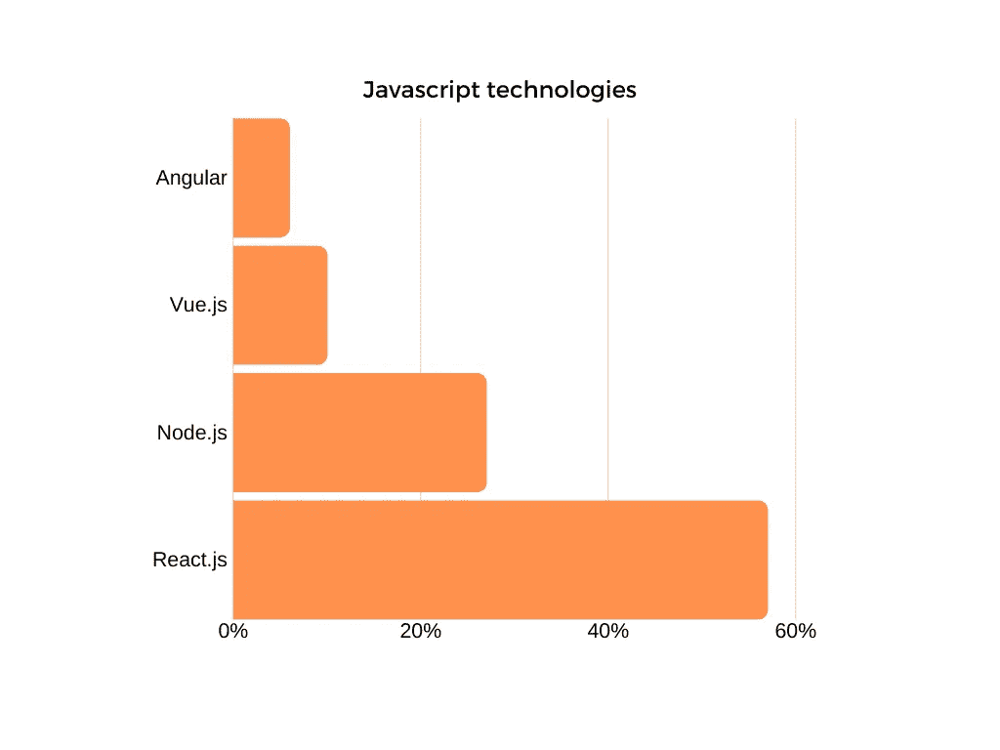
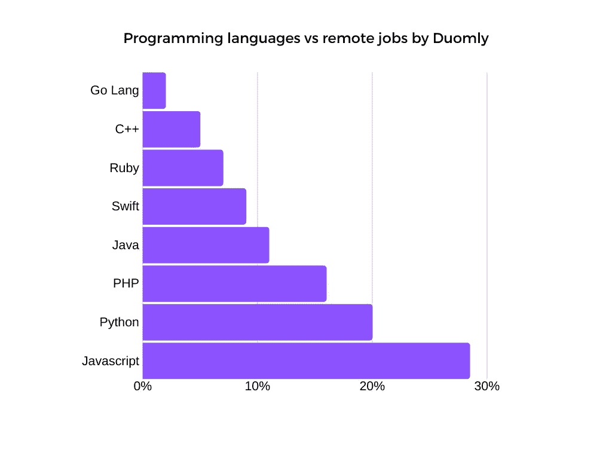

# 获得远程工作应该学习哪种编程语言？

> 原文：<https://medium.com/quick-code/which-programming-language-should-you-learn-to-get-a-remote-job-4fd81e886770?source=collection_archive---------0----------------------->

[Duomly — programming online courses](https://www.duomly.com)

我最近注意到，远程工作对许多人来说是一个非常有趣的话题。这让我想到，我们大多数人都想找一份工作，有在家工作的可能性，并且有一个选择，如果你喜欢去办公室和别人见面，或者如果你喜欢呆在家里在自己的办公桌上工作。

当然，这不是每个职业都能做到的；例如，对于一个计划手术的医生来说，远程手术可能很难，但对于许多办公室工作人员来说，这很容易做到。这在很大程度上取决于公司和管理层，但随着越来越多的技术允许人们轻松合作，唯一的条件是良好的互联网连接，许多公司开始将其视为一种非常有益的合作形式。

远程工作在初创公司中变得非常普遍，这些公司的预算有限，因为他们可以从许多不同的地方选择优秀的专家，而且不同国家的人有不同的财务预期。但它也向公司表明，给员工一些自由可能会带来生产率的大幅提高和办公设施的大幅节省。

为了帮助那些有兴趣获得远程程序员工作机会的人，我浏览了最受欢迎的网站，并检查了哪些技术会使它变得容易。

让我们来看看。

## 1.java 描述语言

在我所做的研究中，Javascript 成为了允许远程工作的技术之王。远程程序员的大部分工作机会都需要 Javascript 知识，在简历中加入这种编程语言会让远程工作的搜索变得更加容易。

考虑到 Javascript 主要用于框架，对于前端或后端，最好的解决方案是学习 React.js，因为它是 Javascript 远程工作机会中最受欢迎的前端技术。

[Duomly — programming online courses](https://www.duomly.com)

第二个最流行的 Javascript 框架是 Node.js，它允许使用 js 编程语言进行后端工作。它在初创公司中很常见，但最近更大的公司也在使用 Node.js。所以，如果你对后端或全栈远程位置感兴趣，值得学习。

稍微不常见的是 VueJS 和 Angular。VueJS 仍然是一个越来越受欢迎的框架，所以不是一个很好的位置，但是，如果你知道这些技术中的一个，你可以选择获得一个现有的提议。

## 2.计算机编程语言

Python 是一种在 web 开发中与 Django 一起使用的流行编程语言，但是随着机器学习的显著增长，Python 的流行程度也增长了很多。现在，它是第二受欢迎的编程语言，允许我们获得远程工作。

Python 远程工作机会主要提到人工智能、机器学习和数据科学，所以如果你是 Python 开发人员，深入研究这些主题无疑是一个好主意，可以增加你获得家庭办公机会的机会。

## 3.服务器端编程语言（Professional Hypertext Preprocessor 的缩写）

PHP 是几年前普遍使用的技术之一，但仍然有使用 PHP 编写的项目，并且需要能够使用这种编程语言的开发人员。

PHP 与 Zend 或 Symfony 等框架一起使用，但也用于为 Wordpress(一个非常流行的内容管理系统)创建自定义模板。

如果你是一个有经验的 PHP 开发人员，你可以很容易地跳到这些远程位置之一。

## 4.Java 语言(一种计算机语言，尤用于创建网站)

Java 是一种非常流行的后端语言，通常用于 Spring 或 Hibernate 框架。了解 Java 或 Kotlin 的后端开发人员有很多机会。

对于后端技术，还需要 SQL 和数据库知识，但我猜如果你是一个有经验的后端开发人员，你可能知道它。

如果你现在选择学习什么技术，以便在这种舒适的环境下从大量的远程工作中进行选择，那么请记住这些信息。

## 5.迅速发生的

另一项在远程招聘中流行的技术是 Swift。这是一种相对较新的编程语言。Swift 创建于 2014 年，是一种为 IOS 系统设备编程的编程语言。这种语言是 Objective-C 语言的后继者，它是由苹果公司和克里斯·拉特纳共同开发的。

考虑到这是一项新技术，学习它可能是一个好主意，因为获得这份工作的竞争可能相当小。

## 6.红宝石

Ruby 编程语言在远程工作机会中的流行主要来自 Ruby on Rails web 应用程序框架。Ruby on Rails 中的代码可读性很强，并且是自文档化的。

作为 Ruby on Rails 程序员，您可以从大量远程工作机会中进行选择。

## 7.C++

公司使用 C++来创建高性能的应用程序，因为这种编程语言的编译和执行比其他多用途语言好得多。使用 C++，我们能够创建浏览器引擎、数据库、银行应用等。

C++在小公司和初创公司中并不常见，但大公司也提供家庭办公，所以如果你是 C++开发人员，不用担心，你仍然可以得到一份远程工作。

## 8.加油郎

Go Lang 是一种非常年轻的编程语言，由 Google 工程师创建。它将编写应用程序的简易性与编译语言的良好性能联系起来。Go lang 用于物联网、机器学习和机器人的项目，因此它是一项潜力巨大的技术。

如果你没有选择要学习的技术，这可能是未来的一个很好的选择。在远程工作的情况下，记住 Go lang 开发者的数量是非常有限的，所以竞争不会很激烈。

[Duomly — programming online courses](https://www.duomly.com)

## 结论

看一下上面的图表，你可以清楚地看到 Javascript 在远程工作机会的数量上领先。原因是大多数 web 和移动应用程序需要一个前端，这在大多数情况下是使用 Javascript 及其框架来完成的。但是选择 Javascript 作为寻找远程工作的主要技术也有一些缺点；最大的一个问题是，招聘人员收到的一个远程 JS 职位的简历数量非常大，可能很难引起注意。

另一个解决方案是选择最流行的远程工作编程语言来学习新技术，这在开发人员中还不是很普遍。那么你就有机会让你的简历非常容易引人注目，因为你是需要技能的人。

获得远程理想工作的另一种方式可能是学习 PHP 等更古老的技术，这种技术仍被广泛使用，为远程员工提供工作机会也很常见，但在这种情况下，你的工资可能不会像新技术案例那样令人印象深刻。

如果你更喜欢学习最新的东西，或者你想使用流行的或者稍微旧一点的技术，那么选择权属于你。但无论你将做出何种选择，都有很大机会获得这份工作，让你可以远程工作。

祝您的远程工作好运！

[Duomly — programming online courses](https://www.duomly.com)