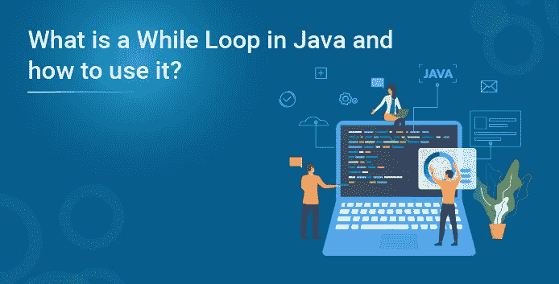
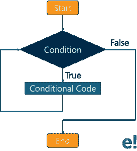

# Java 中什么是 While 循环，如何使用？

> 原文：<https://medium.com/edureka/while-loop-in-java-a4dce110d329?source=collection_archive---------1----------------------->



Java 语言提供了几个循环。循环基本上用于重复执行一组语句，直到满足特定条件。在这里，我将告诉你 Java 中的‘while’循环。本文包含的主题如下:

*   Java 中的 while 循环是什么？
*   while 循环的语法
*   实践演示
*   什么是无限 while 循环？
*   无限 while 循环的语法
*   实践演示

我们开始吧！

# Java 中的 while 循环是什么？

Java while 循环用于反复迭代程序的一部分。如果迭代次数不固定，那么可以使用 while 循环。

while 循环如何工作的图示:



在上图中，当执行开始且条件返回 false 时，控制将跳转到 while 循环后的下一条语句。另一方面，如果条件返回 true，则执行 while 循环中的语句。

继续这篇关于 Java 中的 While 循环的文章，让我们来看看语法:

## 语法:

```
while (condition) {

  // code block to be executed

}
```

现在我已经向您展示了语法，下面是一个示例:

## 实际实施:

```
class Example {
    public static void main(String args[]){
         int i=10;
         while(i>1){
              System.out.println(i);
              i--;
         }
    }
}
```

## 输出:

10
9
8
7
6
5
4
3
2

接下来，我们来看另一个例子:

## Java 中 While 循环的另一个例子:

```
// Java While Loop example

package Loops;

import java.util.Scanner;

public class WhileLoop {
    private static Scanner sc;

    public static void main(String[] args) {
        int number, sum = 0;
        sc = new Scanner(System.in);    

        System.out.println("n Please Enter any integer Value below 10: ");
        number = sc.nextInt();

        while (number <= 10)  {
            sum = sum + number;
            number++;
        }
        System.out.format(" Sum of the Numbers From the While  Loop is: %d ", sum);
    }
}
```

**输出**:

请输入任何小于 10: 7 的整数值
While 循环中的数字之和为:34

与前面的例子相比，上面的例子有点复杂。让我一步一步来解释。

在这个 Java while 循环示例中，机器会要求用户输入任何小于 10 的整数值。接下来，While 循环和 While 循环中的条件将确保给定的数字小于或等于 10。

现在，用户输入值= 7，我已经初始化了 sum = 0

这就是迭代的工作方式:(关注代码中编写的 while 循环)

**第一次迭代:**

sum = sum+number
sum = 0+7 = =>7
现在，数字将增加 1 (number ++)

**第二次迭代**

现在，在第一次迭代中，Number 和 sum 的值都已更改为:Number = 8 和 sum = 7
sum = sum+Number
sum = 7+8 = =>15
同样，数字将增加 1 (number ++)

**第三次迭代**

现在，在第二次迭代中，Number 和 sum 的值都已更改为:Number = 9 和 sum = 15
sum = sum+Number
sum = 15+9 = =>24
遵循相同的模式，Number 将再次递增 1 (number ++)。

**第四次迭代**

在 Java while 循环的第三次迭代中，Number 和 sum 的值都更改为:Number = 10，sum = 24
sum = sum+Number
sum = 24+10 = =>34

最后，数字将最后一次递增 1 (number ++)。

这里，数字= 11。因此，while 循环中出现的条件失败。

最后 System.out.format 语句会打印出上面看到的输出！

再往前走，

您需要记住的一点是，您应该在 while 循环中使用 increment 或 decrement 语句，以便循环变量在每次迭代中都发生变化，从而在某个时刻，条件返回 false。这样就可以结束 while 循环的执行。否则，循环将无限期执行。在这种情况下，循环无限执行，您将在 [Java](https://www.edureka.co/blog/what-is-java/) 中遇到无限 while 循环的概念，这是我们下一个讨论的主题！

# Java 中的无限 while 循环

当您在 while 循环中传递' true '时，将启动无限 while 循环。

**语法**:

```
while (true){
    statement(s);
}
```

## 实践演示

让我给你看一个 Java 中无限 While 循环的例子:

```
class Example {
    public static void main(String args[]){
         int i=10;
         while(i>1)
         {
             System.out.println(i);
              i++;
         }
    }
}
```

这是一个无限的 while 循环，因此不会结束。这是因为代码中的条件表示 i>1，这将始终为真，因为我们在 while 循环中增加了 I 的值。

到此，我的博客就结束了。我真的希望上面分享的内容能对你的 Java 知识有所帮助。让我们一起继续探索 Java 世界。敬请期待！如果你想查看更多关于人工智能、DevOps、道德黑客等市场最热门技术的文章，那么你可以参考 [Edureka 的官方网站。](https://www.edureka.co/blog/?utm_source=medium&utm_medium=content-link&utm_campaign=java-while-loop)

请留意本系列中解释 Java 其他各方面的其他文章。

> *1。* [*面向对象编程*](/edureka/object-oriented-programming-b29cfd50eca0)
> 
> *2。*[*Java 中的继承*](/edureka/inheritance-in-java-f638d3ed559e)
> 
> *3。*[*Java 中的多态性*](/edureka/polymorphism-in-java-9559e3641b9b)
> 
> *4。*[*Java 中的抽象*](/edureka/java-abstraction-d2d790c09037)
> 
> *5。* [*Java 字符串*](/edureka/java-string-68e5d0ca331f)
> 
> *6。* [*Java 数组*](/edureka/java-array-tutorial-50299ef85e5)
> 
> *7。* [*Java 集合*](/edureka/java-collections-6d50b013aef8)
> 
> *8。* [*Java 线程*](/edureka/java-thread-bfb08e4eb691)
> 
> *9。*[*Java servlet 简介*](/edureka/java-servlets-62f583d69c7e)
> 
> 10。 [*Servlet 和 JSP 教程*](/edureka/servlet-and-jsp-tutorial-ef2e2ab9ee2a)
> 
> *11。*[*Java 中的异常处理*](/edureka/java-exception-handling-7bd07435508c)
> 
> *12。* [*高级 Java 教程*](/edureka/advanced-java-tutorial-f6ebac5175ec)
> 
> 13。 [*Java 面试题*](/edureka/java-interview-questions-1d59b9c53973)
> 
> *14。* [*Java 程序*](/edureka/java-programs-1e3220df2e76)
> 
> 15。 [*科特林 vs Java*](/edureka/kotlin-vs-java-4f8653f38c04)
> 
> *16。* [*依赖注入使用 Spring Boot*](/edureka/what-is-dependency-injection-5006b53af782)
> 
> *17。* [*堪比 Java 中的*](/edureka/comparable-in-java-e9cfa7be7ff7)
> 
> *18。* [*十大 Java 框架*](/edureka/java-frameworks-5d52f3211f39)
> 
> *19。* [*Java 反射 API*](/edureka/java-reflection-api-d38f3f5513fc)
> 
> *20。*[*Java 中的 30 大模式*](/edureka/pattern-programs-in-java-f33186c711c8)
> 
> *21。* [*核心 Java 备忘单*](/edureka/java-cheat-sheet-3ad4d174012c)
> 
> *22。*[*Java 中的套接字编程*](/edureka/socket-programming-in-java-f09b82facd0)
> 
> *23。* [*Java OOP 备忘单*](/edureka/java-oop-cheat-sheet-9c6ebb5e1175)
> 
> *24。*[*Java 中的注释*](/edureka/annotations-in-java-9847d531d2bb)
> 
> *25。*[*Java 中的库管理系统项目*](/edureka/library-management-system-project-in-java-b003acba7f17)
> 
> *26。*[*Java 中的树*](/edureka/java-binary-tree-caede8dfada5)
> 
> *27。*[*Java 中的机器学习*](/edureka/machine-learning-in-java-db872998f368)
> 
> *28。* [*顶级数据结构&Java 中的算法*](/edureka/data-structures-algorithms-in-java-d27e915db1c5)
> 
> 29。 [*Java 开发者技能*](/edureka/java-developer-skills-83983e3d3b92)
> 
> *三十。* [*前 55 名 Servlet 面试问题*](/edureka/servlet-interview-questions-266b8fbb4b2d)
> 
> *31。*[](/edureka/java-exception-handling-7bd07435508c)*[*顶级 Java 项目*](/edureka/java-projects-db51097281e3)*
> 
> *32。 [*Java 字符串备忘单*](/edureka/java-string-cheat-sheet-9a91a6b46540)*
> 
> **33。*[*Java 中的嵌套类*](/edureka/nested-classes-java-f1987805e7e3)*
> 
> **34。* [*Java 集合面试问答*](/edureka/java-collections-interview-questions-162c5d7ef078)*
> 
> **35。*[*Java 中如何处理死锁？*](/edureka/deadlock-in-java-5d1e4f0338d5)*
> 
> *36。 [*你需要知道的 50 个 Java 合集面试问题*](/edureka/java-collections-interview-questions-6d20f552773e)*
> 
> *37。[*Java 中的字符串池是什么概念？*](/edureka/java-string-pool-5b5b3b327bdf)*
> 
> **38。*[*C、C++和 Java 有什么区别？*](/edureka/difference-between-c-cpp-and-java-625c4e91fb95)*
> 
> **39。*[*Java 中的回文——如何检查一个数字或字符串？*](/edureka/palindrome-in-java-5d116eb8755a)*
> 
> **40。* [*你需要知道的顶级 MVC 面试问答*](/edureka/mvc-interview-questions-cd568f6d7c2e)*
> 
> **41。*[*Java 编程语言的十大应用*](/edureka/applications-of-java-11e64f9588b0)*
> 
> **42。*[*Java 中的死锁*](/edureka/deadlock-in-java-5d1e4f0338d5)*
> 
> **43。*[*Java 中的平方和平方根*](/edureka/java-sqrt-method-59354a700571)*
> 
> **44。*[*Java 中的类型转换*](/edureka/type-casting-in-java-ac4cd7e0bbe1)*
> 
> **45。*[*Java 中的运算符及其类型*](/edureka/operators-in-java-fd05a7445c0a)*
> 
> *46。[*Java 中的析构函数*](/edureka/destructor-in-java-21cc46ed48fc)*
> 
> **47。*[*Java 中的二分搜索法*](/edureka/binary-search-in-java-cf40e927a8d3)*
> 
> **48。*[*Java 中的 MVC 架构*](/edureka/mvc-architecture-in-java-a85952ae2684)*
> 
> *49。 [*冬眠面试问答*](/edureka/hibernate-interview-questions-78b45ec5cce8)*

**原载于 2021 年 6 月 17 日 https://www.edureka.co*[](https://www.edureka.co/blog/java-while-loop/)**。***

***原载于 2019 年 7 月 26 日*[*https://www.edureka.co*](https://www.edureka.co/blog/java-while-loop/)*。***