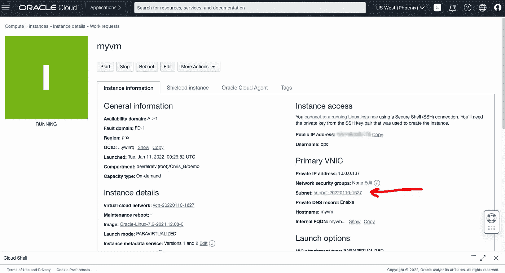
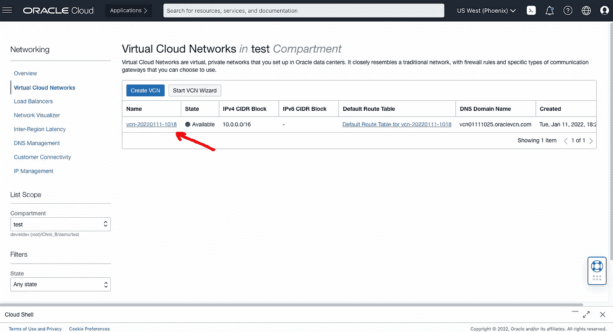

# 允许列出您的 IP 地址以安全连接到 OCI 计算实例

> 原文：<https://medium.com/oracledevs/white-list-your-ip-address-to-security-connect-to-an-oci-compute-instance-4fb99958f0d9?source=collection_archive---------3----------------------->

克里斯·本森

如果你愿意，你可以在 GitHub [这里](https://github.com/chrisbensen/chris-blogs/blob/main/HowTo/IPAddress/IPAddress.md)阅读这篇博文。

首先，一些定义:

堡垒主机是唯一一台作为安全网络代理的计算机。

**VPN** 是一种让用户安全连接网络的安全技术。

每次我用一个公共 IP 地址在云中设置一个虚拟机时，所有的安全警报都会在我脑海中响起，这是理所应当的。建立一个堡垒或虚拟专用网可能是如此痛苦，似乎矫枉过正。说真的，当你在建一个周末小屋的时候，谁有时间做这些？因此，这里有一个非常简单的方法来允许列出您的公共 IP 地址，这样您的计算机是唯一可以与虚拟机交互的计算机。

**步骤 1 —获得 Oracle 免费层**

这需要一个 Oracle 云帐户。您可以免费获得一个名为[免费等级账户](/oracledevs/create-an-oracle-always-free-cloud-account-bc6aa82c1397)的账户。我将演示如何使用 Oracle 免费层做到这一点，因为它是免费的！永远免费给你。说真的，在云中获得几百 g 的存储空间和一些免费的处理器是一笔不错的交易。

**步骤 2 —创建一个计算实例**

Oracle cloud 将虚拟机称为“计算”，因此，使用这些步骤创建其中一个虚拟机，这将为您提供一个“实例”:**创建计算实例**

**步骤 3 —获取路由器的 IP 地址**

从我的博客文章[我如何从命令行](http://chrisbensen.blogspot.com/2021/11/how-do-i-find-my-routers-public-ip.html)找到我的路由器的公共 IP 地址？，打开本地终端，运行以下命令获取路由器的 IP 地址并复制它:

`dig -4 TXT +short o-o.myaddr.l.google.com [@ns1](http://twitter.com/ns1).google.com`

它将被称为 **<个性化地址>**

**步骤 4 —设置安全列表，允许列出您的 IP 地址**

现在您已经有了一个实例和您的公共 IP 地址，按照以下步骤只允许您的计算机通过 SSH(端口 22)访问该实例。

1.单击“子网”字段旁边的链接，这将带您进入虚拟云网络列表:

2.单击 VCN:

3.点击“默认安全列表”:

4.在“入口规则”下，您可以看到 SSH(端口 22)已经有了一个规则。点按右侧的三个点，然后选取“编辑”:

**注意:**您可以通过点击“添加入口规则”按钮来添加您自己的规则，但是您不需要这样做，因为它已经创建好了。

5.在“源 CIDR”中填入您在上述步骤 3 中获得的个人 IP 地址，并在末尾加上“/32”以将其限制为一台机器:

`<PersonalIPAddress>/32`

例如:1.2.3.4/32

6.单击“保存更改”你完了。

**步骤 5 —测试**

从本地终端运行以下命令:

**注意:** INSTANCE_IP 来自创建计算机时的第 2 步:

`ssh -i ~/.ssh/oci_id_rsa opc@${INSTANCE_IP}`

*注意——免费层用户可能会体验到其帐户所含服务的变化。*