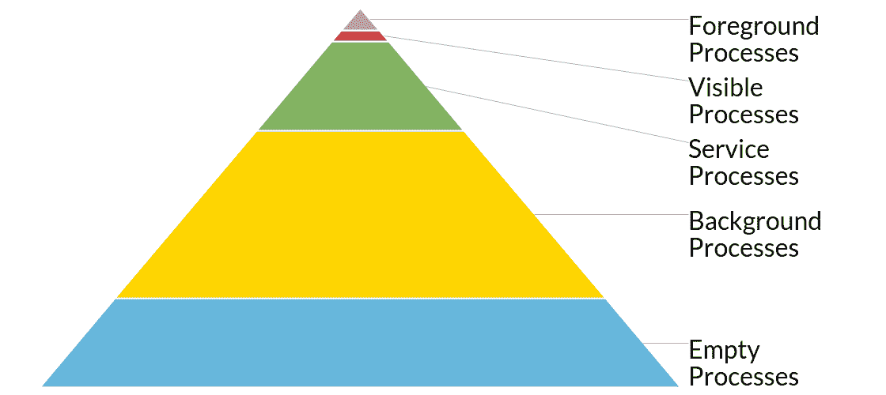

# 谁生谁死？Android 上的流程优先级

> 原文：<https://medium.com/androiddevelopers/who-lives-and-who-dies-process-priorities-on-android-cb151f39044f?source=collection_archive---------3----------------------->

让我们面对现实:移动设备没有无限的内存、无限的电池或无限的其他东西。这对你的应用来说意味着**你应该将进程死亡视为你的应用生命周期的一个自然部分**。重要的是确保与终止进程相关的内存回收不会对用户产生负面影响。事实上，Android 中的大部分流程架构都是专门设计的，以确保排序不是任意的，而是遵循一个重要的层次结构中的固定模式。

# Android 流程层级

您会发现最重要的流程被称为前台流程，其次是任何可见流程、服务流程、后台流程，最后是“空”流程，详见[文档](http://developer.android.com/guide/components/processes-and-threads.html?utm_campaign=adp_series_processes_012016&utm_source=medium&utm_medium=blog#Lifecycle)，我们将在此详述。

注意，虽然我们将讨论具体的组件(服务、活动)， **Android 只杀死进程，不杀死组件。当然，这并不排除通常的垃圾收集过程(这将回收未引用对象的内存)，但这是另一篇文章的主题。**



## 前台进程

你会认为用户当前正在交互的东西是最重要的，你是完全正确的。但是“用户当前正在交互的是什么”这个定义有点模糊。最明显属于这个定义的是**当前的前台活动**——其中 [*onResume()*](http://developer.android.com/reference/android/app/Activity.html?utm_campaign=adp_series_processes_012016&utm_source=medium&utm_medium=blog#onResume()) 已被调用但尚未收到对 [*onPause()*](http://developer.android.com/reference/android/app/Activity.html?utm_campaign=adp_series_processes_012016&utm_source=medium&utm_medium=blog#onPause()) 的调用的活动。

虽然有些活动是独立的，但是它们也可以依赖于[绑定服务](http://developer.android.com/guide/components/bound-services.html?utm_campaign=adp_series_processes_012016&utm_source=medium&utm_medium=blog)。**任何托管绑定到前台活动的服务的进程都被赋予相同的前台优先级**。这当然有直观的意义——如果前台活动认为保持与服务的持续连接足够重要，那么保持服务的活力对活动和 Android 都很重要。这同样适用于前台服务当前正在与之交互的[内容提供商](http://developer.android.com/guide/topics/providers/content-providers.html?utm_campaign=adp_series_processes_012016&utm_source=medium&utm_medium=blog)。

但是谁说活动是用户唯一会注意到消失的东西呢？如果我的音乐突然停止播放，或者我的导航方向突然丢失，我肯定会疯掉。值得庆幸的是，Android 允许服务通过[*start foreground()*](http://developer.android.com/reference/android/app/Service.html?utm_campaign=adp_series_processes_012016&utm_source=medium&utm_medium=blog#startForeground(int,%20android.app.Notification))成为高优先级前台服务时，让系统很明显地看到它们。这绝对是以正确方式播放媒体的最佳实践，但是这里要问的重要问题是“如果我的服务停止了，用户会立即注意到吗？”前台服务应该仅用于关键的、立即可察觉的用例。

> **注意:**前台服务要求您的服务包含一个[通知](http://developer.android.com/guide/topics/ui/notifiers/notifications.html?utm_campaign=adp_series_processes_012016&utm_source=medium&utm_medium=blog)，以确保用户完全知道您的服务正在运行。如果您觉得您的用例不需要通知，那么前台服务可能不适合您(没关系:成为前台服务并不要求在后台运行—见下文)。

还有一些其他情况，其中一个进程围绕接收关键的生命周期方法被临时提升为前台进程，包括服务的任何生命周期方法([*【onCreate()*](http://developer.android.com/reference/android/app/Service.html?utm_campaign=adp_series_processes_012016&utm_source=medium&utm_medium=blog#onCreate())、[*【onstart command()*](http://developer.android.com/reference/android/app/Service.html?utm_campaign=adp_series_processes_012016&utm_source=medium&utm_medium=blog#onStartCommand(android.content.Intent,%20int,%20int))和 [*onDestroy()*](http://developer.android.com/reference/android/app/Service.html?utm_campaign=adp_series_processes_012016&utm_source=medium&utm_medium=blog#onDestroy()) )和任何广播接收者的[*【on receive()*](http://developer.android.com/reference/android/content/BroadcastReceiver.html?utm_campaign=adp_series_processes_012016&utm_source=medium&utm_medium=blog#onReceive(android.content.Context,%20android.content.Intent)))。这保护了那些组件，以确保那些操作是有效的原子操作，并且每个组件都能够完成它们而不会被终止。

## 可见过程

等等，我以为我已经报道过当前的活动了？不过，通过 Android 的乐趣，你会发现有些情况下你的活动可以被看到，但不在前台。一个简单的例子是当前台活动开始一个带有对话框主题的新活动或者一个半透明的活动。另一个例子可能是当您调用[运行时权限](http://developer.android.com/training/permissions/requesting.html?utm_campaign=adp_series_processes_012016&utm_source=medium&utm_medium=blog)对话框(实际上是一个活动！).

从收到 [onStart()](http://developer.android.com/reference/android/app/Activity.html?utm_campaign=adp_series_processes_012016&utm_source=medium&utm_medium=blog#onStart()) 到收到 [onStop()](http://developer.android.com/reference/android/app/Activity.html?utm_campaign=adp_series_processes_012016&utm_source=medium&utm_medium=blog#onStop()) 你会知道你是一个可见的活动。在这两次调用之间，您应该做所有预期可见活动的事情(实时更新屏幕，等等)。

与前台活动类似，相同的可见流程状态也适用于可见活动的绑定服务和内容提供者。这再次确保了这些依赖的进程不会在它们被用于静态活动时被过早地终止。

请记住，**仅仅因为你是可见的，并不意味着你不会被杀死**。如果前台进程有足够的内存压力，你的可见进程仍然有可能被杀死。从用户的角度来看，这意味着当前活动背后的可见活动被替换为黑屏。当然，如果您正在正确地[重新创建您的活动](http://developer.android.com/training/basics/activity-lifecycle/recreating.html?utm_campaign=adp_series_processes_012016&utm_source=medium&utm_medium=blog)，您的流程和活动将在前台活动关闭后立即恢复，不会丢失任何数据。

> **注意:**即使可见，您的活动和流程也可能被终止，这是为什么[startActivityForResult()](http://developer.android.com/reference/android/app/Activity.html?utm_campaign=adp_series_processes_012016&utm_source=medium&utm_medium=blog#startActivityForResult(android.content.Intent,%20int))+[onActivityResult()](http://developer.android.com/reference/android/app/Activity.html?utm_campaign=adp_series_processes_012016&utm_source=medium&utm_medium=blog#onActivityResult(int,%20int,%20android.content.Intent))和[requestPermissions()](http://developer.android.com/reference/android/app/Activity.html?utm_campaign=adp_series_processes_012016&utm_source=medium&utm_medium=blog#requestPermissions(java.lang.String[],%20int))+[onrequestpermissions result()](http://developer.android.com/reference/android/app/Activity.html?utm_campaign=adp_series_processes_012016&utm_source=medium&utm_medium=blog#onRequestPermissionsResult(int,%20java.lang.String[],%20int[]))流不接受回调类实例的原因之一——如果您的整个流程终止，那么每个回调类实例也会终止。如果您看到库使用回调方法，要意识到它对低内存压力的情况没有弹性。

## 服务流程

如果您的流程不属于以上任何一个类别，但是您有一个**启动的服务**，那么您被认为是一个服务流程。这对于许多做后台处理(比如加载数据)的应用来说是典型的，没有前台服务的即时性。

这是个不错的地方！在绝大多数情况下，这是后台处理的*最佳位置*,因为它确保只有在上述可见和前台进程类别中发生了太多事情，必须给出某些东西时，您的进程才会被终止。

请特别注意您从 [*onStartCommand()*](http://developer.android.com/reference/android/app/Service.html?utm_campaign=adp_series_processes_012016&utm_source=medium&utm_medium=blog#onStartCommand(android.content.Intent,%20int,%20int)) 返回的常量，尽管这是控制如果您的服务由于内存压力而被终止会发生什么的因素:

*   [*START_STICKY*](http://developer.android.com/reference/android/app/Service.html?utm_campaign=adp_series_processes_012016&utm_source=medium&utm_medium=blog#START_STICKY) 暗示您希望系统在可能的时候自动重启您的*服务*，但是您并不关心是否再次获得最后的*意图*(即，您可以重新创建自己的状态或者控制自己的开始/停止生命周期)。

*   [*START _ NOT _ STICKY*](http://developer.android.com/reference/android/app/Service.html?utm_campaign=adp_series_processes_012016&utm_source=medium&utm_medium=blog#START_NOT_STICKY)是为了没事默默熬过黑夜的服务。这适用于管理周期性任务的服务，在这种情况下，等待下一个时间段并不是世界末日。

## 后台进程

假设您的活动是前台活动，但是用户只是点击了 home 按钮，导致您的 [*onStop()*](http://developer.android.com/reference/android/app/Activity.html?utm_campaign=adp_series_processes_012016&utm_source=medium&utm_medium=blog#onStop%28%29) 被调用。假设这就是让你保持更高优先级类别的原因，**你的进程将落入后台进程类别**。这是(在正常操作情况下)设备的大部分内存专用的地方，以防你很久以后决定回到你以前打开的活动之一。

Android 不会为了杀东西而去杀东西(记住:从头开始不是免费的！)，因此这些进程可能会在由于内存需求而从更高类别的任何进程中回收之前停留一段时间，按照最近最少使用的顺序终止(最早的进程首先被回收)。然而，与可见活动被终止时一样，您应该能够在任何时候[重新创建您的活动](http://developer.android.com/training/basics/activity-lifecycle/recreating.html?utm_campaign=adp_series_processes_012016&utm_source=medium&utm_medium=blog)，而不会丢失用户的状态。

## 空进程

任何等级制度都有最低的级别。**如果它还没有被覆盖，它很可能驻留在这里**。在这里，没有活动的组件，就 Android 而言，这些组件可以在任何时候被杀死，尽管进程可以纯粹出于缓存的目的而保留(在这里，我们有效地使用我们的内存，而不是让它完全空闲)。

# 警告和注意事项

虽然我们从组件的角度讨论了流程优先级，比如您拥有什么活动和服务，但是请记住，这些**优先级是在流程级别完成的，而不是在组件级别**。仅仅一个组件(比方说，一个前台服务)就会将整个流程推到前台。虽然绝大多数应用程序是一个单独的进程，但是如果你的生命周期有很大的不同，或者你的应用程序中有一个重量级的部分独立于一个长时间运行的轻量级部分，那么强烈地考虑让它们成为单独的进程，以便尽早收集重量级的进程。

然而同样重要的是，**您属于哪一个过程类别是基于组件级别发生的事情**。这意味着当你突然变成一个后台进程时，在一个独立的线程中启动这个超级重要的长时间运行的操作可能会遇到灾难。使用您可以使用的工具(基于优先级的服务或前台服务)来确保系统知道您在做什么。

# 与他人友好相处，把用户放在心上

让整个系统运转的是对用户的强烈关注。**做一个好公民**开发你的应用程序，让你在任何时候都以合适的优先级工作。请记住，作为一名开发人员，你可能有比你最差的用户*快得多*的手机，你可能永远不会看到一个可见的进程被杀死，更不用说一个服务进程，但这并不意味着它不会发生！

然而，虽然我仍然建议购买一个非常低端的 Android 来测试，**你仍然可以在你的高端设备**上测试你的应用程序如何响应被杀。要在包级别终止您的应用程序，请使用:

```
adb shell am force-stop com.example.packagename
```

如果您有多个进程，您可以通过查看的第二列(即第一个数字)找到您的进程 id (PID)

```
adb shell ps | grep com.example.packagename
```

然后杀了它

```
adb shell kill PID
```

测试你的应用程序如何响应被杀是确保你的应用程序在尽可能多的设备上运行良好的第一步，无论内存压力有多大。

# BuildBetterApps

在 [Google+帖子](https://plus.google.com/u/0/+AndroidDevelopers/posts/dwkEWAfkhRR)上加入讨论，关注 [Android 开发模式集合](https://plus.google.com/collection/sLR0p?utm_campaign=adp_series_processes_012016&utm_source=anddev&utm_medium=blog)了解更多！

