# 谁害怕机器学习？第 2 部分:创造一台可以学习的机器

> 原文：<https://medium.com/google-developer-experts/whos-afraid-of-machine-learning-part-2-making-a-machine-that-can-learn-a3c6d2715e26?source=collection_archive---------4----------------------->

## ML 简介(面向移动开发者)

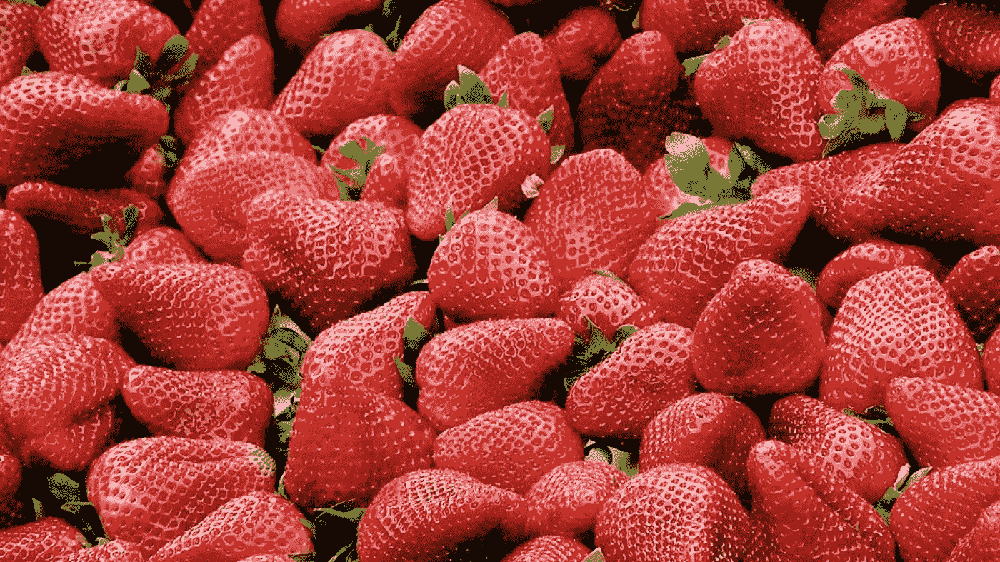

[**上一篇** **概述了 ML**](/@britt.barak/https-medium-com-britt-barak-whos-afraid-of-ml-part1-e464264c3cf0) 以及为什么我们的大脑为它提供了灵感。([bit.ly/brittML-P1](http://bit.ly/brittML-P1))但是，我们如何让一台机器完成与我们大脑相似的过程呢？

这篇文章将简单解释如何创建一个模型，使计算机能够获取数据，从中得出结论，并提高得出结论的能力(或:学习)。

毫无疑问，我最喜欢的食物是草莓🍓！我可以每天都吃它们，一整天，只有它们，这让我很开心！😁

我想写一个程序，它可以获取一张图片，并告诉我图片中是否有草莓或其他东西。为了简化:

## ***这是草莓还是不是草莓？***

如果你要教一个刚来到这个世界的婴儿，一个草莓的形象。你会怎么做？

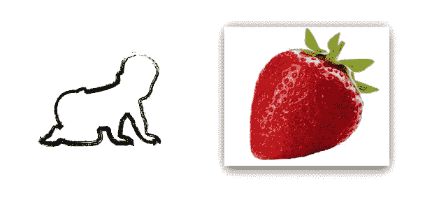

向婴儿展示一个图像，并说- *“这是一个草莓——学习！”*不会这么有帮助。

你可能会说这样的话:*“看到这个图像了吗？在图像中，有一个草莓。你看到它有多红了吗？它的形状是上圆下尖..它的顶部有一些小而窄的叶子..它上面布满了独特的种子图案..这样你就能知道这是一颗草莓。”*

婴儿会看着图片，会注意到你刚才描述的特征，然后得出结论:“*因为这些特征，这些特点，这是一个草莓。”*

当下一个图像出现时，婴儿已经知道寻找特征，发现它们或它们的缺失，然后做出勇敢的结论:“*这是一个草莓！”*或者*“不是的。”*

事实是，即使你没有把图像分解成特征，婴儿的大脑也会。其实不管是哪种方式，它都会发现更多你没有明确提到的特征。这就是我们的大脑是如何工作的，以及它所知道的一些魔法。🔮

让我们更深入地探究一下这种内在的结论形成过程，并建议我们如何让机器做类似的事情:

# **创建人工结论制作模型**

之前的[帖子](/@britt.barak/https-medium-com-britt-barak-whos-afraid-of-ml-part1-e464264c3cf0)，提到我们的大脑与神经网络一起工作。为了给机器创建一个类似的模型，我们应该创建一个 ***人工神经网络(ANN):***

## 输入

如前所述，图像太复杂，不能像那样用作输入。我们想要找到它的特征，就像我们为婴儿做的一样。所以我们的**输入将不是一个图像，而是一个特性列表**。

为了简单起见，让我们只关注 3 个特征:红色的*、s 型的 *eeds 图案*和顶部叶片*。对于这些特征中的每一个，让我们用一个*人工神经元*来代表它。**

**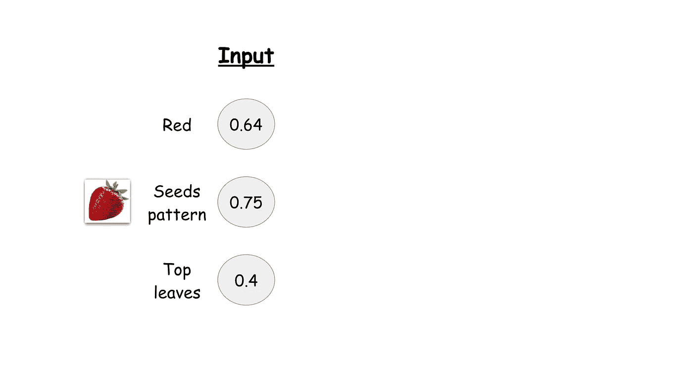**

**如前所述，神经元只是一点数据。每个神经元都会得到一个数字，一个分数，来保存。例如:*图像有多红？它有多少个多孔的图案，顶部的叶子是多少？***

****图中的数字只是我为了举例而编造的一些分数。不要纠结于它们到底是什么意思。这个概念在这里很重要:我们的输入是一列人工神经元，代表从图像中提取的特征。**

**我们可以称这个神经元列表为输入层— ***。*****

## **计算中间层**

****

**接下来，我们将创建另一层神经元。他们每个人都将保持另一个分数。**

**让我们来看看如何给每一个神经元打分，先考虑其中一个:**

**我们知道图像的特征(*红色*、*图案*、*顶叶*)，但我们并不真正知道每个特征对于最终结论有多重要。意思是，图像中的物体是红色的这个事实对决定它是不是草莓有多重要？顶部的叶子有多重要？嗯，有没有顶部叶子的草莓图片。不过，有一种不太常见的情况是，一个草莓图像带有一个不是红色的物体..**

**在我们的大脑中，神经元通过物理连接连接在一起。它们在身体上可能更强或更弱，当它们在彼此之间传递数据时，会或多或少地发出强烈的脉冲(“脉冲”)。**

**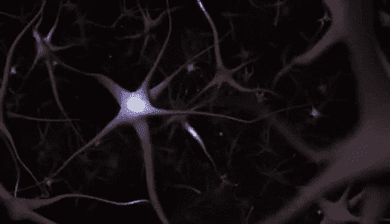**

**在 ANN 上，让我们用一个代表一个 ***权重*** 的数字来表示每个神经元(或特征)的*强度*或*重要性*。我会把它们写在边上，蓝色背景。**

**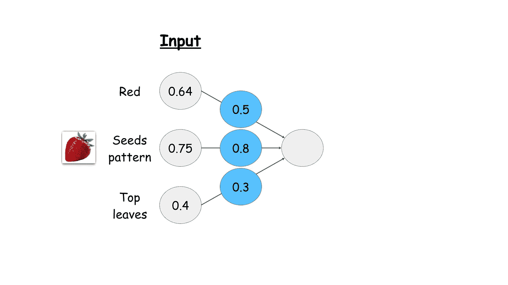**

**一开始，婴儿不能确定每个特征有多重要。一开始，我们只是打算*猜*。所以我编造了这些数字，是的，但是请原谅我。**

**对于中间层的每个神经元，我们将创建一些计算，包括特征和权重。为了演示，我们来看一个简单的线性方程。**

**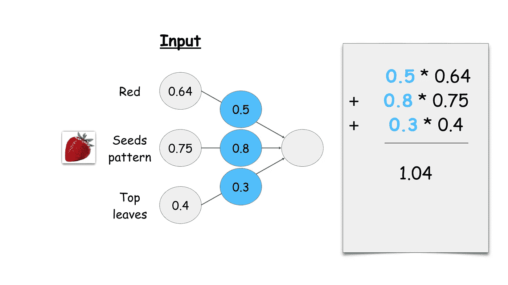**

**稍后，我们可以决定稍微调整一下分数。为什么？目前，只是因为这对我有意义...选择哪种偏见？目前我只是再补一个数字( *0.7* )。但是请容忍我🙂**

**我们得到一个最终的分数，交给神经元保存。**

**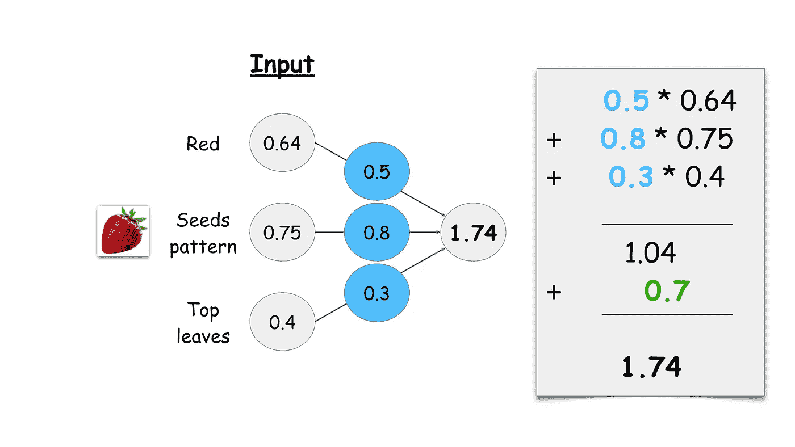**

**我们对中间层的其他每个神经元做同样的事情。权重会不一样，偏倚可能不一样，分数也不一样。**

**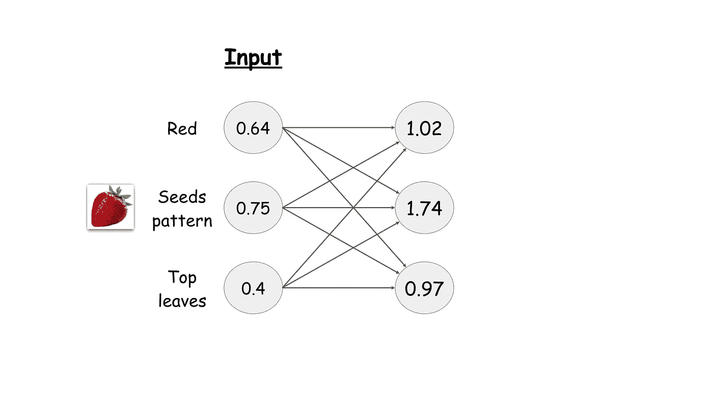**

## **输出**

**好的，那很好，但是*输出*在哪里？对我们人类来说，输出应该是图像是否是草莓。**

**正如我们已经知道的，我们的人工神经网络只知道如何处理神经元和权重，以及数据和数字。它不理解复杂的人类可理解的对象，如图像或标签。让我们创建另一层神经元来表示输出。每个标签一个神经元。**

**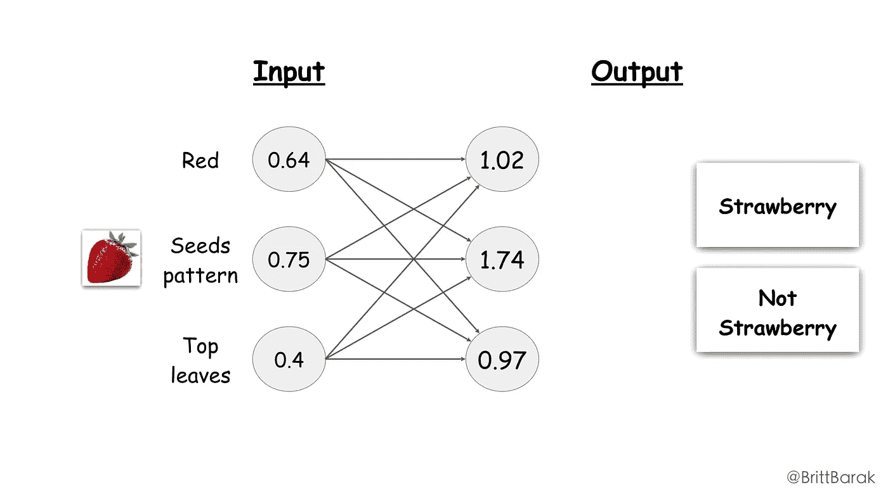**

**我们将做与刚才计算中间层基本相同的事情，但现在要计算输出层:**

*   **创建权重(首先我们创建权重)**
*   **进行一些计算**
*   **得到一个结果**
*   **将结果保存在神经元中**

**唯一的事情是，现在，最终的结果不仅仅是一个数字，而是代表了这个图像确实是一个草莓，或者一个不同物体的概率——根据神经元代表的标签。**

**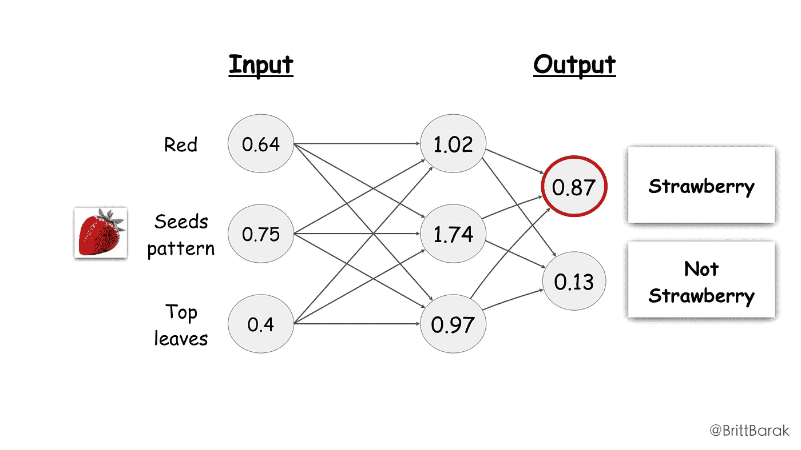**

****在这个例子中，代表*草莓*的神经元有 87%的概率，所以我们可以说我们 87%确定这是一个草莓！****

# **应用模型**

**让我们尝试将相同的人工神经网络应用于另一个图像，例如:一个苹果。**

**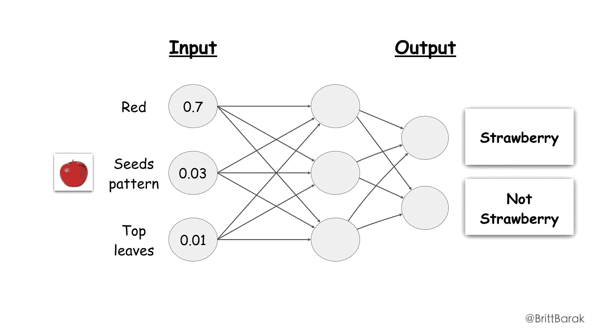**

**我们使用的权重和等式对于我们将应用模型的任何图像都是相同的。然而，由于输入计算不同，中间层的分数和输出层的分数也会不同。**

**在这个例子中，我们的输出层展示了 80%的“非草莓”神经元。**

**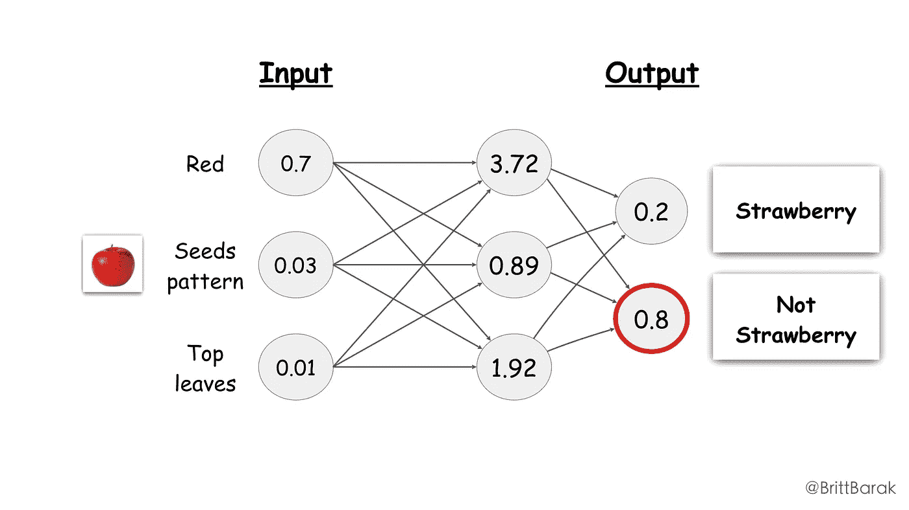**

**太好了！我们有一个模型！这是如何建立机器学习模型的最基本的概念。更准确一点:这是深度学习模型的简化变体，是机器学习模型海洋中的一滴水。**

**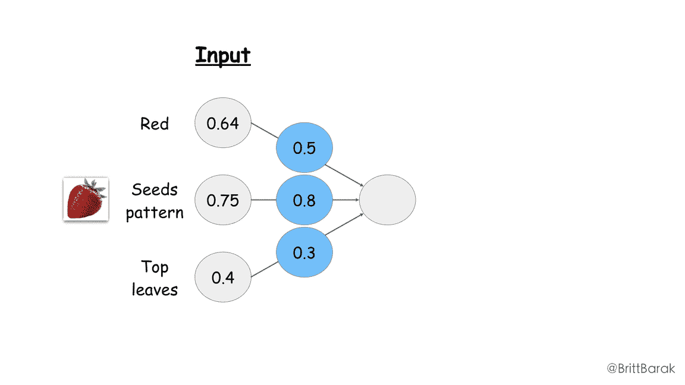**

**你可能会说:*“等等，但是你刚刚告诉我们你编了一堆数字！这怎么能给我们可以信任的东西呢？”***

**为了更好地理解这个模型的“学习”过程，下一篇文章再见。[bit.ly/brittML-3](http://bit.ly/brittML-3)✨**

**感谢您的阅读！❤👏🍓**