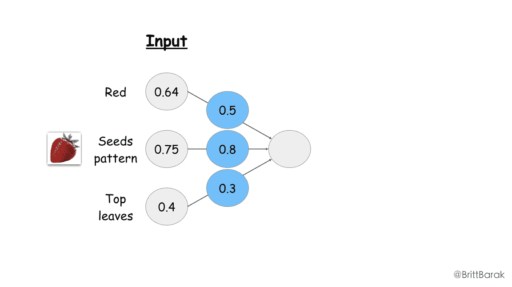
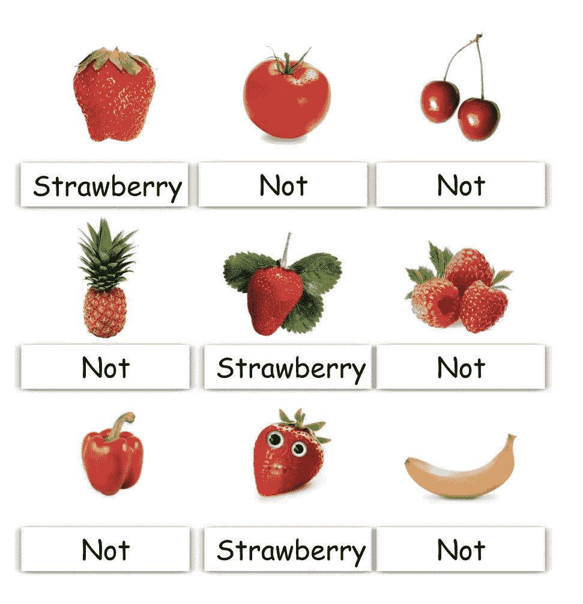
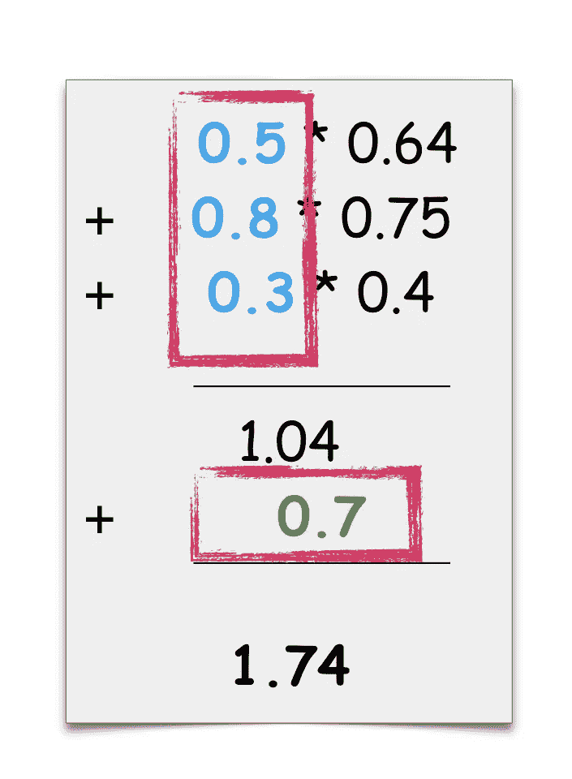
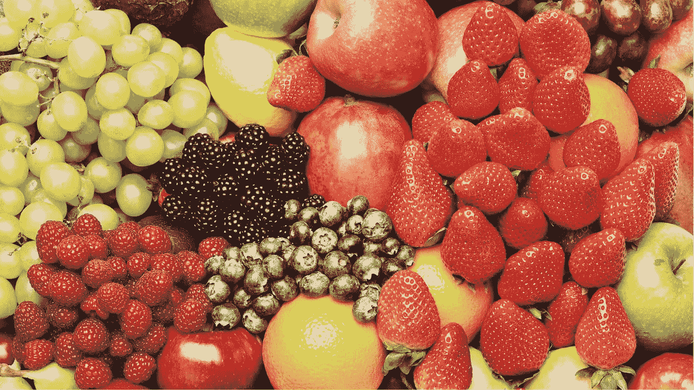
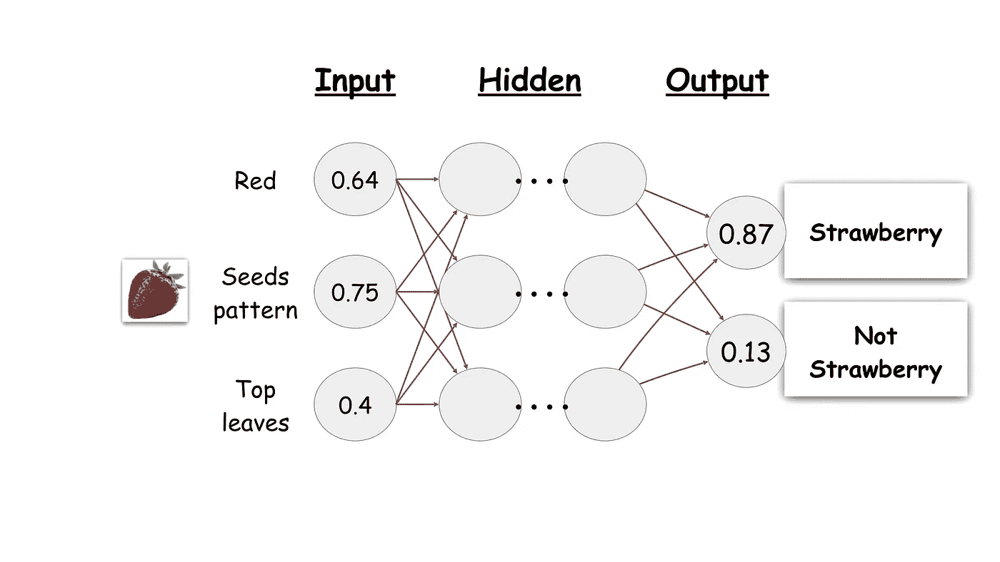

# 谁害怕机器学习？第三部分:关于学习

> 原文：<https://medium.com/google-developer-experts/whos-afraid-of-machine-learning-part-3-about-that-learning-85a8bf336b5a?source=collection_archive---------7----------------------->

## ML 简介(面向移动开发者)

[**上一篇文章**描述了如何创建一个人工神经网络(ANN)，](/@britt.barak/whos-afraid-of-machine-learning-part-2-making-a-machine-that-can-learn-a3c6d2715e26)受我们大脑工作方式的启发。基本上就是如何创建一个获取数据并得出结论的算法。

前一篇文章中的许多数字仅仅是猜测或随机数字。你可能会说:*“等等，但是你刚刚告诉我们你编造了一堆东西！那是怎么回事？这怎么能给我们可以信任的东西呢？”*

## 教学、学习、培训

我们现在将“ ***教给*** ”这个模型，就像我们当年教一个婴儿一样:

我们将获取一个数据集，即一组图像，每个图像都有相应的标签。我们将为模型提供每张图片，并询问:*“对于您当前的模型，这是不是一个草莓？”。*在模型运行并产生结论后，我们可以将其与我们的原始标签进行比较，并说*“是的，您是对的！那是一颗草莓"*或"*不，你错了"* …

然后，根据我们的反馈，模型可以调整我之前猜测的数字。

当然，输入不能被调整，因为图像及其特征是客观的。但是它可以调整我猜测的*权重*和*偏差*(图像上的蓝色和绿色数字)。通过调整它们，模型可以确保下一次我们将得到正确的结论。此外，我们可以使我们的结论更准确，这意味着为结果标签获得更高的概率。

这个过程给模型很多很多的图像和结果，并调整数字以更好地适应，被称为 ***训练。*** 这是模型经历的*学习*过程的核心。

当然，我们的目标是，在这个模型经过足够的训练后，它将能够拍摄任何图像，这不是训练过程的一部分，并产生足够准确的结论。这是因为它非常清楚如何将图像分成多个特征，给出正确的权重，并创建合适的计算来决定这些特征如何影响最终的结论。

## 隐藏层

在继续之前，还有一件事我没有说清楚，我想指出来:

我说有一个*输入*，一个*输出，*和一个*中间层*。实际上，这个中间层通常封装了许多层，这些层执行我们讨论过的类似计算。我们通常将所有这些中间层称为“ ***隐藏层*** ”，因为它隐藏了几层，这几层合起来就是计算和结论的核心。

通常，隐藏层中的每一层负责不同的检测任务。更靠近*输入*的层将负责检测更抽象和“简单”的特征，随着我们更靠近*输出*，检测到的特征变得越来越复杂。例如，*输入*后的第一层将负责检测短线和简单边缘，下一层可以检测更长的线，也许还有角。随着我们越来越接近*输出层*，这些层可以检测到简单的图案，然后是更复杂的图案，然后是形状，可能是一片叶子，可能是一只眼睛……这就像组装一个拼图游戏。我们收集这些碎片来揭示简单的细节，然后是更复杂的细节，直到最后我们准备好品尝复杂的细节并说- *“好的，这是一个草莓”*。

[Ryoji Iwata](https://unsplash.com/@ryoji__iwata?utm_source=medium&utm_medium=referral) on [Unsplash](https://unsplash.com?utm_source=medium&utm_medium=referral)

# 谁做这一切？

选择正确的模型、方程、“调整”算法、收集用于训练的数据、进行训练等等，是 ***数据科学家*** 的工作。开发人员通常不会参与其中。

我们可以谈论如何做到这一点，并可能在以后的帖子中这样做。这是一种迷人的工艺！但重要的一点是，这是一个完全不同的职业，一个完全不同的世界。这和学习如何练习瑜伽或烤蛋糕基本上是一样的。我们可以！但这完全是另外一个话题和技巧。

最常见的是，我们开发人员会从数据科学家那里得到**经过训练和准备的模型**。开发人员将负责将模型集成到应用程序中，给它输入，运行，并获得输出。仅此而已。

因此，从现在起到本博客系列文章的其余部分，**我们将假设我们已经拥有这种天赋，一个我们可以信任其结论的模型**。接下来的文章将探讨如何使用它。

这次就这样了！

下一次，我们将介绍一个伟大的工具来实现一个标记图像的实际模型…**ml-kit**bit.ly/brittML-4✨在那里见

如果你错过了前面的部分，从这里开始寻找 ML 开发者简介:[bit.ly/brittML-1](http://bit.ly/brittML-1)

感谢您的阅读！👏❤🐸🍓